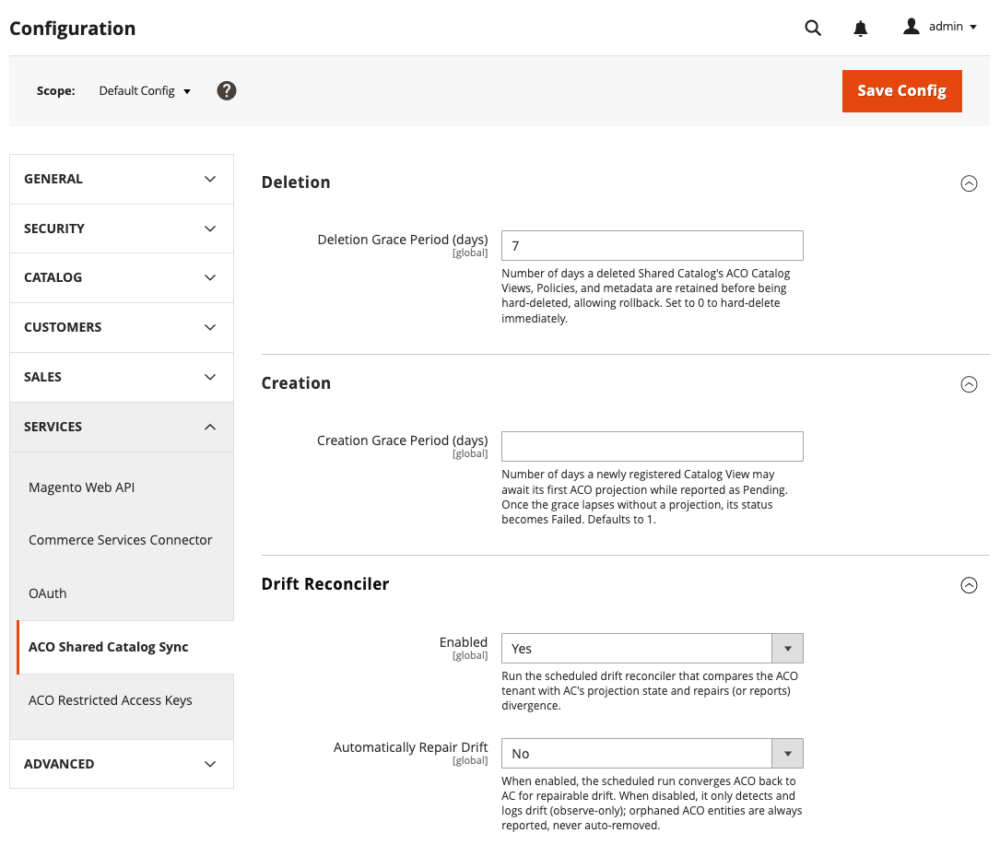

# Monitorización de la sincronización de vistas de catálogo para catálogos compartidos B2B

Rastree la sincronización de la vista del catálogo B2B de [!DNL Adobe Commerce] a [!DNL Adobe Commerce Optimizer] mediante el panel [!UICONTROL Catalog View Sync Status] en el administrador de Commerce.

[!UICONTROL Catalog View Sync Status] comprueba que las configuraciones de vista de catálogo, directiva, referencia de libro de precios y clave de acceso restringido para cada catálogo compartido B2B existen en [!DNL Adobe Commerce Optimizer] y coinciden con la configuración de [!DNL Adobe Commerce]. Para realizar un seguimiento de la sincronización de fuentes de productos, precios y categorías, consulte [Administrar la sincronización de datos](data-sync-status.md#verify-that-the-data-sync-is-working).

## Acceso a la página de estado de sincronización {#access-the-sync-status-page}

Desde Commerce Admin, vaya a **[!UICONTROL System]** > **[!UICONTROL Data Transfer]** > **[!UICONTROL Catalog View Sync Status]**.

{width="600" zoomable="yes"}

La página tiene tres fichas: [!UICONTROL Catalog Views], [!UICONTROL Orphaned in ACO] y [!UICONTROL Deleted].

## Interpretación del estado de sincronización de los catálogos compartidos {#interpret-sync-status}

En la ficha [!UICONTROL Catalog View], cada fila representa una vista de catálogo compartido personalizada proyectada a partir de una combinación de catálogo compartido y vista de tienda. La proyección es la vista de catálogo, la directiva, la referencia del libro de precios y los datos de configuración de clave de acceso restringido que [!DNL Commerce Optimizer Connector] exporta a [!DNL Adobe Commerce Optimizer] para el catálogo compartido. Utilice la información de estado para determinar si los datos entregados a la experiencia de la tienda de la compañía son completos y correctos. La siguiente tabla resume los valores de estado más comunes y lo que significan para el catálogo compartido:

| Estado | Qué significa para el catálogo compartido |
| --- | --- |
| **Degradado** | Se cambió algo directamente en [!DNL Adobe Commerce Optimizer], por ejemplo, la directiva o el libro de precios vinculado. Es posible que la empresa vea una variedad o un precio incorrectos hasta que resuelva el problema. Esto también puede suceder si la clave de acceso, el nombre de la vista o el origen se cambian en Commerce Optimizer. |
| **Error** | La vista de catálogo no existe en [!DNL Adobe Commerce Optimizer], o si el período de gracia transcurre antes de que se realice la primera proyección. (Consulte [Configurar la configuración de sincronización de la vista del catálogo de ACO](#configure-aco-catalog-view-sync-settings)). Si el estado de sincronización del catálogo es `Failed`, la empresa no puede acceder a la experiencia de tienda de este catálogo compartido. |
| **Retirándose** | Ha eliminado el catálogo compartido en [!DNL Adobe Commerce]. La vista de catálogo sigue siendo accesible hasta que caduque el periodo de gracia de eliminación. El período de gracia predeterminado es de siete días. Puede modificar el valor predeterminado actualizando la [configuración de sincronización de la vista de catálogo](#configure-aco-catalog-view-sync-settings). |
| **Huérfano** | La vista o clave del catálogo se creó directamente en [!DNL Adobe Commerce Optimizer] Studio, no por el conector. Ver [Revisar entradas huérfanas y eliminadas](#review-orphaned-and-deleted-entries). |

[!UICONTROL Healthy], [!UICONTROL Pending] y [!UICONTROL Deleted] son estados informativos que no requieren ninguna acción. Consulte [Valores de estado de sincronización](https://experienceleague.adobe.com/en/docs/commerce-admin/systems/data-transfer/data-sync/catalog-view-sync/catalog-view-sync-status#sync-status-values){target="_blank"} en la *Guía de administración de Commerce* para obtener la lista completa.

### Configuración de sincronización de vista de catálogo ACO {#configure-aco-catalog-view-sync-settings}

Desde el administrador de [!DNL Adobe Commerce] (no [!DNL Adobe Commerce Optimizer] Studio), vaya a **[!UICONTROL Stores]** > **[!UICONTROL Configuration]** > **[!UICONTROL Services]** > **[!UICONTROL ACO Catalog View Sync]** para controlar cómo el conector ajusta el tiempo de eliminaciones y creaciones, y si repara la deriva automáticamente.

{width="600" zoomable="yes"}

- **[!UICONTROL Deletion Grace Period (days)]**: número de días que la vista de catálogo, la directiva y los metadatos de un catálogo compartido eliminado se conservan en [!DNL Adobe Commerce Optimizer] antes de quitarse. El valor predeterminado es de siete días. Establezca `0` para eliminar la proyección inmediatamente, sin período de gracia.

- **[!UICONTROL Creation Grace Period (days)]**: número de días que una vista de catálogo recién registrada puede esperar su primera proyección a [!DNL Adobe Commerce Optimizer] mientras se informa como [!UICONTROL Pending]. Si el período de gracia transcurre sin una proyección, el estado se convierte en [!UICONTROL Failed]. El valor predeterminado es 1.

- **[!UICONTROL Enabled]** (reconciliador de deriva): ejecuta el reconciliador de deriva programado que compara [!DNL Adobe Commerce Optimizer] con el estado de proyección [!DNL Adobe Commerce] y repara o informa de la divergencia.

- **[!UICONTROL Automatically Repair Drift]**: cuando se establece en **[!UICONTROL Yes]**, la ejecución programada vuelve a converger [!DNL Adobe Commerce Optimizer] a [!DNL Adobe Commerce] para permitir la reparación de la deriva. Cuando se establece en **[!UICONTROL No]**, la ejecución programada solo detecta y registra la deriva; las entradas huérfanas siempre se registran, nunca se eliminan automáticamente. Esta configuración solo afecta al reconciliador programado. La acción **[!UICONTROL Reconcile & Repair]** de esta página siempre repara la deriva. Ver [Elegir supervisión o reparación](#choose-monitoring-or-repair).

Consulte [Configuración de sincronización de vista de catálogo ACO](https://experienceleague.adobe.com/en/docs/commerce-admin/configuration-reference/services/aco-catalog-view-sync.md) en la guía *[!DNL Commerce Admin]* para obtener detalles sobre cada configuración.

## Elegir supervisión o reparación {#choose-monitoring-or-repair}

[!DNL Adobe Commerce] es siempre la fuente fiable para la vista de catálogo, la directiva, el libro de precios y las configuraciones clave para los catálogos compartidos B2B. Si usted u otro administrador cambió una configuración de directiva, libro de precios o clave directamente en [!DNL Adobe Commerce Optimizer] Studio, la reconciliación notificará las diferencias de configuración como una desviación.

- Seleccione **[!UICONTROL Reconcile]** para comprobar si hay deriva sin cambiar nada, de modo que pueda revisar las diferencias antes de actuar.
- Seleccione **[!UICONTROL Reconcile & Repair]** para restaurar la configuración esperada para cualquier deriva reparable.

Para revisar qué ha cambiado y por qué, abra la página de detalles de una vista de catálogo y compruebe su historial de deriva.

## Revisar entradas huérfanas y eliminadas {#review-orphaned-and-deleted-entries}

Las pestañas **[!UICONTROL Orphaned in ACO]** y **[!UICONTROL Deleted]** cubren dos casos en los que el conector no se puede reparar automáticamente porque no hay ningún catálogo compartido de [!DNL Adobe Commerce] con el que reconciliar:

- **[!UICONTROL Orphaned in ACO]**: el conector informa de entidades huérfanas en estado de sincronización y durante la reconciliación de la deriva. No los adopta ni los elimina automáticamente aunque se ejecute la reconciliación con la reparación habilitada.

  Una entidad queda huérfana cuando existe en [!DNL Adobe Commerce Optimizer], pero el conector no la rastrea ni la asocia con una vista de catálogo con seguimiento. Esto puede ocurrir cuando una entidad se crea manualmente, mediante otra integración o se deja atrás después de una operación de conector interrumpida.

  - **Vistas de catálogo**: el conector no realiza el seguimiento de la vista. Seleccione el vínculo de vista de catálogo para abrir la página de detalles Vista de catálogo en [!DNL Adobe Commerce Optimizer] Studio. Si ya no es necesaria la vista del catálogo, elimínela.

  - **Claves de acceso restringido**: no hay ninguna vista del catálogo activo que haga referencia a la clave. Seleccione el vínculo de vista de catálogo para abrir la página de detalles Vista de catálogo en [!DNL Adobe Commerce Optimizer] Studio. Revise la clave de acceso configurada y elimínela si ya no la necesita.

  - **Políticas**: el conector no realiza el seguimiento de la política y ninguna vista del catálogo en directo hace referencia a ella. Seleccione el vínculo de directiva para abrirlo en [!DNL Adobe Commerce Optimizer] Studio.  Revíselo y elimínelo si ya no es necesario.

- **[!UICONTROL Deleted]**: eliminó un catálogo compartido en [!DNL Adobe Commerce] y su proyección de vista de catálogo se eliminó posteriormente. Estas filas se conservan durante 90 días como registro de lo que se ha eliminado.

>[!MORELIKETHIS]
>
> - [Supervisión del estado de sincronización de la vista de catálogo](https://experienceleague.adobe.com/en/docs/commerce-admin/systems/catalog-view-sync-status.md){target="_blank"} — Referencia de documentación completa para la página de estado de sincronización de la vista de catálogo, en la *Guía de administración de Commerce* —>
> - [Administrar la sincronización de datos](data-sync-status.md): compruebe la sincronización de fuentes de productos, precios y categorías.
> - [Vistas de catálogo privado](/help/optimizer/setup/private-catalog-view.md) — Descubra qué es una vista de catálogo privado administrada por conectores
> - [Claves de acceso restringido](/help/optimizer/setup/restricted-access-keys.md) — Descubra cómo funcionan las claves administradas por conectores
> - [Supervisar cambios en el catálogo compartido B2B](get-started-b2b-shared-catalogs.md#monitor-b2b-shared-catalog-changes) — Descubra lo que automatiza el conector para los catálogos compartidos B2B
