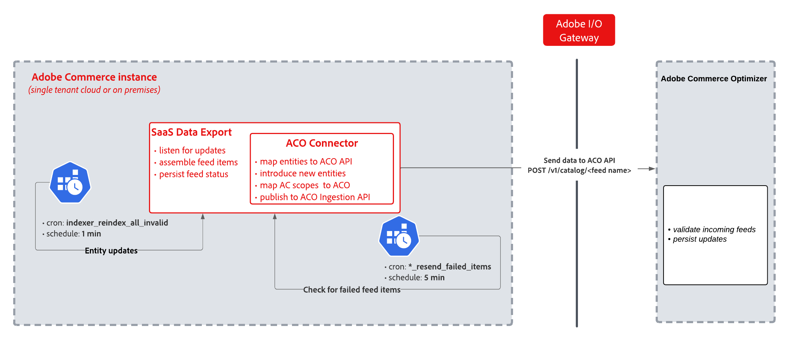

# Canalización de sincronización de conector

Compilado en [[!DNL SaaS Data Export]](https://experienceleague.adobe.com/en/docs/commerce/saas-data-export/overview), **[!DNL Adobe Commerce Optimizer Connector]** asigna los datos recopilados por los indizadores [!DNL SaaS Data Export] al formato requerido por [!DNL Adobe Commerce Optimizer] [!DNL Catalog Data Ingestion API] y administra la autenticación, el envío por lotes y el control de sincronización basado en el ámbito. Las secciones siguientes describen cómo funciona esa sincronización.

Contexto relacionado:

- Obtenga información acerca del valor comercial, las características clave y la arquitectura de la integración en el tema [[!DNL Commerce Optimizer Connector] descripción general](overview.md).

- Para ver los nombres de paquetes de módulos, extremos de API de fuentes y rutas de claves de configuración, consulte [Referencia del conector](reference/connector-reference.md)

## Funcionamiento de la sincronización

El diagrama siguiente muestra la sincronización de datos de [!DNL Adobe Commerce] a [!DNL Commerce Optimizer] a través de [!DNL Adobe I/O Gateway].

{width="800" zoomable="yes"}

Cuando los datos del catálogo cambian en [!DNL Adobe Commerce], la sincronización pasa por estas fases.

1. **Detección de cambio de entidad** — (cada 1 min) Un trabajo cron (`indexer_reindex_all_invalid`) detecta [!DNL Adobe Commerce] cambios de entidad y déclencheur [!DNL SaaS Data Export], que ensambla elementos de fuente.
1. **Transformación**: [!DNL Commerce Optimizer Connector] recoge las fuentes ensambladas, asigna las entidades y ámbitos de [!DNL Adobe Commerce] a los formatos requeridos por la API de [!DNL Commerce Optimizer] y prepara la carga útil para la transmisión.
1. **Transmisión**: los datos transformados se envían a través de HTTP POST (`/v1/catalog/<feed name>`) a través de [!DNL Adobe I/O Gateway] a [!DNL Commerce Optimizer], lo que valida y mantiene las fuentes entrantes.
1. **Persistir resultados** — Mantener el estado de respuesta de API en [tablas de fuentes](reference/connector-reference.md#supported-feeds).
1. **Reintento de error** (cada 5 minutos): un trabajo cron independiente (`*_resend_failed_items`) detecta los elementos de fuente con errores y los vuelve a enviar a través de la misma canalización.

### Trabajos cron programados

Los siguientes trabajos cron automatizan la canalización en una programación fija.

| Grupo Cron | Trabajo de cron | Finalidad | Programación |
|-------------------------------------|-------------------------------|------------------------------------------------------------------------------|----------------|
| `index` | `indexer_update_all_views` | Escucha actualizaciones de entidad, ensambla elementos de fuente y mantiene el estado de la fuente | Cada 1 minuto |
| `index` | `indexer_reindex_all_invalid` | Realice una resincronización completa de los índices de fuentes marcados como &quot;Reindexación obligatoria&quot; | Cada 1 minuto |
| `resync_failed_feeds_data_exporter` | `*_resend_failed_items` | Comprueba los elementos de fuente con errores y los vuelve a enviar a [!DNL Commerce Optimizer] | Cada 5 minutos |
| `commerce_data_export` | `cleanup_deleted_feed_items` | Limpia los elementos de fuente eliminados sincronizados después del período de retención (7 días) | Todos los días a las 2:00 AM |

La extensión **[!DNL SaaS Data Export]** administra la colección de fuentes y el seguimiento de estado. La capa de conexión asigna entidades y ámbitos al formato requerido por la API [!DNL Commerce Optimizer] y los envía a través de `POST /v1/catalog/<feed name>`.

#### Requisitos

- [Commerce cron debe estar ejecutándose](https://experienceleague.adobe.com/en/docs/commerce-knowledge-base/kb/troubleshooting/miscellaneous/cron-readiness-check-issues){target="_blank"}.
- Los indexadores de fuente deben utilizar el modo **[!UICONTROL Update by Schedule]**. Consulte [Sincronización parcial](../data-export/sync-overview.md#partial-sync){target="_blank"}.

## Control de sincronización basado en el ámbito

El módulo `CommerceOptimizerScopeMapper` lee la configuración de exportación por sitio web y por vista de tienda y la aplica durante la recopilación y el envío de fuentes.

- **Ámbitos habilitados** exportan datos en la programación delta normal.
- **Los ámbitos deshabilitados** se han excluido de la canalización.
Las entidades sincronizadas anteriormente se eliminarán de [!DNL Commerce Optimizer] en la siguiente ejecución de cron.

Si los problemas de sincronización afectan solamente a un origen de catálogo o libro de precios, vea [Los datos no se sincronizan](troubleshooting.md#data-not-syncing).

Para obtener más información sobre cómo personalizar el ámbito de sincronización, vea [Personalizar la configuración de exportación de los ámbitos de Commerce](get-started.md#customize-the-commerce-scopes-export-configuration).

## Programación y monitorización

| Escenario | Intervalo típico |
| -------- | -------------- |
| Actualizaciones rutinarias del catálogo | 1-2 ciclos de sincronización delta (~1-2 minutos para la indexación, más el envío) |
| Errores transitorios | Se vuelve a intentar cada 5 minutos |
| Sincronización completa para catálogos grandes | De minutos a horas |

Monitorice el estado de cada fuente desde la página [[!UICONTROL Data Feed Sync Status]](https://experienceleague.adobe.com/en/docs/commerce-admin/systems/data-transfer/data-sync/data-feed-sync-status) en el administrador de Commerce. Ver [Verificar que la sincronización de datos funcione](./data-sync-manage.md#verify-that-the-data-sync-is-working).

## Envío de fuentes y gestión de errores

El proceso `FeedSubmitter` administra [!DNL Catalog Data Ingestion API] llamadas.

1. Separa los elementos de actualización de los elementos de eliminación (diferentes extremos de API).
1. Las llamadas actualizan y eliminan puntos finales de forma independiente.
1. Combina los resultados de estado por elemento en una sola respuesta.

### Combinación del código de estado HTTP

Cuando las llamadas de actualización y eliminación devuelven códigos de estado diferentes, `FeedSubmitter` combina los resultados de la siguiente manera.

| Actualiza el resultado | Elimina el resultado | Resultado final |
| --------------- | --------------- | ------------- |
| 200 | 200 o ninguno | 200 con éxito |
| 200 | 400 | 200 con errores de eliminación |
| 400 | 400 | 400 errores combinados |
| otro | otro | REINTENTABLE |

| Tipo de error | Comportamiento |
| ---------- | -------- |
| **400** | Los elementos enumerados en el campo de respuesta `errors` aparecen en el Administrador y requieren atención. Se vuelven a intentar otros elementos del lote. |
| **5xx** | Lo han vuelto a intentar los trabajos cron `*_feed_resend_failed_items` específicos de la fuente en el grupo `resync_failed_feeds_data_exporter`. |

>[!MORELIKETHIS]
>
> - [Descripción general del conector](overview.md): aprenda el contexto empresarial y la asignación de ámbito
> - [Referencia de conector](reference/connector-reference.md): revise módulos, extremos de API y claves de configuración
> - [Personalizar la configuración de exportación de los ámbitos de Commerce](./get-started.md#customize-the-commerce-scopes-export-configuration): configure fuentes por nivel de ámbito, habilite y deshabilite el comportamiento y los pasos de administración
> - [Solución de problemas](troubleshooting.md) — Diagnóstico de errores de sincronización
