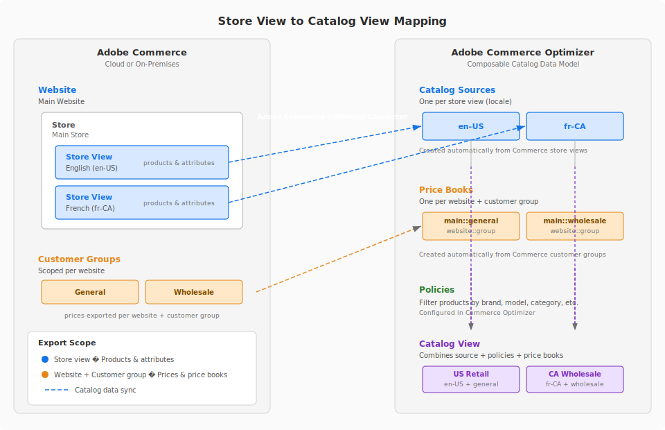

# Conector de Adobe Commerce Optimizer

Adobe Commerce Optimizer Connector es el puente de integración que sincroniza los datos de catálogo y de precios entre Adobe Commerce en la infraestructura en la nube o en la implementación local y [!DNL Adobe Commerce Optimizer]. La sincronización de datos con Adobe Commerce Optimizer habilita funciones como Búsqueda por IA dinámica, Recommendations, tiendas de carga rápida sin encabezado, incluidas las tiendas de Adobe Commerce en Edge Delivery Services y análisis de rendimiento en tiempo real.

## Arquitectura y experiencia

El conector de Adobe Commerce Optimizer funciona asignando sitios web de Commerce y vistas de tienda a un proyecto de Commerce Optimizer, como se muestra en la siguiente ilustración:

{width="600" zoomable="yes"}

Cuando se exportan datos de Commerce a Commerce Optimizer:

* Las vistas de la tienda Commerce están asignadas a orígenes de catálogo
* Los sitios web se asignan a libros de precios

Los datos de catálogo y precio asociados se exportan y se utilizan posteriormente para crear vistas de catálogo y, opcionalmente, definir una política para filtrar los datos de catálogo y precio para casos de uso empresariales específicos.

En lugar de configurar y administrar los servicios de Commerce (Live Search y Product Recommendations) desde el administrador de Commerce, usa [[!DNL Adobe Commerce Optimizer] herramientas de comercialización](../optimizer/merchandising/overview.md) para administrar la configuración de reglas de detección de productos (Live Search) y recomendaciones (Product Recommendations). La instancia de Adobe Commerce se convierte en la fuente de datos para los datos de catálogo y precio. Cuando los datos se actualizan en Commerce, las actualizaciones se sincronizan con la instancia [!DNL Adobe Commerce Optimizer].

## Flujos de trabajo

Connector permite varios flujos de trabajo clave:

* **Exportar los datos del catálogo de Commerce a[!DNL Adobe Commerce Optimizer]**: los datos del libro de precios y precios se exportan a nivel del sitio web y del grupo de clientes. Los datos de atributos de productos y productos se exportan en el nivel `store view`. De forma predeterminada, la sincronización de datos del catálogo está habilitada para todos los ámbitos de Commerce (sitios web y vistas de tiendas).

  Para habilitar este flujo de trabajo, instale la extensión PHP `adobe-commerce/commerce-data-export-aco-adapter`, revise la configuración del exportador y, a continuación, habilite la integración entre Commerce y Commerce Optimizer desde el administrador de Commerce. Para obtener instrucciones detalladas, consulte [Introducción](#get-started).

* **Asigne el sitio web de Commerce y almacene los datos de vista para exportar a[!DNL Adobe Commerce Optimizer]**

  De forma opcional, personalice la configuración de exportación para sincronizar datos solo para sitios web específicos o vistas de tiendas. Por ejemplo, puede elegir exportar los datos del catálogo para una sola vista de tienda para utilizarlos en un caso de uso específico, como optimizar la experiencia de búsqueda y descubrimiento para un mercado o región específicos.

* **Configuración y administración de reglas de comercialización**

  Cuando el conector está habilitado, las reglas de comercialización para la detección de productos y las recomendaciones se definen y administran desde la interfaz de usuario de [!DNL Adobe Commerce Optimizer], no desde las páginas de [!UICONTROL Live Search] y [!UICONTROL Product Recommendations] en el administrador de Commerce.

* **Implementar tu tienda Commerce en Edge Delivery Services**

  Después de configurar la integración con [!DNL Adobe Commerce Optimizer], puede configurar e implementar una Tienda Commerce en Edge Delivery Services para ofrecer rendimiento ultrarrápido, escalabilidad, creación de contenido perfecta, personalización integrada y costos operativos reducidos usando la arquitectura componible basada en API y los componentes modulares disponibles con [!DNL Adobe Commerce Optimizer].

Para obtener más información sobre cómo configurar la integración y habilitar estos flujos de trabajo, consulte [Introducción](get-started.md).
