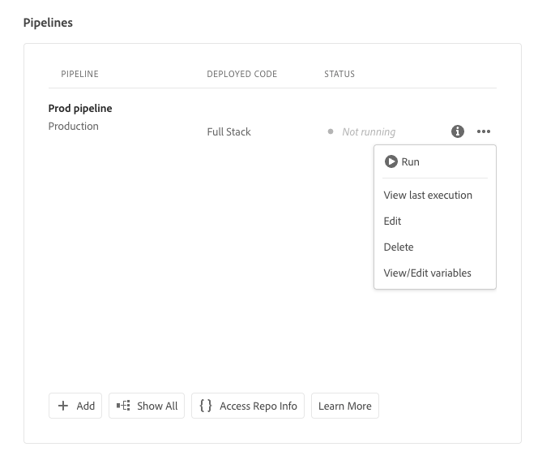

# Configuración del proyecto de AEM Assets

En este tema se describe cómo configurar el proyecto de AEM Assets para que el espacio de nombres de Commerce, el esquema de metadatos y la ficha [!UICONTROL Commerce] estén disponibles en el entorno de creación de AEM. Para obtener información general sobre estos recursos, consulte [Metadatos de Commerce en AEM Assets](../metadata.md).

Tiene dos opciones para configurar el proyecto de AEM Assets:

* [!BADGE Recomendado]{type=Positive} **Incorporación de autoservicio**: en las versiones de AEM `2026.5.26309` y posteriores, habilite la integración en Cloud Manager configurando una variable de entorno y activando Dynamic Media con las capacidades de OpenAPI. No se requiere una implementación de código personalizado. Consulte [Habilitar la integración de Commerce (autoservicio)](#enable-aem-commerce-self-service).

* **Configuración manual**: implemente el paquete `assets-commerce` a través de una canalización de Cloud Manager. Siga estos pasos manuales cuando deba implementar código de paquete personalizado o si está en una versión de AEM anterior a `2026.5.26309`. Consulte [Instalar el paquete de assets-commerce manualmente](#install-the-assets-commerce-package-manually).

>[!TIP]
>
>Puede comprobar la versión actual de AEM en el menú superior derecho: **[!UICONTROL Help]** > **[!UICONTROL About AEM]**.

## Habilitar la integración de Commerce (autoservicio) {#enable-aem-commerce-self-service}

[!BADGE Compatible]{type=Informative tooltip="Admitido"} con la versión de AEM `2026.5.26309` y posterior.

En las versiones de AEM admitidas, se habilita la integración de Commerce desde Cloud Manager sin implementar ningún código personalizado. El área de nombres de Commerce, el esquema de metadatos y la ficha **[!UICONTROL Commerce]** se aprovisionan automáticamente al habilitar la integración en el servicio de creación.

### Requisitos previos de autoservicio

* [Acceso al programa AEM Cloud Manager y a los entornos](https://experienceleague.adobe.com/en/docs/experience-manager-cloud-service/content/onboarding/journey/cloud-manager#access-sysadmin-bo) con los roles de Administrador de implementación y Programa.

* Un programa de AEM en la versión `2026.5.26309` o posterior.

* La **ID de organización de IMS** para su instancia de Commerce.

  Tanto la instancia de Commerce como el entorno de creación de AEM Assets deben estar en la misma organización de IMS.

### Paso 1: Crear el programa y los entornos

La creación de un programa en Cloud Manager es un único proceso de asistente: el programa y sus entornos se configuran en varios pasos y se guardan juntos al final.

1. En Cloud Manager, seleccione **[!UICONTROL Add Program]**.

1. Elija **[!UICONTROL Set up for production]**, escriba un nombre de programa y seleccione **[!UICONTROL Continue]**.

1. En el paso **[!UICONTROL Solutions & Add-ons]**, seleccione las soluciones y los complementos que requiere su proyecto, incluido **[!UICONTROL Dynamic Media]**, y después seleccione **[!UICONTROL Continue]**.

   {width="600" zoomable="yes"}

1. En el paso **[!UICONTROL Add Environment]**, escriba nombres para los entornos **Production** y **Staging** y, a continuación, seleccione una región.

   {width="600" zoomable="yes"}

1. Seleccione **[!UICONTROL Save]** para crear el programa con sus entornos.

### Paso 2: Habilitar la variable de integración de Commerce

En Cloud Manager, abra el entorno que creó en el paso 1 y, a continuación:

1. Seleccione la ficha **[!UICONTROL Configuration]**.

1. Agregue una variable de entorno con los siguientes valores y, a continuación, seleccione **[!UICONTROL Add]** y **[!UICONTROL Save]**:

   | Campo | Valor |
   |---|---|
   | Nombre | `COMMERCE_INTEGRATION_ENABLED` |
   | Valor | `true` |
   | Servicio aplicado | Autor |
   | Tipo | Variable |

   {width="600" zoomable="yes"}

   El entorno se actualiza para aplicar la configuración. Espere hasta que el estado del entorno vuelva a **[!UICONTROL Running]**.

### Paso 3: Activar Dynamic Media con las capacidades de OpenAPI

1. En la ficha del entorno **[!UICONTROL General]**, busque **[!UICONTROL Dynamic Media]**.

1. Junto a *Las funcionalidades de OpenAPI están disponibles*, seleccione **[!UICONTROL Click to activate]**.

   {width="600" zoomable="yes"}

   La activación se ejecuta en segundo plano. Cuando se complete, el entorno estará listo para la integración de Commerce.

   >[!NOTE]
   >
   > Si **[!UICONTROL Click to activate]** no está disponible, abra un ticket de asistencia para habilitar Dynamic Media con las funcionalidades de OpenAPI.

### Paso 4: Validar la configuración

Cambie al **entorno de creación de AEM Assets** y abra cualquier recurso. Edite sus propiedades y confirme que el esquema de metadatos predeterminado incluye la pestaña **[!UICONTROL Commerce]** y que los campos **[!UICONTROL Product Data]** y **[!UICONTROL Eligible for Commerce]** están visibles.

## Instalación manual del paquete de assets-commerce

>[!NOTE]
>
> Utilice este método manual para implementar el código de paquete personalizado o si está en versiones de AEM anteriores a `2026.5.26309`. En las versiones compatibles, use [Habilitar la integración de Commerce (autoservicio)](#enable-aem-commerce-self-service).

### Requisitos previos

Para implementar el código del paquete `assets-commerce` en el entorno de AEM de as a Cloud Service de AEM Assets, necesita los siguientes recursos y permisos:

* [Acceso al Programa Cloud Manager de AEM Assets y a los entornos](https://experienceleague.adobe.com/en/docs/experience-manager-cloud-service/content/onboarding/journey/cloud-manager#access-sysadmin-bo) con los roles de Administrador de implementación y Programa.

* Un [entorno de desarrollo local de AEM](https://experienceleague.adobe.com/en/docs/experience-manager-learn/cloud-service/local-development-environment-set-up/overview) y conocimiento del proceso de desarrollo local de AEM.

* Comprenda la [estructura del proyecto AEM](https://experienceleague.adobe.com/es/docs/experience-manager-cloud-service/content/implementing/developing/aem-project-content-package-structure) y cómo implementar paquetes de contenido personalizado mediante Cloud Manager.

* La **ID de organización de IMS** para su instancia de Commerce. Tanto la instancia de Commerce como el entorno de creación de AEM Assets deben estar en la misma organización de IMS.

* Para habilitar [Dynamic Media con las funciones de OpenAPI](https://experienceleague.adobe.com/en/docs/experience-manager-cloud-service/content/assets/dynamicmedia/dynamic-media-open-apis/dynamic-media-open-apis-overview#enable-dynamic-media-open-apis):

>[!BEGINTABS]

>[!TAB Imágenes del producto]

[!BADGE Solo SaaS]{type=Positive url="https://experienceleague.adobe.com/en/docs/commerce/user-guides/product-solutions" tooltip="Solo se aplica a los proyectos de Adobe Commerce as a Cloud Service y Adobe Commerce Optimizer (infraestructura de SaaS administrada por Adobe)."} Dynamic Media con capacidades OpenAPI es autoservicio para elementos visuales de productos con tecnología de AEM Assets.

1. Vaya a Cloud Manager.

1. Seleccione el entorno que desee.

1. Habilite **Dynamic Media con las funciones de OpenAPI**.

   Si el botón **Dynamic Media con funciones OpenAPI** no está activo, abre un ticket de asistencia.

>[!TAB AEM Assets]

[!BADGE Solo PaaS]{type=Informative tooltip="Solo se aplica a proyectos de Adobe Commerce en la nube (infraestructura PaaS administrada por Adobe)."} En AEM as a Cloud Service, envía un ticket de asistencia de Adobe con esta información:

* Título: Habilite la API de apertura de Dynamic Media para integrar Adobe Commerce completamente con los AEM Assets

   * Contenido del ticket de asistencia:

      * **[!UICONTROL AEM Program ID]**
      * **[!UICONTROL Adobe Commerce URL]**
      * **[!UICONTROL AEM Environment ID]**
      * **[!UICONTROL IMS Org ID]**

Una vez enviado el vale de soporte, Adobe habilita Dynamic Media con las capacidades de OpenAPI en su entorno de Cloud Services y comparte los detalles, como el ID de cliente de IMS, para que pueda continuar con la integración.

>[!ENDTABS]

### Pasos de instalación

1. Vaya a AEM Cloud Manager, seleccione un programa y [cree entornos de producción y ensayo](https://experienceleague.adobe.com/en/docs/experience-manager-cloud-service/content/onboarding/journey/create-environments#creating-environments) que desee integrar con Adobe Commerce.

1. [Clonar el repositorio de Git administrado por Adobe](https://experienceleague.adobe.com/en/docs/experience-manager-cloud-service/content/sites/administering/site-creation/quick-site/retrieve-access#repo-access) para el programa seleccionado.

   {width="600" zoomable="yes"}

   En Cloud Manager **Canalizaciones**, seleccione **[!UICONTROL Access Repo Info]** para abrir **[!UICONTROL Repository Info]**. Copie el valor **[!UICONTROL URL]** o **[!UICONTROL Git command line]**, genere una contraseña de acceso si es necesario y luego clone localmente con su cliente Git.

1. En GitHub, descargue el código del paquete del [repositorio Commerce de AEM Assets](https://github.com/ankumalh/assets-commerce).

1. Desde su [entorno de desarrollo local de AEM](https://experienceleague.adobe.com/en/docs/experience-manager-learn/cloud-service/local-development-environment-set-up/overview), copie manualmente el código descargado en el repositorio administrado de Adobe existente.

1. En todos los archivos de `filter.xml` y `pom.xml` del proyecto, reemplace todas las apariciones de &lt;my-app> por el nombre de su aplicación.

   >[!NOTE]
   >
   > También puede instalar el código personalizado en la configuración de su proyecto de AEM Assets como un paquete de **Maven**.

1. Confirme los cambios e inserte la rama de desarrollo local en el repositorio de Git de Cloud Manager.

1. Configure una [canalización de implementación](https://experienceleague.adobe.com/en/docs/experience-manager-cloud-service/content/sites/administering/site-creation/quick-site/pipeline-setup#create-front-end-pipeline) o verifique que su canalización pueda implementar cambios en el entorno seleccionado.

   {width="600" zoomable="yes"}

   Cuando exista la canalización, abra el menú de acciones (**...**) para **[!UICONTROL Run]**, **[!UICONTROL Edit]**, **[!UICONTROL View/Edit variables]** u otras acciones; consulte la documentación de canalización de Cloud Manager vinculada anteriormente.

1. Desde AEM Cloud Manager, [actualice el entorno de AEM mediante la canalización para implementar su código](https://experienceleague.adobe.com/en/docs/experience-manager-cloud-service/content/implementing/using-cloud-manager/deploy-code#deploying-code-with-cloud-manager).

1. Vaya a cualquier recurso y edite sus propiedades para validar los cambios:

   * El esquema de metadatos predeterminado incluye la ficha **Commerce**.

   * Los SKU del producto y los campos `Eligible for Commerce` están visibles.

### La pestaña Commerce no está visible en las propiedades

Si la pestaña **Commerce** no aparece en las propiedades, debe completar manualmente los siguientes pasos en el editor de esquemas de metadatos:

1. Vaya al editor de esquemas de metadatos.

1. Seleccione **Editar** para modificar el formulario de esquema de metadatos predeterminado.

1. Cree una ficha **Commerce** y selecciónela.

1. Arrastre y suelte el componente **Product** en la ficha **Commerce** y asígnelo a la propiedad `commerce:skus`.

1. Seleccione la casilla de verificación para **mostrar roles** y **mostrar pedido**.

1. Arrastre y suelte un componente **checkbox** en la ficha **Commerce** y asígnelo a la propiedad `commerce:isCommerce`. Defina **Yes** y **No** como las opciones.

Si tiene algún otro problema, cree un [ticket de asistencia](https://experienceleague.adobe.com/en/docs/commerce-knowledge-base/kb/help-center-guide/magento-help-center-user-guide#submit-ticket) o póngase en contacto con su representante de ventas de integración de AEM Assets para obtener ayuda.

## Configuración de un perfil de metadatos (opcional)

En el entorno de creación de AEM Assets, establezca los valores predeterminados para los metadatos de recursos de Commerce creando un perfil de metadatos. Para utilizar estos valores predeterminados automáticamente, aplique el nuevo perfil a las carpetas de recursos de AEM. Esta configuración optimiza el procesamiento de recursos al reducir los pasos manuales.

Al configurar el perfil de metadatos, solo debe configurar los siguientes componentes:

* Agregue una pestaña Commerce. Esta pestaña habilita las opciones de configuración específicas de Commerce que agrega la plantilla.

* Agregue el campo `Eligible for Commerce` a la ficha Commerce.

El componente de interfaz de usuario de datos del producto se agrega automáticamente en función de la plantilla.

### Definición del perfil de metadatos

1. Inicie sesión en el entorno de creación de Adobe Experience Manager.

1. En Adobe Experience Manager Workspace, vaya al espacio de trabajo Administración de contenido de autor para AEM Assets haciendo clic en el icono Adobe Experience Manager.

   {width="600" zoomable="yes"}

1. Abra las Herramientas de administración seleccionando el icono de martillo.

   {width="600" zoomable="yes"}

1. Abra la página de configuración del perfil haciendo clic en **[!UICONTROL Metadata Profiles]**.

1. **[!UICONTROL Create]** un perfil de metadatos para la integración de Commerce.

   {width="600" zoomable="yes"}

1. Agregue una pestaña para los metadatos de Commerce.

   1. A la izquierda, haga clic en **[!UICONTROL Settings]**.

   1. Haga clic en **[!UICONTROL +]** en la sección de la ficha y, a continuación, especifique **[!UICONTROL Tab Name]**, `Commerce`.

1. Agregue el campo `Eligible for Commerce` al formulario.

   {width="600" zoomable="yes"}

   * Haga clic en **[!UICONTROL Build form]**.

   * Arrastre el campo `Single Line text` al formulario.

   * Agregue el texto `Eligible for Commerce` para la etiqueta haciendo clic en **[!UICONTROL Field Label]**.

   * En la pestaña Configuración, agregue el texto de la etiqueta a **Etiqueta de campo**.

   * Establezca el texto del marcador de posición en `yes`.

   * En el campo **[!UICONTROL Map to Property]**, copie y pegue el siguiente valor

     ```terminal
     ./jcr:content/metadata/commerce:isCommerce
     ```

1. Opcional. Para sincronizar automáticamente los recursos de Commerce aprobados a medida que se cargan en el entorno de AEM Assets, establezca el valor predeterminado del campo _[!UICONTROL Review Status]_en la ficha `Basic` en `approved`.

1. Guarde la actualización.

### Aplicar el perfil de metadatos a la carpeta de origen de los recursos de Commerce

1. En la página **[!UICONTROL Metadata Profiles]**, seleccione el perfil de integración de Commerce.

1. En el menú de acción, seleccione **[!UICONTROL Apply Metadata Profiles to Folders]**.

1. Seleccione la carpeta que contiene los recursos de Commerce.

   Cree una carpeta de Commerce si no existe.

1. Seleccione **[!UICONTROL Apply]**.

## Pasos siguientes

* [!BADGE Solo PaaS]{type=Informative tooltip="Solo se aplica a proyectos de Adobe Commerce en la nube (infraestructura PaaS administrada por Adobe)."} [Instalar paquetes de Adobe Commerce](configure-commerce.md).

* [!BADGE Solo SaaS]{type=Positive url="https://experienceleague.adobe.com/en/docs/commerce/user-guides/product-solutions" tooltip="Solo se aplica a los proyectos de Adobe Commerce as a Cloud Service y Adobe Commerce Optimizer (infraestructura de SaaS administrada por Adobe)."} [Configure la integración desde el administrador](setup-synchronization.md).
