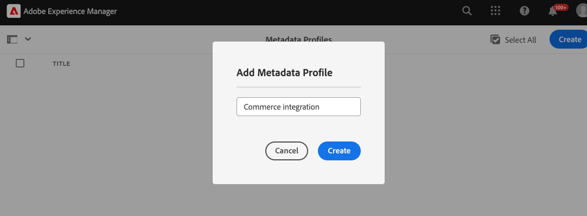

# Configuración del proyecto de AEM Assets para que admita metadatos de Commerce

Cuando utiliza AEM Assets como sistema de administración de recursos digitales (DAM) para Commerce, la instalación del paquete `assets-commerce` le permite administrar imágenes y vídeos para productos de Commerce desde el entorno de creación de AEM.

Complete los siguientes pasos para configurar el proyecto de AEM Assets con el código de paquete y los metadatos necesarios para administrar los recursos de Commerce desde el entorno de creación de AEM:

1. [Obtenga información acerca de &#x200B;](#aem-commerce-assets-commerce-package-contents)

1. [Complete los pasos de instalación para configurar el proyecto de AEM Assets para que admita metadatos de Commerce](#step-1-install-the-assets-commerce-package)

## Contenido del paquete de AEM Commerce assets-commerce

Adobe proporciona un código de paquete de AEM Commerce `assets-commerce` para agregar recursos de espacio de nombres de Commerce y esquema de metadatos a la configuración del entorno de Experience Manager Assets as a Cloud Service.

Este código de paquete añade los siguientes recursos al entorno de creación de AEM Assets:

* Un [espacio de nombres personalizado](https://github.com/ankumalh/assets-commerce/blob/main/ui.config/jcr_root/apps/commerce/config/org.apache.sling.jcr.repoinit.RepositoryInitializer~commerce-namespaces.cfg.json), `Commerce` para identificar propiedades relacionadas con Commerce.

   * Un tipo de metadatos personalizado `commerce:isCommerce` con la etiqueta `Eligible for Commerce` para etiquetar recursos de Commerce asociados con un proyecto de Adobe Commerce.

   * Un tipo de metadatos personalizado `commerce:skus` y un componente de interfaz de usuario correspondiente para agregar una propiedad **[!UICONTROL Product Data]**. Los datos de producto incluyen las propiedades de metadatos para asociar un recurso de Commerce con los SKU de producto.

     {width="600" zoomable="yes"}

   * Atributos de tipo de metadatos personalizados `commerce:roles` y `commerce:positions` para mostrar cómo se visualiza el recurso en Commerce.

* Un formulario de esquema de metadatos con una pestaña de Commerce que incluye los campos `Eligible for Commerce` y `Product Data` para etiquetar recursos de Commerce. El formulario también proporciona opciones para mostrar u ocultar los campos `roles` y `position` de la interfaz de usuario de AEM Assets.

  {width="600" zoomable="yes"}

* Un [recurso de ejemplo etiquetado y aprobado por Commerce](https://github.com/ankumalh/assets-commerce/blob/main/ui.content/src/main/content/jcr_root/content/dam/wknd/en/activities/hiking/equipment_6.jpg/.content.xml) `equipment_6.jpg` para admitir la sincronización inicial de recursos. Solo los recursos de Commerce aprobados se pueden sincronizar de AEM Assets a Adobe Commerce.

>[!NOTE]
>
> Consulte la página [readme](https://github.com/ankumalh/assets-commerce) para obtener más información sobre el **código de paquete de AEM Commerce**.

## Requisitos previos

Necesita los siguientes recursos y permisos para implementar el código de paquete `assets-commerce` en el entorno as a Cloud Service AEM de AEM Assets:

* [Acceso al Programa Cloud Manager de AEM Assets y a los entornos](https://experienceleague.adobe.com/en/docs/experience-manager-cloud-service/content/onboarding/journey/cloud-manager#access-sysadmin-bo) con los roles de Administrador de implementación y Programa.

* Un [entorno de desarrollo local de AEM](https://experienceleague.adobe.com/en/docs/experience-manager-learn/cloud-service/local-development-environment-set-up/overview) y conocimiento del proceso de desarrollo local de AEM.

* Comprenda la [estructura del proyecto AEM](https://experienceleague.adobe.com/es/docs/experience-manager-cloud-service/content/implementing/developing/aem-project-content-package-structure) y cómo implementar paquetes de contenido personalizado mediante Cloud Manager.

* La **ID de organización de IMS** configurada para su instancia de Commerce.

* Para habilitar [Dynamic Media con las funciones de OpenAPI](https://experienceleague.adobe.com/en/docs/experience-manager-cloud-service/content/assets/dynamicmedia/dynamic-media-open-apis/dynamic-media-open-apis-overview#enable-dynamic-media-open-apis) en AEM as a Cloud Service, envía un ticket de asistencia de Adobe con la siguiente información:

   * Title: Habilite la API abierta de Dynamic Media para lograr una integración completa entre Adobe Commerce y los AEM Assets/productos visuales de AEM Assets

   * Contenido del ticket de asistencia:

   * **[!UICONTROL AEM Program ID]**
   * **[!UICONTROL Adobe Commerce URL]**
   * **[!UICONTROL AEM Environment ID]**
   * **[!UICONTROL IMS Org ID]** para el entorno de creación de AEM Assets que desea conectar a Commerce.

  Una vez enviado el vale de soporte, Adobe habilita Dynamic Media con las capacidades de OpenAPI en su entorno de Cloud Services y comparte los detalles, como el ID de cliente de IMS, para que pueda continuar con la integración.

## Paso 1: Instalación del paquete de assets-commerce

1. Vaya a AEM Cloud Manager, seleccione un programa y [cree entornos de producción y ensayo](https://experienceleague.adobe.com/en/docs/experience-manager-cloud-service/content/onboarding/journey/create-environments#creating-environments) que desee integrar con Adobe Commerce.

1. Configure una [canalización de implementación](https://experienceleague.adobe.com/en/docs/experience-manager-cloud-service/content/sites/administering/site-creation/quick-site/pipeline-setup#create-front-end-pipeline) o verifique que su canalización pueda implementar cambios en el entorno seleccionado.

1. [Clonar el repositorio de Git administrado por Adobe](https://experienceleague.adobe.com/en/docs/experience-manager-cloud-service/content/sites/administering/site-creation/quick-site/retrieve-access#repo-access) para el programa seleccionado.

1. En GitHub, descargue el código del paquete del [repositorio Commerce de AEM Assets](https://github.com/ankumalh/assets-commerce).

1. Desde su [entorno de desarrollo local de AEM](https://experienceleague.adobe.com/en/docs/experience-manager-learn/cloud-service/local-development-environment-set-up/overview), copie manualmente el código descargado en el repositorio administrado de Adobe existente.

1. En todos los `filter.xml` y `pom.xml files` de su proyecto, reemplace todas las ocurrencias de `<my-app>` con el nombre de su aplicación.

>[!NOTE]
>
> También puede instalar el código personalizado en la configuración de su proyecto de AEM Assets como un paquete de **Maven**.

1. Confirme los cambios e inserte la rama de desarrollo local en el repositorio de Git de Cloud Manager.

1. Desde AEM Cloud Manager, [actualice el entorno de AEM mediante la canalización para implementar su código](https://experienceleague.dobe.com/en/docs/experience-manager-cloud-service/content/implementing/using-cloud-manager/deploy-code#deploying-code-with-cloud-manager).

1. Vaya a cualquier recurso y edite sus propiedades para validar los cambios:

   * El esquema de metadatos predeterminado incluye la ficha **Commerce**.

   * Los SKU del producto y los campos `Eligible for Commerce` están visibles.

### La pestaña Commerce no está visible en las propiedades

Si la ficha **Commerce** no aparece en las propiedades, debe crear manualmente una en el editor de esquemas de metadatos.

1. Vaya al editor de esquemas de metadatos.

1. Haga clic en **Editar** para modificar el formulario de esquema de metadatos predeterminado.

1. Cree una ficha **Commerce** y selecciónela.

1. Arrastre y suelte el componente **Product** en la ficha **Commerce** y asígnelo a la propiedad `commerce:skus`.

1. Seleccione la casilla de verificación para **mostrar roles** y **mostrar pedido**.

1. Arrastre y suelte un componente **checkbox** en la ficha **Commerce** y asígnelo a la propiedad `commerce:isCommerce`. Defina **Yes** y **No** como las opciones.

Si tiene algún otro problema, cree un [ticket de asistencia](https://experienceleague.adobe.com/docs/commerce-knowledge-base/kb/help-center-guide/magento-help-center-user-guide.html#submit-ticket) o póngase en contacto con su representante de ventas de integración de AEM Assets para obtener ayuda.

## Paso 2: Opcional. Configuración de un perfil de metadatos

En el entorno de creación de AEM Assets, establezca los valores predeterminados para los metadatos de recursos de Commerce creando un perfil de metadatos. A continuación, aplique el nuevo perfil a las carpetas de recursos de AEM para utilizar automáticamente estos valores predeterminados. Esta configuración optimiza el procesamiento de recursos al reducir los pasos manuales.

Al configurar el perfil de metadatos, solo debe configurar los siguientes componentes:

* Agregue una pestaña Commerce. Esta pestaña habilita las opciones de configuración específicas de Commerce que agrega la plantilla.

* Agregue el campo `Eligible for Commerce` a la ficha Commerce.

El componente de interfaz de usuario de datos del producto se agrega automáticamente en función de la plantilla.

### Definición del perfil de metadatos

1. Inicie sesión en el entorno de creación de Adobe Experience Manager.

1. En Adobe Experience Manager Workspace, vaya al espacio de trabajo Administración de contenido de autor para AEM Assets haciendo clic en el icono Adobe Experience Manager.

   {width="600" zoomable="yes"}

1. Abra las Herramientas de administración seleccionando el icono de martillo.

   {width="600" zoomable="yes"}

1. Abra la página de configuración del perfil haciendo clic en **[!UICONTROL Metadata Profiles]**.

1. **[!UICONTROL Create]** un perfil de metadatos para la integración de Commerce.

   {width="600" zoomable="yes"}

1. Agregue una pestaña para los metadatos de Commerce.

   1. A la izquierda, haga clic en **[!UICONTROL Settings]**.

   1. Haga clic en **[!UICONTROL +]** en la sección de la ficha y, a continuación, especifique **[!UICONTROL Tab Name]**, `Commerce`.

1. Agregue el campo `Eligible for Commerce` al formulario.

   {width="600" zoomable="yes"}

   * Haga clic en **[!UICONTROL Build form]**.

   * Arrastre el campo `Single Line text` al formulario.

   * Agregue el texto `Eligible for Commerce` para la etiqueta haciendo clic en **[!UICONTROL Field Label]**.

   * En la pestaña Configuración, agregue el texto de la etiqueta a **Etiqueta de campo**.

   * Establezca el texto del marcador de posición en `yes`.

   * En el campo **[!UICONTROL Map to Property]**, copie y pegue el siguiente valor

     ```terminal
     ./jcr:content/metadata/commerce:isCommerce
     ```

1. Opcional. Para sincronizar automáticamente los recursos de Commerce aprobados a medida que se cargan en el entorno de AEM Assets, establezca el valor predeterminado del campo _[!UICONTROL Review Status]_&#x200B;en la pestaña `Basic` en `approved`.

1. Guarde la actualización.

### Aplicar el perfil de metadatos a la carpeta de origen de los recursos de Commerce

1. En la página [!UICONTROL &#x200B; Metadata Profiles], seleccione el perfil de integración de Commerce.

1. En el menú de acción, seleccione **[!UICONTROL Apply Metadata Profiles to Folders]**.

1. Seleccione la carpeta que contiene los recursos de Commerce.

   Cree una carpeta de Commerce si no existe.

1. Haga clic en **[!UICONTROL Apply]**.

## Pasos siguientes

* [!BADGE Solo PaaS]{type=Informative tooltip="Solo se aplica a proyectos de Adobe Commerce en la nube (infraestructura PaaS administrada por Adobe)."} [Instalar paquetes de Adobe Commerce](configure-commerce.md).

* [!BADGE Solo SaaS]{type=Positive url="https://experienceleague.adobe.com/en/docs/commerce/user-guides/product-solutions" tooltip="Solo se aplica a los proyectos de Adobe Commerce as a Cloud Service y Adobe Commerce Optimizer (infraestructura de SaaS administrada por Adobe)."} [Configure la integración desde el administrador de Commerce](setup-synchronization.md).
