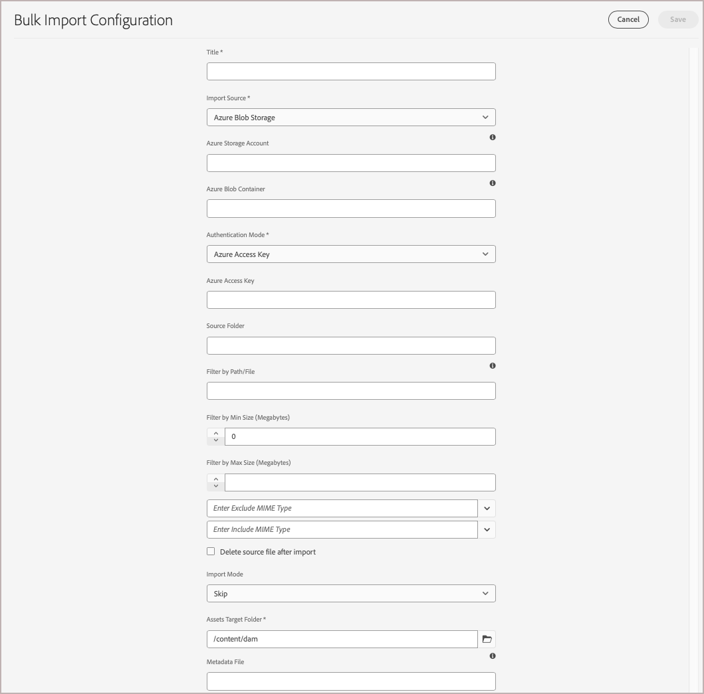

# Migrar archivos de medios al DAM de AEM Assets

Tanto Adobe Commerce como Adobe Experience Manager (AEM) proporcionan características integradas para optimizar la migración de archivos multimedia de Commerce al **sistema de administración de recursos digitales (DAM)** de los AEM Assets. También puede migrar archivos multimedia de otras fuentes.

## Requisitos previos

| Categoría | Requisito |
|----------|-------------|
| **Requisitos del sistema** | <ul><li>Entorno de AEM as a Cloud Service aprovisionado con AEM Assets</li><li>Capacidad de almacenamiento suficiente</li><li>Ancho de banda de red para transferencias de archivos grandes</li></ul> |
| **Acceso y permisos requeridos** | <ul><li>Acceso de administrador a AEM Assets as a Cloud Service</li><li>Acceso al sistema de origen donde se almacenan los archivos multimedia (Adobe Commerce o sistema externo)</li><li>Permisos adecuados para acceder a los servicios de almacenamiento en la nube</li></ul> |
| **Cuenta de almacenamiento en la nube** | <ul><li>Cuenta de almacenamiento de AWS S3 o Azure Blob</li><li>Configuración de contenedor/contenedor privado</li><li>Credenciales de autenticación</li></ul> |
| **Contenido de Source** | <ul><li>Archivos de medios organizados listos para la migración</li><li>Archivos de imagen y vídeo en <a href="https://experienceleague.adobe.com/en/docs/experience-manager-cloud-service/content/assets/file-format-support#image-formats">formatos admitidos por los AEM Assets</a>.</li><li>Recursos limpios y duplicados</li></li> |
| **Preparación de metadatos** | <ul><li><a href="https://experienceleague.adobe.com/en/docs/commerce-admin/content-design/aem-asset-management/getting-started/aem-assets-configure-aem">Perfil de metadatos de AEM Assets configurado para recursos de Commerce</a></li><li>Valores de metadatos asignados para cada recurso</li><li>Editor de archivos CSV (por ejemplo, Microsoft Excel)</li></ul> |

## Prácticas recomendadas de migración

1. Elimine el contenido no utilizado y duplicado para depurar los recursos antes de la migración.

1. Organice los recursos lógicamente por tamaño, formato o caso de uso.

1. Considere la posibilidad de dividir migraciones grandes en lotes más pequeños.

1. Programar importaciones que consuman muchos recursos durante las horas de menor actividad.

1. Valide la asignación de metadatos antes de la importación completa.

## Flujo de trabajo migración

Siga el flujo de trabajo de migración para exportar archivos de medios desde Adobe Commerce u otro sistema externo e importarlos en el DAM de AEM Assets.

### Paso 1: Exportación de contenido desde la fuente de datos existente

[!BADGE Solo PaaS]{type=Informative tooltip="Solo se aplica a proyectos de Adobe Commerce en la nube (infraestructura PaaS administrada por Adobe)."}

Para los comerciantes de Adobe Commerce, el **módulo de almacenamiento remoto** puede facilitar la importación y exportación de archivos multimedia. Este módulo permite a las empresas almacenar y administrar archivos multimedia mediante servicios de almacenamiento remoto como AWS S3. Para configurar el almacenamiento remoto de su instancia de Commerce, consulte [Configuración del almacenamiento remoto](https://experienceleague.adobe.com/en/docs/commerce-operations/configuration-guide/storage/remote-storage/remote-storage-aws-s3) en la **Guía de configuración de Commerce**.

Si tiene archivos multimedia almacenados fuera de Adobe Commerce, cárguelos directamente a una de las [fuentes de datos](https://experienceleague.adobe.com/en/docs/experience-manager-cloud-service/content/assets/assets-view/bulk-import-assets-view#prerequisites) compatibles con AEM as a Cloud Service.

### Paso 2: Crear un archivo CSV para la asignación de metadatos

Cree un archivo CSV que asigne cada archivo multimedia a sus datos de producto de Commerce. Elija uno de los siguientes métodos:

* **Adobe Commerce (PaaS)**: use el comando CLI para generar automáticamente el CSV a partir del catálogo
* Crear manualmente el archivo CSV

#### Exportación de metadatos mediante CLI

[!BADGE Solo PaaS]{type=Informative tooltip="Solo se aplica a proyectos de Adobe Commerce en la nube (infraestructura PaaS administrada por Adobe)."}

Utilice el comando CLI de integración de AEM Assets para generar automáticamente un archivo CSV de metadatos que incluya direcciones URL, posiciones y funciones de imagen a partir de los archivos multimedia de producto almacenados en el proyecto de Commerce.

1. Enumere los comandos disponibles para comprobar que el módulo Integración de AEM Assets está instalado:

   ```bash
   bin/magento list aem
   ```

   Los comandos de extensión personalizados aparecen bajo `aem` al principio de la lista de comandos.

1. Ejecute el comando de exportación de metadatos con el prefijo de ruta de AEM:

   ```bash
   bin/magento aem:assets:export:csv <AEM-path-prefix>
   ```

   `<AEM-path-prefix>` es la ruta de la carpeta base en la que se almacenarán los recursos en DAM de AEM Assets (por ejemplo, `/content/dam/commerce/`).

   ```bash
   bin/magento aem:assets:export:csv /content/dam/commerce/
   ```

   Esto crea un archivo de `metadata.csv` en el directorio `var/export` que contiene las direcciones URL, las posiciones y los roles de imagen para cada recurso de producto en el catálogo de Commerce.

#### Cree el CSV manualmente

Para los archivos multimedia almacenados fuera de Adobe Commerce, cree manualmente el archivo CSV. Los encabezados de columna **deben coincidir** con los nombres de campo configurados en su [perfil de metadatos de AEM Assets](configure-aem.md). Después de crear el archivo, rellene las filas con los valores de metadatos de cada archivo multimedia.

| Metadatos | Descripción | Valor |
|-------|-------------|--------|
| assetPath | Ruta de acceso completa en la que se almacenará el recurso en el repositorio de AEM Assets.<br><br>Utilice la ruta de acceso para crear subcarpetas para organizar los recursos de Commerce, por ejemplo `content/dam/commerce/<brand>/<type>`. | `/content/dam/commerce/<sub-folder>/..<filename>` |
| commerce:positions | La posición/orden del recurso en las galerías de productos | Varios valores numéricos separados por barra vertical (&quot;Número: multi&quot;) |
| commerce:isCommerce | Indicador que indica si el recurso se utiliza en el comercio | `Yes` |
| commerce:skus | SKU de producto asociadas a este recurso | Varios valores de cadena separados por barra vertical (cadena: multi) |
| commerce:roles | Los roles o tipos de imágenes para el recurso (por ejemplo, `thumbnail`, `main image`, `swatch`) | Valores múltiples separados por punto y coma (por ejemplo, &quot;thumbnail; image; swatch_image; small_image&quot;) |

+++Código CSV

Utilice este código CSV de ejemplo para crear el archivo en un editor de código o una aplicación de hoja de cálculo como Microsoft Excel.

```csv
assetPath,commerce:positions{{Number: multi}},commerce:isCommerce{{String}},commerce:skus{{String: multi}},commerce:roles{{String: multi}}
/content/dam/commerce/sample1.jpg,1,Yes,sku1,thumbnail; image; swatch_image; small_image
/content/dam/commerce/sample2.jpg,1|1|1,Yes,sku1|sku2|sku3,thumbnail; image; swatch_image; small_image|image|image; small_change
```

+++

### Paso 3: Importación masiva de Assets en AEM Assets

Después de crear el archivo de asignación de metadatos, utilice la herramienta de importación masiva de AEM Assets para importar los recursos.

A continuación se ofrece una descripción general de alto nivel sobre el uso de la herramienta.

1. [Inicie sesión en el entorno de as a Cloud Service Author para AEM Assets](https://experienceleague.adobe.com/en/docs/experience-manager-cloud-service/content/onboarding/journey/aem-users#login-aem).

1. En la vista Herramientas de Experience Manager, seleccione **[!UICONTROL Assets]** > **[!UICONTROL Bulk Import]**.

   {width="600" zoomable="yes"}

1. En Configuraciones de importación masiva, seleccione **[!UICONTROL Create]** para abrir el formulario de configuración.

   {width="600" zoomable="yes"}

1. Configure y guarde la configuración.

   Necesitará lo siguiente:

   * Credenciales de autenticación para la fuente de datos
   * Carpeta de destino en los AEM Assets donde se almacenarán los archivos importados
   * Opcional. Información sobre los tipos MIME, el tamaño de archivo y otros parámetros para personalizar la configuración de importación
   * La ruta al archivo CSV de asignación de metadatos que ha cargado en la instancia de almacenamiento de Cloud.

   Para ver los pasos detallados, consulte [Configuración de la herramienta de importación masiva](https://experienceleague.adobe.com/en/docs/experience-manager-cloud-service/content/assets/manage/add-assets#configure-bulk-ingestor-tool) en la *Guía del usuario de as a Cloud Service para AEM Assets*.

1. Después de guardar la configuración, utilice las herramientas de importación masiva para probar y ejecutar la operación de importación.

>[!MORELIKETHIS]
>
> [Demostración en vídeo de la herramienta de importación masiva](https://experienceleague.adobe.com/en/docs/experience-manager-cloud-service/content/assets/manage/add-assets#asset-bulk-ingestor)
> [Sugerencias, prácticas recomendadas y limitaciones](https://experienceleague.adobe.com/en/docs/experience-manager-cloud-service/content/assets/manage/add-assets#tips-limitations)
> [Cargar o introducir recursos mediante API ](https://experienceleague.adobe.com/en/docs/experience-manager-cloud-service/content/assets/admin/developer-reference-material-apis#asset-upload)
