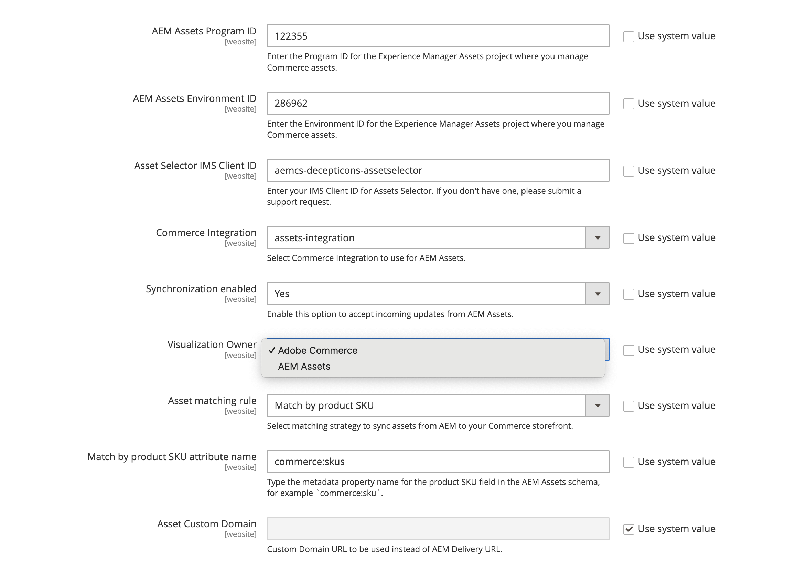

# Configuración de la integración

Configure la integración conectando Commerce a la instancia de AEM Assets y seleccionando la estrategia de coincidencia para la sincronización de recursos.

Después de identificar el proyecto de AEM Assets, seleccione la regla de coincidencia para sincronizar los recursos entre Adobe Commerce y los AEM Assets.

* **[!UICONTROL Match by product SKU]**: regla predeterminada que coincide con el SKU de los metadatos del recurso con el [SKU del producto de Commerce](https://experienceleague.adobe.com/en/docs/commerce-operations/implementation-playbook/glossary#sku) para garantizar que los recursos estén asociados con los productos correctos.

* **[!UICONTROL Custom match]**: regla de coincidencia para escenarios más complejos o requisitos empresariales específicos que requieren una lógica de coincidencia personalizada. La implementación de la coincidencia personalizada requiere el desarrollo de código personalizado en Adobe Developer App Builder para definir cómo se comparan los recursos con los productos. Próximamente más detalles...

Para la configuración inicial, usa la regla predeterminada *Coincidir con el SKU del producto*.

## Requisitos previos

* [Configuración del proyecto de AEM Assets](configure-aem.md)

* [!BADGE Solo PaaS]{type=Informative tooltip="Solo se aplica a proyectos de Adobe Commerce en la nube (infraestructura PaaS administrada por Adobe)."} [Instale paquetes de Adobe Commerce](configure-commerce.md) para agregar la extensión y generar las credenciales y conexiones necesarias para usar la extensión.

* Siga los pasos descritos en el tema [habilitar la API abierta de Dynamic Media](https://experienceleague.adobe.com/en/docs/experience-manager-cloud-service/content/assets/dynamicmedia/dynamic-media-open-apis/dynamic-media-open-apis-overview#enable-dynamic-media-open-apis). Incluya la siguiente información para el equipo de asistencia:

   * **[!UICONTROL AEM Program ID]**
   * **[!UICONTROL Adobe Commerce URL]**
   * **[!UICONTROL AEM Environment ID]**,
   * **[!UICONTROL IMS Org ID]** para el entorno de creación de AEM Assets que desea conectar a Commerce.

## Configuración de la conexión

1. Obtenga el proyecto [Entorno de creación de AEM Assets](https://experienceleague.adobe.com/en/docs/experience-manager-cloud-service/content/sites/authoring/quick-start) y el ID de entorno.

   1. Abra AEM Cloud Manager y seleccione **[!UICONTROL Assets]**.

   1. Copie y guarde los identificadores de proyecto y entorno desde la dirección URL: `https://author-p[Program ID]-e[EnvironmentID].adobeaemcloud.com/`

1. En el Administrador de Commerce, abra la configuración Integración de AEM Assets.

   1. Vaya a **[!UICONTROL Store]** > Configuración > **[!UICONTROL ADOBE SERVICES]** > **[!UICONTROL AEM Assets Integration]**.

      La integración de {width="600" zoomable="yes"}

1. Introduzca el entorno de AEM Assets **[!UICONTROL Program ID]** y **[!UICONTROL Environment ID]**.

   Edite los valores de configuración eliminando la selección de *[!UICONTROL Use system value]*.

1. Escriba **[!UICONTROL Asset Selector IMS Client ID]**.

   Para obtener más información sobre el Selector de recursos, consulte [Selección manual de recursos](../synchronize/asset-selector-integration.md)

1. [!BADGE Solo PaaS]{type=Informative tooltip="Solo se aplica a proyectos de Adobe Commerce en la nube (infraestructura PaaS administrada por Adobe)."} Seleccione [[!UICONTROL Commerce integration]](configure-commerce.md#add-the-integration-to-the-commerce-environment) para autenticar solicitudes entre Commerce y el servicio de coincidencia de recursos.

1. Establezca **[!UICONTROL Commerce integration]** en `assets-integration` para seleccionar la integración de Commerce que se usará con los AEM Assets.

1. Establezca **[!UICONTROL Synchronization enabled]** en `Yes` para permitir que Commerce acepte actualizaciones entrantes de los AEM Assets.

   Después de habilitar la integración, hay opciones de configuración adicionales disponibles para especificar criterios coincidentes de recursos.

1. Seleccione una de las reglas de coincidencia de recursos para la sincronización de recursos de la lista desplegable **[!UICONTROL Asset matching rule]**.

   * Seleccionar **[!UICONTROL Match by SKU]** para [coincidencia automática predeterminada](../synchronize/default-match.md),
   * Seleccione **[!UICONTROL Custom match]** para [coincidencia automática personalizada](../synchronize/custom-match.md) (requiere [Adobe Developer App Builder](https://experienceleague.adobe.com/en/docs/commerce-learn/tutorials/adobe-developer-app-builder/introduction-to-app-builder)).

1. Agregue el nombre del campo de metadatos de AEM Assets [definido para las SKU de productos de Commerce en el campo ](configure-aem.md#configure-metadata), **[!UICONTROL Match by product SKU attribute name]** de forma predeterminada.`commerce:skus`

1. Seleccione **[!UICONTROL Save Config]** para aplicar actualizaciones e iniciar la sincronización de recursos.

   La actualización de configuración crea un déclencheur con el proceso de sincronización inicial, lo que permite a Commerce aceptar las actualizaciones entrantes de los AEM Assets. El tiempo necesario para la sincronización depende del volumen de recursos y de las configuraciones específicas. La integración aprovecha los procesos automatizados para minimizar el tiempo necesario para la sincronización.

### Sincronización SLA

La integración garantiza los siguientes niveles de rendimiento de sincronización:

* `< 5 minutes for 99% of updates`

* `< 30 minutes for 99.9% of updates`

Esto garantiza que las páginas de producto siempre muestren las imágenes más actualizadas, manteniendo el contenido de la tienda preciso y visualmente atractivo.

### Configuración del propietario de la visualización

La configuración **Propietario de la visualización** determina qué sistema proporciona imágenes de producto en la integración:

* Adobe Commerce: Utiliza imágenes alojadas en Commerce.
* AEM Assets: Utiliza imágenes sincronizadas desde AEM.

El administrador muestra las imágenes disponibles para ese propietario, mientras que el resto de las imágenes aparecen atenuadas y mostradas con la etiqueta **hidden**.

Consulte el tema [establecer detalles de la imagen](https://experienceleague.adobe.com/en/docs/commerce-admin/catalog/products/digital-assets/product-image#set-image-details){target=_blank} para obtener detalles sobre el comportamiento de visualización de la imagen.

>[!TIP]
>
> Durante una migración de Commerce a AEM Assets, establezca **Propietario de la visualización** en Commerce para evitar que se rompan los vínculos de imagen. Una vez que todos los productos se hayan sincronizado correctamente con los AEM Assets, cambie al propietario de los AEM Assets para completar la transición. Esto garantiza la disponibilidad continua de las imágenes durante todo el proceso.

1. Vaya a **[!UICONTROL Store]** > Configuración > **[!UICONTROL ADOBE SERVICES]** > **[!UICONTROL AEM Assets Integration]**.

   {width="400" zoomable="yes"}

1. Seleccione el origen de **Propietario de la visualización** para mostrar las imágenes.

1. Haga clic en **[!UICONTROL Save Config]** para aplicar actualizaciones e iniciar la sincronización de recursos.

### Opcional. Configuración de la URL del dominio personalizado

Si el proyecto as a Cloud Service de AEM Assets se ha configurado con un [nombre de dominio personalizado](https://experienceleague.adobe.com/es/docs/experience-manager-cloud-service/content/implementing/using-cloud-manager/custom-domain-names/add-custom-domain-name){target=_blank}, debe agregar el nombre de dominio a la configuración de la tienda de Commerce para que la integración de AEM Assets para Commerce pueda utilizarlo.

1. Vaya a **[!UICONTROL Store]** > Configuración > **[!UICONTROL ADOBE SERVICES]** > **[!UICONTROL AEM Assets Integration]**.

   La integración de {width="700" zoomable="yes"}

1. Agregue la **URL de dominio personalizado** al campo **[!UICONTROL Asset Custom Domain]**.

1. Haga clic en **[!UICONTROL Save Config]** para aplicar actualizaciones e iniciar la sincronización de recursos.

## Siguiente paso

[Administración de recursos de Commerce](../manage-assets.md)
