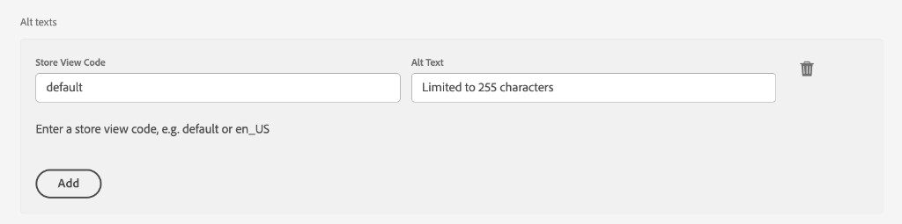

# Metadatos de Commerce en AEM Assets

Los metadatos de Commerce son el contrato entre los AEM Assets y Commerce. Indica a Commerce qué recursos son para Commerce, a qué productos pertenecen y cómo deben utilizarse o mostrarse. Estos metadatos permiten a la integración de AEM Assets asignar y sincronizar correctamente los archivos de recursos.

Los metadatos de Commerce habilitan las siguientes funciones:

* **Marcar un recurso como apto para Commerce** mediante el campo `commerce:isCommerce`.
* **Asocie un recurso con uno o más SKU de producto** a través del campo `commerce:skus`.
* **Defina cómo aparece el recurso en Commerce** mediante los campos `commerce:roles` y `commerce:positions`.
* **Agregar texto alternativo específico de Commerce con clave de vista de tienda** a través de los campos `commerce:altTextStoreViews` y `commerce:altTextValues`.
* **Exponga estos campos en la interfaz de usuario de las propiedades de los AEM Assets** a través de una ficha y un formulario de esquema de **[!UICONTROL Commerce]**.

>[!IMPORTANT]
>
>La funcionalidad **Texto alternativo específico de Commerce** aún no está disponible a través de la incorporación de [autoservicio](get-started/configure-aem.md#enable-aem-commerce-self-service). Actualmente solo se proporciona al implementar el paquete de código personalizado `assets-commerce` (consulte [Instalar el paquete de assets-commerce manualmente](get-started/configure-aem.md#install-the-assets-commerce-package-manually)). La compatibilidad nativa está planificada para una próxima versión de AEM.

Para configurar estos recursos en su proyecto de AEM, consulte [Configuración del proyecto de AEM Assets](get-started/configure-aem.md). El resto de este tema describe cómo se proporcionan los metadatos.

## Contenido del paquete de AEM Commerce assets-commerce

Adobe proporciona el paquete de código AEM Commerce `assets-commerce` para agregar recursos de esquemas de metadatos y áreas de nombres de Commerce a la configuración de as a Cloud Service de Experience Manager Assets.

Este código de paquete añade los siguientes recursos al entorno de creación de AEM Assets:

* Un [espacio de nombres personalizado](https://github.com/ankumalh/assets-commerce/blob/main/ui.config/jcr_root/apps/commerce/config/org.apache.sling.jcr.repoinit.RepositoryInitializer~commerce-namespaces.cfg.json), `Commerce` para identificar propiedades relacionadas con Commerce.

   * Un tipo de metadatos personalizado `commerce:isCommerce` con la etiqueta `Eligible for Commerce` para etiquetar recursos de Commerce asociados con un proyecto de Adobe Commerce.

   * Un tipo de metadatos personalizado `commerce:skus` y un componente de interfaz de usuario correspondiente para agregar una propiedad **[!UICONTROL Product Data]**. Los datos de producto incluyen las propiedades de metadatos para asociar un recurso de Commerce con los SKU de producto.

     {width="600" zoomable="yes"}

   * Atributos de tipo de metadatos personalizados `commerce:roles` y `commerce:positions` que muestran cómo se visualiza el recurso en Commerce.

   * Metadatos de varios campos de texto alternativo (_[!UICONTROL Alt texts]_) para que los editores puedan escribir texto alternativo para cada código de vista de la tienda Commerce. El multicampo persiste en dos propiedades `String[]` alineadas con el índice:

      * `commerce:altTextStoreViews` — almacena el código de vista de cada fila.
      * `commerce:altTextValues` — texto alternativo coincidente en el mismo índice que cada entrada de `commerce:altTextStoreViews`.

     Las implementaciones de App Builder que usan un [coincidente externo](synchronize/custom-match.md){target=_blank} pueden interceptar estas propiedades al transformar las cargas útiles de los recursos. Esto no cambia la forma en que las imágenes de producto se asignan o asignan en el ámbito del catálogo. Ver [texto alternativo localizado en los metadatos de los AEM Assets](#localized-alt-text-in-aem-assets-metadata).

* Un formulario de esquema de metadatos con una pestaña de Commerce que incluye los campos `Eligible for Commerce` y `Product Data` para etiquetar recursos de Commerce. El formulario también proporciona opciones para mostrar u ocultar los campos `roles` y `position` de la interfaz de usuario de AEM Assets.

  {width="600" zoomable="yes"}

* Un [recurso de ejemplo etiquetado y aprobado por Commerce](https://github.com/ankumalh/assets-commerce/blob/main/ui.content/src/main/content/jcr_root/content/dam/wknd/en/activities/hiking/equipment_6.jpg/.content.xml) `equipment_6.jpg` para admitir la sincronización inicial de recursos. Solo los recursos de Commerce aprobados se pueden sincronizar de AEM Assets a Adobe Commerce.

>[!NOTE]
>
> Consulte la página [readme](https://github.com/ankumalh/assets-commerce) en GitHub para obtener más información sobre el **código de paquete de AEM Commerce**.

## Texto alternativo localizado en metadatos de AEM Assets

El multicampo _[!UICONTROL Alt texts]_&#x200B;está disponible en el editor de metadatos de recursos de AEM Assets en la pestaña **[!UICONTROL Commerce]**&#x200B;cuando edita una imagen elegible.

>[!IMPORTANT]
>
> El comportamiento de vista por tienda se aplica solo a texto alternativo. La integración de AEM Assets no sincroniza diferentes imágenes de productos por vista de tienda de Adobe Commerce. Las imágenes de producto de AEM se siguen sincronizando con Commerce con el mismo comportamiento de asignación de galerías que antes de esta versión.

El multicampo contiene una fila por cada vista de tienda de Commerce. Cada fila tiene dos entradas:

* **[!UICONTROL Store View Code]**: el identificador de vista de almacén (por ejemplo `default` o `en_US`).

* **[!UICONTROL Alt Text]**: texto alternativo para esa vista de almacén, con un límite de 255 caracteres.

Seleccione **[!UICONTROL Add]** para agregar más filas para vistas de tienda adicionales. Para quitar una fila, seleccione el icono **[!UICONTROL Delete]** de esa fila para quitarla.

{width="600" zoomable="yes"}

Al guardar, la validación del lado del cliente bloquea el envío si alguna fila tiene un elemento _[!UICONTROL Store View Code]_&#x200B;vacío o si dos filas utilizan el mismo código de vista de almacén (sin distinción de mayúsculas y minúsculas).

Las entradas de texto alternativas persisten en los metadatos de recursos JCR como dos propiedades `String[]` alineadas con el índice:

* `commerce:altTextStoreViews`: almacena el código de vista de cada fila.
* `commerce:altTextValues`: texto alternativo coincidente en el mismo índice que cada entrada de `commerce:altTextStoreViews`.

Cuando estos recursos se sincronizan con Adobe Commerce, el texto alternativo de vista por tienda se escribe en la galería de medios del producto para los códigos de vista de tienda coincidentes. La asignación de imágenes subyacente no se ha modificado.
