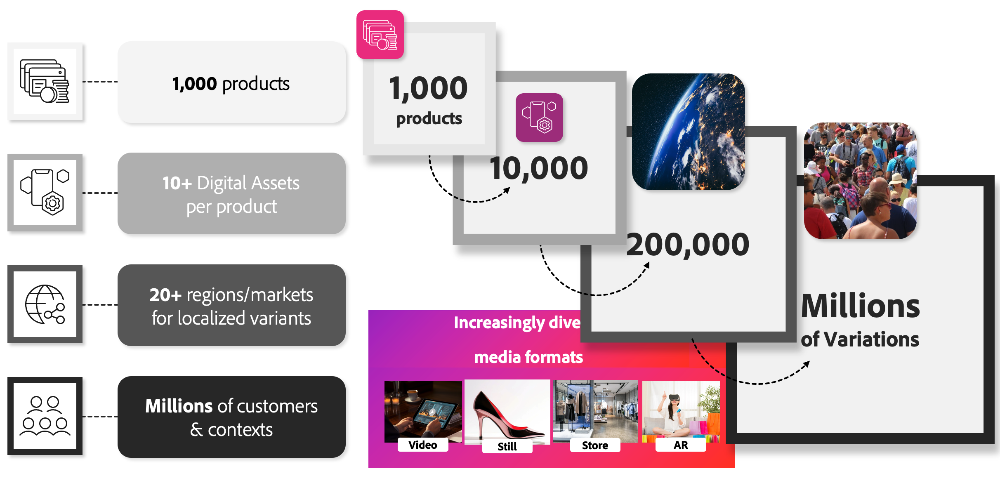

# Integración de AEM Assets para Commerce

La demanda de contenido personalizado aumenta rápidamente mientras que los presupuestos de marketing están bajo presión. Los minoristas y las marcas tienen dificultades para mantenerse al día con la creciente necesidad de variaciones en las imágenes de los productos, impulsadas por requisitos regionales, estacionales y específicos de segmentos.

Piense en un retailer con 1000 productos. Incluso antes de tener en cuenta las variaciones de atributos, el número de recursos digitales necesarios se amplía significativamente al tener en cuenta diferentes regiones, segmentos de clientes y esfuerzos de personalización. Esto puede conllevar un número abrumador de variaciones de activos, llegando a millones.

{width="700" zoomable="yes"}

La integración de AEM Assets aborda este desafío automatizando los flujos de trabajo de administración de recursos. La integración garantiza que los recursos digitales, como las imágenes de los productos y el contenido de marketing, se vinculen dinámicamente a las entidades de comercialización adecuadas, incluidos los productos y las categorías de Adobe Commerce, en función del SKU u otros atributos clave. Este proceso optimiza las operaciones y mejora la eficacia al permitir lo siguiente:

* **Instalación y configuración sin problemas**: los equipos y desarrolladores de comercialización pueden configurar rápidamente la integración con herramientas y flujos de trabajo de Adobe conocidos.

* **Actualizaciones dinámicas de recursos**: las imágenes y los recursos de marketing del producto reflejan automáticamente los cambios más recientes en los AEM Assets, por lo que las tiendas son precisas y relevantes.

* **Administración optimizada de catálogos**: automatiza la actualización y limpieza de recursos, minimiza el esfuerzo manual y garantiza un catálogo de productos coherente y bien mantenido.

## Requisitos para utilizar la integración

Para aprovechar esta integración con [AEM Assets o elementos visuales del producto](https://experienceleague.adobe.com/es/docs/commerce/cloud-service/overview#product-visuals-powered-by-aem-assets), las empresas deben cumplir con los siguientes requisitos:

>[!BEGINTABS]

>[!TAB Imágenes del producto]

[!BADGE Solo SaaS]{type=Positive url="https://experienceleague.adobe.com/es/docs/commerce/user-guides/product-solutions" tooltip="Solo se aplica a los proyectos de Adobe Commerce as a Cloud Service y Adobe Commerce Optimizer (infraestructura de SaaS administrada por Adobe)."} licencias activas para Adobe Commerce, elementos visuales de productos con tecnología de AEM Assets y [AEM Dynamic Media](https://experienceleague.adobe.com/es/docs/experience-manager-65/content/assets/dynamic/administering-dynamic-media) (estas licencias están disponibles de forma predeterminada con [!DNL Adobe Commerce as a Cloud Service] y [!DNL Adobe Commerce Optimizer]).

>[!TAB AEM Assets]

[!BADGE Solo SaaS]{type=Positive url="https://experienceleague.adobe.com/es/docs/commerce/user-guides/product-solutions" tooltip="Solo se aplica a los proyectos de Adobe Commerce as a Cloud Service y Adobe Commerce Optimizer (infraestructura de SaaS administrada por Adobe)."} licencias activas para Adobe Commerce, Adobe Experience Manager Assets y [AEM Dynamic Media](https://experienceleague.adobe.com/es/docs/experience-manager-65/content/assets/dynamic/administering-dynamic-media).

[!BADGE Solo PaaS]{type=Informative tooltip="Solo se aplica a proyectos de Adobe Commerce en la nube (infraestructura PaaS administrada por Adobe)."} Adobe Commerce 2.4.5+

* PHP 8.1, 8.2, 8.3 y 8.4

* Composer 2.x

[!BADGE Solo SaaS]{type=Positive url="https://experienceleague.adobe.com/es/docs/commerce/user-guides/product-solutions" tooltip="Solo se aplica a los proyectos de Adobe Commerce as a Cloud Service y Adobe Commerce Optimizer (infraestructura de SaaS administrada por Adobe)."} Adobe Experience Manager está aprovisionado con [Adobe Experience Manager Assets as a Cloud Service](https://experienceleague.adobe.com/es/docs/experience-manager-cloud-service/content/assets/overview)

>[!ENDTABS]

El usuario de Adobe Commerce que configuró la integración debe tener acceso a la [organización de IMS](https://experienceleague.adobe.com/es/docs/core-services/interface/administration/organizations#concept_EA8AEE5B02CF46ACBDAD6A8508646255) en la que se ha aprovisionado el proyecto de AEM Assets.

>[!BEGINSHADEBOX]

## Ventajas empresariales clave

 **Sin costo adicional**- Esta integración se proporciona de forma gratuita para los comerciantes que cumplan con los requisitos de licencia.

 **Solución oficial de Adobe**: desarrollada, mantenida y totalmente compatible con Adobe, que garantiza estabilidad y alineación con futuras mejoras de la plataforma.

 **Modelo de soporte administrado por Adobe**: la asistencia y la solución de problemas son gestionadas directamente por Adobe, lo que proporciona tranquilidad y una solución de problemas más ágil.

 **Funciones de Adobe Storefront Builder**: la solución de administración de activos digitales (DAM) permite el uso de recursos como imágenes, vídeos y otros medios en [Storefront Builder](https://experienceleague.adobe.com/developer/commerce/storefront/merchants/storefront-builder/?lang=es#userlabs-commerce-genai-product-visuals).

>[!ENDSHADEBOX]

## Tutorial

Vea estos vídeos para aprender a configurar y utilizar la integración de AEM Assets con Adobe Commerce.

>[!BEGINTABS]

>[!TAB Tutorial De PaaS]

Vea este vídeo para conocer cómo Adobe Commerce y los AEM Assets trabajan juntos para optimizar los flujos de trabajo de contenido:

>[!VIDEO](https://video.tv.adobe.com/v/3447886?captions=spa)

>[!TAB Tutorial de Adobe Commerce as a Cloud Service]

Aprenda a utilizar Adobe Commerce as a Cloud Service con la integración de AEM Assets.

>[!VIDEO](https://video.tv.adobe.com/v/3478140?quality=12&learn=on)

>[!ENDTABS]

## Pasos siguientes

Habilitar la integración de Commerce con Experience Manager Assets es un proceso de tres pasos:

1. [Configure su proyecto de AEM Assets para que admita metadatos de Commerce](get-started/configure-aem.md).

1. [!BADGE Solo PaaS]{type=Informative tooltip="Solo se aplica a proyectos de Adobe Commerce en la nube (infraestructura PaaS administrada por Adobe)."} [Instalar paquetes de Adobe Commerce](get-started/configure-commerce.md).

1. Configure la integración para su entorno:

   * [!BADGE Solo PaaS]{type=Informative tooltip="Solo se aplica a proyectos de Adobe Commerce en la nube (infraestructura PaaS administrada por Adobe)."} [Adobe Commerce](get-started/setup-synchronization.md)
   * [!BADGE Solo SaaS]{type=Positive url="https://experienceleague.adobe.com/es/docs/commerce/user-guides/product-solutions" tooltip="Solo se aplica a los proyectos de Adobe Commerce as a Cloud Service y Adobe Commerce Optimizer (infraestructura de SaaS administrada por Adobe)."} [Adobe Commerce Optimizer](get-started/configure-aco.md)

## Asistencia

Si necesita información o tiene preguntas que no se tratan en esta guía, póngase en contacto con su representante de ventas de integración de AEM Assets o cree un [ticket de asistencia](https://experienceleague.adobe.com/docs/commerce-knowledge-base/kb/help-center-guide/magento-help-center-user-guide.html?lang=es#submit-ticket) para recibir ayuda adicional.
