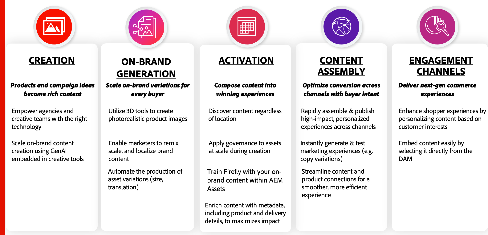

# Mantener un contenido preciso y relevante

Un suministro de contenido real implica una combinación de pilares clave en **Creación y producción**, **Flujo de trabajo y planificación**, y **Entrega y activación**. Cada uno de estos pilares es valioso por sí solo y ayuda a impulsar un valor significativo para las organizaciones:

{width="600" zoomable="yes"}

Una plataforma de comercio electrónico es uno de los canales de participación más cruciales. Garantizar actualizaciones sin problemas en el sistema de administración de recursos garantiza que las tiendas de comercio siempre muestren la información de producto más actualizada. Esto es esencial para lograr los tres objetivos principales de cualquier **DAM (sistema de administración de activos digitales)** &lt;> **integración de Commerce**:

* Mejore el **tiempo de comercialización (TTM)** para nuevos lanzamientos de productos.

* Elimine las ineficiencias operativas y reduzca las interacciones manuales.

* Garantice la coherencia de la marca proporcionando siempre contenido aprobado que se ajuste a las directrices de marca.

Para lograr estos objetivos, la integración de AEM Assets para Commerce está suscrita a los eventos **Adobe Commerce** y **AEM Assets**, lo que garantiza la sincronización dinámica entre el contenido y el comercio.

## Cambios en el catálogo Adobe Commerce

La integración de AEM Assets escucha eventos de creación de productos activados cuando los productos se crean en **Admin** o mediante la **API**. Cuando se activa, sincroniza los recursos aprobados de DAM asociados con el nuevo SKU del producto.

Al desvincular la creación de contenido de la administración de catálogos, las empresas obtienen varias ventajas:

* Los equipos de contenido pueden operar de forma independiente, lo que garantiza que los recursos de alta calidad estén listos para el lanzamiento del producto.

* Las actualizaciones de productos siguen siendo rápidas porque la creación de recursos no retrasa los cambios del catálogo, lo que permite una mayor agilidad en la gestión de nuevos productos.

* La automatización mejora la eficacia y la precisión, reduciendo las discrepancias entre los datos del producto y el contenido asociado.

## Cambios del ciclo vital de AEM Assets

La integración también escucha los cambios de estado de los recursos en los AEM Assets. Como Adobe Commerce sirve como canal de participación, solo se muestran en la tienda los recursos aprobados.

La integración automatiza la administración del ciclo de vida de los recursos para garantizar que el contenido de la tienda siga siendo preciso y compatible con la marca.

* Solo se publican los activos aprobados, lo que mantiene la integridad de la marca y el cumplimiento de la normativa.

* Los recursos obsoletos o irrelevantes se eliminan automáticamente, lo que evita que aparezca contenido obsoleto.

* La sincronización perfecta entre la aprobación de recursos y la visualización del producto reduce los esfuerzos manuales y los retrasos.

Al aprovechar la integración del Selector de recursos de AEM, las empresas pueden mantener un cambio de suministro de contenido optimizado, preciso y eficiente, lo que mejora tanto la experiencia del cliente como la eficacia operativa.
