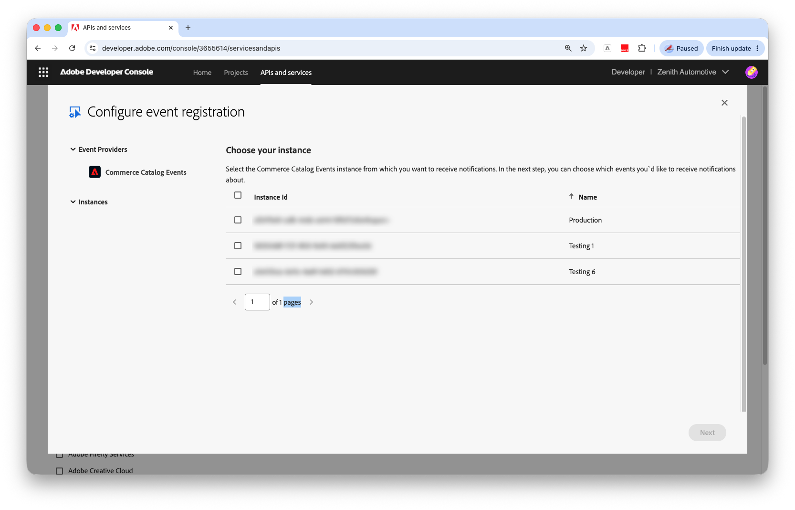

# Activación y configuración de eventos de catálogo con Adobe I/O

Los eventos de catálogo son notificaciones generadas por el equipo que describen los cambios de catálogo admitidos disponibles mediante [!DNL Catalog Service]. Permiten flujos de trabajo impulsados por eventos como:

* Mantener las cachés o los servicios externos sincronizados con las actualizaciones del catálogo.
* Activar procesos descendentes cuando cambian productos, variantes, precios o categorías.
* Encendido de Experience Edge y [!DNL Edge Delivery Services] casos de uso que requieren actualizaciones de catálogo casi en tiempo real.

Para ver la ruta de extremo a extremo de [!DNL Adobe Commerce] a los consumidores de eventos, consulte [Envío de eventos mediante [!DNL Adobe I/O Events]](#event-delivery-through-adobe-io-events).

## Tipos de eventos admitidos {#supported-event-types}

Los eventos de catálogo se centran en cambios relevantes para la tienda expuestos a través de [!DNL Adobe Developer Console]. Actualmente se admiten las siguientes suscripciones.

| Suscripción | Eventos |
| --- | --- |
| Actualización del producto | Crear, actualizar y eliminar cambios de productos disponibles a través de [!DNL Catalog Service] |
| Actualización de precios | Crear, actualizar y eliminar cambios en los precios que afecten a los datos del catálogo de tiendas |

Cada evento incluye:

* Identificador de evento que describe el tipo de cambio.
* Contexto de entidad y entorno, como ID de instancia y SKU.
* Una carga útil que describe la entidad modificada y la información de ámbito relevante.


## Ejemplo de cargas útiles de eventos

**Evento ProductUpdated**

```json
{
  "imsOrgId": "aaa-0",
  "instanceId": "instance-9",
  "eventCode": "productUpdated",
  "sku": "1234",
  "links": [
    {"type":  "variantOf", "sku": "5678"}
   ],
  "scope": [
    { "storeViewCode": "US-us" },
    { "storeViewCode": "FR-fr" },
    { "storeViewCode": "DE-de" }
  ]
}
```

**Evento PriceUpdated**

```json
{
  "imsOrgId": "aaa-0",
  "instanceId": "instance-9",
  "eventCode": "priceUpdated",
  "sku": "1234",
  "scope": [
    {
      "websiteCode": "website1",
      "customerGroupCode": "customer-group-code1"
    },
    {
      "websiteCode": "website2",
      "customerGroupCode": "customer-group-code2"
    }
  ]
}
```

## Envío de evento mediante [!DNL Adobe I/O Events] {#event-delivery-through-adobe-io-events}

[!DNL Adobe I/O Events] entrega eventos de catálogo a sus integraciones. El diagrama siguiente muestra el flujo de alto nivel de los cambios de catálogo de [!DNL Adobe Commerce] a [!DNL Catalog Service] y [!DNL Adobe I/O Events] para los consumidores suscritos:


Los siguientes pasos explican cada entrega con más detalle:

1. **Servicio de catálogo → Adobe Commerce**

[!DNL Adobe Commerce] exporta datos de catálogo a [!DNL Catalog Service] mediante las extensiones de exportación de datos SaaS admitidas.

1. **Procesamiento del servicio de catálogo**

   * [!DNL Catalog Service] procesa los cambios de catálogo admitidos y los prepara para la entrega de eventos.

1. **Servicio de catálogo → Adobe I/O Events**

* Los eventos de catálogo se han publicado en [!DNL Adobe I/O Events].
* Los consumidores se suscriben mediante Diarios, webhooks, [!DNL Adobe I/O Runtime], Amazon EventBridge u otros mecanismos de envío admitidos.

[!DNL Adobe I/O Events] proporciona:

* *Envío de al menos una vez* por suscriptor (es posible realizar eventos duplicados).
* No hay garantías de pedidos entre envíos.

Los consumidores deben gestionar eventos duplicados y envíos desordenados. Consulte [Idempotencia](#idempotency) para obtener instrucciones de implementación.

## Casos de uso {#use-cases}

Puede utilizar eventos de catálogo en varios escenarios.

### Envío estático de sitios y perímetros

* Regenerar o invalidar páginas de catálogo y fragmentos de tienda cuando cambien los datos del catálogo.
* Evite sondear con frecuencia las API [!DNL Catalog Service].

### Indexación de búsquedas y almacenamiento en caché

* Almacenar en déclencheur actualizaciones incrementales en índices de búsqueda descendentes.
* Actualice las capas de la caché o las vistas externas del catálogo cuando cambien los datos del producto o la categoría.

### Integración con sistemas externos

* Reenviar cambios de catálogo a sistemas externos como PIM, motores de precios u otros sistemas de línea de negocios.
* Mantener las aplicaciones descendentes sincronizadas sin acceso directo a la base de datos.

### Monitorización y observabilidad

Combine eventos de catálogo con la supervisión existente (por ejemplo, [!DNL Grafana] y [!DNL Prometheus]) para:

* Monitorice el rendimiento del evento.
* Detectar anomalías en el volumen de actualización del catálogo.

## Habilitar eventos de catálogo {#enable-catalog-events}

Para habilitar los eventos de catálogo de principio a fin, siga estos pasos.

>[!PREREQUISITES]
>
>Antes de habilitar los eventos de catálogo, asegúrese de que dispone de lo siguiente:
>
>* Un entorno de Adobe Commerce compatible con [!DNL Catalog Service] habilitado.
>* [La conexión [!DNL Adobe I/O] está configurada para Adobe Commerce](https://developer.adobe.com/commerce/extensibility/events/configure-commerce).
>* Acceso a [!DNL Adobe Developer Console] en la misma organización de IMS donde se aprovisiona el entorno de Commerce.
>* Para comprobar la sincronización con los servicios SaaS de Commerce, use **[!UICONTROL Data Management Dashboard]** en el Administrador.
>* Se requiere Product Recommendations v6.0, [!DNL Live Search] v4.1.0+ o [!DNL Catalog Service] v1.17+ para la verificación del panel. Adobe recomienda actualizar el proyecto de Commerce a las últimas versiones compatibles de estos servicios. Para versiones de servicio anteriores, usa [Catalog Sync](https://experienceleague.adobe.com/en/docs/commerce/user-guides/data-services/catalog-sync) para la verificación de sincronización.


>[!NOTE]
>
>Para usar eventos de catálogo, primero configure el entorno de Commerce para [!DNL Adobe I/O Events] y después registre una suscripción de evento en [!DNL Adobe Developer Console].
>
>Si su entorno no aparece en [!DNL Adobe Developer Console] después de la configuración, compruebe que ha iniciado sesión en la organización IMS correcta y que su cuenta tiene el acceso requerido. Si el entorno sigue sin aparecer, póngase en contacto con el Soporte técnico de Adobe.

### Verificar datos del catálogo {#verify-catalog-data}

Antes de configurar, compruebe que [!DNL Catalog Service] tenga los datos actuales del catálogo de su instancia [!DNL Commerce]. Los eventos de catálogo dependen de que [!DNL SaaS Data Export] complete dos fases: confirmar **ambas**:

1. Confirmar la exportación correcta de la fuente **desde Commerce**.

   Desde el administrador de [!DNL Adobe Commerce], abra la página [Estado de sincronización de fuentes de datos](https://experienceleague.adobe.com/en/docs/commerce-admin/systems/data-transfer/data-sync/data-feed-sync-status) (**[!UICONTROL System]** > **[!UICONTROL Data Transfer]** > **[!UICONTROL Data Feed Sync Status]**) y confirme que el último estado de exportación es correcto para cada fuente de [!DNL Catalog Service].

1. Confirmar la **sincronización correcta con los servicios conectados de Commerce** del administrador de [!DNL Adobe Commerce].

   Desde el administrador de [!DNL Adobe Commerce], abra [el tablero de administración de datos](https://experienceleague.adobe.com/en/docs/commerce-admin/systems/data-transfer/data-sync/data-dashboard) (**[!UICONTROL System]** > **[!UICONTROL Data Transfer]** > **[!UICONTROL Data Management Dashboard]**) y compruebe que los datos de los productos sincronizados incluyan los productos esperados.

### Registrar y suscribirse a [!DNL Adobe I/O Events] {#register-events}

Defina a qué eventos de Commerce suscribirse y, a continuación, regístrelos en el proyecto.

Si la instancia no está en la lista de selección, no está conectada a [!DNL Adobe I/O]. Para obtener instrucciones para solucionar el problema, consulte [Configuración de la [!DNL Adobe I/O] conexión](https://developer.adobe.com/commerce/extensibility/events/configure-commerce#configure-the-adobe-io-connection) en la documentación de *Adobe Commerce Developer*.

1. Desde [!DNL Adobe Developer Console], inicie sesión en la misma organización de IMS utilizada para el proyecto de Commerce.

1. Cree un proyecto para eventos de catálogo de Commerce o agregue la API de eventos a un proyecto existente.

   * Seleccione **[!UICONTROL APIs and services]** en la barra de navegación superior.

   * En la página **[!UICONTROL Browse APIs and services]**, seleccione la ficha **[!UICONTROL Events]**.

   * Encuentre rápidamente las API de eventos de catálogo de Commerce. Escriba _Catalog_ en el cuadro de búsqueda o filtre por el producto **[!UICONTROL Commerce]**.

   * En la tarjeta **[!UICONTROL Commerce Catalog Events]**, seleccione **[!UICONTROL Project]**.

   {width="600" zoomable="yes"}

1. Configure el registro de eventos.

   Seleccione la instancia de Commerce desde la que desea recibir notificaciones de eventos. A continuación, seleccione **[!UICONTROL Next]**.

   {width="600" zoomable="yes"}

1. Elija los eventos a los que desee suscribirse.

   Seleccione las suscripciones de evento admitidas que desee recibir, como **[!UICONTROL Product Update]** o **[!UICONTROL Price Update]**. A continuación, seleccione **[!UICONTROL Next]**.

   {width="600" zoomable="yes"}

1. Agregue las credenciales de servidor a servidor OAuth.

   Escriba un **[!UICONTROL Credential name]**. A continuación, seleccione **[!UICONTROL Next]**.

1. Escriba **[!UICONTROL Event registration name]** y **[!UICONTROL Event registration description]**. A continuación, seleccione **[!UICONTROL Next]**.

1. En la pantalla de registro final, acepte el consumidor predeterminado, la API de diario.

   El consumidor predeterminado de la API de asientos le permite probar el registro de eventos y confirmar que se entregan los eventos. Si ya configuró un webhook o un consumidor de acción [!DNL Adobe I/O Runtime], selecciónelo aquí. De lo contrario, edite el registro del evento más adelante cuando el consumidor esté listo.

   {width="600" zoomable="yes"}

1. Seleccione **[!UICONTROL Complete registration]**.

### Configurar consumidor de eventos {#configure-consumer}

1. Configure un consumidor, como:

   * Punto final de un gancho web
   * Una acción [!DNL Adobe I/O Runtime]
   * Otro destino admitido

1. Si no ha seleccionado ningún consumidor durante el registro, edite el registro del evento para añadir los detalles del consumidor.

   * Desde [!DNL Adobe Developer Console], edite el proyecto. A continuación, seleccione el registro de evento que ha creado.

   * En la página de detalles de registro del evento, seleccione **[!UICONTROL Edit Events Registration]**.

   * Seleccione **[!UICONTROL Next]** hasta que llegue a la pantalla de selección de consumidores. A continuación, seleccione el consumidor que ha configurado.

   * Actualice el consumidor al destino configurado. A continuación, seleccione **[!UICONTROL Save configured events]**.

### Validación del flujo de eventos {#validate-event-flow}

Los eventos de catálogo están habilitados para su entorno. Cuando los datos del catálogo cambian en [!DNL Commerce], las actualizaciones fluyen por [!DNL Catalog Service] hasta [!DNL Adobe I/O Events] y el consumidor suscrito recibe el evento de catálogo correspondiente. Revise [Límites y prácticas recomendadas](#limits-and-best-practices) antes de generar integraciones de producción.
1. Realice un cambio de catálogo sencillo y compatible, como actualizar el nombre de un producto o cambiar un precio.

1. Confirme los siguientes resultados:

   * El cambio es visible a través de las API [!DNL Catalog Service].
   * El consumidor [!DNL Adobe I/O Events] recibe el evento de producto o precio correspondiente.


## Límites y prácticas recomendadas {#limits-and-best-practices}

Cuando genere eventos de catálogo, siga estas prácticas recomendadas.

### Idempotencia {#idempotency}

[!DNL Adobe I/O Events] puede entregar el mismo evento de catálogo más de una vez y los eventos de un solo producto pueden llegar sin orden. Diseñar consumidores idempotentes mediante:

* Uso de ID de entidad con un campo de versión o marca de tiempo.
* Ignorar de forma segura las notificaciones duplicadas para el mismo cambio.

### Rendimiento y contrapresión

Los catálogos grandes con altas tasas de actualización pueden generar un volumen de evento significativo. Asegúrese de que:

* Los consumidores pueden procesar eventos con un rendimiento máximo.
* Utilice el almacenamiento en búfer, el agrupamiento o las colas donde sea necesario.

### Seguridad y aislamiento

* [!DNL Adobe I/O Events] aplica *aislamiento de inquilinos*.
* Su organización recibe eventos solo para sus propios entornos y autorizaciones.

### Evolución del esquema

Las cargas de eventos de catálogo siguen el mismo modelo conceptual que las API [!DNL Catalog Service]. Para seguir siendo compatible con versiones anteriores:

* Evite la aplicación estricta del esquema siempre que sea posible.
* Omitir campos desconocidos en lugar de errores.

## Solucionar problemas de eventos de catálogo {#troubleshoot-catalog-events}

Si faltan o se retrasan los eventos de catálogo, siga estos pasos.

1. **Comprobar datos del servicio de catálogo**

   [Use la [!DNL Catalog Service] API](https://developer.adobe.com/commerce/webapi/graphql/schema/catalog-service/queries/) para confirmar que el cambio de catálogo se almacene correctamente.

1. **Verificar[!DNL SaaS Data Export]**

   Los eventos de catálogo requieren datos actuales en [!DNL Catalog Service]. Confirme ambas fases de la ruta de exportación:

   * **Exportación de fuente desde Commerce**: en la página [Estado de sincronización de fuente de datos](https://experienceleague.adobe.com/en/docs/commerce-admin/systems/data-transfer/data-sync/data-feed-sync-status) o en `var/log/saas-export.log`, confirme que [!DNL Catalog Service] fuentes se exportaron correctamente desde [!DNL Commerce].

   * **Sincronizar con los servicios SaaS de Commerce conectados**: en el [panel de administración de datos](https://experienceleague.adobe.com/en/docs/commerce-admin/systems/data-transfer/data-sync/data-dashboard), [sincronización de catálogos](https://experienceleague.adobe.com/en/docs/commerce/user-guides/data-services/catalog-sync) o en los registros de exportación, confirme que los datos se sincronizaron correctamente con [!DNL Catalog Service].

   Para solucionar problemas con los trabajos de exportación y sincronización, consulte [Sincronizar datos con la exportación de datos SaaS](../data-export/data-sync-manage.md) y [Registro y solución de problemas](../data-export/troubleshooting/logging.md).

1. **Validar configuración de [!DNL Adobe I/O Events]**

   Confirme que:

   * Ha iniciado sesión en la organización IMS correcta en [!DNL Adobe Developer Console].
   * El proveedor **[!UICONTROL Commerce Catalog Events]** está habilitado.
   * El proveedor **[!UICONTROL Commerce Catalog Events]** y el entorno esperados son visibles.
   * La suscripción está activa.
   * El extremo, la acción o el consumidor del diario pueden recibir y procesar eventos de prueba.

1. **Póngase en contacto con el Soporte técnico de Adobe**

   Al abrir un ticket de asistencia, seleccione el motivo del problema que corresponde a **aplicación de Adobe Commerce** e incluya la siguiente información:

   * Detalles del servicio de catálogo (entorno, región).
   * [!DNL Adobe I/O Events] detalles de suscripción.
   * Hora aproximada y descripción de los eventos que faltan.

   Para obtener ayuda adicional, consulte [tickets de asistencia](https://experienceleague.adobe.com/en/docs/support-resources/adobe-support-tools-guide/adobe-commerce-support/adobe-commerce-help-center-user-guide#support-case).

>[!MORELIKETHIS]
>
>
>* [Incorporación e instalación](installation.md)
>* [Introducción al servicio de catálogo](get-started.md)
>* [Sincronizar datos con la exportación de datos SaaS](../data-export/data-sync-manage.md)
>* [Recuperar datos de catálogo con la API de GraphQL](https://developer.adobe.com/commerce/webapi/graphql/schema/catalog-service/queries/){target="_blank"}
>* [[!DNL Catalog Service] y API Mesh](mesh.md)
>* [Configurar la [!DNL Adobe I/O] conexión](https://developer.adobe.com/commerce/extensibility/events/configure-commerce#configure-the-adobe-io-connection){target="_blank"}
>* [[!DNL Adobe I/O Events]](https://developer.adobe.com/events/docs/guides/){target="_blank"}
