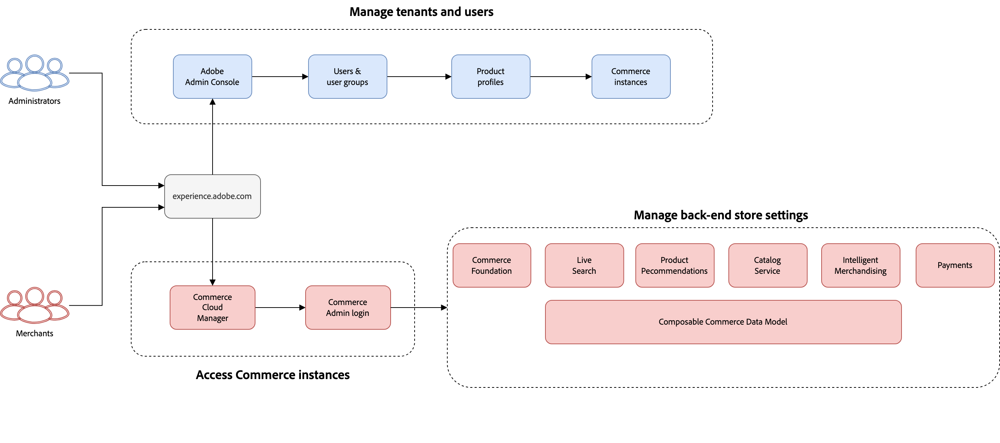
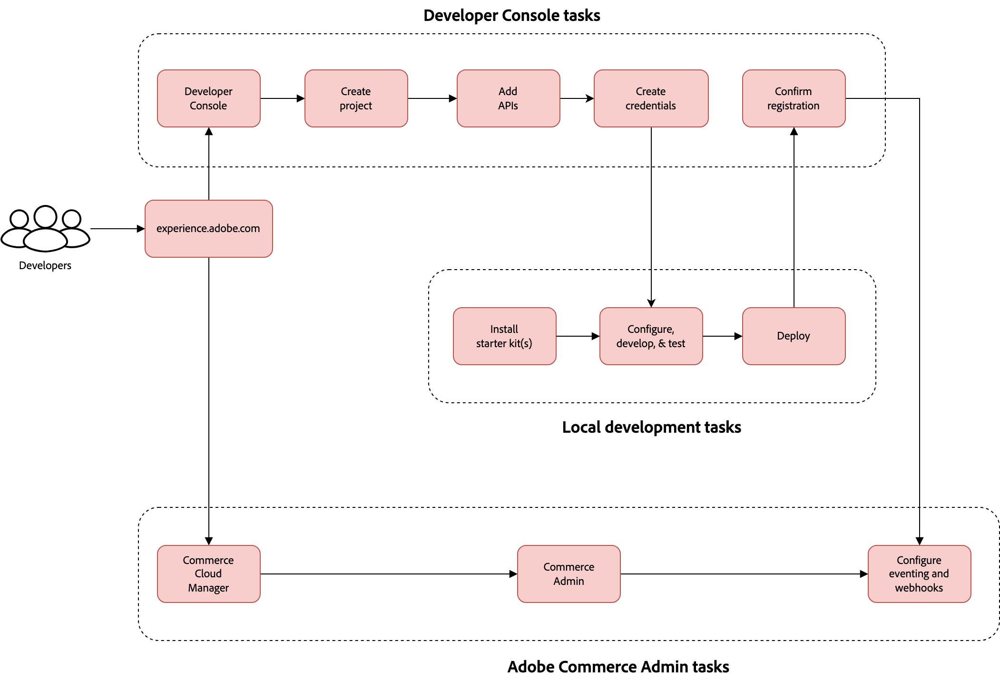

# Primeros pasos

[!DNL Adobe Commerce as a Cloud Service] proporciona la mayor parte de la configuración de forma predeterminada. Después de completar algunos procesos de configuración básicos, su tienda está funcionando en poco tiempo. Esta guía le explica cómo crear y trabajar con una instancia de y le ayuda a configurar su organización para tener éxito. Garantiza que sus equipos tengan acceso adecuado a [!DNL Adobe Commerce as a Cloud Service] y a las herramientas que necesita para comenzar.

[!DNL Adobe Commerce as a Cloud Service] es una plataforma de comercio nativa de la nube que proporciona flexibilidad, escalabilidad y eficiencia para ofrecer experiencias de comercio digital. Esta oferta de SaaS es una plataforma completamente administrada y sin versiones que proporciona una experiencia de actualización perfecta sin intervención manual.

## Componentes clave

[!DNL Adobe Commerce as a Cloud Service] consta de los siguientes componentes:

* **[[!DNL Adobe Experience Cloud]](https://experience.adobe.com/)**: tu punto de entrada central a todos los productos de [!DNL Adobe Commerce] en [experience.adobe.com](https://experience.adobe.com/)
   * Haga clic en [!UICONTROL **Commerce**] en [!UICONTROL **Acceso rápido**] para abrir Commerce Cloud Manager
* **[[!DNL Commerce Cloud Manager]](https://experience.adobe.com/#/commerce/cloud-service)**: cree y administre instancias, acceda a direcciones URL de API y a su administrador de Commerce
* **[[!DNL Adobe Admin Console]](https://adminconsole.adobe.com/)** - Administrar usuarios y funciones
* **Administrador de Commerce**: administre productos, pedidos, clientes y configuración de tiendas
* **[Tienda con tecnología de [!DNL Edge Delivery Services]](./storefront.md)**: crea y personaliza una tienda orientada al cliente con un sistema de alto rendimiento que ofrece velocidad, optimización de los motores de búsqueda y experiencia de usuario excepcionales para comerciantes y desarrolladores
* **[[!DNL Adobe Developer App Builder]](https://developer.adobe.com/app-builder/)** - Generar integraciones personalizadas usando [!DNL App Builder], junto con otras herramientas de extensibilidad como [integration starter kit](https://developer.adobe.com/commerce/extensibility/starter-kit/integration/) y [[!DNL API Mesh]](https://developer.adobe.com/graphql-mesh-gateway/)

## Configuración y administración

Como parte del proceso de configuración de [!DNL Adobe Commerce as a Cloud Service], el administrador del sistema, los comerciantes y los desarrolladores configuran el acceso y los recursos de su organización, incluido el aprovisionamiento de recursos de la nube y la asignación de usuarios a las funciones adecuadas en función de sus responsabilidades.

### Flujo de trabajo de configuración y administración

Como grupo combinado, el administrador del sistema, el comerciante y el desarrollador deben seguir estos pasos esenciales para poner en marcha la instancia de Commerce:

1. **Todos los usuarios**: [Crear una instancia](#create-an-instance)
1. **Administrador del sistema**: [Agregue usuarios y asigne funciones](user-management.md#add-users)
1. **Comerciantes**: [Acceda al administrador de Commerce](#access-an-instance) e [importe su catálogo](#import-your-catalog)
1. **Desarrolladores**: [Configura tu tienda](storefront.md) y explora la [plataforma para desarrolladores](overview.md#developer-platform)

#### Flujo de trabajo de AEM Assets y productos visuales

Se requieren los siguientes pasos para integrar [!DNL Adobe Experience Manager Assets] o [!DNL Product Visuals powered by AEM Assets] con [!DNL Adobe Commerce as a Cloud Service]:

1. **Administrador del sistema**: [Agregar usuarios al [!DNL AEM Assets] y [!DNL Product Visuals] perfil de producto](user-management.md#add-a-user-to-aem-assets-or-product-visuals)
1. **Desarrolladores**: [Integrar [!DNL AEM Assets] y [!DNL Product Visuals]](../aem-assets-integration/overview.md)
1. **Comerciantes**: [Acceda a sus [!DNL AEM Assets] y [!DNL Product Visuals]](./user-management.md#access-the-experience-manager-interface)

### Tareas de configuración y administración basadas en funciones

Seleccione una de las siguientes pestañas para ver los gráficos de flujo de trabajo de alto nivel de la función correspondiente:

>[!BEGINTABS]

>[!TAB Flujo de trabajo de administrador del sistema y comerciante]

Este diagrama proporciona información general de alto nivel sobre cómo los administradores de sistemas y los comerciantes acceden y administran [!DNL Adobe Commerce as a Cloud Service] instancias. Consulte la [Guía de Adobe Admin Console](https://helpx.adobe.com/enterprise/admin-guide.html) para obtener más información sobre los flujos de trabajo de administrador.

{zoomable="yes"}

>[!TAB Flujo de trabajo para desarrolladores]

Este diagrama proporciona información general de alto nivel sobre cómo los desarrolladores crean integraciones para [!DNL Adobe Commerce as a Cloud Service] mediante App Builder. Consulte la [documentación de la API](https://developer.adobe.com/commerce/webapi/rest/) para obtener más información.

{zoomable="yes"}

>[!ENDTABS]

Seleccione su función para buscar recursos para comenzar con el proceso de configuración:

>[!BEGINTABS]

>[!TAB Administrador del sistema]

Como administrador del sistema, es responsable de configurar la organización y administrar el acceso de los usuarios.

| Tarea | Descripción | Recurso |
|------|-------------|----------|
| Comprender la plataforma | Obtenga información acerca de la arquitectura y las ventajas de Adobe Commerce as a Cloud Service | [Información general](overview.md) |
| Comparar características | Comprender las diferencias entre Cloud Service y otras ofertas de Adobe Commerce | [Comparación de características](feature-comparison.md) |
| Creación de una instancia | Aprovisionar entornos de zona protegida y producción | [Crear una instancia](#create-an-instance) |
| Configuración de la administración de usuarios | Agregar usuarios, asignar funciones y administrar permisos | [Administración de usuarios](user-management.md) |
| Configuró [!DNL AEM Assets] y [!DNL Product Visuals] (opcional) | Agregar usuarios, asignar funciones y administrar permisos | [Administración de usuarios](user-management.md#add-a-user-to-aem-assets-or-product-visuals) |

>[!TAB Comerciante]

Como comerciante, se centra en la administración de productos, pedidos y contenido de tiendas.

| Tarea | Descripción | Recurso |
|------|-------------|----------|
| Acceso a su instancia | Inicie sesión en Commerce Admin para administrar su tienda | [Acceder a una instancia](#access-an-instance) |
| Exploración de casos de uso | Descubra escenarios y flujos de trabajo prácticos para empresas | [Casos de uso](./use-cases.md) |
| Importar catálogo | Obtenga información acerca de cómo importar los datos de productos en la plataforma | [Importe su catálogo](#import-your-catalog) |
| Obtener acceso a [!DNL AEM Assets] y [!DNL Product Visuals] (opcional) | Acceda al administrador de experiencia para empezar a usar [!DNL AEM Assets] y [!DNL Product Visuals] | [Acceder a la interfaz de Experience Manager](./user-management.md#access-the-experience-manager-interface) |

>[!TAB Desarrollador]

Como desarrollador, debe saber cómo crear integraciones personalizadas y ampliar la funcionalidad de la plataforma.

| Tarea | Descripción | Recurso |
|------|-------------|----------|
| Comprender la arquitectura | Obtenga información acerca de la extensibilidad y las API de la plataforma | [Información general - Plataforma para desarrolladores](overview.md#developer-platform) |
| Configuración de un entorno de desarrollo | Creación de una instancia de zona protegida para desarrollo y pruebas | [Crear una instancia](#create-an-instance) |
| Crear tienda | Aprenda a configurar y personalizar Commerce Storefront | [Configuración de tienda](./storefront.md) |
| Configurar tu tienda | Más información sobre cómo configurar tu tienda | [Configuración de tienda](./storefront.md) |
| Explorar opciones de integración | Obtenga información acerca de App Builder, API Mesh y otras herramientas de extensibilidad a las que tiene acceso | [Información general - Plataforma para desarrolladores](overview.md#developer-platform) |
| Integrar [!DNL AEM Assets] y [!DNL Product Visuals] (opcional) | Aprenda a integrar [!DNL AEM Assets] y [!DNL Product Visuals] con [!DNL Adobe Commerce] | [Integración de AEM Assets](../aem-assets-integration/overview.md) |

>[!ENDTABS]

### Pasos siguientes

Después de completar las tareas de configuración específicas de su rol:

* **Administradores del sistema**: revise las directrices de [responsabilidad compartida](./security/shared-responsibility.md)
* **Comerciantes**: explore [casos de uso](use-cases.md) para escenarios comerciales comunes
* **Desarrolladores**: Consulte la [documentación para desarrolladores de Adobe Commerce](https://developer.adobe.com/commerce/docs)

## Conceptos básicos de Adobe Commerce as a Cloud Service

Las secciones siguientes describen los procesos básicos que debe completar para poner en marcha la instancia de Commerce.

### Creación de una instancia

>[!NOTE]
>
>Para poder crear una instancia, el administrador de productos o del sistema de su organización debe agregarlo como usuario del producto [!DNL Adobe Commerce as a Cloud Service]. Consulte [Agregar usuarios y administradores](./user-management.md#add-users) para obtener más información.

[!DNL Adobe Commerce as a Cloud Service] instancias utilizan un sistema basado en crédito. Puede crear varias instancias, pero cada una de ellas requiere créditos disponibles. El número de créditos que tienes inicialmente depende de tu suscripción.

1. Inicie sesión en su cuenta de [[!DNL Adobe Experience Cloud]](https://experience.adobe.com/).

1. En [!UICONTROL Quick access], haga clic en [!UICONTROL **Commerce**] para abrir [!UICONTROL Commerce Cloud Manager].

   [!UICONTROL Commerce Cloud Manager] muestra una lista de [!DNL Adobe Commerce as a Cloud Service] instancias disponibles en su organización de Adobe IMS.

1. Haga clic en [!UICONTROL **Agregar instancia**] en la esquina superior derecha de la pantalla.

   {width="50%" align="center" zoomable="yes"}

1. Seleccione [!UICONTROL **Commerce as a Cloud Service**].

1. Escriba un **Nombre** y una **Descripción** para su instancia.

1. Elija [!UICONTROL **Tipo de entorno**] para su instancia. Puede elegir entre las siguientes opciones:

   * [!UICONTROL **Espacio aislado**]: solo con fines de diseño y prueba. Debe comenzar el recorrido de [!DNL Adobe Commerce as a Cloud Service] usando el entorno de espacio aislado.

   >[!NOTE]
   >
   > Las instancias de zona protegida solo son para fines de diseño y prueba. No debe utilizar ningún dato de producción en un entorno de zona protegida.
   >
   >Las instancias de zona protegida se limitan a la región de América del Norte.

   * [!UICONTROL **Producción**]: para tiendas en vivo y sitios de cara al cliente.

   >[!NOTE]
   >
   >La infraestructura de Adobe Commerce as a Cloud Service está disponible en todo el mundo. Para obtener información sobre los entornos de producción de su región, póngase en contacto con su representante de servicio de atención al cliente.

1. Seleccione la región en la que desea alojar la instancia.

   >[!NOTE]
   >
   >Una vez creada la instancia, no se puede modificar la región.

1. Haga clic en [!UICONTROL **Agregar instancia**].

>[!NOTE]
>
>No puede copiar ni eliminar una instancia existente.

{{aem-assets-instance-mapping}}

### Acceso a una instancia

Después de crear una instancia, puede obtener acceso a ella desde el [!UICONTROL Commerce Cloud Manager].

1. Inicie sesión en su cuenta de [Adobe Experience Cloud](https://experience.adobe.com/).

1. En [!UICONTROL Quick access], haga clic en [!UICONTROL **Commerce**] para abrir [!UICONTROL Commerce Cloud Manager].

   [!UICONTROL Commerce Cloud Manager] muestra una lista de instancias disponibles en su organización de Adobe IMS.

1. Para abrir [!UICONTROL Commerce Admin] de una instancia, haga clic en el nombre de la instancia.

>[!TIP]
>
>Para ver información sobre la instancia, incluidos los extremos de REST y GraphQL y la URL del administrador, haga clic en el icono de información situado junto al nombre de la instancia.

Las direcciones URL base para el administrador y los puntos de conexión difieren según la región y el entorno, y utilizan el siguiente patrón:

* Administrador
   * Administrador de producción de Norteamérica: `https://na1.admin.commerce.adobe.com`
   * Administrador de zona protegida de Norteamérica: `https://na1-sandbox.admin.commerce.adobe.com`
   * Administrador de producción de Europa: `https://eu1.admin.commerce.adobe.com`
* REST y GRAPHQL
   * GraphQL de producción de Norteamérica: `https://na1.api.commerce.adobe.com`
   * GraphQL de zona protegida de Norteamérica: `https://na1-sandbox.api.commerce.adobe.com`
   * GraphQL de producción de Europa: `https://eu1.api.commerce.adobe.com`

### Importar el catálogo

De manera predeterminada, las instancias de [!DNL Adobe Commerce as a Cloud Service] no incluyen datos de productos. Tiene la opción de incluir datos de productos de ejemplo al crear una instancia para fines de prueba y aprendizaje antes de importar su propio catálogo.

Existen dos maneras de importar el catálogo en [!DNL Adobe Commerce as a Cloud Service]:

* [**Administrador de Commerce**](https://experienceleague.adobe.com/en/docs/commerce-admin/systems/data-transfer/import/data-import): Una interfaz fácil de usar que le permite importar los datos del catálogo en unos pocos clics.
* [**Importar API JSON**](https://developer.adobe.com/commerce/webapi/rest/modules/import/#import-json-api): una API de REST que le permite importar los datos del catálogo mediante programación.

### Configurar la tienda

Ahora que has creado una instancia, estás listo para [configurar tu tienda](storefront.md) con tecnología de [!DNL Edge Delivery Services].

## Recursos adicionales

* [Notas de la versión](release-notes.md)
* [Guía de migración](migration/overview.md)
* [Documentación de Commerce Store](https://experienceleague.adobe.com/developer/commerce/storefront/)
