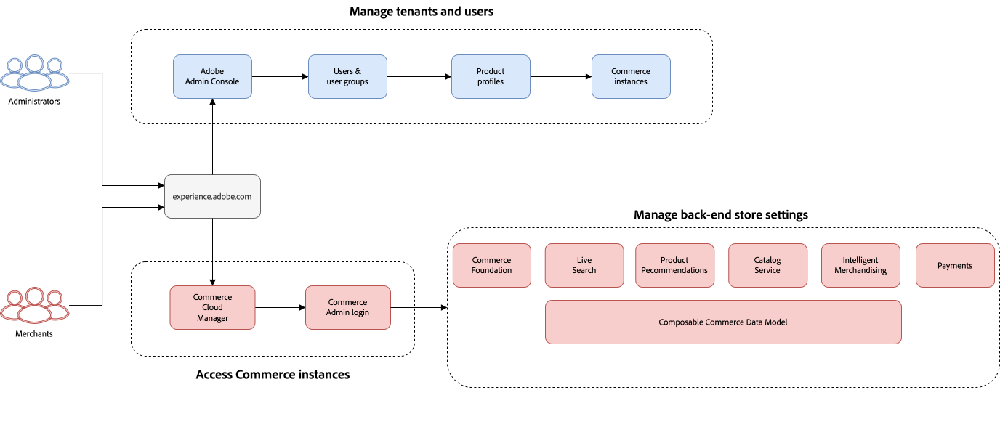

# Primeros pasos

Adobe Commerce as a Cloud Service proporciona la mayoría de la configuración predeterminada. Después de completar algunos procesos de configuración básicos, su tienda estará lista en poco tiempo. Esta guía le explica cómo crear y trabajar con una instancia.

Haga clic en las pestañas siguientes para ver información general de flujo de trabajo de alto nivel de los siguientes tipos de usuarios:

* Administradores
* Comerciantes
* Desarrolladores

>[!BEGINTABS]

>[!TAB Flujo de trabajo de administrador y comerciante]

Este diagrama proporciona información general de alto nivel sobre cómo los administradores y los comerciantes acceden y administran las instancias de as a Cloud Service de Adobe Commerce. Consulte la [Guía de Adobe Admin Console](https://helpx.adobe.com/enterprise/admin-guide.html) para obtener más información sobre los flujos de trabajo de administrador.

{zoomable="yes"}

>[!TAB Flujo de trabajo para desarrolladores]

Este diagrama proporciona información general de alto nivel sobre cómo los desarrolladores crean integraciones para Adobe Commerce as a Cloud Service mediante App Builder. Consulte la [documentación de la API](https://developer.adobe.com/commerce/services/cloud/) para obtener más información.

{zoomable="yes"}

>[!ENDTABS]

## Creación de una instancia

Las instancias de Adobe Commerce as a Cloud Service utilizan un sistema basado en el crédito. Puede crear varias instancias, pero cada una requiere una cantidad relativa de créditos. La cantidad de créditos que tienes inicialmente depende de tu suscripción.

1. Inicie sesión en su cuenta de [Adobe Experience Cloud](https://experience-stage.adobe.com/).

1. En [!UICONTROL Quick access], haga clic en [!UICONTROL **Commerce**] para abrir [!UICONTROL Commerce Cloud Manager].

   [!UICONTROL Commerce Cloud Manager] muestra una lista de las instancias de Adobe Commerce as a Cloud Service que están disponibles en su organización IMS de Adobe.

1. Haga clic en [!UICONTROL **Agregar instancia**] en la esquina superior derecha de la pantalla.

   {width="50%" align="center" zoomable="yes"}

1. Seleccione [!UICONTROL **Commerce as a Cloud Service**].

1. Escriba un **Nombre** y una **Descripción** para su instancia.

1. Seleccione la región en la que desea alojar la instancia.

   >[!NOTE]
   >
   >Una vez creada la instancia, no se puede modificar la región.

1. Elija [!UICONTROL **Tipo de entorno**] para su instancia. Puede elegir entre las siguientes opciones:

   * [!UICONTROL **Espacio aislado**]: ideal para fines de diseño y prueba. Debe comenzar la recorrido de Adobe Commerce as a Cloud Service usando el entorno de zona protegida.
   * [!UICONTROL **Producción**]: para tiendas en vivo y sitios de cara al cliente.

   >[!NOTE]
   >
   >Actualmente, las instancias de zona protegida están limitadas a la región de América del Norte.

1. _(Opcional)_ Si desea incluir datos de productos de ejemplo para fines de prueba y aprendizaje, seleccione [!UICONTROL **Almacén de Adobe**] de la lista desplegable [!UICONTROL **Datos de prueba**].

   Puede omitir esta opción, pero su tienda no tendrá ningún producto si lo hace. Tendrá que [importar su catálogo](#import-your-catalog) para ver la experiencia completa de la tienda.

1. Haga clic en [!UICONTROL **Agregar instancia**].

## Acceso a una instancia

Después de crear una instancia, puede obtener acceso a ella desde el [!UICONTROL Commerce Cloud Manager].

1. Inicie sesión en su cuenta de [Adobe Experience Cloud](https://experience.adobe.com/).

1. En [!UICONTROL Quick access], haga clic en [!UICONTROL **Commerce**] para abrir [!UICONTROL Commerce Cloud Manager].

   [!UICONTROL Commerce Cloud Manager] muestra una lista de instancias disponibles en su organización de Adobe IMS.

1. Para abrir [!UICONTROL Commerce Admin] de una instancia, haga clic en el nombre de la instancia.

>[!TIP]
>
>Para ver información sobre la instancia, incluidos los extremos de REST y GraphQL y la URL del administrador, haga clic en el icono de información situado junto al nombre de la instancia.

## Importar el catálogo

De forma predeterminada, las instancias de Adobe Commerce as a Cloud Service no incluyen datos de producto. Tiene la opción de incluir datos de productos de ejemplo al crear una instancia para fines de prueba y aprendizaje antes de importar su propio catálogo.

Existen dos formas de importar el catálogo en Adobe Commerce as a Cloud Service:

* [**Administrador de Commerce**](https://experienceleague.adobe.com/en/docs/commerce-admin/systems/data-transfer/import/data-import): Una interfaz fácil de usar que le permite importar los datos del catálogo en unos pocos clics.
* [**Importar API JSON**](https://developer.adobe.com/commerce/webapi/rest/modules/import/#import-json-api): una API de REST que le permite importar los datos del catálogo mediante programación.

<!-- TODO

- Add guidance about how to choose which method to use
- Add guidance for new vs existing customers (cross-reference OR and _include file for migration content)

-->

## Configurar la tienda

Ahora que has creado una instancia, estás listo para continuar [configurando](storefront.md) tu tienda Commerce con tecnología Edge Delivery Services.
