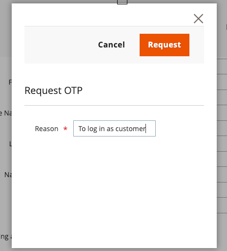

# Iniciar sesión como cliente

{{accs-sandbox-experimental}}

La función Iniciar sesión como cliente OTC (código de un solo uso) permite a los usuarios administradores generar un código de un solo uso de corta duración para un cliente. Este código se puede intercambiar por un token de acceso de cliente a través de GraphQL, lo que permite **iniciar sesión como cliente** sin contraseña en situaciones de compra asistida por el vendedor.

Iniciar sesión como cliente consta de los siguientes componentes:

* **IU de administración**: en la página de edición de clientes, los administradores pueden solicitar un código único (OTC) en lugar de iniciar sesión directamente como clientes.
* **API de REST**: un extremo programático para la generación de OTC, útil para scripts de administración e integraciones de terceros.
* **API de GraphQL**: mutaciones que intercambian un OTC por un token de acceso de cliente para flujos de comercio sin encabezado o de tienda.

## Genere un código de una sola vez desde el administrador

El botón Iniciar sesión como cliente OTC reemplaza el botón estándar Iniciar sesión como cliente en la página de edición de clientes por un botón [!UICONTROL **Obtener inicio de sesión como cliente OTC**]. El código de una sola vez generado se puede utilizar con la tienda o GraphQL para compras asistidas por el vendedor.

>[!NOTE]
>
>El botón **Iniciar sesión como cliente** no está disponible en las páginas Pedido, Factura, Envío y Nota de abono.

### Requisitos previos

Debe cumplir los siguientes requisitos antes de utilizar la función Iniciar sesión como cliente:

* **Permiso de administrador** - El usuario administrador debe tener habilitado el permiso de la Lista de control de acceso (ACL) de `Magento_LoginAsCustomer::login` en su rol de administrador para iniciar sesión como cliente.

* **Consentimiento del cliente**: el cliente debe tener el atributo de extensión `login_as_customer_assistance_allowed` establecido en **2**. Esto se puede configurar en la página **Editar cliente** del Administrador o a través de GraphQL cuando se crea o edita un cliente.

  {width="600" zoomable="yes"}

* **Iniciar sesión como extensión de cliente habilitada** - La funcionalidad de iniciar sesión como cliente no está disponible cuando la extensión de iniciar sesión como cliente está deshabilitada. Para comprobar que la extensión está habilitada, vaya a [!UICONTROL **Tiendas**] > [!UICONTROL **Configuración**] > [!UICONTROL **Clientes**] > [!UICONTROL **Iniciar sesión como cliente**] > [!UICONTROL **Habilitar extensión**].

### Solicitar un código de una sola vez (OTC)

1. Vaya a [!UICONTROL **Clientes**] y seleccione un cliente para abrir la página de edición.

1. En la página Editar cliente, haga clic en [!UICONTROL **Obtener inicio de sesión del cliente OTC**].

   {width="600" zoomable="yes"}

1. Escriba un [!UICONTROL **Motivo**] (obligatorio) y haga clic en [!UICONTROL **Solicitud**].

   {width="600" zoomable="yes"}

   >[!NOTE]
   >
   >El campo **Motivo** es obligatorio. Se pasa al flujo de generación OTP y está reservado para su uso en próximas funciones de auditoría y registro de eventos.

1. El OTC generado se muestra en el modal. Use este código con la mutación de GraphQL `generateCustomerToken` o `exchangeOtpForCustomerToken` para la autorización de clientes.

   {width="300" zoomable="yes"}

>[!IMPORTANT]
>
>El código de tiempo único OTC generado es válido durante 30 segundos de forma predeterminada y se invalida después de un solo uso. El TTL se puede configurar enviando un [ticket de soporte](https://experienceleague.adobe.com/home?lang=es&support-tab=home#support).

Una vez generado el código de una sola vez, puede utilizarlo si navega hasta la tienda e inicia sesión con las siguientes credenciales:

* **Correo electrónico**: La dirección de correo electrónico del cliente
* **Contraseña**: El código único (OTC) generado

## Generar un código de una sola vez mediante la API de REST

El extremo de POST `V1/customer/:customerId/otp` proporciona una forma programática de generar un OTC para un cliente. Esto resulta útil para las IU de administración, los scripts o las integraciones de terceros que necesitan almacenar en déclencheur la emisión de OTC de forma coherente.

### Contrato REST

| Elemento | Valor |
|---|---|
| **Método** | PUBLICAR |
| **URL** | `/rest/V1/customer/:customerId/otp` |
| **Autenticación** | Token de administrador (portador). ACL requerida: `Magento_LoginAsCustomer::login`. |
| **Cuerpo de solicitud** | JSON con el campo `reason` opcional. Se utiliza para la auditoría y el registro. |
| **Respuesta correcta** | HTTP 200, JSON con `otp` (cadena hexadecimal de 32 caracteres). |
| **Respuestas de error** | Errores de API web estándar (por ejemplo, 401, 403). Si la opción Iniciar sesión como asistencia al cliente está desactivada para el cliente, puede aparecer como 500 o como una excepción asignada. |

### Solicitar ejemplo

```text
POST /rest/V1/customer/:customerId/otp
Content-Type: application/json
```

```json
{"reason": "Support session"}
```

### Ejemplo de respuesta

```json
{"otp": "a1b2c3d4e5f6789012345678abcdef01"}
```

## Intercambio de un código único por un token de cliente mediante GraphQL

Después de generar un OTC (desde la IU de administración o la API de REST), utilice una de las siguientes mutaciones de GraphQL para intercambiarlo por un token de acceso de cliente.

### `generateCustomerToken` mutación

La mutación `generateCustomerToken(email, password)` devuelve un token de cliente. El argumento `password` se evalúa en el siguiente orden:

1. **Contraseña de cliente (predeterminada)**: Contraseña de la cuenta del cliente.
1. **Token de contraseña de restablecimiento del cliente (un solo uso)**: un token válido de **Olvidé la contraseña** (por ejemplo, la mutación `requestPasswordResetEmail`). Consumidos en el primer uso.
1. **Código no disponible generado por el administrador (OTC)**: código generado por un administrador para el cliente a través de la API de REST o la IU de administración. De un solo uso, de corta duración (30 segundos de forma predeterminada).

**Esquema:**

```graphql
type Mutation {
  generateCustomerToken(email: String!, password: String!): CustomerToken
}

type CustomerToken {
  token: String!
}
```

**Ejemplo: iniciar sesión con el administrador OTC**

```graphql
mutation GenerateCustomerToken($email: String!, $password: String!) {
  generateCustomerToken(email: $email, password: $password) {
    token
  }
}
```

Variables (utilice OTC como `password`):

```json
{
  "email": "customer@example.com",
  "password": "<admin-generated-OTC>"
}
```

**Ejemplo: inicio de sesión con contraseña**

```graphql
mutation GenerateCustomerToken($email: String!, $password: String!) {
  generateCustomerToken(email: $email, password: $password) {
    token
  }
}
```

Variables:

```json
{
  "email": "customer@example.com",
  "password": "CustomerPassword123"
}
```

**Ejemplo: inicio de sesión con token de restablecimiento de contraseña**

Una vez que el cliente solicita un restablecimiento de contraseña (por ejemplo, `requestPasswordResetEmail`), el token de restablecimiento recibido a través del vínculo de correo electrónico se puede usar como `password` en `generateCustomerToken` (un solo uso).

```graphql
mutation GenerateCustomerToken($email: String!, $password: String!) {
  generateCustomerToken(email: $email, password: $password) {
    token
  }
}
```

Variables (usar el token de restablecimiento como `password`):

```json
{
  "email": "customer@example.com",
  "password": "<reset-password-token-from-email-link>"
}
```

**Respuesta de ejemplo:**

```json
{
  "data": {
    "generateCustomerToken": {
      "token": "<customer-access-token>"
    }
  }
}
```

### `exchangeOtpForCustomerToken` mutación

La mutación `exchangeOtpForCustomerToken` intercambia un token de restablecimiento de contraseña o OTP generado por un administrador por un token de acceso de cliente. El OTP se invalida después de un intercambio correcto (uso único). Este extremo respeta la configuración de reCAPTCHA.

**Esquema:**

```graphql
type Mutation {
  exchangeOtpForCustomerToken(
    email: String!
    otp: String!
  ): CustomerToken
}

type CustomerToken {
  token: String!
}
```

**Solicitud de ejemplo:**

```graphql
mutation ExchangeOtpForCustomerToken($email: String!, $otp: String!) {
  exchangeOtpForCustomerToken(email: $email, otp: $otp) {
    token
  }
}
```

Variables:

```json
{
  "email": "customer@example.com",
  "otp": "<one-time-password>"
}
```

**Respuesta de ejemplo:**

```json
{
  "data": {
    "exchangeOtpForCustomerToken": {
      "token": "<customer-access-token>"
    }
  }
}
```

### Resumen de mutación

| Mutación | Caso de uso |
|---|---|
| `generateCustomerToken(email, password)` | Punto de entrada único: contraseña de cliente, token de restablecimiento de contraseña, OTC de administrador u OTP (se intentó después de la contraseña/restablecimiento). |
| `exchangeOtpForCustomerToken(email, otp)` | Intercambio de tokens de contraseña OTP o Restablecimiento. OTP (o token de restablecimiento de contraseña) se consume después de su uso. |

El token de restablecimiento de contraseña y Admin OTC se pasan como el argumento `password` a `generateCustomerToken`. La resolución detecta el tipo de token y lo valida en consecuencia.
