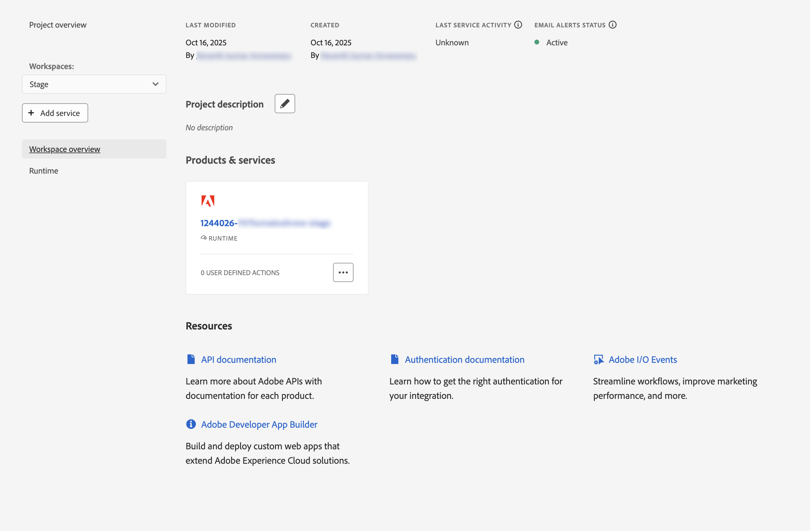
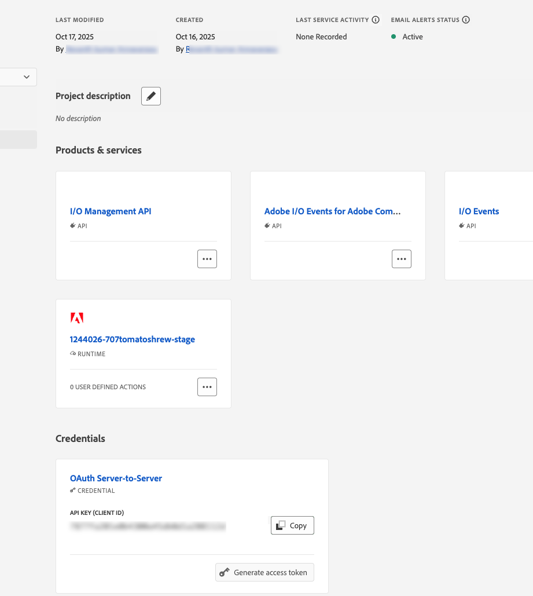
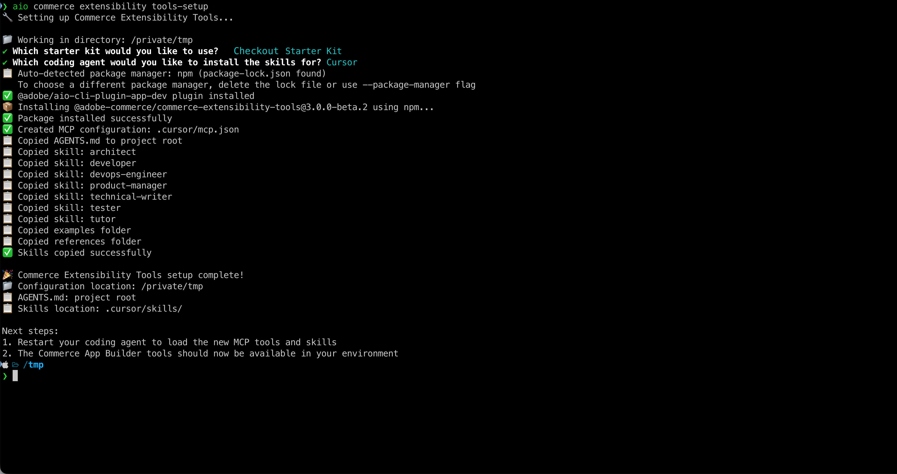

# Requisitos previos del tutorial

En esta página se enumeran los requisitos previos y los pasos de configuración de [!DNL Adobe Commerce as a Cloud Service] tutoriales, como el [tutorial de extensión de clasificaciones](./ratings-extension.md) y el [tutorial de extensión de método de envío](./shipping-method-extension.md).

## Requisitos previos generales

En este tutorial, se requieren las siguientes herramientas tanto para el desarrollo de extensiones como de tiendas.

* [!DNL Node.js] (versión `22.x.x`) y npm (`9.0.0` o superior): compruebe su instalación con el siguiente comando:

  ```bash
  node --version
  npm --version
  ```

* Instalar [Git](https://git-scm.com). Compruebe la instalación:

  ```bash
  git --version
  ```

* Bash shell
   * macOS/Linux: no se requiere instalación
   * Windows: use [Git Bash](https://git-scm.com/install) o [Subsistema de Windows para Linux (WSL)](https://learn.microsoft.com/en-us/windows/wsl/install)

* Descargue un IDE asistido por IA, como [Cursor](https://cursor.com/download) (recomendado). También se admiten otros IDE, como Claude Code, Gemini CLI o Copilot, pero podrían requerir modificaciones en las indicaciones y otros pasos del tutorial.

## [!DNL Adobe Commerce as a Cloud Service] requisitos previos

* Instalar [!DNL Adobe I/O CLI]

  ```bash
  npm install -g @adobe/aio-cli
  ```

* Instale los complementos [Adobe I/O CLI Commerce](https://github.com/adobe-commerce/aio-cli-plugin-commerce), [Adobe I/O CLI Runtime](https://github.com/adobe/aio-cli-plugin-runtime) y [App Builder CLI](https://github.com/adobe/aio-cli-plugin-app-dev):

  ```bash
  aio plugins:install https://github.com/adobe-commerce/aio-cli-plugin-commerce @adobe/aio-cli-plugin-app-dev @adobe/aio-cli-plugin-runtime
  ```

### Requisitos previos de Adobe Developer Console

Configure un proyecto en Adobe Developer Console con las API y credenciales requeridas.

1. Vaya a [Adobe Developer Console](https://developer.adobe.com/console){target="_blank"}.
1. Inicie sesión con su correo electrónico y contraseña.

#### Creación de un nuevo proyecto

Cree un proyecto de App Builder en Adobe Developer Console para alojar la extensión.

1. Vaya a [Adobe Developer Console](https://developer.adobe.com/).
1. Haga clic en **[!UICONTROL Create project from a template]**.
1. Seleccione la plantilla **[!UICONTROL App Builder]**.
1. Escriba **[!UICONTROL Project Title]** y **[!UICONTROL App Name]**.
1. Asegúrese de que la casilla de verificación **[!UICONTROL Include Runtime]** esté marcada.

   {width="600" zoomable="yes"}

1. Haga clic en **[!UICONTROL Save]**.

#### Añadir API al espacio de trabajo

Añada las API necesarias al espacio de trabajo de ensayo para la administración de eventos y la integración de Commerce.

1. Haga clic en el área de trabajo **[!UICONTROL Stage]** y, a continuación, repita los pasos siguientes para cada API.

   {width="600" zoomable="yes"}

1. Haga clic en **[!UICONTROL Add Service]** y seleccione **[!UICONTROL API]**.

1. Seleccione una de las siguientes API. Repita este proceso para cada API enumerada a continuación:

   * Filtro **[!UICONTROL Adobe Services]**:
      * **[!UICONTROL I/O Management API]**
      * API **[!UICONTROL I/O Events]**
   * Filtro **[!UICONTROL Experience Cloud]**:
      * API **[!UICONTROL Adobe I/O Events for Adobe Commerce]**

1. Haga clic en **[!UICONTROL Next]**.

1. Haga clic en **[!UICONTROL Save configured API]**.

1. Repita los pasos anteriores hasta que agregue todas las API al espacio de trabajo.

   {width="600" zoomable="yes"}

### Configuración de la CLI de Adobe I/O

Conecte [!DNL Adobe I/O CLI] a su organización, proyecto y área de trabajo.

1. Borre cualquier configuración existente:

   ```bash
   aio config clear
   ```

1. Iniciar sesión con [!DNL Adobe I/O CLI]:

   ```bash
   aio auth login -f
   ```

1. Seleccione su organización, proyecto y espacio de trabajo con cada uno de los siguientes comandos:

   ```bash
   aio console org select
   ```

   ```bash
   aio console project select
   ```

   ```bash
   aio console workspace select
   ```

   {width="600" zoomable="yes"}

### Clona los starter kits

Clone uno de los siguientes repositorios de Commerce starter kit para la extensión que está creando y prepare su proyecto:

Kit de inicio de integración:

```bash
git clone https://github.com/adobe/commerce-integration-starter-kit.git extension
cd extension
```

Kit de inicio de compra:

```bash
git clone https://github.com/adobe/commerce-checkout-starter-kit.git extension
cd extension
```

>[!BEGINTABS]

>[!TAB Kit de inicio de integración]

### Creación de un archivo .env

Cree el archivo de configuración de entorno:

```bash
cp env.dist .env
```

Abra el archivo `.env` en un editor de texto y agregue las siguientes credenciales de OAuth:

```bash
OAUTH_CLIENT_ID=
OAUTH_CLIENT_SECRET=
OAUTH_TECHNICAL_ACCOUNT_ID=
OAUTH_TECHNICAL_ACCOUNT_EMAIL=
OAUTH_ORG_ID=
```

Copie estos valores de la página **[!UICONTROL Credential details]** en [Developer Console](https://developer.adobe.com/) haciendo clic en la pestaña **[!UICONTROL OAuth Server-to-Server]** del área de trabajo.

{width="600" zoomable="yes"}

#### Añadir la configuración de Commerce

Agregue los siguientes detalles de la instancia de Commerce al archivo `.env`:

```bash
COMMERCE_BASE_URL=
COMMERCE_GRAPHQL_ENDPOINT=
```

Para buscar estos valores:

1. Vaya a [Instancias del servicio Commerce Cloud](https://experience.adobe.com/#/@commerce/commerce/cloud-service/instances).
1. Haga clic en el icono de información junto a la instancia.
1. Copie el extremo REST como `COMMERCE_BASE_URL`.
1. Copie el extremo de GraphQL como `COMMERCE_GRAPHQL_ENDPOINT`.

#### Definición del prefijo del evento

Establezca un valor temporal para el prefijo de evento:

```bash
EVENT_PREFIX=test
```

### Descargar la configuración de Workspace

Ejecute el siguiente comando para descargar el archivo de configuración de Workspace:

```bash
aio console workspace download workspace.json
```

Copie el archivo de configuración de área de trabajo en el directorio `scripts`:

```bash
cp workspace.json scripts/
```

### Conectar el espacio de trabajo local al espacio de trabajo remoto

Vincule el proyecto local al espacio de trabajo remoto:

```bash
aio app use workspace.json -m
```

{width="600" zoomable="yes"}

>[!TAB Kit de inicio de cierre de compra]

### Conectar el espacio de trabajo local al remoto

Vincule el proyecto local al espacio de trabajo remoto. Desde la raíz del proyecto (la carpeta `extension`), ejecute:

```bash
aio app use --merge
```

Cuando se le solicite, elija la opción que utiliza la organización, el proyecto y el espacio de trabajo que seleccionó al configurar la CLI de Adobe I/O. Esto escribe la configuración del espacio de trabajo en la aplicación para que la implementación y el desarrollo local utilicen ese espacio de trabajo.

{width="600" zoomable="yes"}

>[!ENDTABS]

### Instalación de las herramientas de IA de extensibilidad

Este proceso crea la configuración de MCP (`.<agent>/mcp.json`), el directorio de aptitudes (`.<agent>/skills/`) y agrega `AGENTS.md` a la raíz del proyecto. Se le pedirá que elija un Starter Kit, un agente de codificación y un gestor de paquetes.


1. Configure las herramientas de desarrollo asistido por IA en la carpeta `extension` mediante los siguientes comandos:

   ```bash
   cd extension
   ```

   ```bash
   aio commerce extensibility tools-setup
   ```

   {width="600" zoomable="yes"}

1. Una vez finalizada la instalación, reinicie el agente de codificación para que pueda cargar las nuevas herramientas y habilidades de MCP. Las herramientas de Commerce App Builder ya están disponibles en su entorno.

   >[!NOTE]
   >
   >Si ve una advertencia que indica que no se encontraron aptitudes para el Starter Kit, se produjo un error, a menudo porque la configuración se ejecutó en una carpeta distinta de la carpeta en la que se clonó el Starter Kit. Ejecute `aio commerce extensibility tools-setup` desde la carpeta `extension` (la raíz del proyecto del Starter Kit) y seleccione el Starter Kit apropiado cuando se le solicite.

   {width="600" zoomable="yes"}

## Requisitos previos de Storefront

Se requieren los siguientes elementos para completar la sección [tienda](./ratings-extension.md#connect-to-the-storefront) del tutorial de la extensión [Clasificaciones](./ratings-extension.md) y mostrar las clasificaciones de productos en tu tienda.

* [Google Chrome](https://www.google.com/chrome/) - Necesario para probar la tienda

* Un proyecto de tienda conectado a su instancia [!DNL Commerce]. Si no tiene un proyecto de tienda, siga los pasos de [Crear una tienda](https://experienceleague.adobe.com/developer/commerce/storefront/get-started/create-storefront/){target="_blank"}, incluida la sección [Vincular repositorio a los datos de comercio](https://experienceleague.adobe.com/developer/commerce/storefront/get-started/create-storefront/#link-repo-to-commerce-data){target="_blank"}.

### Clonar el repositorio de la tienda

Abra el terminal y clone el repositorio:

```bash
git clone --branch agentic-dev https://github.com/hlxsites/aem-boilerplate-commerce.git storefront
cd storefront
```

### Instalación de las dependencias

Instale las dependencias del proyecto:

```bash
npm install
```

### Instalación de las herramientas de IA de tienda

Configure las herramientas de desarrollo asistido por IA en la carpeta `storefront`. Ejecute el siguiente comando desde la raíz del proyecto de plantillas:

```bash
aio commerce extensibility tools-setup
```

El comando le guiará por dos mensajes:

1. **Seleccionar un kit de inicio** — Elija **AEM Boilerplate Commerce**.

1. **Seleccione su agente de codificación** — Elija su agente de la lista de agentes admitidos.

El comando instala el paquete `@adobe-commerce/commerce-extensibility-tools` como una dependencia de desarrollo, copia los archivos de aptitudes en el directorio de aptitudes del agente y configura MCP (Model Context Protocol) para que el agente pueda acceder a las herramientas de búsqueda de documentación de Commerce.