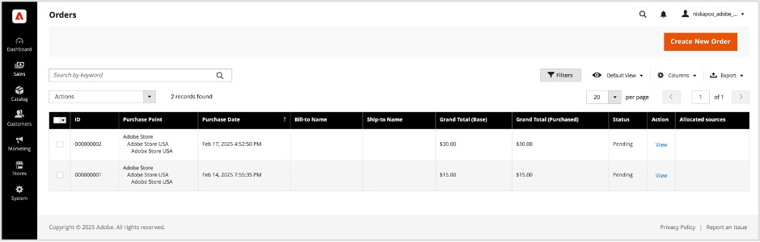
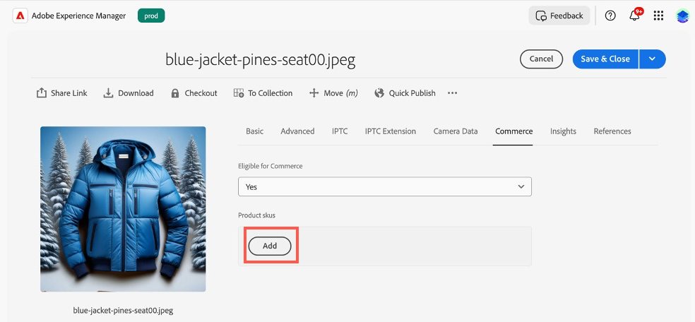

# Casos de uso

Los siguientes casos de uso muestran la funcionalidad principal y los escenarios empresariales admitidos por [!DNL Adobe Commerce as a Cloud Service], lo que le permite acelerar el desarrollo e iniciar experiencias de alto impacto.

Si encuentra algún problema, consulte la sección [Solución de problemas](#troubleshooting) para obtener instrucciones.

## Requisitos previos

Antes de intentar cualquiera de estos casos de uso, debe completar los siguientes requisitos previos:

1. [Cree su instancia de Cloud Service](./getting-started.md#create-an-instance) con las siguientes opciones:
   1. Seleccione [!UICONTROL **espacio aislado**] en el menú desplegable [!UICONTROL **Entorno**].
   1. Seleccione [!UICONTROL **Tienda Adobe**] en el menú desplegable [!UICONTROL **Datos de prueba**].
1. [Inicia sesión en tu cuenta de Adobe Experience Cloud](https://experience.adobe.com)
1. [Configura tu tienda Cloud Service](./storefront.md) con las siguientes opciones:
   1. Seleccione [!UICONTROL `adobe-commerce/adobe-demo-store`] para la plantilla.
   1. Seleccione [!UICONTROL **Elegir una instancia disponible (Malla -> SaaS)**] para el método de conexión.

## Flujo de trabajo de retirada

Este flujo de trabajo muestra el proceso de cierre de compra de un cliente que compra un producto en su tienda y cómo usted, como administrador, puede confirmar el pedido.

### Habilitar servicios de pago

1. En el Administrador de Commerce, vaya a [!UICONTROL **Tiendas**] > [!UICONTROL Settings] > [!UICONTROL **Configuración**] > [!UICONTROL **Métodos de pago**].

1. En la sección [!UICONTROL **Configuración general**], escriba sus `Payment Services Sandbox ID` y `Payment Services Sandbox Key`. Puede obtener estos identificadores siguiendo los pasos descritos en [Incorporación a espacio aislado](../payment-services/sandbox.md#sandbox-onboarding)

1. Establezca el menú desplegable [!UICONTROL **Habilitar**] en [!UICONTROL **Sí**].

1. Haga clic en [!UICONTROL **Guardar configuración**].

### Adquirir un producto

1. Vaya a la [tienda](./storefront.md) que creó en los requisitos previos.

1. Busque y seleccione un producto. Realice las selecciones de personalización necesarias. Luego haz clic en [!UICONTROL **Agregar al carro**].

   {width="600" zoomable="yes"}

1. Seleccione el icono de carro de compras para ver su carro de compras.

   {width="600" zoomable="yes"}

1. Haga clic en [!UICONTROL **Finalizar compra**].

   {width="600" zoomable="yes"}

1. Introduzca los datos de contacto y la información de envío necesarios. Puede utilizar información ficticia para este pedido.

1. Para pagar, selecciona [!UICONTROL **Cheque / giro postal**]. Si quieres usar una tarjeta de crédito, usa una de las [tarjetas de prueba proporcionadas por Paypal](https://developer.paypal.com/tools/sandbox/card-testing/#link-teststaticcardnumbers). Puede utilizarlas con cualquier fecha de caducidad futura y con cualquier CVC.

   {width="600" zoomable="yes"}

   {width="600" zoomable="yes"}

1. Haga clic en [!UICONTROL **Realizar pedido**].

### Confirmar el pedido

1. Abra el Administrador de Commerce: `<your store URL>/admin`.

1. Inicie sesión con su Adobe ID.

1. Vaya a [!UICONTROL **Ventas**] > [!UICONTROL **Pedidos**].

   {width="600" zoomable="yes"}

1. Busque el pedido que ha realizado y confirme los detalles.

   {width="600" zoomable="yes"}

## Actualizar contenido de tienda

Cree, edite y publique contenido directamente en la tienda.

1. Abra la [tienda](./storefront.md) que creó en los requisitos previos.

1. Abra el Generador de tiendas. Navegando a `https://da.live/#/<GitHub User Name>/<Repository Name>/main/da/index.md`.

1. Abra la página [!UICONTROL **Index**].

1. Debajo del bloque de carrusel, introduzca un nuevo título editando la línea &quot;Bienvenido a la demostración de la tienda Adobe&quot;.

1. Haga clic en el icono Enviar y luego en [!UICONTROL **Vista previa**].

1. Revise la página de vista previa y haga clic en [!UICONTROL **Publicar**].

1. Actualice la página de la tienda y confirme que los cambios ya están activos.

## Experimentación contextual

La función de experimentación contextual de Adobe Commerce le permite crear y administrar experimentos en la tienda para probar diferentes contenidos y configuraciones.

### Requisitos previos

* Instalar la [extensión de AEM Sidekick](https://www.aem.live/docs/sidekick)

1. En Storefront Builder, seleccione su página de índice y haga clic en [!UICONTROL **Copiar**].

1. Cree una carpeta [!UICONTROL **experimentos**] en la carpeta principal, haciendo clic en el botón [!UICONTROL **Nuevo**] y seleccionando [!UICONTROL **Carpeta**].

1. Cree una carpeta llamada **1234** en la carpeta [!UICONTROL **experimentos**].

1. Pegue las dos copias de la página de índice en la carpeta **1234**.

1. Abra cada página y cambie el nombre a &quot;homev1&quot; y &quot;homev2&quot;. Estos son sus [aspirantes](https://www.aem.live/docs/experimentation#create-your-challenger-page).

1. Modifique cada página para incluir contenido diferente. Por ejemplo, cambie la imagen a pantalla completa o el texto. Debe poder identificar las diferencias entre cada página.

1. Publique cada una de las páginas de aspirante.

1. Abra la página de control, la página de índice original.

1. Agregue un nuevo bloque con el título [!UICONTROL **metadata**].

1. Añada la siguiente información a las filas del bloque de metadatos

   * Título - Adobe Commerce
   * Descripción: Una tienda web
   * Experimento - 1234
   * Variantes del experimento
      * `https://<your-site>.aem.live/experiments/1234/indexv1`
      * `https://<your-site>.aem.live/experiments/1234/indexv2`

   {width="600" zoomable="yes"}

1. Abra una ventana de navegación privada o de incógnito y vaya a la página principal.

1. Cierre la ventana de exploración privada y repita el paso anterior. Cada vez que abra la página, verá una variante aleatoria que ha creado.

## Mejora del contenido de tienda

Con AEM Assets, Adobe Express y Firefly, ahora puede realizar rápidamente cambios en las imágenes que aparecen en su tienda con un flujo de trabajo sencillo y autodirigido.

### Requisitos previos

* Requiere acceso a AEM Assets, Adobe Express y Adobe Firefly.

### Personalizar el fondo de una imagen

Imagine un escenario en el que desee modificar rápidamente el fondo de una imagen de producto. La combinación de Adobe Commerce, AEM Assets y Adobe Express le permite realizar este cambio en unos sencillos pasos.

1. Abra la [tienda](./storefront.md) que creó en los requisitos previos y vaya al elemento que desee cambiar. Anote el SKU o el código de producto de los artículos.

1. Abra [!UICONTROL AEM Assets], seleccionándolo en [Adobe Experience Cloud](https://experience.adobe.com/#/home).

   {width="600" zoomable="yes"}

1. Haga clic en [!UICONTROL Assets].

   {width="600" zoomable="yes"}

1. Busque el artículo por **SKU** o **código de producto**.

1. Seleccione el elemento que desea editar y haga clic en [!UICONTROL **Abrir en Adobe Express**].

   {width="600" zoomable="yes"}

1. En el panel [!UICONTROL **Imagen**], seleccione [!UICONTROL **Insertar objeto**].

   {width="600" zoomable="yes"}

1. En el cuadro de texto, describa la imagen que desee agregar. Por ejemplo, &quot;pinos nevados&quot;.

   {width="600" zoomable="yes"}

1. Ajuste [!UICONTROL Brush size] y dibuje donde desee agregar la imagen generada. Para este ejemplo, dibuje alrededor del objeto existente para seleccionar el fondo.

1. Haga clic en [!UICONTROL **Generar**] para ver los resultados.

1. Elige entre los diferentes resultados, seleccionando la opción deseada y haciendo clic en [!UICONTROL **Conservar**].

1. Haz clic en [!UICONTROL **Tus cosas**] para volver al editor de imágenes.

1. Haga clic en [!UICONTROL **Guardar**] para especificar el tipo de imagen.

1. Vuelva a hacer clic en [!UICONTROL **Guardar**] para guardar los cambios.

1. En el cuadro de diálogo [!UICONTROL **Guardar recurso**], seleccione la carpeta Commerce [!UICONTROL **Destino**].

   {width="600" zoomable="yes"}

1. Haga clic en [!UICONTROL **Guardar como nuevo recurso**] para guardar la imagen.

#### Añadir la imagen a los AEM Assets de Commerce

1. En el [panel de navegación](https://experienceleague.adobe.com/es/docs/experience-manager-cloud-service/content/sites/authoring/basic-handling#navigation-panel) de AEM as a Cloud Service, seleccione **Assets** > **Archivos** > **Commerce** y haga clic en el recurso que creó en la sección anterior.

   {width="600" zoomable="yes"}

1. Haga clic en [!UICONTROL **Propiedades**].

   {width="600" zoomable="yes"}

1. Seleccione la ficha [!UICONTROL **Commerce**].

   {width="600" zoomable="yes"}

1. Asegúrese de que [!UICONTROL **¿Existe en Adobe Commerce?El campo**] está establecido en [!UICONTROL **Sí**].

1. Haga clic en [!UICONTROL **Agregar**] e introduzca el SKU del producto al que desea agregar el recurso.

   {width="600" zoomable="yes"}

1. Seleccione la posición del recurso y el tipo de recurso.

1. Seleccione la ficha [!UICONTROL **Básico**] y cambie la ficha [!UICONTROL **Estado de revisión**] a [!UICONTROL **Aprobado**].

   {width="600" zoomable="yes"}

1. Haga clic en [!UICONTROL **Guardar y cerrar**].

#### Confirmar la imagen en Commerce

1. En Adobe Commerce [!UICONTROL **Admin**], vaya a [!UICONTROL **Catálogo**] > [!UICONTROL **Productos**].

1. Seleccione el producto al que agregó la imagen en la sección anterior.

1. Expanda la sección [!UICONTROL **Imágenes y vídeos**].

   {width="600" zoomable="yes"}

1. Confirme que la imagen ya está disponible en la lista de imágenes.

1. Vuelva a la tienda y navegue hasta la página del producto modificado.

1. Confirme que aparece la nueva imagen.

   {width="600" zoomable="yes"}

## Generar variaciones

Generate Variations de Adobe Commerce aprovecha la IA generativa para automatizar la generación de contenido de alta calidad, ajustar la mensajería y publicar recursos sin problemas en su tienda.

### Generar texto

1. Abra el sitio de la tienda con el [Editor universal](https://experienceleague.adobe.com/es/docs/experience-manager-cloud-service/content/implementing/developing/universal-editor/introduction).

1. Seleccione el bloque de texto que desee editar.

1. En el panel [!UICONTROL **Propiedades**], haga clic en [!UICONTROL **Generar variaciones**].

1. Haga clic en el botón [!UICONTROL **Generar**].

1. Seleccione o personalice el texto generado.

1. Haz clic en [!UICONTROL **Publicar**] para actualizar tu tienda.

### Generación de contenido e imágenes

1. Abrir [Generar variaciones](https://experienceleague.adobe.com/es/docs/experience-manager-cloud-service/content/generative-ai/generate-variations)

1. Seleccione la plantilla [!UICONTROL **Hero Banner**].

1. En el cuadro de texto [!UICONTROL **Explicar la interacción del usuario**], escriba: &quot;¡Experiencia para que los empleados y socios de Adobe compren equipos de la marca Adobe!&quot;.

1. En la [!UICONTROL **URL del conocimiento del dominio**], escriba **www.adobestore.com**.

1. Haga clic en [!UICONTROL **Generar**].

1. Seleccione una variación de contenido y haga clic en [!UICONTROL **Generar imagen**].

1. En el menú desplegable [!UICONTROL **Tamaño de imagen**], seleccione [!UICONTROL **Pantalla panorámica (16:9)**].

1. En el menú desplegable [!UICONTROL **Tipo de contenido**], seleccione [!UICONTROL **Foto**].

1. Para la imagen de referencia [!UICONTROL **Style**], seleccione el titular de la tienda Adobe existente.

1. Seleccione la imagen generada que desee usar y haga clic en [!UICONTROL **Guardar**].

1. Repita este proceso con otras imágenes de referencia para generar más variaciones.

## Resolución de problemas

Utilice las siguientes sugerencias para resolver cualquier problema que tenga al intentar utilizar estos tutoriales.

* Si necesita instrucciones sobre comandos o indicadores:

   1. Ejecute `aio --help` para ver todos los comandos y indicadores disponibles.
   1. Para comandos específicos, use el indicador `--help`. Por ejemplo:
      * `aio console --help`
      * `aio commerce –help`

* Si encuentra problemas de inicio de sesión no válidos:

   1. Ejecutar `aio config clear`.
   1. Ejecutar `aio auth login –-force`.
   1. Inicie sesión en su explorador.
   1. Seleccione su perfil.
   1. Vuelva al terminal para continuar.

* Si el comando `init` falla:

   1. Ejecutar `aio api-mesh delete`.
   1. Volver a ejecutar `aio commerce init`.

* Si seleccionó la organización, proyecto o espacio de trabajo incorrecto antes de ejecutar el comando `init`:

   1. Ejecutar `aio console org select`.
   1. Ejecutar `aio console project select`.
   1. Ejecutar `aio console workspace select`.

* Si tiene una selección de inquilino no válida:

   1. Cancele la ejecución de CLI actual presionando **Ctrl-C**.
   1. Ejecutar `aio commerce init`.

* Si encuentra una instalación de API Mesh no válida:

   * Ejecutar `aio api-mesh update mesh-config.json`.
