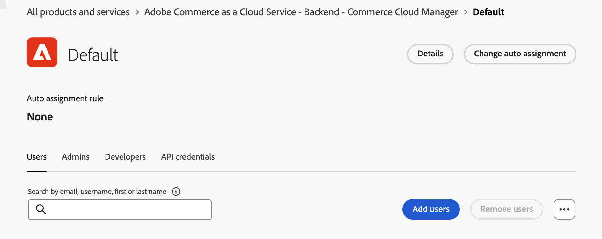

# Administración de usuarios

{{accs-early-access}}

Si desea que los usuarios tengan acceso al administrador en [!DNL Adobe Commerce as a Cloud Service], debe agregarlos como usuarios de su organización y asegurarse de que tengan acceso al producto Cloud Service en [Adobe Admin Console](https://adminconsole.adobe.com){target="_blank"}.

Este proceso requiere una organización de IMS con acceso a [!DNL Adobe Commerce as a Cloud Service]. Solo un administrador del sistema o de producto de la organización puede realizar estos procesos.

>[!TIP]
>
>Para agregar varios usuarios simultáneamente, puede realizar una [carga CSV en lotes](https://helpx.adobe.com/es/enterprise/using/bulk-upload-users.html){target="_blank"}.
> 
> También puede agregar varios usuarios a un rol creando un [grupo de usuarios](https://helpx.adobe.com/es/enterprise/using/user-groups.html){target="_blank"}. A continuación, puede agregar el producto [!UICONTROL **Adobe Commerce as a Cloud Service - servidor**] al grupo de usuarios.

## Explicación de funciones

Los roles siguientes están disponibles para [!DNL Adobe Commerce as a Cloud Service]. Para ver o editar estos roles, en el Administrador de Commerce, vaya a **Sistema** > **Permisos** > **Roles de usuario**.

* **Usuarios**: los usuarios tienen acceso de administrador al administrador de Commerce, pero no pueden administrar el acceso de nivel de producto en Admin Console. Los usuarios también pueden usar créditos para [crear instancias](./getting-started.md#create-an-instance) en [!DNL Commerce Cloud Manager].

* [**Desarrolladores**](https://helpx.adobe.com/es/enterprise/using/manage-developers.html#Adddevelopers){target="_blank"} Los desarrolladores tienen permisos de usuario y se agregan a la instancia de Commerce como usuario desarrollador. Esto significa que pueden usar [Admin UI SDK](https://developer.adobe.com/commerce/extensibility/admin-ui-sdk/){target="_blank"}, [configurar eventos](https://developer.adobe.com/commerce/extensibility/events/){target="_blank"} y [crear enlaces web](https://developer.adobe.com/commerce/extensibility/webhooks/){target="_blank"}.

* Administradores: existen tres tipos diferentes de administradores:
   * [Administradores del sistema](https://helpx.adobe.com/es/enterprise/using/admin-roles.html){target="_blank"}: el administrador del sistema tiene acceso a todos los productos y perfiles de producto de la organización a través de Admin Console.
   * [Administradores de productos](#add-a-product-admin): los administradores de productos pueden [administrar usuarios, roles y permisos para el producto](#add-users-and-admins) en [!DNL Adobe Admin Console] y [administrar usuarios en el administrador de Commerce](https://experienceleague.adobe.com/es/docs/commerce-admin/systems/user-accounts/permissions-users-all#create-a-user){target="_blank"}.
   * [Administradores de perfil de producto](#add-users-developers-and-product-profile-admins): los administradores de perfil de producto no tienen acceso al Administrador de Adobe Commerce, pero pueden administrar usuarios para el producto en [!DNL Adobe Admin Console].

Para obtener información detallada sobre los permisos otorgados a cada función dentro de Adobe Commerce, consulte [permisos de usuario](#user-permissions).

## Añadir un administrador de productos

1. Vaya a https://adminconsole.adobe.com e inicie sesión con su Adobe ID.

1. Seleccione su organización.

1. En la ficha [!UICONTROL **Productos**], en [!UICONTROL **Productos y servicios**], seleccione el producto [!UICONTROL **Adobe Commerce as a Cloud Service - servidor**].

   {width="600" zoomable="yes"}

1. Seleccione la ficha [!UICONTROL **Administradores**].

1. Haga clic en [!UICONTROL **Agregar administrador**].

1. Escriba el nombre de usuario o la dirección de correo electrónico de los usuarios que quiere agregar como administradores y haga clic en [!UICONTROL **Guardar**].

## Adición de usuarios, desarrolladores y administradores de perfil de producto

Las siguientes instrucciones proporcionan información sobre cómo agregar usuarios y desarrolladores a [!DNL Commerce Cloud Manager] y al administrador de Commerce. La interfaz [!DNL Commerce Cloud Manager] le permite crear y administrar sus instancias de Commerce.

>[!NOTE]
>
>Solo los administradores de productos y de sistemas pueden agregar usuarios y desarrolladores al producto Adobe Commerce as a Cloud Service.

1. Vaya a https://adminconsole.adobe.com e inicie sesión con su Adobe ID.

1. Seleccione su organización.

1. En la ficha [!UICONTROL **Productos**], en [!UICONTROL **Productos y servicios**], seleccione el producto [!UICONTROL **Adobe Commerce as a Cloud Service - servidor**].

   {width="600" zoomable="yes"}

1. Haga clic en el perfil de producto [!UICONTROL **Predeterminado - Cloud Manager**].

1. Seleccione la ficha [!UICONTROL **Usuarios**], [!UICONTROL **Desarrolladores**] o [!UICONTROL **Administradores**] y haga clic en [!UICONTROL **Agregar usuarios**] o [!UICONTROL **Agregar desarrolladores**] o [!UICONTROL **Agregar administradores**].

   >[!NOTE]
   >
   >Los administradores agregados desde esta pantalla son [administradores de perfil de producto](#understanding-roles) y no tienen acceso al administrador de Commerce.

   {width=600 zoomable="yes"}

1. Escriba el nombre de usuario o la dirección de correo electrónico de los usuarios que quiere agregar como administradores y haga clic en [!UICONTROL **Guardar**].

## Recursos de roles

En la lista siguiente se describen los recursos a los que los roles predeterminados tienen permiso para acceder dentro del administrador de Adobe Commerce. Para editar los permisos predeterminados de cada función, vaya a **Sistema** > **Permisos** > **Roles de usuario** en el administrador de Commerce.

**Usuarios**

* Catálogo
   * Inventario
      * Productos
         * Leer precio del producto

**Desarrolladores**

* Catálogo
   * Inventario
      * Productos
         * Leer precio del producto
* Sistema
   * Transferencia de datos
      * Importar historial
* Configuración de eventos de Adobe IO
   * Comprobación de configuración
   * Crear proveedor de eventos
   * Actualización de configuración
   * Sincronización de eventos
   * Obtener lista de proveedores de eventos
* Marco de eventos
   * Lista de eventos
   * Probar conexión de evento
   * Suscripción a un evento
   * Cancelar la suscripción a un evento
   * Estado del evento
   * API para obtener suscripciones a eventos
   * Ver IU de administración de suscripciones a eventos
   * IU de administración Crear suscripciones a eventos
   * Solicitar nueva IU de administración de eventos
* Webhooks
   * Firma digital de webhooks
      * Configuración de firma digital de Webhooks
      * Firma digital Generar claves
   * Administración de webhooks
      * Cuadrícula de webhooks
      * Edición de webhooks
      * Probar webhooks
      * Suscripción de API al webhook
      * Cancelar suscripción a API desde webhook
      * Lista de webhooks
      * Solicitar nuevo webhook
      * Registros de webhooks
      * Obtener lista de webhooks

**Administradores**

Los administradores tienen acceso a todos los permisos.
