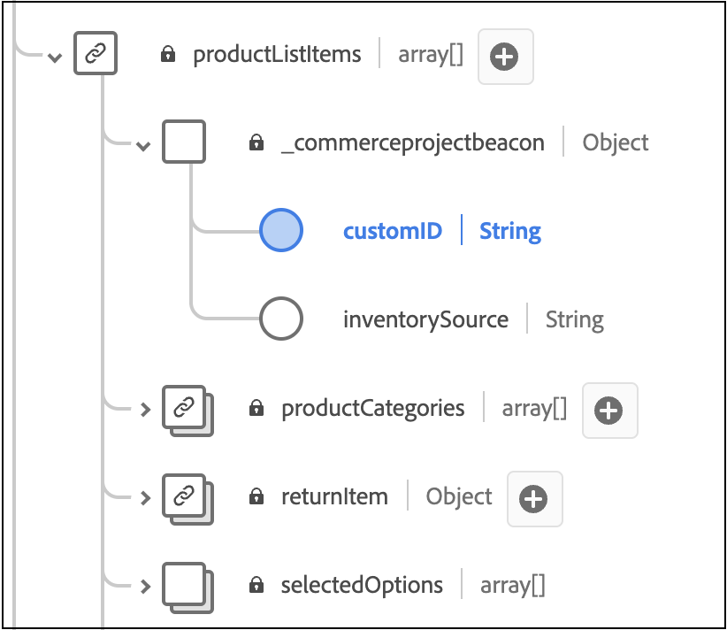

# Añadir atributos personalizados a los pedidos

En este artículo, aprenderá a añadir atributos personalizados a los eventos de back office. Con los atributos personalizados, puede capturar perspectivas de datos enriquecidas para mejorar los análisis y crear experiencias personalizadas para sus compradores.

>[!NOTE]
>
>Aprenda a [agregar identidades personalizadas](custom-identities.md) a los perfiles.

Los atributos personalizados se admiten en dos niveles:

- Nivel de pedido
- Nivel de artículo de pedido

>[!NOTE]
>
>Adobe [!DNL Commerce] admite atributos personalizados que tienen un tipo de datos de cadena, booleano o fecha.

Añadir atributos personalizados a eventos de back office requiere lo siguiente:

1. Cree un proyecto en su instalación de [!DNL Commerce].
1. Actualice el esquema para que los nuevos atributos personalizados se puedan introducir correctamente en Experience Platform.
1. En el Administrador, confirme que los atributos personalizados se capturan y se envían a Experience Platform.

>[!IMPORTANT]
>
>La estructura de directorios y los ejemplos de código siguientes ilustran cómo se pueden implementar atributos personalizados. La estructura de directorios real y el código requerido dependen de la configuración de la tienda y del entorno.

## Paso 1: Crear la estructura de directorios

1. Vaya al directorio `app/code` de la instalación de [!DNL Commerce] y cree un directorio de módulos. Por ejemplo: `Magento/AepCustomAttributes`. Este directorio contiene los archivos necesarios para los atributos personalizados.
1. En el directorio del módulo, cree un subdirectorio llamado `etc`. El directorio `etc` contiene los archivos `module.xml`, `query.xml`, `di.xml` y `et_schema.xml`.

## Paso 2: Definir las dependencias y la versión de instalación

Cree un archivo `module.xml` que defina las dependencias y la versión de instalación. Por ejemplo:

```xml
<?xml version="1.0"?>
<config xmlns:xsi="http://www.w3.org/2001/XMLSchema-instance" xsi:noNamespaceSchemaLocation="urn:magento:framework:Module/etc/module.xsd">
    <module name="Magento_AepCustomAttributes">
        <sequence>
            <module name="Magento_SalesOrderDataExporter"/>
        </sequence>
    </module>
</config>
```

## Paso 3: Recuperar datos de pedidos de ventas

Crear un archivo `query.xml` que recupere datos de pedidos de ventas. Por ejemplo:

```xml
<?xml version="1.0"?>
<config xmlns:xsi="http://www.w3.org/2001/XMLSchema-instance" xsi:noNamespaceSchemaLocation="urn:magento:Module:Magento_QueryXml:etc/query.xsd">
  <query name="salesOrdersV2">
    <source name="sales_order">
      <link-source name="sales_order_inventory_source" link-type="inner">
        <attribute name="inventory_source_code" alias="inventory_source" />
        <using glue="and">
          <condition attribute="order_id" operator="eq" type="identifier">entity_id</condition>
         </using> 
        </link-source>
    </source>
  </query>
  </config>
```

## Paso 4: Configurar la inyección de dependencia

Cree un archivo `di.xml` que configure la inyección de dependencias. Por ejemplo:

```xml
  <?xml version="1.0"?>
  <config xmlns:xsi="http://www.w3.org/2001/XMLSchema-instance" xsi:noNamespaceSchemaLocation="urn:magento:framework:ObjectManager/etc/config.xsd">
      <type name="Magento\AepCustomAttributes\Model\Provider\CustomAttribute">
          <arguments>
              <argument name="usingField" xsi:type="string">commerceOrderId</argument>
          </arguments>
      </type>
      <type name="Magento\AepCustomAttributes\Model\Provider\OrderItemCustomAttribute">
          <arguments>
              <argument name="usingField" xsi:type="string">entityId</argument>
          </arguments>
      </type>
      <type name="Magento\DataServices\Model\ProductContext">
          <plugin name="product-context-plugin" type="Magento\AepCustomAttributes\Plugin\Model\ProductContext"/>
      </type>
  </config>
```

## Paso 5: Defina los servicios utilizados para la inyección de dependencias

Cree un archivo `et_schema.xml` que defina los servicios utilizados para la inyección de dependencias. Por ejemplo:

```xml
  <?xml version="1.0"?>
  <config xmlns:xsi="http://www.w3.org/2001/XMLSchema-instance" xsi:noNamespaceSchemaLocation="urn:magento:module:Magento_DataExporter:etc/et_schema.xsd">
      <record name="OrderV2">
          <field name="additionalInformation" type="CustomAttribute" repeated="true" provider="Magento\AepCustomAttributes\Model\Provider\CustomAttribute">
              <using field="commerceOrderId"/>
          </field>
      </record>
      <record name="OrderItemV2">
          <field name="additionalInformation" type="CustomAttribute" repeated="true" provider="Magento\AepCustomAttributes\Model\Provider\OrderItemCustomAttribute">
              <using field="entityId"/>
          </field>
      </record>
  </config>
```

## Paso 6: Crear un directorio para los archivos PHP

En el mismo nivel que el directorio `etc`, cree un directorio llamado `Module/Provider`. Este directorio contiene los archivos PHP `OrderCustomAttributes` y `OrderItemCustomAttributes`.

## Paso 7: Definición de OrderCustomAttributes

Cree un archivo `OrderCustomAttributes.php` que defina el orden de los atributos personalizados. Por ejemplo:

```php
declare(strict_types=1);

namespace Magento\AepCustomAttributes\Model\Provider;

use Magento\Framework\Serialize\Serializer\Json;

class CustomAttribute
{
  /**
   * @var Json
   */
  private Json $jsonSerializer;

  /**
   * @var string
   */
  private string $usingField = '';

  /**
   * @param string $usingField
   * @param Json $jsonSerializer
   */
  public function __construct(
      string $usingField,
      Json $jsonSerializer
  ) {
      $this->usingField = $usingField;
      $this->jsonSerializer = $jsonSerializer;
  }

  /**
   * @param array $values
   * @return array
   */
  public function get(array $values): array
  {
      $output = [];

      /**
       * Entity IDs
       */
      $ids = array_column($values, $this->usingField);

      foreach ($this->flatten($values) as $row) {
          $info = \is_string($row['additionalInformation']) ? $row['additionalInformation'] : '{}';
          $unserializedData = $this->jsonSerializer->unserialize($info) ?? [];

          if (isset($row)) {
              $unserializedData['order_channel'] = 'order_channel';
              $unserializedData['order_status'] = 'order_status';

              $additionalInformation = [];
              foreach ($unserializedData as $name => $value) {
                  $additionalInformation[] = [
                      'name' => $name,
                      'value' => \is_string($value) ? $value : $this->jsonSerializer->serialize($value)
                  ];
              }
              foreach ($additionalInformation as $information) {
                  $output[] = [
                      'additionalInformation' => $information,
                      $this->usingField => $row[$this->usingField],
                  ];
              }
          }
      }
      return $output;
  }

  /**
   * @param $values
   * @return array
   */
  private function flatten($values): array
  {
      if (isset(current($values)[0])) {
          return array_merge([], ...array_values($values));
      }
      return $values;
  }
}
```

## Paso 8: Definición de OrderItemCustomAttributes

Cree un archivo `OrderItemCustomAttributes.php` que defina los atributos personalizados del elemento de pedido. Por ejemplo:

```php
declare(strict_types=1);

namespace Magento\AepCustomAttributes\Model\Provider;

use Magento\Framework\Serialize\Serializer\Json;

class OrderItemCustomAttribute
{
  /**
   * @var Json
   */
  private Json $jsonSerializer;

  /**
   * @var string
   */
  private string $usingField = '';

  /**
   * @param Json $jsonSerializer
   * @param string $usingField
   */
  public function __construct(
      Json $jsonSerializer,
      string $usingField
  ) {
      $this->jsonSerializer = $jsonSerializer;
      $this->usingField = $usingField;
  }

  /**
   * Getting additional attributes data.
   *
   * @param array $values
   * @return array
   */
  public function get(array $values): array
  {
      $output = [];
      $values = $this->flatten($values);

      foreach ($values as $row) {
          $info = \is_string($row['additionalInformation']) ? $row['additionalInformation'] : '{}';
          $unserializedData = $this->jsonSerializer->unserialize($info) ?? [];
          $unserializedData['product_brand'] = implode(',', ['label 1', 'label 2']);

          $additionalInformation = [];
          foreach ($unserializedData as $name => $value) {
              $additionalInformation[] = [
                  'name' => $name,
                  'value' => \is_string($value) ? $value : $this->jsonSerializer->serialize($value)
              ];
          }
          foreach ($additionalInformation as $information) {
              $output[] = [
                  'additionalInformation' => $information,
                  $this->usingField => $row[$this->usingField],
              ];
          }
      }
      return $output;
  }

  /**
   * @param $values
   * @return array
   */
  private function flatten($values): array
  {
      if (isset(current($values)[0])) {
          return array_merge([], ...array_values($values));
      }
      return $values;
  }
}
```

## Paso 9: Crear un directorio para el archivo productContext

En el mismo nivel que el directorio `etc`, cree un directorio llamado `Plugin/Module`. Este directorio contiene el archivo `ProductContext.php`.

## Paso 10: Definir la clase ProductContext

Cree un archivo denominado `ProductContext.php` que defina la clase `ProductContext`. Por ejemplo:

```php
<?php>
namespace Magento\AepCustomAttributes\Plugin\Model;
use Magento\Catalog\Model\Product;
use Magento\DataServices\Model\ProductContext as Subject;
use Magento\Framework\App\ResourceConnection;

class ProductContext
{
    private ?array $brandCache = [];
    public function __construct(
        private ResourceConnection $resourceConnection ) {
    }  

    public function afterGetContextData(Subject $subject, array $result Product $product)
    {
        $brand = $product->getCustomAttribute('cust_attr1');
        if (!empty($brand) && $brand->getValue()) {
            $result['brands'] = ['brand_label_1', 'brand_label_2'];
            }
            return $result;
      }
  }
```

## Paso 11: Registrar el módulo

En el mismo nivel que el directorio `etc`, cree un archivo `registration.php` que registre el módulo. Por ejemplo:

```php
<?php>
declare(strict_types=1);

use \Magento\Framework\Component\ComponentRegistrar;

ComponentRegistrar::register(
    ComponentRegistrar::MODULE,
    'Magento_AepCustomAttributes',
    __DIR__
);
```

## Paso 12: Ampliar el esquema XDM existente

Para asegurarse de que su esquema [!DNL Commerce] puede introducir los nuevos atributos de pedido personalizados en Experience Platform, debe ampliar el esquema para incluir estos campos personalizados.

Para obtener información sobre cómo ampliar un esquema XDM existente para incluir estos campos personalizados, consulte el artículo [Crear y editar esquemas en la interfaz de usuario](https://experienceleague.adobe.com/en/docs/experience-platform/xdm/ui/resources/schemas#custom-fields-for-standard-groups) en la documentación de Experience Platform. El campo ID de inquilino se genera dinámicamente; sin embargo, la estructura del campo debe ser similar al ejemplo proporcionado en la documentación de Experience Platform.

>[!IMPORTANT]
>
>Los atributos personalizados de XDM deben coincidir con los atributos enviados desde [!DNL Commerce].

Para `commerce.order`, agregue un campo para el nivel de pedido:


Para `productListItems`, agregue campos para el nivel de elemento de pedido:



## Paso 12: Confirmar que se están capturando datos

Vea la ficha [Personalización de datos](connect-data.md#data-customization) en el administrador para confirmar que los datos de atributos personalizados se capturan y se envían a Experience Platform.

### Resolución de problemas

Si ve el mensaje `No custom order attributes found.` en la ficha **[!UICONTROL Data Customization]**, confirme lo siguiente:

1. Ha completado los requisitos previos para habilitar la [extensión del conector de datos](overview.md#prerequisites).
1. Ha configurado [atributos de pedido personalizados](#add-custom-order-attributes).
1. Se ha generado al menos un evento de pedido.
