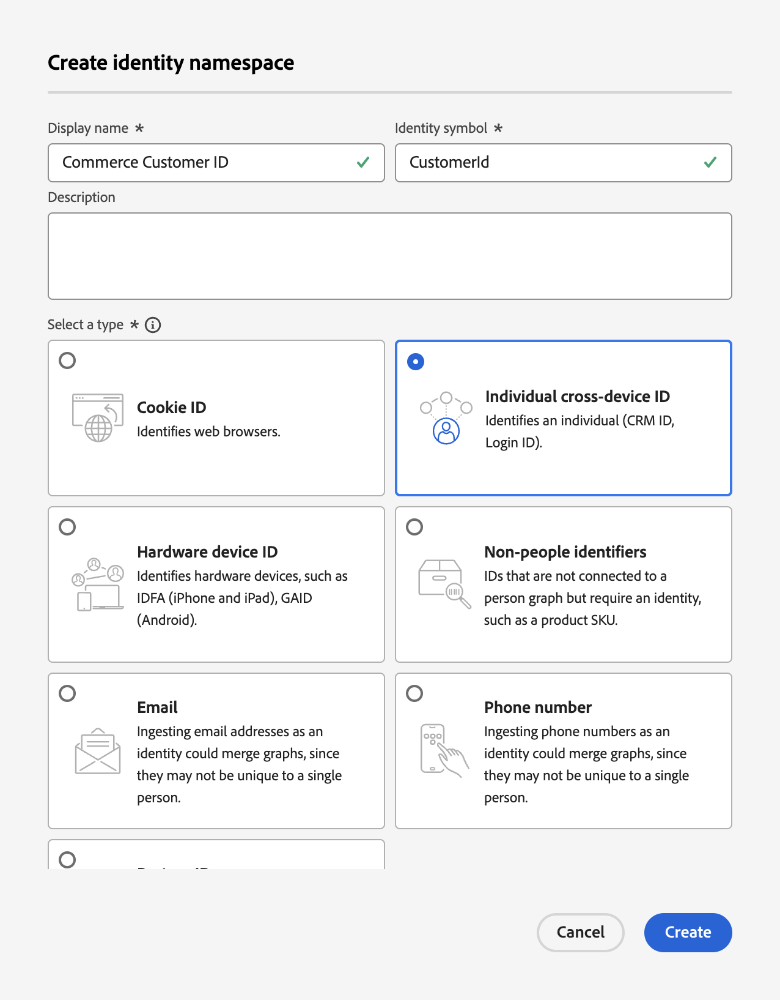

# Actualizar el esquema de registro de perfil para la ingesta de datos de Commerce

Cuando los compradores crean un perfil en el sitio de Commerce, se crea un registro de perfil y se capturan datos. Debe crear un esquema y un conjunto de datos específicos para ese registro de perfil para poder transmitir esos datos de perfil a Experience Platform.

1. [Cree](https://experienceleague.adobe.com/es/docs/experience-platform/xdm/ui/resources/schemas) un esquema y establezca la clase en **Perfil individual**.

1. [Agregar](https://experienceleague.adobe.com/es/docs/experience-platform/xdm/ui/resources/schemas) los siguientes grupos de campos específicos de perfiles:

   - identityMap
   - Datos demográficos
   - Datos personales de contacto
   - Detalles de cuenta de usuario

1. [Habilite](https://experienceleague.adobe.com/es/docs/experience-platform/xdm/ui/resources/schemas) el esquema para el perfil.

   Cuando un esquema está habilitado para el perfil, cualquier conjunto de datos creado a partir de este esquema participa en Real-Time CDP, que combina datos de fuentes dispares para construir una vista completa de cada cliente.

1. [Crear un conjunto de datos](https://experienceleague.adobe.com/es/docs/platform-learn/implement-mobile-sdk/experience-cloud/platform) basado en el esquema que creó o actualizó.

   Un conjunto de datos es una construcción de almacenamiento y administración para una colección de datos, normalmente una tabla que contiene un esquema (columnas) y campos (filas). Los conjuntos de datos también contienen metadatos que describen varios aspectos de los datos que almacenan.

1. Crear un [espacio de nombres personalizado](https://experienceleague.adobe.com/es/docs/experience-platform/identity/features/namespaces#create-namespaces) en Experience Platform con los siguientes valores:

   - **Nombre para mostrar**: _ID de cliente de Commerce_
   - **Símbolo de identidad**: _CustomerId_
   - **Tipo**: _ID individual entre dispositivos_

   {width="700" zoomable="yes"}

   Haga clic en **[!UICONTROL Create]**. El servicio de perfil unificado utiliza un área de nombres personalizada para unir fragmentos de perfil.

Con el esquema, el conjunto de datos y el espacio de nombres personalizado configurados para los datos de registro de perfil del cliente, puede [configurar](connect-data.md#data-collection) su instancia de Commerce para recopilar y enviar esos datos a Experience Platform.

Para crear un esquema, un conjunto de datos y un flujo de datos para los datos de evento de comportamiento y de back office, consulte [actualizar esquemas de evento de series temporales para la ingesta de datos de Commerce](update-xdm.md).
