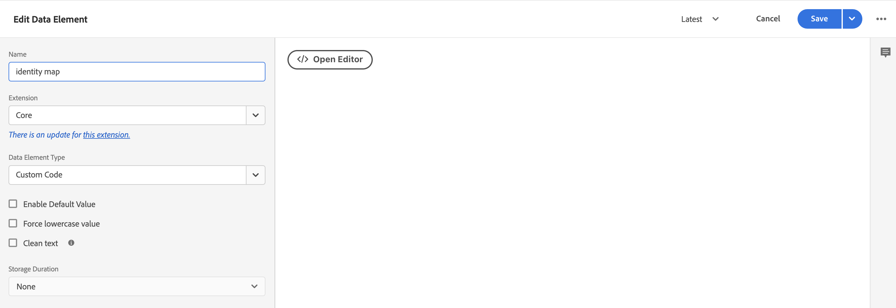
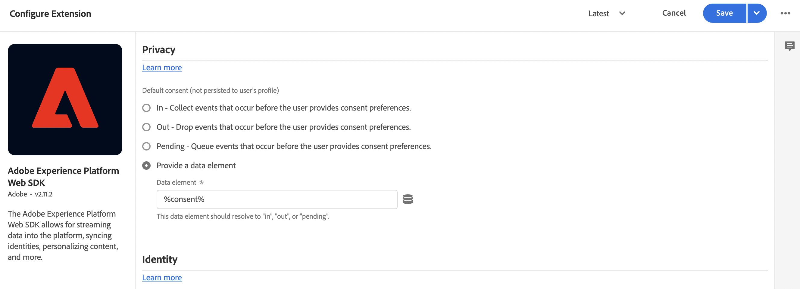

# Recopilación de datos de Commerce mediante etiquetas de Adobe Experience Platform

Aunque puede usar la extensión [!DNL Data Connection] para publicar y suscribirse a eventos de tienda, es posible que algunos comerciantes ya estén usando una solución de recopilación de datos, como las [etiquetas Adobe Experience Platform](https://experienceleague.adobe.com/docs/platform-learn/data-collection/tags/create-a-property.html?lang=es). Para esos comerciantes, Adobe Commerce proporciona una opción de solo publicación en la extensión [!DNL Data Connection] que utiliza Adobe Commerce Event SDK.

![[!DNL Data Connection] Flujo de datos de extensión](assets/tags-data-flow.png)
_[!DNL Data Connection]Flujo de datos de extensión con etiquetas_

En este tema, aprenderá a asignar los valores de evento de tienda proporcionados por la extensión [!DNL Data Connection] a la solución de etiquetas de Adobe Experience Platform que ya está utilizando.

## Recopilación de datos de evento de Adobe Commerce

Para recopilar datos de evento de Commerce:

- Instale [Adobe Commerce Events SDK](https://github.com/adobe/commerce-events/tree/main/packages/storefront-events-sdk). Para las tiendas PHP, consulte el tema [instalar](install.md). Para las tiendas PWA Studio, consulta la [guía de PWA Studio](https://developer.adobe.com/commerce/pwa-studio/integrations/adobe-commerce/aep/).

  >[!NOTE]
  >
  > **no** [configura](connect-data.md) el ID de organización y el ID de flujo de datos.

## Asignar datos de tienda de Commerce a Adobe Experience Platform

Para asignar datos de tienda de Commerce a Adobe Experience Platform, configure e instale lo siguiente desde etiquetas de Adobe Experience Platform:

1. [Configurar una propiedad de etiquetas](https://experienceleague.adobe.com/docs/platform-learn/implement-in-websites/configure-tags/create-a-property.html?lang=es) en la recopilación de datos de Adobe Experience Platform.

1. En **Creación**, seleccione **Extensiones** e instale y configure las siguientes extensiones:

   - [Capa de datos del cliente de Adobe](https://experienceleague.adobe.com/docs/experience-platform/tags/extensions/client/client-data-layer/overview.html?lang=es)

   - [Adobe Experience Platform Web SDK](https://experienceleague.adobe.com/docs/experience-platform/edge/fundamentals/installing-the-sdk.html?lang=es)

1. [Publicar etiqueta](https://experienceleague.adobe.com/docs/experience-platform/tags/publish/overview.html?lang=es) en su entorno de desarrollo.

1. Siga los pasos de **Asignación de eventos** a continuación para configurar los elementos de datos y las reglas para eventos específicos.

### Asignación de eventos

Dado que la recopilación de datos mediante etiquetas es diferente al uso de Adobe Commerce Event SDK, es importante comprender los términos equivalentes utilizados en ambos marcos.

| Término de etiquetas de Adobe Experience Platform | Término de Adobe Commerce Event SDK |
|---|---|
| _elementos de datos_ | contexto |
| _reglas_ | evento |
|  | _condiciones de regla_ - detectores de eventos (de ACDL)<br><br>_acciones de regla_ - controladores de eventos (enviar a Adobe Experience Platform) |

Al actualizar los elementos de datos y las reglas en las etiquetas de Adobe Experience Platform con datos de evento específicos de Adobe Commerce, hay algunos pasos comunes que debe seguir.

Por ejemplo, vamos a agregar el evento de Adobe Commerce `signOut` a las etiquetas de Adobe Experience Platform. Los pasos descritos a continuación, excepto para los valores específicos que ha establecido, describen cómo agregar [elementos de datos](https://experienceleague.adobe.com/docs/experience-platform/collection/e2e.html?lang=es#data-element) y [reglas](https://experienceleague.adobe.com/docs/experience-platform/collection/e2e.html?lang=es#create-a-rule), que se aplican a todos los eventos de Adobe Commerce que está agregando a las etiquetas.

1. Crear un elemento de datos:

   
   _Crear nuevo elemento de datos_

1. Establezca **Name** en `sign out`.

1. Establezca **Extension** en `Adobe Experience Platform Web SDK`.

1. Establezca **Tipo de elemento de datos** en `XDM object`.

1. Seleccione la **zona protegida** y el **esquema** que desee actualizar.

1. En **userAccount** > **logout**, establezca **value** en **Logout de visitantes** en `1`.

   
   _Actualizar valor de cierre de sesión_

1. Seleccione **Guardar**.

1. Crear una regla:

   
   _Crear nueva regla_

1. Seleccione **Agregar** en **EVENTOS**.

1. Establezca **Extension** en `Adobe Client Data Layer`.

1. Definir **Tipo de evento** en `Data Pushed`.

1. Seleccione **Evento específico** y establezca el **Evento/Clave para registrarse para** en `sign-out`.

1. Seleccione **Conservar cambios** para guardar la nueva regla.

1. Añada una acción.

1. Establezca **Extension** en `Adobe Experience Platform Web SDK`.

1. Establezca **Tipo de acción** en `Send Event`.

1. Establezca **Instancia** en `Alloy`.

1. Establecer **Type** en `userAccount.logout`.

1. Definir **datos XDM** en `%sign out%`.

1. Haga clic en **Guardar**.

   Ha creado un elemento de datos en su esquema para el evento `signOut` desde Adobe Commerce. Además, ha creado una regla con una acción específica que debe producirse cuando ese evento se activa desde la tienda de Adobe Commerce.

Repita los pasos anteriores en las etiquetas para cada uno de los eventos de Adobe Commerce que se describen a continuación.

## Eventos disponibles

Para cada uno de los siguientes eventos, asigne los eventos de Adobe Commerce al XDM siguiendo los pasos anteriores.

- [`signOut`](#signout)
- [&quot;signIn&quot;](#signin)
- [&quot;createAccount&quot;](#createaccount)
- [&quot;editAccount&quot;](#editaccount)
- [&quot;pageView&quot;](#pageview)
- [productView](#productview)
- [&quot;searchRequestSent&quot;](#searchrequestsent)
- [&quot;searchResponseReceived&quot;](#searchresponsereceived)
- [addToCart](#addtocart)
- [`openCart`](#opencart)
- [&quot;viewCart&quot;](#viewcart)
- [removeFromCart](#removefromcart)
- [&quot;startCheckout&quot;](#initiatecheckout)
- [&quot;placeOrder&quot;](#placeorder)

### signOut

Se activa cuando un comprador intenta cerrar la sesión.

#### Elementos de datos

Cree el siguiente elemento de datos:

1. Cerrar sesión:

   - **Nombre**: `Sign out`
   - **Extensión**: `Adobe Experience Platform Web SDK`
   - **Tipo de elemento de datos**: `XDM object`
   - **Grupo de campos**: `userAccount` > `logout`
   - **Cierre de sesión de visitantes**: **Valor** = `1`

#### Reglas 

- **Nombre**: `Sign out`
- **Extensión**: `Adobe Client Data Layer`
- **Tipo de evento**: `Data Pushed`
- **Evento específico**: `sign-out`

##### Acciones

- **Extensión**: `Adobe Experience Platform Web SDK`
- **Tipo de acción**: `Send event`
- **Tipo**: `userAccount.logout`
- **Datos XDM**: `%sign-out%`

### signIn

Se activa cuando un comprador intenta iniciar sesión.

#### Elementos de datos

Cree los siguientes elementos de datos:

1. Correo electrónico de cuenta:

   - **Nombre**: `account email`
   - **Extensión**: `Adobe Client Data Layer`
   - **Tipo de elemento de datos**: `Data Layer Computed State`
   - **[Ruta de acceso ] opcional**: `accountContext.emailAddress`

1. Tipo de cuenta:

   - **Nombre**: `account type`
   - **Extensión**: `Adobe Client Data Layer`
   - **Tipo de elemento de datos**: `Data Layer Computed State`
   - **[Ruta de acceso ] opcional**: `accountContext.accountType`

1. ID de cuenta:

   - **Nombre**: `account id`
   - **Extensión**: `Adobe Client Data Layer`
   - **Tipo de elemento de datos**: `Data Layer Computed State`
   - **[Ruta de acceso ] opcional***: `accountContext.accountId`

1. Iniciar sesión:

   - **Nombre**: `sign in`
   - **Extensión**: `Adobe Experience Platform Web SDK`
   - **Tipo de elemento de datos**: `XDM object`
   - **Grupo de campos**: `person` > `accountID`
   - **Id. de cuenta**: **Valor** = `%account id%`
   - **Grupo de campos**: `person` > `accountType`
   - **Tipo de cuenta**: **Valor** = `%account type%`
   - **Grupo de campos**: `person` > `personalEmailID`
   - **Dirección de correo electrónico personal**: **Valor** = `%account email%`
   - **Grupo de campos**: `personalEmail` > `address`
   - **Dirección**: **Valor** = `%account email%`
   - **Grupo de campos**: `userAccount` > `login`
   - **Inicio de sesión de visitante**: **Valor** = `1`

#### Reglas 

- **Nombre**: `sign in`
- **Extensión**: `Adobe Client Data Layer`
- **Tipo de evento**: `Data Pushed`
- **Evento específico**: `sign-in`

##### Acciones

- **Extensión**: `Adobe Experience Platform Web SDK`
- **Tipo de acción**: `Send event`
- **Tipo**: `userAccount.login`
- **Datos XDM**: `%sign in%`

### createAccount

Se activa cuando un comprador intenta crear una cuenta.

#### Elementos de datos

Cree los siguientes elementos de datos:

1. Correo electrónico de cuenta:

   - **Nombre**: `account email`
   - **Extensión**: `Adobe Client Data Layer`
   - **Tipo de elemento de datos**: `Data Layer Computed State`
   - **[Ruta de acceso ] opcional**: `accountContext.emailAddress`

1. Tipo de cuenta:

   - **Nombre**: `account type`
   - **Extensión**: `Adobe Client Data Layer`
   - **Tipo de elemento de datos**: `Data Layer Computed State`
   - **[Ruta de acceso ] opcional**: `accountContext.accountType`

1. ID de cuenta:

   - **Nombre**: `account id`
   - **Extensión**: `Adobe Client Data Layer`
   - **Tipo de elemento de datos**: `Data Layer Computed State`
   - **[Ruta de acceso ] opcional**: `accountContext.accountId`

1. Crear cuenta:

   - **Nombre**: `Create account`
   - **Extensión**: `Adobe Experience Platform Web SDK`
   - **Tipo de elemento de datos**: `XDM object`
   - **Grupo de campos**: `person` > `accountID`
   - **Id. de cuenta**: **Valor** = `%account id%`
   - **Grupo de campos**: `person` > `accountType`
   - **Tipo de cuenta**: **Valor** = `%account type%`
   - **Grupo de campos**: `person` > `personalEmailID`
   - **Dirección de correo electrónico personal**: **Valor** = `%account email%`
   - **Grupo de campos**: `personalEmail` > `address`
   - **Dirección**: **Valor** = `%account email%`
   - **Grupo de campos**: `userAccount` > `createProfile`
   - **Creación de perfil de cuenta**: **Valor** = `1`

#### Reglas 

- **Nombre**: `Create account`
- **Extensión**: `Adobe Client Data Layer`
- **Tipo de evento**: `Data Pushed`
- **Evento específico**: `create-account`

##### Acciones

- **Extensión**: `Adobe Experience Platform Web SDK`
- **Tipo de acción**: `Send event`
- **Tipo**: `userAccount.createProfile`
- **Datos XDM**: `%create account%`

### editAccount

Se activa cuando un comprador intenta editar una cuenta.

#### Elementos de datos

Cree los siguientes elementos de datos:

1. Correo electrónico de cuenta:

   - **Nombre**: `account email`
   - **Extensión**: `Adobe Client Data Layer`
   - **Tipo de elemento de datos**: `Data Layer Computed State`
   - **[Ruta de acceso ] opcional**: `accountContext.emailAddress`

1. Tipo de cuenta:

   - **Nombre**: `account type`
   - **Extensión**: `Adobe Client Data Layer`
   - **Tipo de elemento de datos**: `Data Layer Computed State`
   - **[Ruta de acceso ] opcional**: `accountContext.accountType`

1. ID de cuenta:

   - **Nombre**: `account id`
   - **Extensión**: `Adobe Client Data Layer`
   - **Tipo de elemento de datos**: `Data Layer Computed State`
   - **[Ruta de acceso ] opcional**: `accountContext.accountId`

1. Editar cuenta:

   - **Nombre**: `Edit account`
   - **Extensión**: `Adobe Experience Platform Web SDK`
   - **Tipo de elemento de datos**: `XDM object`
   - **Grupo de campos**: `person` > `accountID`
   - **Id. de cuenta**: **Valor** = `%account id%`
   - **Grupo de campos**: `person` > `accountType`
   - **Tipo de cuenta**: **Valor** = `%account type%`
   - **Grupo de campos**: `person` > `personalEmailID`
   - **Dirección de correo electrónico personal**: **Valor** = `%account email%`
   - **Grupo de campos**: `personalEmail` > `address`
   - **Dirección**: **Valor** = `%account email%`
   - **Grupo de campos**: `userAccount` > `updateProfile`
   - **Creación de perfil de cuenta**: **Valor** = `1`

#### Reglas

- **Nombre**: `Edit account`
- **Extensión**: `Adobe Client Data Layer`
- **Tipo de evento**: `Data Pushed`
- **Evento específico**: `edit-account`

##### Acciones

- **Extensión**: `Adobe Experience Platform Web SDK`
- **Tipo de acción**: `Send event`
- **Tipo**: `userAccount.updateProfile`
- **Datos XDM**: `%edit account%`

### pageView

Se activa cuando se carga cualquier página.

#### Elementos de datos

Cree los siguientes elementos de datos:

1. Nombre de página:

   - **Nombre**: `page name`
   - **Extensión**: `Adobe Client Data Layer`
   - **Tipo de elemento de datos**: `Data Layer Computed State`
   - **[Ruta de acceso ] opcional**: `pageContext.pageName`

#### Reglas 

- **Nombre**: `page view`
- **Extensión**: `Adobe Client Data Layer`
- **Tipo de evento**: `Data Pushed`
- **Evento específico**: `page-view`

##### Acciones

- **Extensión**: `Adobe Experience Platform Web SDK`
- **Tipo de acción**: `Send event`
- **Tipo**: `web.webPageDetails.pageViews`
- **Datos XDM**: `%page view%`

### productView

Se activa cuando se carga cualquier página de producto.

#### Elementos de datos

Cree los siguientes elementos de datos:

1. Nombre del producto:

   - **Nombre**: `product name`
   - **Extensión**: `Adobe Client Data Layer`
   - **Tipo de elemento de datos**: `Data Layer Computed State`
   - **[Ruta de acceso ] opcional**: `productContext.name`

1. SKU del producto:

   - **Nombre**: `product sku`
   - **Extensión**: `Adobe Client Data Layer`
   - **Tipo de elemento de datos**: `Data Layer Computed State`
   - **[Ruta de acceso ] opcional**: `productContext.sku`

1. URL de imagen del producto:

   - **Nombre**: `product image`
   - **Extensión**: `Adobe Client Data Layer`
   - **Tipo de elemento de datos**: `Data Layer Computed State`
   - **[Ruta de acceso ] opcional**: `productContext.mainImageUrl`

1. Divisa del producto:

   - **Nombre**: `product currency`
   - **Extensión**: `Adobe Client Data Layer`
   - **Tipo de elemento de datos**: `Data Layer Computed State`
   - **[Ruta de acceso ] opcional**: `productContext.pricing.currencyCode`

1. Código de divisa:

   - **Nombre**: `currency code`
   - **Extensión**: `Core`
   - **Tipo de elemento de datos**: `Custom Code`
   - **Abrir editor**:

   ```bash
   return _satellite.getVar('product currency') || _satellite.getVar('storefront').storeViewCurrencyCode
   ```

1. Precio especial:

   - **Nombre**: `special price`
   - **Extensión**: `Adobe Client Data Layer`
   - **Tipo de elemento de datos**: `Data Layer Computed State`
   - **[Ruta de acceso ] opcional**: `productContext.pricing.specialPrice`

1. Precio normal:

   - **Nombre**: `regular price`
   - **Extensión**: `Adobe Client Data Layer`
   - **Tipo de elemento de datos**: `Data Layer Computed State`
   - **[Ruta de acceso ] opcional**: `productContext.pricing.regularPrice`

1. Precio del producto:

   - **Nombre**: `product price`
   - **Extensión**: `Core`
   - **Tipo de elemento de datos**: `Custom Code`
   - **Abrir editor**:

   ```bash
   return _satellite.getVar('product regular price') || _satellite.getVar('product special price')
   ```

1. Vista del producto:

   - **Nombre**: `product view`
   - **Extensión**: `Adobe Experience Platform Web SDK`
   - **Tipo de elemento de datos**: `XDM object`
   - **Grupo de campos**: `productListItems`. Seleccione **Proporcionar elementos individuales** y haga clic en el botón **Agregar elemento**. Como esta vista es para una PDP, puede rellenar con un solo elemento.
   - **Grupo de campos**: `productListItems` > `name`
   - **Nombre**: **Valor** = `%product name%`
   - **Grupo de campos**: `productListItems` > `SKU`
   - **SKU**: **Valor** = `%product sku%`
   - **Grupo de campos**: `productListItems` > `priceTotal`
   - **Precio total**: **Valor** = `%product price%`
   - **Grupo de campos**: `productListItems` > `currencyCode`
   - **Código de moneda**: **Valor** = `%currency code%`
   - **Grupo de campos**: `productListItems` > `ProductImageUrl`
   - **ProductImageUrl**: **Valor** = `%product image%`
   - **Grupo de campos**: `commerce` > `productViews` > `value`
   - **valor**: **Valor** = `1`

#### Reglas 

- **Nombre**: `product view`
- **Extensión**: `Adobe Client Data Layer`
- **Tipo de evento**: `Data Pushed`
- **Evento específico**: `product-page-view`

##### Acciones

- **Extensión**: `Adobe Experience Platform Web SDK`
- **Tipo de acción**: `Send event`
- **Tipo**: `commerce.productViews`
- **Datos XDM**: `%product view%`

### searchRequestSent

Se activa por eventos en la ventana emergente &quot;buscar mientras escribe&quot; y por eventos en las páginas de resultados de búsqueda.

#### Elementos de datos

Cree los siguientes elementos de datos:

1. Buscar entrada

   - **Nombre**: `search input`
   - **Extensión**: `Adobe Client Data Layer`
   - **Tipo de elemento de datos**: `Data Layer Computed State`
   - **[Ruta de acceso ] opcional**: `searchInputContext.units[0]`

1. Buscar frase de entrada

   - **Nombre**: `search input phrase`
   - **Extensión**: `Core`
   - **Tipo de elemento de datos**: `Custom Code`
   - **Abrir editor**:

   ```bash
   return _satellite.getVar('search input').phrase;
   ```

1. Buscar orden de entrada

   - **Nombre**: `search input sort`
   - **Extensión**: `Core`
   - **Tipo de elemento de datos**: `Custom Code`
   - **Abrir editor**:

   ```bash
   const searchInput = _satellite.getVar('search input');
   const sortFromInput = searchInput ? searchInput.sort : [];
   const sort = sortFromInput.map((searchSort) => {
       return {
           attribute: searchSort.attribute,
           order: searchSort.direction,
       };
   });
   return sort;
   ```

1. Buscar filtros de entrada

   - **Nombre**: `search input filters`
   - **Extensión**: `Core`
   - **Tipo de elemento de datos**: `Custom Code`
   - **Abrir editor**:

   ```bash
   const searchInput = _satellite.getVar('search input');
   const filtersFromInput = searchInput ? searchInput.filter : [];
   const filters = filtersFromInput.map(
       (searchFilter) => {
           let value = [];
           let isRange = false;
           if (searchFilter.eq) {
               value.push(searchFilter.eq);
           } else if (searchFilter.in) {
               value = searchFilter.in;
           } else if (searchFilter.range) {
               isRange = true;
               value.push(String(searchFilter.range.from));
               value.push(String(searchFilter.range.to));
           }
           return {
               attribute: searchFilter.attribute,
               value,
               isRange,
           };
       }
   );
   
   return filters;
   ```

1. Solicitud de búsqueda:

   - **Nombre**: `search request`
   - **Extensión**: `Adobe Experience Platform Web SDK`
   - **Tipo de elemento de datos**: `XDM object`
   - **Grupo de campos**: `siteSearch` > `phrase`
   - **value**: aún no está disponible
   - **Grupo de campos**: `siteSearch` > `sort`. Seleccione **Proporcionar todo el objeto**.
   - **Grupo de campos**: `siteSearch` > `filter`. Seleccione **Proporcionar todo el objeto**.
   - **Grupo de campos**: `searchRequest` > `id`
   - **Identificador Único**: **Valor** = `%search request ID%`
   - **Grupo de campos**: `searchRequest` > `value`
   - **valor**: **Valor** = `1`

#### Reglas 

- **Nombre**: `search request sent`
- **Extensión**: `Adobe Client Data Layer`
- **Tipo de evento**: `Data Pushed`
- **Evento específico**: `search-request-sent`

##### Acciones

- **Extensión**: `Adobe Experience Platform Web SDK`
- **Tipo de acción**: `Send event`
- **Tipo**: `searchRequest`
- **Datos XDM**: `%search request%`

### searchResponseReceived

Se activa cuando Live Search devuelve los resultados de la página emergente &quot;buscar mientras escribes&quot; o de la página de resultados de búsqueda.

#### Elementos de datos

Cree los siguientes elementos de datos:

1. Resultados de la búsqueda:

   - **Nombre**: `search results`
   - **Extensión**: `Adobe Client Data Layer`
   - **Tipo de elemento de datos**: `Data Layer Computed State`
   - **[Ruta de acceso ] opcional**: `searchResultsContext.units[0]`

1. Número de resultados de búsqueda de productos:

   - **Nombre**: `search result number of products`
   - **Extensión**: `Core`
   - **Tipo de elemento de datos**: `Custom Code`
   - **Abrir editor**:

   ```bash
   return _satellite.getVar('search result').products.length;
   ```

1. Productos de resultados de búsqueda:

   - **Nombre**: `search result products`
   - **Extensión**: `Core`
   - **Tipo de elemento de datos**: `Custom Code`
   - **Abrir editor**:

   ```bash
   const searchResult = _satellite.getVar('search result');
   const productsFromResult = searchResult.products ? searchResult.products : [];
   const products = productsFromResult.map(
       (product) => {
           return { SKU: product.sku, name: product.name };
       }
   );
   return products;
   ```

1. Sugerencias de resultados de búsqueda:

   - **Nombre**: `search result products`
   - **Extensión**: `Core`
   - **Tipo de elemento de datos**: `Custom Code`
   - **Abrir editor**:

   ```bash
   const searchResult = _satellite.getVar('search result');
   const suggestionsFromResult = searchResult.suggestions ? searchResult.suggestions : [];
   const suggestions = suggestionsFromResult.map((suggestion) => suggestion.suggestion);
   return suggestions;
   ```

1. URL de imagen del producto:

   - **Nombre**: `product image`
   - **Extensión**: `Adobe Client Data Layer`
   - **Tipo de elemento de datos**: `Data Layer Computed State`
   - **[Ruta de acceso ] opcional**: `productContext.mainImageUrl`

1. Respuesta de búsqueda:

   - **Nombre**: `search response`
   - **Extensión**: `Adobe Experience Platform Web SDK`
   - **Tipo de elemento de datos**: `XDM object`
   - **Grupo de campos**: `siteSearch` > `suggestions`. Seleccione **Proporcionar todo el objeto**.
   - **Elemento de datos**: `%search result suggestions%`
   - **Grupo de campos**: `siteSearch` > `numberOfResults`
   - **valor**: `%search result number of products%`
   - **Grupo de campos**: `productListItems`. Seleccione **Proporcionar todo el objeto**.
   - **Grupo de campos**: `productListItems` > `ProductImageUrl`
   - **ProductImageUrl**: **Valor** = `%product image%`
   - **Elemento de datos**: `%search result products%`
   - **Grupo de campos**: `searchResponse` > `id`
   - **Identificador Único**: **Valor** = `%search response ID%`
   - **Grupo de campos**: `searchResponse` > `value`
   - **valor**: **Valor** = `1`

#### Reglas 

- **Nombre**: `search response received`
- **Extensión**: `Adobe Client Data Layer`
- **Tipo de evento**: `Data Pushed`
- **Evento específico**: `search-response-received`

##### Acciones

- **Extensión**: `Adobe Experience Platform Web SDK`
- **Tipo de acción**: `Send event`
- **Tipo**: `searchResponse`
- **Datos XDM**: `%search response%`

### addToCart

Se activa cuando se añade un producto al carro de compras o cada vez que se incrementa la cantidad de un producto en el carro de compras.

#### Elementos de datos

Cree los siguientes elementos de datos:

1. Nombre del producto:

   - **Nombre**: `product name`
   - **Extensión**: `Adobe Client Data Layer`
   - **Tipo de elemento de datos**: `Data Layer Computed State`
   - **[Ruta de acceso ] opcional**: `productContext.name`

1. SKU del producto:

   - **Nombre**: `product sku`
   - **Extensión**: `Adobe Client Data Layer`
   - **Tipo de elemento de datos**: `Data Layer Computed State`
   - **[Ruta de acceso ] opcional**: `productContext.sku`

1. Código de divisa:

   - **Nombre**: `currency code`
   - **Extensión**: `Adobe Client Data Layer`
   - **Tipo de elemento de datos**: `Data Layer Computed State`
   - **[Ruta de acceso ] opcional**: `productContext.pricing.currencyCode`

1. Precio especial del producto:

   - **Nombre**: `product special price`
   - **Extensión**: `Adobe Client Data Layer`
   - **Tipo de elemento de datos**: `Data Layer Computed State`
   - **[Ruta de acceso ] opcional**: `productContext.pricing.specialPrice`

1. URL de imagen del producto:

   - **Nombre**: `product image`
   - **Extensión**: `Adobe Client Data Layer`
   - **Tipo de elemento de datos**: `Data Layer Computed State`
   - **[Ruta de acceso ] opcional**: `productContext.mainImageUrl`

1. Precio regular del producto:

   - **Nombre**: `product regular price`
   - **Extensión**: `Adobe Client Data Layer`
   - **Tipo de elemento de datos**: `Data Layer Computed State`
   - **[Ruta de acceso ] opcional**: `productContext.pricing.regularPrice`

1. Product  precio:

   - **Nombre**: `product price`
   - **Extensión**: `Core`
   - **Tipo de elemento de datos**: `Custom Code`
   - **Abrir editor**:

   ```bash
   return _satellite.getVar('product regular price') || _satellite.getVar('product special price') 
   ```

1. Carrito:

   - **Nombre**: `cart`
   - **Extensión**: `Adobe Client Data Layer`
   - **Tipo de elemento de datos**: `Data Layer Computed State`
   - **[Ruta de acceso ] opcional**: `shoppingCartContext`

1. ID de carrito:

   - **Nombre**: `cart id`
   - **Extensión**: `Core`
   - **Tipo de elemento de datos**: `Custom Code`
   - **Abrir editor**:

   ```bash
   return _satellite.getVar('cart').id
   ```

1. Añadir al carro:

   - **Nombre**: `add to cart`
   - **Extensión**: `Adobe Experience Platform Web SDK`
   - **Tipo de elemento de datos**: `XDM object`
   - **Grupo de campos**: `productListItems`. Seleccione **Proporcionar elementos individuales** y haga clic en el botón **Agregar elemento**. Como esta vista es para una PDP, puede rellenar con un solo elemento.
   - **Grupo de campos**: `productListItems` > `name`
   - **Nombre**: **Valor** = `%product name%`
   - **Grupo de campos**: `productListItems` > `SKU`
   - **SKU**: **Valor** = `%product sku%`
   - **Grupo de campos**: `productListItems` > `priceTotal`
   - **Precio total**: **Valor** = `%product price%`
   - **Grupo de campos**: `productListItems` > `currencyCode`
   - **Grupo de campos**: `productListItems` > `ProductImageUrl`
   - **ProductImageUrl**: **Valor** = `%product image%`
   - **Código de moneda**: **Valor** = `%currency code%`
   - **Grupo de campos**: `commerce` > `cart` > `cartID`
   - **Id. del carro de compras**: **Valor** = `%cart id%`
   - **Grupo de campos**: `commerce` > `productListAdds` > `value`
   - **valor**: **Valor** = `1`

#### Reglas 

- **Nombre**: `add to cart`
- **Extensión**: `Adobe Client Data Layer`
- **Tipo de evento**: `Data Pushed`
- **Evento específico**: `add-to-cart`

##### Acciones

- **Extensión**: `Adobe Experience Platform Web SDK`
- **Tipo de acción**: `Send event`
- **Tipo**: `commerce.productListAdds`
- **Datos XDM**: `%add to cart%`

### openCart

Se activa cuando se crea un carro de compras nuevo, lo que sucede cuando se agrega un producto a un carro de compras vacío.

#### Elementos de datos

Cree el siguiente elemento de datos:

1. Abrir carro:

   - **Nombre**: `open cart`
   - **Extensión**: `Adobe Experience Platform Web SDK`
   - **Tipo de elemento de datos**: `XDM object`
   - **Grupo de campos**: `commerce` > `productListOpens` > `value`
   - **valor**: **Valor** = `1`
   - **Grupo de campos**: `commerce` > `cart` > `cartID`
   - **Id. del carro de compras**: **Valor** = `%cart id%`
   - **Grupo de campos**: `productListItems`. Para `productListItems`, se pueden precalcular varios elementos. Seleccione **productListItems** > **Proporcione toda la matriz**.

#### Reglas 

- **Nombre**: `open cart`
- **Extensión**: `Adobe Client Data Layer`
- **Tipo de evento**: `Data Pushed`
- **Evento específico**: `open-cart`

##### Acciones

- **Extensión**: `Adobe Experience Platform Web SDK`
- **Tipo de acción**: `Send event`
- **Tipo**: `commerce.productListOpens`
- **Datos XDM**: `%open cart%`

### viewCart

Se activa cuando se carga cualquier página del carro de compras.

#### Elementos de datos

Cree los siguientes elementos de datos:

1. Tienda:

   - **Nombre**: `storefront`
   - **Extensión**: `Adobe Client Data Layer`
   - **Tipo de elemento de datos**: `Data Layer Computed State`
   - **[Ruta de acceso ] opcional**: `storefrontInstanceContext`

1. URL de imagen del producto:

   - **Nombre**: `product image`
   - **Extensión**: `Adobe Client Data Layer`
   - **Tipo de elemento de datos**: `Data Layer Computed State`
   - **[Ruta de acceso ] opcional**: `productContext.mainImageUrl`

   1. Carrito:

   - **Nombre**: `cart`
   - **Extensión**: `Adobe Client Data Layer`
   - **Tipo de elemento de datos**: `Data Layer Computed State`
   - **[Ruta de acceso ] opcional**: `shoppingCartContext`

1. ID de carrito:

   - **Nombre**: `cart id`
   - **Extensión**: `Core`
   - **Tipo de elemento de datos**: `Custom Code`
   - **Abrir editor**:

   ```bash
   return _satellite.getVar('cart').id
   ```

1. Elementos de la lista de productos:

   - **Nombre**: `product list items:`
   - **Extensión**: `Core`
   - **Tipo de elemento de datos**: `Custom Code`
   - **Abrir editor**:

   ```bash
   const storefrontContext = _satellite.getVar('storefront');
   const cart = _satellite.getVar('cart');
   
   const returnList = [];
   cart.items.forEach(item => {
       const selectedOptions = [];
       item.configurableOptions?.forEach(option => {
           selectedOptions.push({
               attribute: option.optionLabel,
               value: option.valueLabel,
           });
       });
   
       const productListItem = {
           SKU: item.product.sku,
           name: item.product.name,
           quantity: item.quantity,
           priceTotal: item.prices.price.value * item.quantity,
           currencyCode: item.prices.price.currency ? item.prices.price.currency : storefrontContext.storeViewCurrencyCode,
           selectedOptions: selectedOptions,
       };
   
       returnList.push(productListItem);
   });
   return returnList;
   ```

1. Ver carro:

   - **Nombre**: `view cart`
   - **Extensión**: `Adobe Experience Platform Web SDK`
   - **Tipo de elemento de datos**: `XDM object`
   - **Grupo de campos**: `productListItems`. Para `productListItems`, puede haber varios elementos precalculados. Seleccione **productListItems** > **Rellenar toda la matriz**.
   - **Elemento de datos**: `%product list items%`
   - **Grupo de campos**: `productListItems` > `ProductImageUrl`
   - **ProductImageUrl**: **Valor** = `%product image%`
   - **Grupo de campos**: `commerce` > `cart` > `cartID`
   - **Id. del carro de compras**: **Valor** = `%cart id%`
   - **Grupo de campos**: `commerce` > `productListViews` > `value`
   - **valor**: **Valor** = `1`

#### Reglas

- **Nombre**: `view cart`
- **Extensión**: `Adobe Client Data Layer`
- **Tipo de evento**: `Data Pushed`
- **Evento específico**: `shopping-cart-view`

##### Acciones

- **Extensión**: `Adobe Experience Platform Web SDK`
- **Tipo de acción**: `Send event`
- **Tipo**: `commerce.productListViews`
- **Datos XDM**: `%view cart%`

### removeFromCart

Se activa cuando se elimina un producto de un carro de compras o cada vez que se reduce la cantidad de un producto en el carro de compras.

#### Elementos de datos

Cree los siguientes elementos de datos:

1. Nombre del producto:

   - **Nombre**: `product name`
   - **Extensión**: `Adobe Client Data Layer`
   - **Tipo de elemento de datos**: `Data Layer Computed State`
   - **[Ruta de acceso ] opcional**: `productContext.name`

1. SKU del producto:

   - **Nombre**: `product sku`
   - **Extensión**: `Adobe Client Data Layer`
   - **Tipo de elemento de datos**: `Data Layer Computed State`
   - **[Ruta de acceso ] opcional**: `productContext.sku`

1. Código de divisa:

   - **Nombre**: `currency code`
   - **Extensión**: `Adobe Client Data Layer`
   - **Tipo de elemento de datos**: `Data Layer Computed State`
   - **[Ruta de acceso ] opcional**: `productContext.pricing.currencyCode`

1. Precio especial del producto:

   - **Nombre**: `product special price`
   - **Extensión**: `Adobe Client Data Layer`
   - **Tipo de elemento de datos**: `Data Layer Computed State`
   - **[Ruta de acceso ] opcional**: `productContext.pricing.specialPrice`

1. Precio regular del producto:

   - **Nombre**: `product regular price`
   - **Extensión**: `Adobe Client Data Layer`
   - **Tipo de elemento de datos**: `Data Layer Computed State`
   - **[Ruta de acceso ] opcional**: `productContext.pricing.regularPrice`

1. Product  precio:

   - **Nombre**: `product price`
   - **Extensión**: `Core`
   - **Tipo de elemento de datos**: `Custom Code`
   - **Abrir editor**:

   ```bash
   return _satellite.getVar('product regular price') || _satellite.getVar('product special price') 
   ```

1. Carrito:

   - **Nombre**: `cart`
   - **Extensión**: `Adobe Client Data Layer`
   - **Tipo de elemento de datos**: `Data Layer Computed State`
   - **[Ruta de acceso ] opcional**: `shoppingCartContext`

1. ID de carrito:

   - **Nombre**: `cart id`
   - **Extensión**: `Core`
   - **Tipo de elemento de datos**: `Custom Code`
   - **Abrir editor**:

   ```bash
   return _satellite.getVar('cart').id
   ```

1. Eliminar del carro:

   - **Nombre**: `remove from cart`
   - **Extensión**: `Adobe Experience Platform Web SDK`
   - **Tipo de elemento de datos**: `XDM object`
   - **Grupo de campos**: `productListItems`. Seleccione **Proporcionar elementos individuales** y haga clic en el botón **Agregar elemento**. Como esta vista es para una PDP, puede rellenar con un solo elemento.
   - **Grupo de campos**: `productListItems` > `name`
   - **Nombre**: **Valor** = `%product name%`
   - **Grupo de campos**: `productListItems` > `SKU`
   - **SKU**: **Valor** = `%product sku%`
   - **Grupo de campos**: `productListItems` > `priceTotal`
   - **Precio total**: **Valor** = `%product price%`
   - **Grupo de campos**: `productListItems` > `currencyCode`
   - **Código de moneda**: **Valor** = `%currency code%`
   - **Grupo de campos**: `commerce` > `cart` > `cartID`
   - **Id. del carro de compras**: **Valor** = `%cart id%`
   - **Grupo de campos**: `commerce` > `productListRemovals` > `value`
   - **valor**: **Valor** = `1`

#### Reglas 

- **Nombre**: `remove from cart`
- **Extensión**: `Adobe Client Data Layer`
- **Tipo de evento**: `Data Pushed`
- **Evento específico**: `remove-from-cart`

##### Acciones

- **Extensión**: `Adobe Experience Platform Web SDK`
- **Tipo de acción**: `Send event`
- **Tipo**: `commerce.productListRemovals`
- **Datos XDM**: `%remove from cart%`

### startCheckout

Se activa cuando el comprador hace clic en un botón de cierre de compra.

#### Elementos de datos

Cree los siguientes elementos de datos:

1. Tienda:

   - **Nombre**: `storefront`
   - **Extensión**: `Adobe Client Data Layer`
   - **Tipo de elemento de datos**: `Data Layer Computed State`
   - **[Ruta de acceso ] opcional**: `storefrontInstanceContext`

1. URL de imagen del producto:

   - **Nombre**: `product image`
   - **Extensión**: `Adobe Client Data Layer`
   - **Tipo de elemento de datos**: `Data Layer Computed State`
   - **[Ruta de acceso ] opcional**: `productContext.mainImageUrl`

1. Carrito:

   - **Nombre**: `cart`
   - **Extensión**: `Adobe Client Data Layer`
   - **Tipo de elemento de datos**: `Data Layer Computed State`
   - **[Ruta de acceso ] opcional**: `shoppingCartContext`

1. ID de carrito:

   - **Nombre**: `cart id`
   - **Extensión**: `Core`
   - **Tipo de elemento de datos**: `Custom Code`
   - **Abrir editor**:

   ```bash
   return _satellite.getVar('cart').id
   ```

1. Elementos de la lista de productos:

   - **Nombre**: `product list items`
   - **Extensión**: `Core`
   - **Tipo de elemento de datos**: `Custom Code`
   - **Abrir editor**:

   ```bash
   const storefrontContext = _satellite.getVar('storefront');
   const cart = _satellite.getVar('cart');
   
   const returnList = [];
   cart.items.forEach(item => {
       const selectedOptions = [];
       item.configurableOptions?.forEach(option => {
           selectedOptions.push({
               attribute: option.optionLabel,
               value: option.valueLabel,
           });
       });
   
       const productListItem = {
           SKU: item.product.sku,
           name: item.product.name,
           quantity: item.quantity,
           priceTotal: item.prices.price.value * item.quantity,
           currencyCode: item.prices.price.currency ? item.prices.price.currency : storefrontContext.storeViewCurrencyCode,
           selectedOptions: selectedOptions,
       };
   
       returnList.push(productListItem);
   });
   return returnList;
   ```

1. Iniciar cierre de compra:

   - **Nombre**: `initiate checkout`
   - **Extensión**: `Adobe Experience Platform Web SDK`
   - **Tipo de elemento de datos**: `XDM object`
   - **Grupo de campos**: `productListItems`. Para `productListItems`, puede haber varios elementos precalculados. Seleccione **productListItems** > **Rellenar toda la matriz**.
   - **Elemento de datos**: `%product list items%`
   - **Grupo de campos**: `productListItems` > `ProductImageUrl`
   - **ProductImageUrl**: **Valor** = `%product image%`
   - **Grupo de campos**: `commerce` > `cart` > `cartID`
   - **Id. del carro de compras**: **Valor** = `%cart id%`
   - **Grupo de campos**: `commerce` > `checkouts` > `value`
   - **valor**: **Valor** = `1`

#### Reglas 

- **Nombre**: `initiate checkout`
- **Extensión**: `Adobe Client Data Layer`
- **Tipo de evento**: `Data Pushed`
- **Evento específico**: `initiate-checkout`

##### Acciones

- **Extensión**: `Adobe Experience Platform Web SDK`
- **Tipo de acción**: `Send event`
- **Tipo**: `commerce.checkouts`
- **Datos XDM**: `%initiate checkout%`

### placeOrder

Se activa cuando el comprador realiza un pedido.

#### Elementos de datos

Cree los siguientes elementos de datos:

1. Correo electrónico de cuenta:

   - **Nombre**: `account email`
   - **Extensión**: `Adobe Client Data Layer`
   - **Tipo de elemento de datos**: `Data Layer Computed State`
   - **[Ruta de acceso ] opcional**: `accountContext.emailAddress`

1. Tienda:

   - **Nombre**: `storefront`
   - **Extensión**: `Adobe Client Data Layer`
   - **Tipo de elemento de datos**: `Data Layer Computed State`
   - **[Ruta de acceso ] opcional**: `storefrontInstanceContext`

1. URL de imagen del producto:

   - **Nombre**: `product image`
   - **Extensión**: `Adobe Client Data Layer`
   - **Tipo de elemento de datos**: `Data Layer Computed State`
   - **[Ruta de acceso ] opcional**: `productContext.mainImageUrl`

1. Carrito:

   - **Nombre**: `cart`
   - **Extensión**: `Adobe Client Data Layer`
   - **Tipo de elemento de datos**: `Data Layer Computed State`
   - **[Ruta de acceso ] opcional**: `shoppingCartContext`

1. ID de carrito:

   - **Nombre**: `cart id`
   - **Extensión**: `Core`
   - **Tipo de elemento de datos**: `Custom Code`
   - **Abrir editor**:

   ```bash
   return _satellite.getVar('cart').id
   ```

1. Pedido:

   - **Nombre**: `order`
   - **Extensión**: `Adobe Client Data Layer`
   - **Tipo de elemento de datos**: `Data Layer Computed State`
   - **[Ruta de acceso ] opcional**: `orderContext`

1. Pedido de Commerce:

   - **Nombre**: `commerce order`
   - **Extensión**: `Core`
   - **Tipo de elemento de datos**: `Custom Code`
   - **Abrir editor**:

   ```bash
   const order = _satellite.getVar('order');
   const storefront = _satellite.getVar('storefront');
   
   if (order.payments && order.payments.length) {
       payments = order.payments.map(payment => {
           return {
               paymentAmount: payment.total,
               paymentType: payment.paymentMethodCode,
               transactionID: order.orderId.toString(),
           };
       });
   } else {
       payments = [
           {
               paymentAmount: order.grandTotal,
               paymentType: order.paymentMethodCode,
               transactionID: order.orderId.toString(),
           },
       ];
   }
   
   return {
       purchaseID: order.orderId.toString(),
       currencyCode: storefront.storeViewCurrencyCode,
       payments,
   };
   ```

1. Envío del pedido:

   - **Nombre**: `order shipping`
   - **Extensión**: `Core`
   - **Tipo de elemento de datos**: `Custom Code`
   - **Abrir editor**:

   ```bash
   const order = _satellite.getVar('order');
   return {
       shippingMethod: order.shipping.shippingMethod,
       shippingAmount: order.shipping.shippingAmount || 0,
   }
   ```

1. ID de promoción:

   - **Nombre**: `promotion id`
   - **Extensión**: `Core`
   - **Tipo de elemento de datos**: `Custom Code`
   - **Abrir editor**:

   ```bash
   return _satellite.getVar('order').appliedCouponCode
   ```

1. Elementos de la lista de productos:

   - **Nombre**: `product list items`
   - **Extensión**: `Core`
   - **Tipo de elemento de datos**: `Custom Code`
   - **Abrir editor**:

   ```bash
   const storefrontContext = _satellite.getVar('storefront');
   const cart = _satellite.getVar('cart');
   
   const returnList = [];
   cart.items.forEach(item => {
       const selectedOptions = [];
       item.configurableOptions?.forEach(option => {
           selectedOptions.push({
               attribute: option.optionLabel,
               value: option.valueLabel,
           });
       });
   
       const productListItem = {
           SKU: item.product.sku,
           name: item.product.name,
           quantity: item.quantity,
           priceTotal: item.prices.price.value * item.quantity,
           currencyCode: item.prices.price.currency ? item.prices.price.currency : storefrontContext.storeViewCurrencyCode,
           selectedOptions: selectedOptions,
       };
   
       returnList.push(productListItem);
   });
   return returnList;
   ```

1. Realizar pedido:

   - **Nombre**: `place order`
   - **Extensión**: `Adobe Experience Platform Web SDK`
   - **Tipo de elemento de datos**: `XDM object`
   - **Grupo de campos**: `productListItems`. Para `productListItems`, puede haber varios elementos precalculados. Seleccione **productListItems** > **Rellenar toda la matriz**.
   - **Elemento de datos**: `%product list items%`
   - **Grupo de campos**: `productListItems` > `ProductImageUrl`
   - **ProductImageUrl**: **Valor** = `%product image%`
   - **Grupo de campos**: `commerce` > `order`
   - **Identificador Único**: **Valor** = `%commerce order%`
   - **Grupo de campos**: `commerce` > `shipping`
   - **Identificador Único**: **Valor** = `%order shipping%`
   - **Grupo de campos**: `commerce` > `promotionID`
   - **Id. de promoción**: **Valor** = `%promotion id%`
   - **Grupo de campos**: `commerce` > `purchases` > `value`
   - **valor**: **Valor** = `1`
   - **Dirección de correo electrónico personal**: **Valor** = `%account email%`
   - **Grupo de campos**: `personalEmail` > `address`
   - **Dirección**: **Valor** = `%account email%`

#### Reglas 

- **Nombre**: `place order`
- **Extensión**: `Adobe Client Data Layer`
- **Tipo de evento**: `Data Pushed`
- **Evento específico**: `place-order`

##### Acciones

- **Extensión**: `Adobe Experience Platform Web SDK`
- **Tipo de acción**: `Send event`
- **Tipo**: `commerce.order`
- **Datos XDM**: `%place order%`

## Definir identidad en eventos de tienda

Los eventos de tienda contienen información de perfil basada en los campos `personalEmail` (para eventos de cuenta) y `identityMap` (para todos los demás eventos de tienda). La extensión [!DNL Data Connection] se une y genera perfiles basados en estos dos campos. Sin embargo, cada campo tiene que seguir diferentes pasos para crear perfiles:

>[!NOTE]
>
>Si tiene una configuración anterior que se basa en diferentes campos, puede seguir utilizándolos.

- `personalEmail`: solo se aplica a los eventos de cuenta. Siga los pasos, reglas y acciones descritos [arriba](#createaccount)
- `identityMap`: se aplica a todos los demás eventos de tienda. Consulte el siguiente ejemplo.

### Ejemplo

Los siguientes pasos muestran cómo configurar un evento `pageView` con `identityMap` en la extensión [!DNL Data Connection]:

1. Configure el elemento de datos con el código personalizado para ECID:

   
   _Configurar elemento de datos con código personalizado_

1. Seleccione [!UICONTROL Open Editor] y agregue el siguiente código personalizado:

   ```javascript
   return alloy("getIdentity").then((result) => {
       var identityMap = {
           ECID: [
           {
               id: ecid,
               primary: true
           }
           ],
           email: [
           {
               id: email,
               primary: false
           }
           ]
       };
     _satelite.setVar("identityMap", identityMap);
   });
   ```

1. Actualizar esquema XDM con `identityMap` establecido como ECID:

   
   _Establecer identityMap como ECID_

1. Defina acciones de regla que recuperen ECID:

   
   _Recuperar ECID_

## Definir identidad en eventos de back office

A diferencia de los eventos de tienda que utilizan ECID para identificar y vincular información de perfil, los datos de evento de back office se basan en SaaS y, por lo tanto, no hay ningún ECID disponible. Para los eventos de back office, debe utilizar el correo electrónico para identificar los compradores de forma exclusiva. En esta sección, aprenderá a vincular datos de evento de back office a un ECID mediante correo electrónico.

1. Crear un elemento de mapa de identidad.

   
   _Crear mapa de identidad de back office_

1. Seleccione [!UICONTROL Open Editor] y agregue el siguiente código personalizado:

```javascript
const IdentityMap = {
  "ECID": [
    {
      id:  _satellite.getVar('ECID'),
      primary: true,
    },
  ],
};
 
if (_satellite.getVar('account email')) {
    IdentityMap.email = [
        {
            id: _satellite.getVar('account email'),
            primary: false,
        },
    ];
}
return IdentityMap;
```

1. Agregue este nuevo elemento a cada campo `identityMap`.

   
   _Actualizar cada identityMap_

## Configuración del consentimiento

Al instalar la extensión [!DNL Data Connection] en Adobe Commerce, el consentimiento de recopilación de datos está habilitado de manera predeterminada. La exclusión se administra mediante la cookie [`mg_dnt` ](https://experienceleague.adobe.com/docs/commerce-admin/start/compliance/privacy/compliance-cookie-law.html?lang=es). Puede seguir los pasos descritos aquí si elige usar `mg_dnt` para administrar el consentimiento. La [documentación de Adobe Experience Platform Web SDK](https://experienceleague.adobe.com/docs/experience-platform/edge/consent/supporting-consent.html?lang=es) tiene varias opciones adicionales para administrar el consentimiento.

1. Crear un elemento de datos de **Código personalizado principal** (`%do not track cookie%`) para la cookie `mg_dnt`:

   
   _Crear no rastrear elemento de datos_

1. Crear un elemento de datos de **Código personalizado principal** (`%consent%`) que devuelva `out` si la cookie está establecida y `in` en caso contrario:

   
   _Crear elemento de datos de consentimiento_

1. Configurar la extensión de Adobe Experience Platform Web SDK con `%consent%` elemento de datos:

   
   _Actualizar SDK con consentimiento_

## Advertencias

- Si no se siguen los pasos para desactivar la colección de Experience Platform, los eventos se cuentan dos veces
- No configurar asignaciones/eventos como se describe en este tema puede afectar a los tableros de Adobe Analytics
- No puede configurar Target con la extensión [!DNL Data Connection] si la recopilación de datos está deshabilitada
