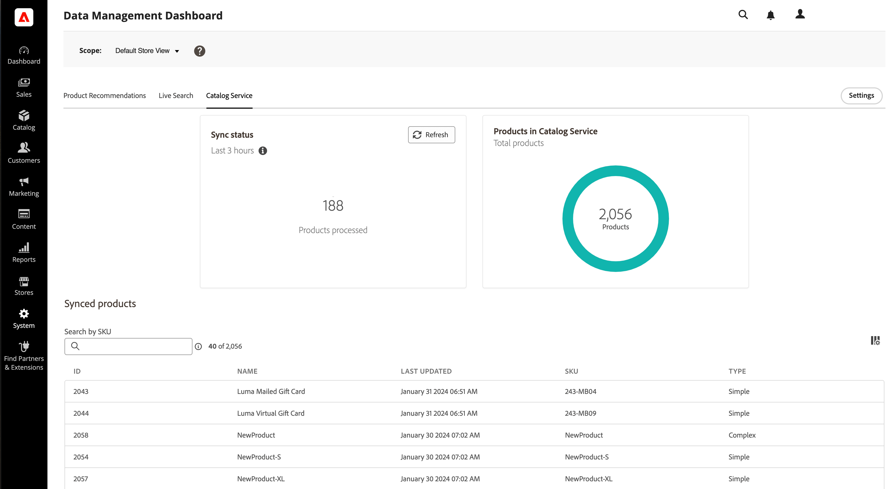

# Ver y administrar el proceso de sincronización

La mayoría de las actividades de sincronización se procesan automáticamente mediante la sincronización completa, la sincronización parcial o la reintento de la sincronización de elementos fallidos. Consulte [Tipos de sincronización](sync-overview.md#synchronization-types) para obtener detalles sobre cuándo se ejecuta cada tipo. [!DNL SaaS Data Export] también proporciona herramientas para supervisar, administrar y solucionar problemas del proceso. Puede ver el estado de sincronización y administrar el proceso de sincronización de datos mediante los paneles de la implementación.

>[!BEGINTABS]

>[!TAB Adobe Commerce]

Para implementaciones de Adobe Commerce en la nube, locales o de Adobe Commerce as a Cloud Service, vea y administre el proceso de sincronización desde estos recursos de administración de Commerce:

- **[Página de estado de sincronización de fuentes de datos](../optimizer/setup/data-sync.md)**: compruebe el estado de exportación de fuentes para implementaciones conectadas con [!DNL Live Search], [!DNL Product Recommendations] o [!DNL Catalog Service]. Este panel muestra el estado de exportación de la fuente de cada fuente, incluidos los errores encontrados. Una vista de detalles muestra el estado de exportación de las fuentes de los elementos de fuente individuales.

- **[Panel de administración de datos](https://experienceleague.adobe.com/en/docs/commerce-admin/systems/data-transfer/data-sync/data-dashboard)**: los usuarios administradores pueden ver y rastrear los datos que se han exportado y sincronizado correctamente con los servicios de Commerce conectados. Este panel muestra los datos del producto sincronizados con los servicios de Commerce.

>[!NOTE]
>
>El panel de administración de datos y la página de estado de sincronización de fuentes de datos solo están disponibles si tiene [!DNL Live Search], [!DNL Product Recommendations] o [!DNL Catalog Service] instalados.

>[!TAB Adobe Commerce con Commerce Optimizer]

Para implementaciones locales o en la nube de Commerce integradas con [!DNL Commerce Optimizer], vea y administre el proceso de sincronización con los siguientes recursos:

- **[Página de estado de sincronización de fuentes de datos](../optimizer/setup/data-sync.md)**: en los proyectos de Commerce que usan [!DNL Commerce Optimizer], compruebe la disponibilidad de los datos del catálogo para su tienda desde la página de estado de sincronización de fuentes de datos en [!DNL Commerce Optimizer]. Este panel muestra el estado de sincronización de las fuentes de exportación de datos.

- **[Página de sincronización de datos](../optimizer/setup/data-sync.md)**: La página de sincronización de datos ofrece una descripción general del estado de sincronización de los datos de producto procedentes del origen del catálogo ascendente a [!DNL Commerce Optimizer].

Para obtener más información sobre cómo usar estos paneles para comprobar que la sincronización de datos funciona y para resincronizar datos manualmente, consulte [Administrar sincronización](../aco-connector/data-sync-manage.md) en la _Guía del conector de Adobe Commerce Optimizer_.

>[!ENDTABS]

## Compruebe que la sincronización de datos funciona {#verify-that-the-data-sync-is-working}

Para comprobar que la sincronización de datos funciona, confirme que los datos exportados correctamente desde [!DNL Adobe Commerce] y que se entregaron correctamente al servicio conectado de Commerce. Utilice los paneles de la implementación para comprobar ambos pasos.

Comience con la exportación y confirme la entrega.

1. Compruebe el estado de sincronización en el Administrador de Commerce.

   Vaya a **[!UICONTROL System]** > **[!UICONTROL Data Transfer]** > **[!UICONTROL Data Feed Sync Status]**.

   {width="800" zoomable="yes"}

   Cuando se está ejecutando la sincronización, los datos de la fuente muestran los registros enviados correctamente. Seleccione una fuente para ver los detalles o solucionar problemas de sincronización.

1. Confirme que los datos se han enviado a los servicios conectados de Commerce.

   Desde Commerce Admin, vaya a **[!UICONTROL System]** > **[!UICONTROL Data Transfer]** > **[!UICONTROL Data Management Dashboard]**.

   {width="700" zoomable="yes"}

   Compruebe que aparecen los productos, precios y atributos esperados.

>[!TIP]
>
>Si tiene algún problema con la sincronización de datos, consulte [Revisar registros y solucionar problemas](troubleshooting/logging.md).

## Resincronizar datos manualmente

Cuando la sincronización parcial y los reintentos automáticos no resuelven los problemas de sincronización, puede volver a sincronizar manualmente los datos desde el administrador de Commerce o mediante los comandos CLI de Commerce. Las opciones disponibles dependen de la implementación.

### Opciones de resincronización manual disponibles {#manual-resync-options-commerce}

Utilice las siguientes opciones para resincronizar manualmente los datos de las fuentes.

| Tarea | Opción | Notas |
| --- | --- | --- |
| Resincronizar los elementos de fuente seleccionados con errores o problemas | **[!UICONTROL Data Feed Sync Status]página** | Monitorice y vuelva a sincronizar los elementos de fuente seleccionados desde el administrador de Commerce. Ver [Verificar que la sincronización de datos funcione](#verify-that-the-data-sync-is-working). |
| Sincronización completa de todas las fuentes | **[!UICONTROL Data Management Dashboard]** | Realice una resincronización completa de todas las fuentes desde el administrador de Commerce; Adobe recomienda esto principalmente al conectarse por primera vez a un servicio de Commerce. Ver [Verificar que la sincronización de datos funcione](#verify-that-the-data-sync-is-working). |
| Sincronización de fuentes de destino con control operativo | **CLI de Commerce** | Utilice el comando `saas:resync` para resincronizar fuentes de destino. Consulte [Sincronizar fuentes mediante la CLI de Commerce](data-export-cli-commands.md). |

>[!MORELIKETHIS]
>
> - [Funcionamiento de la sincronización](sync-overview.md): obtenga información acerca de los modos de sincronización, la sincronización completa, la sincronización parcial y los reintentos de elementos con errores.
> - [Sincronizar fuentes mediante la CLI de Commerce](data-export-cli-commands.md): use el comando `saas:resync` para resincronizar fuentes de destino.
> - [Revisar registros y solucionar problemas](troubleshooting/logging.md): Diagnostique errores de exportación de datos y SaaS.
> - [Administrar sincronización con [!DNL Commerce Optimizer]](../aco-connector/data-sync-manage.md): compruebe la sincronización de datos del catálogo y vuelva a sincronizar manualmente las fuentes de los conectores.

