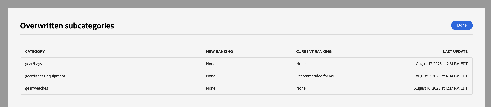

# Comercialización por categorías

La comercialización de categorías permite a los propietarios de tiendas aplicar [!DNL Live Search] reglas de clasificación inteligente [a las categorías y subcategorías de productos](rules.md).

Este vídeo es una introducción a la comercialización de categorías.

>[!VIDEO](https://video.tv.adobe.com/v/3424617)

Se accede a la funcionalidad en Administración en **Marketing** > SEO y búsqueda > **[!DNL Live Search]** > **Comercialización de categoría**.

>[!NOTE]
>
>La comercialización por categorías está disponible con [!DNL Live Search] [3.0.0 o superior](release-notes.md). Si ve el área de trabajo de comercialización de categorías pero no está rellenada con datos, actualice el módulo [!DNL Live Search].

La vista Comercialización de categorías muestra las reglas de categoría definidas, con columnas para:

* Categoría
* Estrategia de clasificación
* Clasificación heredada
* Última actualización
* Acción

Puede buscar una categoría o subcategoría en el campo &quot;Buscar por categoría&quot;.

## Estrategias de clasificación

La comercialización de categorías usa los mismos tipos de clasificación que con [productos individuales](rules-workspace.md).
Existen dos tipos de clasificación: Inteligente y Manual.

**La clasificación inteligente** aprovecha el análisis de datos de comportamiento de la tienda de [Adobe Sensei](https://www.adobe.com/sensei.html) para ordenar todos los productos dentro de las categorías elegidas según un algoritmo determinado. Una vez elegida una clasificación inteligente, se espera que el orden específico de los productos cambie con el tiempo, ya que Adobe Sensei reanaliza los datos subyacentes de forma continua. Por ejemplo, los productos de tendencias principales cambiarán automáticamente con el tiempo a medida que cambien las preferencias del comprador.
Los métodos de clasificación inteligentes son:

* Más comprados: clasifica los productos según la frecuencia con la que fueron comprados por los compradores en los siete días anteriores.
* Más añadidos al carro de compras: clasifica los productos según la frecuencia con la que los compradores los añadieron al carro de compras en los siete días anteriores.
* Más visitados: clasifica los productos según la frecuencia con la que fueron vistos por los compradores en los siete días anteriores.
* Recomendado para usted: en función del comportamiento previo y actual de cada comprador en el sitio, clasifica los productos según la probabilidad de que el comprador interactúe con cada uno.
* Tendencia: clasifica los productos según los recientes aumentos de popularidad basados en las vistas.
* Ninguno: clasifica los productos por su orden predeterminado.

**La clasificación manual** permite a los usuarios anular el orden automático de clasificación de productos al definir las reglas de anclaje, ampliación, eliminación y ocultación manuales.

## Clasificación heredada

Como comerciante, es posible que desee poder seleccionar todas las categorías de ropa de mujer para ordenarlas por &quot;tendencias&quot;. Esto incluye las subcategorías &quot;Pantalones de mujer&quot;, &quot;Camisas de mujer&quot; y &quot;Accesorios de mujer&quot;. Las categorías masculinas no deben verse afectadas. Puede utilizar clasificaciones heredadas para conseguirlo.

Al seleccionar un método de clasificación inteligente para una categoría o subcategoría que tiene subcategorías, puede activar la opción **Aplicar clasificaciones inteligentes a subcategorías**. Esto aplica el método de clasificación a todas las subcategorías.

Estas subcategorías ahora heredan esa regla de la categoría principal (&quot;Sí&quot; en la columna Clasificación heredada). En la columna Acción, las únicas opciones disponibles son **Editar regla** y **Ver detalles**. La opción **Delete** está deshabilitada para las reglas heredadas en subcategorías. Para eliminar la herencia de subcategorías es necesario deshacer la herencia de la categoría principal.

Cualquier categoría o subcategoría solo puede tener una clasificación inteligente aplicada a la vez. Es posible que también se hayan aplicado clasificaciones manuales adicionales.

Si aplica una clasificación inteligente a una categoría y activa la opción **Aplicar clasificación inteligente a las subcategorías**, se sobrescribirá cualquier clasificación inteligente que ya se haya aplicado a las subcategorías.

{width="700"}

Si hace clic en **Ver todo**, se abrirá un cuadro de diálogo con detalles de los cambios propuestos.

Al añadir una clasificación inteligente directamente a una categoría que tiene una clasificación inteligente heredada, la herencia se anula con la nueva clasificación inteligente.

Al eliminar la clasificación Inteligente de la categoría, se restablece la herencia.
En ambos casos, se mantiene cualquier clasificación manual.

Si elimina una clasificación inteligente de una categoría y se selecciona la herencia de subcategorías, solo se eliminan de las subcategorías las clasificaciones inteligentes heredadas. Las clasificaciones manuales no están sujetas a herencia y permanecerán.

Aparecerá un cuadro de diálogo que explica qué subcategorías heredadas se ven afectadas por los cambios realizados en una categoría de nivel superior.

{width="1200"}

## Crear una regla de categoría

Para crear una regla de categoría:

1. Haga clic en el botón **Agregar regla**.
1. En la vista _Seleccionar categoría_, haga clic en las categorías y subcategorías.
1. Seleccione la casilla de verificación para seleccionar la categoría que desea clasificar.
1. Haga clic en **Aplicar**.

   

1. En la vista _Agregar regla de categoría_, seleccione el método de clasificación inteligente que desee aplicar a la categoría.
La página de vista previa de categorías muestra los resultados reales de la clasificación seleccionada con los datos de Live Search.
1. Haga clic en **Guardar y publicar** para guardar la regla.

El servicio [!DNL Live Search] procesa la regla y la activa en el almacén cuando finaliza.

## Modificación de una regla de categoría

Para modificar una regla existente:

1. Haga clic en **...** en la columna Acción y elija **Editar**.
1. En la vista de regla Editar categoría, realice los cambios necesarios y haga clic en **Guardar y publicar**.

Los cambios se reflejarán en el almacén cuando [!DNL Live Search] haya procesado el cambio.

## Eliminar una regla de categoría

Para eliminar una regla de categoría:

1. Haga clic en **...** en la columna Acción y elija **Eliminar**.
1. En el modal _Eliminar regla_, seleccione **Eliminar** para eliminar la regla o **Cancelar** para cancelar la acción.

## Clasificación manual

La clasificación manual le permite anular el orden del producto determinado por las reglas de clasificación inteligente (si las hay) y controlar manualmente dónde aparecen los productos dentro de los resultados.

Los eventos son acciones que modifican los resultados de búsqueda cuando se cumplen las condiciones definidas. Una clasificación manual puede tener hasta 25 eventos.

* Ampliación: mueve un producto a una posición superior en los resultados de búsqueda.
* Enterrar: mueve un producto más abajo en los resultados de búsqueda.
* Anclar un producto: mueve un producto a una posición específica en los resultados.
* Ocultar un producto: excluye un producto de los resultados de búsqueda.

Cree una clasificación manual:

1. Configure una regla de clasificación inteligente para una categoría como se ha descrito anteriormente. Los resultados de la consulta aparecerán en la vista previa de página de categoría. Utiliza los datos reales de Live Search para obtener una vista previa de los resultados.

1. Haga clic y arrastre un producto en la vista Página de vista previa de categorías. Arrástrela y suéltela en la posición deseada. Los campos Producto y Posición se rellenan automáticamente en el panel Eventos.

También puede hacer clic en el icono de anclaje para anclar un producto a su ubicación actual. Utilice el menú contextual de los tres puntos para &quot;Anclar al principio&quot; o &quot;Anclar al final&quot;.

Para añadir manualmente un evento:

1. En Clasificación manual, haga clic en el menú **Seleccionar un evento** y elija un evento que tendrá lugar cuando se cumplan las condiciones asociadas.
1. Introduzca el nombre del producto al que desea aplicar el cambio. Los productos se sugieren a medida que escribe.
1. Para varios eventos, elija cualquier otro evento que desee almacenar en déclencheur cuando se cumplan las condiciones.
