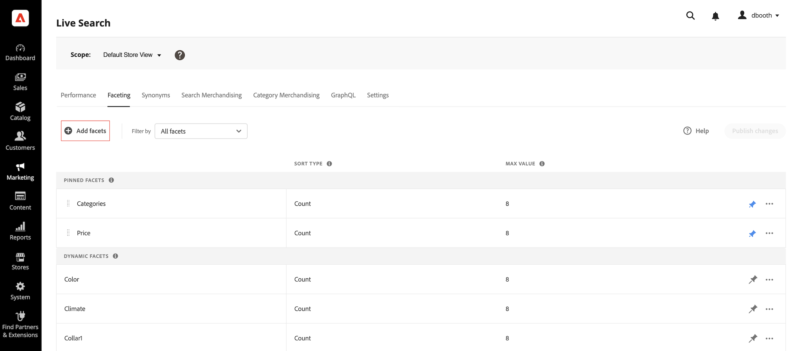
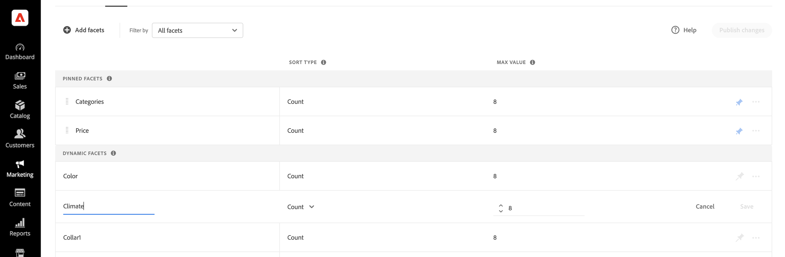
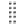

# Agregar facetas

Cualquier atributo de producto filtrable puede utilizarse como faceta. El panel *Agregar facetas* enumera las facetas actuales y facilita la asignación de atributos de producto adicionales como facetas. Durante este proceso de tres pasos, se elige un atributo para utilizarlo como faceta, las propiedades se editan si es necesario y los cambios se publican en la tienda.

## Paso 1: Añadir una faceta

1. En el Administrador, vaya a **Marketing** > SEO y búsqueda > **[!DNL Live Search]**.
1. En la ficha *Faceting*, haga clic en **Agregar facetas**.
1. En la lista *Agregar facetas*, cada atributo disponible tiene un  independiente. Complete cualquiera de las siguientes opciones:

   * En la lista *Atributos de facetas*, elija el atributo de producto que desee usar como faceta y haga clic en **Agregar**.
   * Para buscar un atributo de producto específico, escriba los primeros caracteres del nombre del atributo en el cuadro *Buscar*. A continuación, haga clic en **Agregar**.

     Para configurar intervalos y agrupaciones de facetas de precios, consulte [Configuración](settings.md). Para obtener más información, ve a [Tipos de facetas](facets-type.md).
La faceta se agrega al final de la lista *Facetas dinámicas* y el botón *Publicar cambios* pasa a estar disponible.

1. Si la faceta que desea agregar no se encuentra, vaya a **Tiendas** > Atributos > **Producto** y compruebe que el atributo tiene las [propiedades requeridas](facets.md) para utilizarlo como faceta. Si es necesario, actualice las siguientes propiedades de tienda del atributo:

   * Usar en la búsqueda: `No`
   * Usar en la navegación por capas de los resultados de búsqueda - `Yes`
   * Uso en la navegación por capas - `Filterable (with results)`

1. Cuando se le solicite, actualice la caché.

   La faceta estará disponible en la tienda la próxima vez que el catálogo se sincronice con [!DNL Live Search]. Si la faceta no está disponible después de dos horas, consulte [Sincronizar datos del catálogo](install.md#synchronize-catalog-data).

## Paso 2: Editar las propiedades de la faceta (opcional)

1. Para editar las propiedades de la faceta, haga clic en las opciones **Más** () en la columna del extremo derecho.
1. En el menú, haga clic en **Editar**. A continuación, ajuste las siguientes propiedades según sea necesario.

   * Etiqueta: ([Sin encabezado](facets-type.md) solamente) Escriba la etiqueta de faceta que desee usar.
   * Tipo de orden: las facetas se ordenan alfabéticamente en todas las tiendas de [!DNL Commerce]. En el caso de implementaciones sin encabezado, las facetas se pueden ordenar alfabéticamente o por recuento. Opciones: Alfabético, Recuento (solo sin encabezado)
   * Valor máximo: introduzca el número máximo de valores de faceta mostrados en la tienda. Entradas válidas: 0 - 100; Predeterminado: 8

1. Una vez finalizado, haga clic en **Guardar**.

   

1. Para fijar la faceta al principio de la lista *Filtros*, haga clic en la chincheta gris ().
1. Para cambiar el orden de la faceta anclada, haga clic en el icono **Mover** () y arrastre la fila a una nueva posición en la sección *Facetas ancladas*.

## Paso 3: Publicar cambios

1. Cuando finalice la faceta, haga clic en **Publicar cambios**.
1. Espere a que la faceta aparezca en la tienda.
Si la faceta no está disponible después de dos horas, consulte [Verificar exportación](install.md#synchronize-catalog-data) en las instrucciones de instalación.

## Descripciones de campos

| Campo | Descripción |
|--- |--- |
| Etiqueta | ([Sin encabezado](facets-type.md) solamente) La [etiqueta de faceta](facets-type.md) que está visible en la tienda se puede editar para mantener la coherencia con tu marca. |
| Tipo de orden | El método usado para [ordenar](facets-type.md) facetas. Todas las [!DNL Commerce] tiendas ordenan facetas solo alfabéticamente. Las implementaciones sin encabezado también se pueden ordenar por `Count`. Opciones: Alfabético: ordena las facetas alfabéticamente. Recuento: (solo sin encabezado) ordena las facetas según el número de coincidencias encontradas. |
| Valor máximo | Número máximo de valores que se pueden mostrar en la tienda para cada faceta. Las facetas que representan un rango de valores se distribuyen de forma uniforme. Entradas válidas: 0 - 100; Predeterminado: 8 |

### Controles

| Control | Descripción |
|--- |--- |
|  | Fija o libera una faceta al principio de la lista *Filtros*. |
|  | Muestra un menú de más acciones que se pueden aplicar a la faceta seleccionada. Opciones: Editar, Eliminar |
|  | Utilice el icono *Mover* para arrastrar una faceta anclada a otro lugar de la sección *Facetas ancladas*. |
