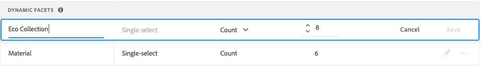
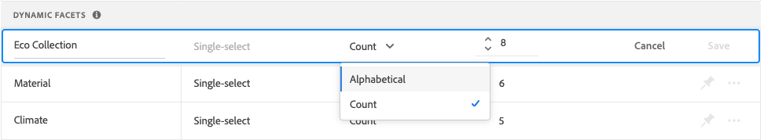

# Administrar facetas

Siga estas instrucciones para actualizar las propiedades de las facetas existentes o cambiar su presentación en la tienda.

## Configurar agrupaciones de facetas de precios

Consulta [Configuración](settings.md) para configurar los intervalos y agrupaciones de facetas de precios.

## Editar faceta

1. Busque la faceta que desee editar.
1. Si hay muchas facetas en la lista, establezca *Filtrar por* en una de las siguientes:

   * Anclado
   * Dinámico

   Para obtener más información, ve a [Tipos de facetas](facets-type.md).

   

1. Para editar las propiedades de la faceta, haga clic en **Más** (...) opciones.
1. Haga clic en **Editar**

   

1. Para editar la etiqueta de faceta, realice una de las siguientes acciones:

   * Para una tienda [!DNL Commerce], edite la [etiqueta de atributo](https://experienceleague.adobe.com/docs/commerce-admin/catalog/product-attributes/product-attributes.html?lang=es).
   * Para una implementación sin encabezado, haga clic en el valor de la primera columna y edite el texto según sea necesario.

   

1. (Solo sin encabezado) Para cambiar el método que se usa para ordenar los valores de faceta, haga clic en el valor de la columna *Tipo de orden* y elija una de las siguientes opciones:

   * Alfabético
   * Recuento

   

1. En la columna **Valor máximo**, establezca el número máximo (de 0 a 10) de valores de filtro de faceta que se mostrarán en la tienda.
1. Una vez finalizado, haga clic en **Guardar**.

   Los cambios no aparecerán en la tienda hasta que se publiquen.

## Fijar/desanclar faceta

El fijador cambia de color cuando se hace clic y se usa para mover la faceta a la sección *Facetas fijadas* o *Facetas dinámicas*.

1. Para anclar una faceta a la parte superior de la lista *Filtros*, busque la faceta en la lista *Facetas dinámicas* y haga clic en la chincheta gris ().

   El pin se volverá azul y la faceta se moverá a la sección *Facetas ancladas*.

1. Para desanclar una faceta, búsquela en la lista *Facetas ancladas* y haga clic en el pin azul ().

   La chincheta se volverá gris y la faceta pasará a la sección *Facetas dinámicas*.

   

>[!NOTE]
>
>El orden de facetas anclado puede ser incoherente si hay dos etiquetas con el mismo nombre.

## Mover faceta anclada

>[!NOTE]
>
>El orden de las facetas ancladas solo se admite en implementaciones sin encabezado. Si se necesitan facetas ordenadas, utilice el widget PLP [!DNL Live Search].

El orden de las facetas ancladas se puede cambiar moviendo la fila a una posición diferente. Las facetas ancladas tienen un icono *Mover* () al principio de la fila. A diferencia de las facetas ancladas, las facetas dinámicas no se pueden mover.

1. Busque la faceta en la sección *Facetas ancladas* de la lista.
1. Utilice el icono **Mover** () para arrastrar la fila a una nueva posición en la sección *Facetas ancladas*.

   Una vez publicados los cambios, las facetas reordenadas aparecerán en la lista de la tienda *Filtros*.

## Eliminar faceta

1. Busque la faceta en la lista y haga clic en **Más** (...) opciones.
1. Haga clic en **Eliminar**.
1. Cuando se le pida que confirme, haga clic en **Eliminar faceta**.
La faceta se eliminará de la tienda una vez publicados los cambios.

## Publicar cambios

1. Para actualizar la tienda con los cambios, haz clic en **Publicar cambios**.
1. Espera unos 15 minutos para que las actualizaciones aparezcan en tu tienda.
