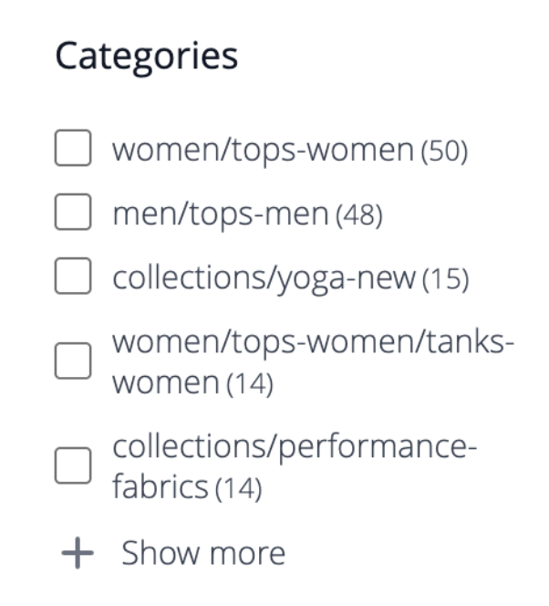

# Facetas

Las facetas son un método de filtrado de alto rendimiento que utiliza varias dimensiones de valores de atributo como criterios de búsqueda. La búsqueda con facetas es similar, pero considerablemente &quot;más inteligente&quot; que la navegación con capas estándar [y ](https://experienceleague.adobe.com/docs/commerce-admin/catalog/catalog/navigation/navigation-layered.html). La lista de filtros disponibles está determinada por los [atributos filtrables](https://experienceleague.adobe.com/docs/commerce-admin/catalog/catalog/navigation/navigation-layered.html#filterable-attributes) de los productos devueltos en los resultados de búsqueda.

[!DNL Live Search] usa la consulta `productSearch`, que devuelve facetas y otros datos específicos de [!DNL Live Search]. Consulte [`productSearch` consulta](https://developer.adobe.com/commerce/webapi/graphql/schema/live-search/queries/product-search/) en la documentación para desarrolladores para ver ejemplos de código.

Dentro de una faceta, los compradores pueden seleccionar varias opciones, como &quot;Básico&quot; y &quot;Cómodo&quot; en &quot;Estilo&quot;, y los resultados de la búsqueda se actualizan para mostrar solo esos estilos. Del mismo modo, si un comprador selecciona opciones en todas las facetas, como &quot;Básico&quot; en &quot;Estilo&quot; e &quot;Interior&quot; en &quot;Clima&quot;, los resultados de la búsqueda se actualizan para mostrar ese estilo seleccionado y ese clima seleccionado.

Cualquier faceta definida puede utilizarse como parámetro de URL y los resultados se filtrarán según los valores del parámetro: `http://yourstore.com?brand=acme&color=red`.

## Requisitos de faceteado

Los requisitos de atributos de categoría y producto para faceteado son similares a los atributos filtrables utilizados para la navegación por capas. Cada propiedad de tienda de un atributo debe tener el valor &quot;Usar en navegación por capas de resultados de búsqueda&quot; establecido en &quot;Sí&quot;. Puede revisar y actualizar la configuración del atributo desde el menú [!DNL Stores] > [!DNL Attribute] en Admin.

>[!NOTE]
>
>Si define una categoría de producto como una faceta, la faceta muestra el `url_path` de la categoría y la subcategoría.
>
>

Vea [límites y límites](./boundaries-limits.md#facets) para obtener más información acerca de los requisitos de faceta en [!DNL Live Search].

Si tiene un gran número de atributos con los que lidiar, considere la posibilidad de combinar atributos en un único &quot;metaatributo&quot;. Por ejemplo, los zapatos generalmente tienen tallas numéricas, mientras que las camisas suelen tener el tamaño &quot;S/M/L/XL&quot;. Estos dos tipos de tamaños se pueden combinar en un único atributo en el que se puede buscar.

| Configuración | Descripción |
|--- |--- |
| [Configuración de visualización de categoría](https://experienceleague.adobe.com/docs/commerce-admin/catalog/categories/create/categories-display-settings.html) | Anclaje - `Yes` |
| [Propiedades del atributo](https://experienceleague.adobe.com/docs/commerce-admin/catalog/product-attributes/create/attribute-product-create.html) | [Tipo de entrada de catálogo](https://experienceleague.adobe.com/docs/commerce-admin/catalog/product-attributes/attributes-input-types.html) - `Yes/No`, `Dropdown`, `Multiple Select`, `Price`, `Visual swatch` (solo widget), `Text swatch` (solo widget) |
| Propiedades de tienda de atributos | Usar en la navegación por capas de los resultados de búsqueda - `Yes` |

## Agregación de facetas

La agregación de facetas se realiza de la siguiente manera: si la tienda tiene tres facetas (categorías, color y precio) y el comprador filtra las tres (color = azul, el precio va de 10,00 a 50,00 $, categorías = `promotions`).

* Agregación `categories`: agrega `categories` y, a continuación, aplica los filtros `color` y `price`, pero no el filtro `categories`.
* Agregación `color`: agrega `color` y, a continuación, aplica los filtros `price` y `categories`, pero no el filtro `color`.
* Agregación `price`: agrega `price` y, a continuación, aplica los filtros `color` y `categories`, pero no el filtro `price`.
