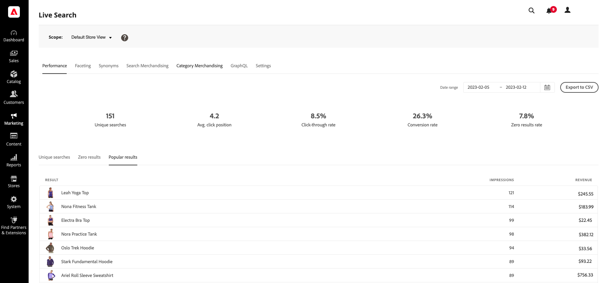

# Rendimiento

El área de trabajo *Rendimiento* proporciona insight a los términos de búsqueda que usan los compradores. La información se puede utilizar para identificar tendencias, aumentar los clics y mejorar la tasa de conversión. El espacio de trabajo Rendimiento proporciona una instantánea de las métricas de búsqueda para un intervalo de fechas específico e incluye los siguientes informes:

* Búsquedas únicas
* Cero resultados
* Resultados frecuentes

También puede consultar el [Tablero de administración de datos](https://experienceleague.adobe.com/docs/commerce-admin/systems/data-transfer/data-sync/data-dashboard.html?lang=es) para obtener más datos sobre la sincronización de datos.

>[!NOTE]
>
>El espacio de trabajo de rendimiento se actualiza cada 12 horas.

## Ver un informe

1. Para escribir **Intervalo de fechas**, haga clic en el calendario () y realice una de las siguientes acciones:

   * Para especificar una sola fecha, haga doble clic en la fecha del calendario.
   * Para especificar un intervalo de fechas, haga clic en la primera y en la última fecha del calendario.

>[!NOTE]
>
>El intervalo de fechas no puede superar un año.

## Descripciones de campos

| Datos de instantánea | Descripción | Ejemplo de cálculo |
|--- |--- |--- |
| Búsquedas únicas | Número total de búsquedas únicas para el intervalo de fechas especificado. Varias búsquedas realizadas por el mismo comprador, incluso si se refieren a la misma consulta, se consideran únicas si se envían con más de una hora de diferencia. | **Ejemplo:**  Búsquedas: - &quot;pantalones&quot; a las 10:00 AM - &quot;pantalones&quot; a las 10:30 AM (dentro de 1 hora no → únicos) - &quot;pantalones&quot; a las 12:00 PM (después de 1 hora → únicos) - &quot;camisa&quot; a las 1:00 PM   **Búsquedas únicas totales = 3** |
| Tasa de clics | El porcentaje de búsquedas que finalizan cuando el comprador hace clic en un producto. Por ejemplo, la tasa de clics es del 50 % si el comprador busca &quot;pantalones&quot; y &quot;camisa&quot; y luego hace clic en un resultado de la búsqueda &quot;camisa&quot;. | **Fórmula:**  Tasa de pulsaciones = Búsquedas con ≥1 clic ÷ Total de búsquedas únicas   **Ejemplo:**  Total de búsquedas únicas = 4 Búsquedas con al menos un clic = 2  CTR = 2 ÷ 4 = **50%** |
| Tasa de conversión | El porcentaje de productos que compra el comprador en comparación con el número de productos en los que hace clic para el intervalo de fechas especificado. Por ejemplo, la tasa de conversión de la interacción es del 100 % si el comprador ve seis productos en la ventana emergente, hace clic en uno y realiza una compra.   La tasa de conversión no se ve afectada por el número de vistas de un producto determinado. Por ejemplo, la tasa de conversión sigue siendo la misma si el comprador utiliza la búsqueda, pero no hace clic en ningún producto. | **Fórmula:**  Tasa de conversión = Productos totales comprados ÷ Productos totales en los que se hizo clic   **Ejemplo 1:**  Productos en los que se hizo clic = 5 Productos comprados = 2  CVR = 2 ÷ 5 = **40%**  **Ejemplo 2 (agregación de 5 horas):**  Clics por hora: 4, 5, 6, 10, 2 Compras por hora: 1, 3, 0, 4, 1  Clics totales = 4 + 5 + 6 + 10 + 2 = 27  Compras totales 3 + 0 + 4 + 1 = 9  CVR = 9 ÷ 27 = **33,33 %** |
| Tasa de resultados cero | Porcentaje de búsquedas únicas que no devuelven resultados para el intervalo de fechas especificado. Por ejemplo, la tasa de resultados cero es del 66,67 % si el comprador busca &quot;fjjajfjfjf&quot; dos veces (sin resultados) y &quot;pantalones&quot; una vez (con resultados). | **Fórmula:**  Tasa de resultados cero = Búsquedas únicas con resultados cero ÷ Total de búsquedas únicas   **Ejemplo:**  Total de búsquedas únicas = 3 Búsquedas con resultados cero = 2  Tasa de resultados cero = 2 ÷ 3 = **66,67%** |
| El Promedio de posición del clic | La posición relativa de la tasa promedio de pulsaciones basada en búsquedas únicas para el intervalo de fechas especificado. | **Fórmula:**  Posición de clic promedio = Suma de posiciones de clic ÷ Clics totales   **Ejemplo:**  Clics en posiciones: 1, 3, 2  Posición de clic promedio = (1 + 3 + 2) ÷ 3 = **2** |

| Informes | Descripción |
|--- |--- |
| Búsquedas únicas | Enumera las consultas de búsqueda únicas utilizadas durante el intervalo de fechas especificado. Los datos del informe se calculan del mismo modo que los datos de instantáneas de búsqueda única. Si un comprador escribe la misma consulta de búsqueda dos veces, pero con una diferencia de más de una hora, la búsqueda se considera dos búsquedas únicas.  **Límite de informes:** 500 términos principales al generar el archivo CSV. |
| Cero resultados | Enumera las consultas de búsqueda que no devuelven resultados y la cantidad de veces utilizadas durante el intervalo de fechas especificado.  **Límite de informes:** 500 términos principales al generar el archivo CSV. |
| Resultados frecuentes | Enumera los nombres de los productos que recibieron la mayor cantidad de vistas durante el intervalo de fechas especificado. Los resultados populares se calculan únicamente en función de las impresiones y no se ven afectados por el número de clics o ingresos generados.  **Límite de informes:** 500 términos principales al generar el archivo CSV. |
