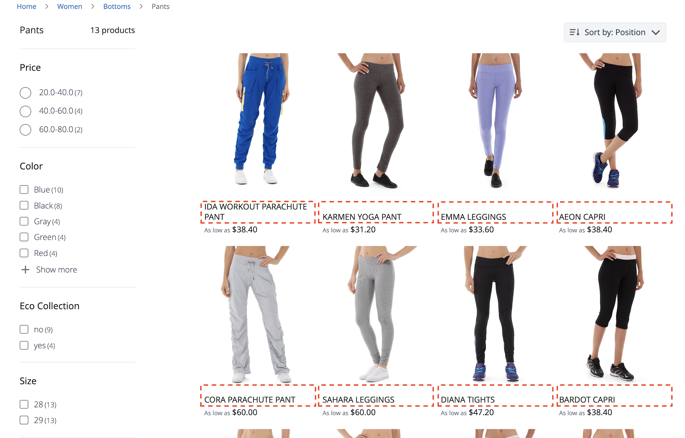

# Widget de página de lista de productos

[!DNL Live Search Product Listing Page Widget] (PLP) utiliza la plataforma de servicios de Commerce para proporcionar una página de lista de productos con rendimiento, en la que se pueden realizar búsquedas y facetas. En este tema se describe cómo habilitar y aplicar estilo al widget PLP.

## Activación del widget PLP

Cuando se instala el servicio [!DNL Live Search], la funcionalidad de búsqueda predeterminada se convierte automáticamente en [!DNL Live Search].

El widget PLP [!DNL Live Search] está habilitado de manera predeterminada para las nuevas instalaciones.

Si está actualizando [!DNL Live Search] y el widget PLP ya se ha desactivado, seguirá siéndolo.

>[!NOTE]
>
>Si está migrando desde el adaptador de búsqueda obsoleto, consulte la [guía de migración](migrate-to-plp.md) para obtener instrucciones detalladas sobre escenarios, requisitos previos e instrucciones paso a paso.

Para activar el widget PLP:

1. En el administrador de Adobe Commerce, vaya a Configuración de → de configuración de → de tiendas.
1. En el panel de navegación izquierdo, haga clic en **[!UICONTROL Live Search]** > **[!UICONTROL Storefront Features]**.
1. Haga clic en la sección [!UICONTROL Storefront Features].
1. Set [!UICONTROL Enable Product Listing Widget] = Sí
1. Guardar configuración
1. Si se le solicita, vacíe la caché ( vaya a Sistema > Herramientas > Administración de caché > [!UICONTROL Flush Magento Cache]).

>[!IMPORTANT]
>
>Cuando [!DNL Live Search Product Listing Page Widget] está habilitado, no se puede cambiar la dirección del criterio de ordenación en una página de lista de productos.

## Funciones de widget

El widget PLP proporciona las siguientes funciones integradas:

- Botones Añadir al carrito: disponible solo para productos simples.
- Varias imágenes por producto: la imagen puede cambiar cuando se elige un color diferente para un producto configurable.
- Compatibilidad con muestras de color: tenga en cuenta que el atributo de color debe escribirse `color` para que el código se valide correctamente.

### Personalización del widget

Además de las funciones integradas del widget PLP, puede personalizarlo aún más para incluir las siguientes funciones:

- Filtrado por atributos
- Compatibilidad con varios idiomas
- Reguladores de precios

Para obtener información sobre cómo personalizar el widget PLP para que administre las funciones anteriores, consulte el archivo léame `storefront-product-listing-page` en el siguiente [repositorio](https://github.com/adobe/storefront-product-listing-page/). El archivo léame de este repositorio proporciona un ejemplo de cómo personalizar el widget PLP e implementar esas personalizaciones en el sitio.

>[!WARNING]
>
>Si personaliza el widget PLP mediante el código disponible en el repositorio, usted es responsable del mantenimiento y de las actualizaciones necesarias. Cualquier nueva función del widget PLP que publique Adobe podría ser incompatible con su implementación personalizada.

## Ejemplo de estilo

Puede personalizar el aspecto del widget PLP para que coincida con su sitio mediante [CSS](https://developer.adobe.com/commerce/frontend-core/guide/css/).

>[!NOTE]
>
>Los elementos con clases personalizadas dentro de una temática de Adobe Commerce no se heredan. Estos elementos deben estar dirigidos por su clase específica para que coincidan con las clases personalizadas; las clases de acción principales no funcionarán en un botón de widget. Se heredan los elementos de destino genéricos dentro de CSS; `button` se aplica a los botones del widget.

Los divs resaltados contienen la clase de destino `ds-sdk-product-item__product-name`.


Personalice el nombre del producto añadiendo una regla para que esté en mayúsculas.

```css
.ds-sdk-product-item__product-name {
 text-transform: uppercase;
}
```



## Clases CSS

### Lista de productos

- `.ds-sdk-product-list`: div externo
- `.ds-sdk-product-list__grid`: div interno


#### Paginación de lista de productos

- `.ds-plp-pagination`


- `.ds-plp-pagination_item`


- `.ds-plp-pagination_item--current`


### Widgets

- `.ds-widgets`: div externo
- `.ds-widgets__actions`: div interior del lado izquierdo
- `.ds-widgets__results`: div interior del lado derecho


### Lista desplegable Ordenar

- `.ds-sdk-sort-dropdown`


- `.ds-sdk-sort-dropdown__button`


- `.ds-sdk-sort-dropdown__items`


- `.ds-sdk-sort-dropdown__items--item`


- `.ds-sdk-sort-dropdown__items--item-selected`


- `.ds-sdk-sort-dropdown__items--item-active`


### Facetas

- `.ds-plp-facets`
- `.ds-plp-facets__header`
- `.ds-plp-facets__header_title`
- `.ds-plp-facets__header__clear-all`

{width="350"}

- `.ds-plp-facets__pills`
- `.ds-sdk-pill`

{width="350"}

- `.ds-sdk-pill__label`
- `.ds-sdk-pill__cta`

{width="350"}

- `.ds-plp-facets__list`

{width="350"}

- `.ds-sdk-input`
- `.ds-sdk-input__label`
- `.ds-sdk-product-item__product-swatch-group`
- `ds-sdk-product-item__product-swatch-item`
- `.ds-sdk-input_fieldset_show-more`


- `.ds-sdk-labelled-input`


- `.ds-sdk-labelled-input__input`
- `.ds-sdk-labelled-input__label`


### Elemento de producto

- `.ds-sdk-product-item`
- `.ds-sdk-product-item__image`
- `.ds-sdk-product-item__product-name`
- `.ds-sdk-product-item__product-options`
- `.ds-sdk-product-price`
   - `.ds-sdk-product-price--no-discount`
   - `.ds-sdk-product-price--grouped`
   - `.ds-sdk-product-price--bundle`
   - `.ds-sdk-product-price--discount`


### Cargando

- `.ds-sdk-loading`
- `.ds-sdk-loading__spinner`
- `.ds-sdk-loading__spinner-label`


## Desactivación del widget PLP

Para desactivar el widget PLP:

1. Vaya a **Tiendas** > Configuración > **Configuración** > **[!DNL Live Search]** > **Características de la tienda** y establezca **Habilitar widgets de lista de productos** en &quot;No&quot;.
1. Seleccione **Guardar configuración** para guardar la configuración.
