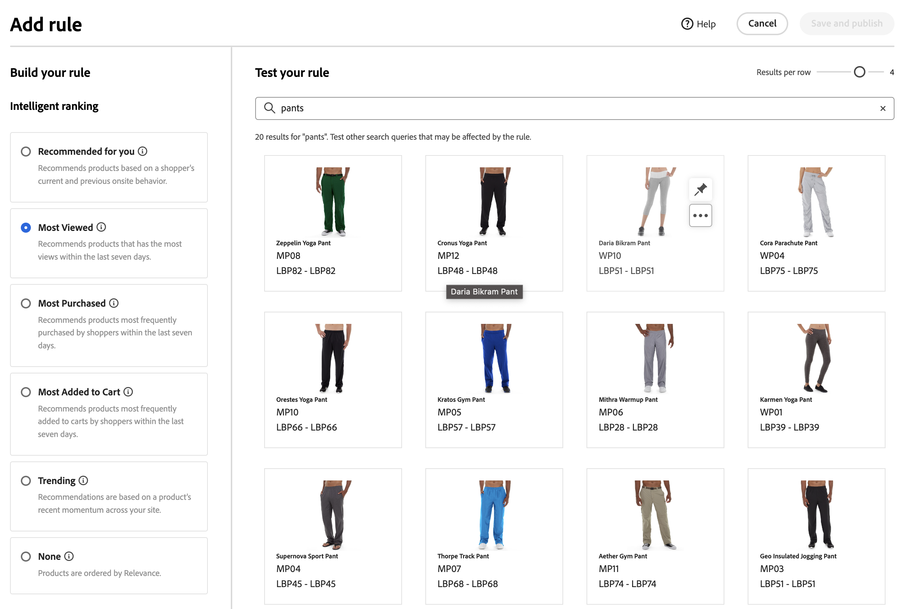

# Añadir reglas

Para generar una regla, el primer paso es utilizar el editor de reglas para definir las condiciones en el texto de consulta del comprador que almacenan en déclencheur los eventos asociados. A continuación, complete los detalles de la regla, pruebe los resultados y publique la regla.

## Añadir una regla

1. En el Administrador, vaya a **Marketing** > SEO y búsqueda > **[!DNL Live Search]**.
1. Establezca **Scope** para identificar la [vista del almacén](https://experienceleague.adobe.com/docs/commerce-admin/start/setup/websites-stores-views.html#scope-settings) donde se aplica la regla.
1. Haga clic en el área de trabajo **Buscar comercialización**.
1. Haga clic en **Agregar regla** para iniciar el editor de reglas.

## Tipo de regla

Una consulta de búsqueda es donde se define un término de búsqueda, condiciones y tipos de clasificación específicos.

Se puede establecer una regla predeterminada que se aplique a todas las consultas, a menos que se defina una consulta de búsqueda más específica. Solo se puede establecer una regla predeterminada que no puede contener ninguna condición. Si selecciona Predeterminado, no se muestra la interfaz Conditions.
Elija el tipo de clasificación inteligente predeterminado y cualquier clasificación manual que desee aplicar a todas las búsquedas predeterminadas. Las clasificaciones manuales siempre se aplican.

## Condiciones

Las condiciones son los requisitos para almacenar en déclencheur un evento. Una regla puede tener hasta diez condiciones y 25 eventos. Una regla predeterminada no puede tener ninguna condición.

>[!NOTE]
>
>Actualmente, no es posible segmentar reglas para un grupo de clientes específico.

### Condición única

1. En *Generar la regla*, seleccione la **condición** que se debe cumplir y siga las instrucciones para completar la instrucción.

   * La consulta de búsqueda contiene: introduzca la cadena de texto que debe estar en la consulta del comprador. La configuración Coincidencia determina el grado de coincidencia de la consulta del comprador con el catálogo. Opciones:  Cualquiera: cualquier parte del texto de consulta del comprador puede coincidir con la condición. Todo: toda la consulta del comprador debe coincidir con la condición.
   * La consulta de búsqueda es: introduzca una cadena de texto que coincida exactamente con la consulta del comprador. Por ejemplo: &quot;pantalones de yoga&quot;. Las reglas con `Search query is` y Coincidencia `All` solo pueden tener una condición.
   * La consulta de búsqueda comienza con: introduzca un carácter o cadena de texto que debe estar al principio de la consulta del comprador.
   * La consulta de búsqueda termina con: introduzca un carácter o cadena de texto que debe estar al final de la consulta del comprador.

   Los resultados aparecen inmediatamente en el panel *Probar la regla* y están numerados por prioridad. Puede usar el control deslizante *Resultados por fila* en la parte superior    derecho para cambiar el número de productos en cada fila.

   

1. Para probar otras consultas, cambia el texto de la consulta en el cuadro de búsqueda *Probar la regla* y pulsa **Devolver**.
Inicialmente, el panel de prueba procesa la consulta desde el cuadro de búsqueda Condiciones. Pero ahora está procesando la consulta desde el cuadro de consulta de prueba. El panel de prueba procesa solo una consulta a la vez.
1. Si te gusta el resultado, actualiza el texto en el cuadro de búsqueda *Condiciones*. A continuación, haga clic en cualquier lugar de la página para actualizar los resultados en el panel de pruebas.
1. Para generar una regla simple con una condición, vaya al paso 3: [Agregar eventos](#events).

### Varias condiciones

1. Para generar una regla con varias condiciones, haga clic en **Agregar condición**.
Una regla puede tener hasta diez condiciones. El operador lógico que une dos condiciones se basa en la configuración actual de *Match*. De manera predeterminada, *Match* es `All` y el operador lógico es `AND`.

1. Seleccione la segunda condición e introduzca el texto de consulta requerido.

1. Para cambiar la lógica de la regla, cambie la configuración **Match** para determinar en qué medida los criterios de búsqueda del comprador deben coincidir con la condición de consulta. Establezca **Match** en una de las siguientes opciones:

   * Cualquiera - (predeterminado) Todos los operadores lógicos de la regla están configurados en `OR` y los resultados aparecen en el panel de prueba.
   * Todos: todos los operadores lógicos de la regla están configurados en `AND` y los resultados aparecen en el panel de prueba.

   El valor *Match* determina el operador lógico que se usa para unir varias condiciones. Si se cambia la configuración *Match*, se cambiarán todos los operadores lógicos de la regla. No es posible combinar `AND` y `OR` en la misma regla.

   En este ejemplo, en lugar de buscar &quot;pantalones de yoga&quot;, hay dos consultas independientes que buscan &quot;yoga&quot; o &quot;pantalones&quot;. Esta regla es menos específica y se activa con más frecuencia en la tienda que la otra.

   

1. Para agregar otra condición, haga clic en **Agregar condición** y repita el proceso.

## Clasificación inteligente

La clasificación inteligente combina los comportamientos de los usuarios y las estadísticas del sitio para determinar la clasificación del producto.
Los propietarios de tiendas pueden configurar los siguientes tipos de estrategias de clasificación:

* Más comprados: esto clasifica los productos según el total de compras por SKU en los 7 días anteriores.
* Más añadidos al carro de compras: clasifica en orden del total de actividades &quot;Agregar al carro de compras&quot; en los 7 días anteriores.
* Más visitados: Clasifica el total de vistas por SKU en los 7 días anteriores.
* Recomendado para usted: utiliza el punto de datos `viewed-viewed` . Los compradores que vieron este SKU también vieron estos otros SKU.
* Tendencia: revisa los eventos de vista de página de las últimas 72 horas para los eventos en segundo plano y 24 horas para los eventos en primer plano.
* Ninguno: los productos se ordenan por relevancia.

Seleccione el tipo de estrategia para la regla. La ventana **Probar la regla** muestra los resultados esperados.

### Advertencias

* Los apóstrofos y las citas en las consultas pueden llevar a algunos problemas menores con clasificación y relevancia en algunos idiomas.
* Para asegurarse de que la clasificación inteligente funciona correctamente, asegúrese de que **Peso de búsqueda** para cualquier atributo de producto que se utilice para la búsqueda o el filtrado (facetas) sea `5` o menos. Para encontrar esta configuración en el administrador de [!DNL Commerce]:

   1. Seleccione **Tiendas** > _Atributos_ > **Producto**.
   1. Busque el atributo como, por ejemplo, &quot;nombre&quot;.
   1. En la página **Información de atributo** > **Propiedades de tienda**, establezca el valor de la búsqueda en `5` o menos.

      

## Clasificación manual

La clasificación manual (anteriormente denominada Eventos) es una acción que modifica los resultados de la búsqueda cuando se cumplen las condiciones definidas. Una sola regla puede tener hasta 25 eventos.

* Ampliación: mueve un producto a una posición superior en los resultados de búsqueda.
* Entierro: mueve un SKU a una posición inferior en los resultados de búsqueda.
* Fijar un producto: el producto se muestra en la &quot;posición&quot; seleccionada en la página.
* Ocultar un producto: excluye un SKU de los resultados de búsqueda.

La forma más sencilla de anclar un producto es arrastrando y soltando.

1. Haga clic y arrastre un producto en el panel Prueba. Arrástrela y suéltela en la posición deseada. Los campos Producto y Posición se rellenan automáticamente en el panel Eventos.

   

También puede hacer clic en el icono de anclaje para anclar un producto a su ubicación actual. Utilice el menú contextual de los tres puntos para &quot;Anclar al principio&quot; o &quot;Anclar al final&quot;.

>[!NOTE]
>
>Solo puede anclar productos que se devuelven en la consulta.

O los eventos se pueden configurar manualmente:

1. En *Eventos*, elija el **Evento** que se llevará a cabo cuando se cumplan las condiciones asociadas.

   Por ejemplo, elija `Hide a product`. A continuación, introduzca el nombre del producto que desea ocultar. Los productos se sugieren a medida que escribe.

1. Para varios eventos, elija cualquier otro evento que desee almacenar en déclencheur cuando se cumplan las condiciones.

## Detalles adicionales

La información que se escribe aquí aparece en el panel [Detalles de regla](rules-workspace.md).

1. En *Detalles*, escriba un **Nombre** para la regla. Todos los nombres de reglas deben ser únicos.
1. Escriba una **descripción** breve de la regla.
1. Escriba **Fecha de inicio** y **Fecha de finalización** para que la regla esté activa o elija las fechas del calendario.

   Para seleccionar un rango de fechas, haga clic en la primera fecha y arrastre para seleccionarlo.

   

## Finalización de la regla

1. Examine los resultados de la regla en el panel de prueba.
1. Si la regla tiene varias consultas, pruebe cada una de ellas que pueda verse afectada por la regla.
1. Una vez finalizado, haga clic en **Guardar y publicar**.

   La regla se agrega a la lista del área de trabajo *Reglas*.

1. Aunque las reglas activas entran en vigor inmediatamente, es posible que tenga que esperar hasta 15 minutos para que se actualicen los resultados de la consulta en caché en la tienda.

>[!NOTE]
>
>Las reglas y los productos clasificados manualmente se aplican a los resultados de búsqueda cuando se selecciona el orden predeterminado, &quot;Ordenar por: Más relevante&quot;. Si un comprador cambia el criterio de ordenación a algo como ordenar por nombre o precio, las reglas y las clasificaciones manuales ya no están en vigor.

## Descripciones de campos

### Condiciones (si)

| Condición | Descripción |
|--- |--- |
| La consulta de búsqueda contiene | Un carácter o cadena de texto que se incluye en la consulta del comprador. La consulta del comprador debe coincidir con un solo carácter para cumplir esta condición. |
| La consulta de búsqueda es | Carácter o cadena de texto que coincide exactamente con la consulta del comprador. Las consultas complejas con varias condiciones no se pueden crear cuando se utiliza esta condición. |
| La consulta de búsqueda comienza con | La consulta del comprador comienza con este carácter o cadena de texto. |
| La consulta de búsqueda termina con | La consulta del comprador termina con este carácter o cadena de texto. |

### Operadores lógicos

| Operador | Descripción |
|--- |--- |
| O | (Predeterminado) El operador lógico `OR` compara dos condiciones y cumple los requisitos para almacenar en déclencheur un evento si al menos una condición es verdadera. |
| Y | El operador lógico `AND` compara dos condiciones y cumple los requisitos para almacenar en déclencheur un evento si ambas condiciones son verdaderas. |

### Operadores de coincidencia

| Operador | Descripción |
|--- |--- |
| Cualquiera | Cambia todos los operadores lógicos de la regla a `OR` y devuelve el conjunto de productos coincidentes. |
| Todo | Cambia todos los operadores lógicos de la regla a `AND` y devuelve el conjunto de productos coincidentes. |

### Clasificación manual

| Evento | Descripción |
|--- |--- |
| Aumentar | Mueve un SKU o un rango de SKU a una posición superior en los resultados de búsqueda. Cada uno está marcado con un distintivo de vista previa &quot;potenciado&quot; en los resultados de búsqueda de la prueba. |
| Enterrar | Mueve un SKU o un rango de SKU más abajo en los resultados de búsqueda. Cada uno está marcado con un distintivo de vista previa &quot;enterrado&quot; en los resultados de búsqueda de la prueba. |
| Fijar un producto | Adjunta un único SKU a una posición específica en los resultados de búsqueda. El producto está marcado con un distintivo de vista previa &quot;anclado&quot; en los resultados de búsqueda de la prueba. |
| Ocultar un producto | Excluye un SKU o un rango de SKU de los resultados de búsqueda. |

### Detalles

| Campo | Descripción |
|--- |--- |
| Nombre | Nombre de la regla. Los nombres de las reglas deben ser únicos. |
| Tipo de regla | Predeterminado o Consulta. El valor predeterminado se aplica a todas las reglas, a menos que se defina una regla de consulta más específica. |
| Fecha de inicio | La fecha de inicio de la regla, si está programada. |
| Fecha de finalización | La fecha de finalización de la regla, si está programada. |
| Descripción | Breve descripción de la regla. |
