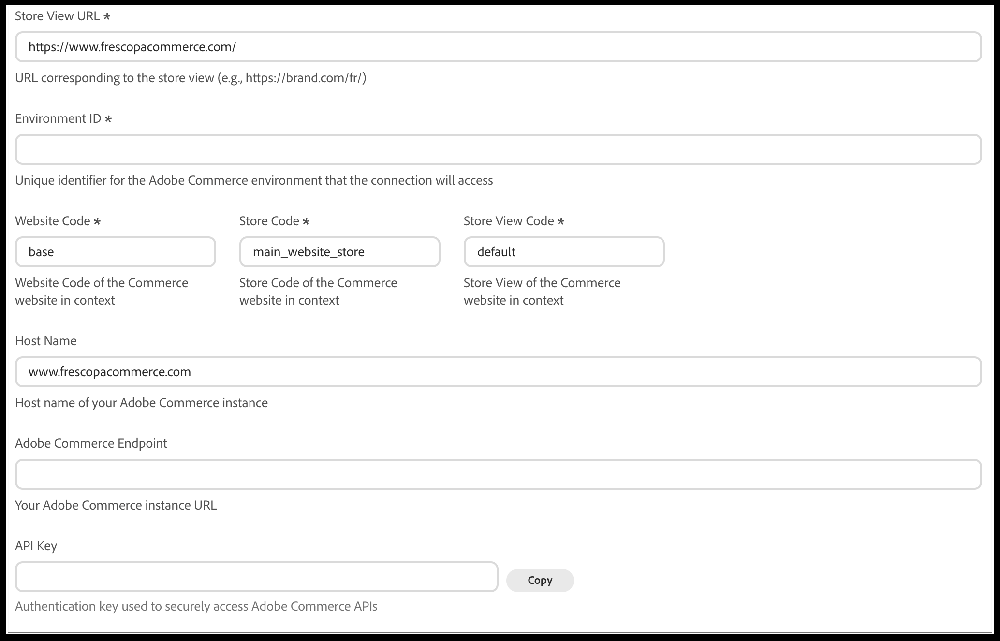

# Conectar [!DNL Adobe Commerce] a [!DNL Adobe LLM Optimizer]

>[!IMPORTANT]
>
>El acceso a esta integración está restringido. Póngase en contacto con el administrador de cuentas técnico para obtener más información.

Este artículo explica cómo conectar el catálogo [!DNL Adobe Commerce] disponible para LLM Optimizer.

>[!NOTE]
>
>Este artículo se centra en la parte de Commerce de la integración. Para obtener información general acerca de LLM Optimizer, consulte la [documentación del producto LLM Optimizer](https://experienceleague.adobe.com/es/docs/llm-optimizer/using/home).

## Habilitar los servicios de Commerce necesarios {#enable-commerce-services}

Póngase en contacto con el administrador de Commerce o con su socio de implementación para asegurarse de lo siguiente:

- Los datos de catálogo que LLM Optimizer debe leer se **exportan o sincronizan** según su arquitectura (incluido cualquier exportador o conector de datos SaaS de su implementación).
- El acceso a la API, las credenciales y las direcciones URL del entorno (zona protegida frente a producción) coinciden con el **inquilino** que planea usar en LLM Optimizer.

## Configuración de la conexión de Commerce en LLM Optimizer {#configure-commerce-connection}

**Para configurar la conexión de Commerce:**

1. En la interfaz de usuario de [!DNL Adobe LLM Optimizer], abra **Configuración del cliente** y, a continuación, seleccione la pestaña **[!UICONTROL Commerce]**.

   

1. Haga clic en **[!UICONTROL Add Store View]** para crear una fila nueva o expanda una entrada de la vista de tienda existente para editarla.
1. Escriba **[!UICONTROL Store View URL]** (obligatorio).

   Utilice la dirección URL de la tienda para esa vista de tienda, incluido cualquier prefijo de configuración regional o de ruta de acceso (por ejemplo, `https://brand.example.com/` o `https://brand.example.com/fr/`).

1. Escriba **[!UICONTROL Environment ID]** (obligatorio): el identificador del entorno de Adobe Commerce al que LLM Optimizer debe conectarse.
1. Escriba **[!UICONTROL Website Code]**, **[!UICONTROL Store Code]** y **[!UICONTROL Store View Code]** (obligatorio).

   Estos valores deben coincidir con los códigos del administrador de Commerce para el sitio web, la tienda y la vista de tienda a los que se conecte.

1. Opcional: escriba **[!UICONTROL Host Name]** con el nombre de host de su instancia de Commerce (por ejemplo, `www.example.com`) si ese valor es diferente de la dirección URL.
1. Escriba **[!UICONTROL Adobe Commerce Endpoint]**: la dirección URL base de la instancia de Adobe Commerce que se usa para el acceso a la API.
1. Escriba o pegue el(la) **[!UICONTROL API Key]** utilizado(a) para autenticar solicitudes en las API de Commerce.

   Haga clic en **[!UICONTROL Copy]** al lado del campo si necesita copiar la clave en otro lugar de forma segura.

1. Haga clic en **[!UICONTROL Save]** para almacenar la configuración.

Después de guardar, espere a que se complete cualquier **sincronización inicial** o trabajo de validación antes de depender de los resultados del catálogo o de la auditoría para esa vista de almacén.

Para quitar una configuración de vista de tienda, abra esa entrada y haga clic en **[!UICONTROL Delete]**.

### Descripciones de campos {#commerce-connection-fields}

| Campo | Descripción |
| --- | --- |
| URL de vista de tienda | La dirección URL pública de la LLM Optimizer de vista de tienda debe tratarse como en el ámbito de los flujos de trabajo de catálogo y auditoría. |
| ID de entorno | Identificador de entorno de Commerce (de la documentación de nube o implementación o del administrador, según corresponda). |
| Código del sitio web | Commerce **[!UICONTROL Website Code]** para el sitio web propietario del catálogo. |
| Código de tienda | Commerce **[!UICONTROL Store Code]** para la tienda de ese sitio web. |
| Código de vista de tienda | Commerce **[!UICONTROL Store View Code]** para la vista de tienda (por ejemplo, `default`). |
| Nombre de host | Nombre del host de la tienda o instancia de Commerce cuando el formulario lo solicita además de otras direcciones URL. |
| Punto final de Adobe Commerce | URL de instancia que utiliza LLM Optimizer para llegar a las API de Commerce. |
| Clave de API | Clave secreta para la autenticación de API; trátela como cualquier credencial de producción. |

## Confirmar la preparación del inquilino y el entorno {#confirm-tenant-readiness}

- Compruebe que los proyectos de **sandbox** conectados no se mezclan con los datos de **producción** Commerce, a menos que sea intencional.
- Alinee **funciones de usuario** en Experience Cloud y Commerce para que las personas que aprueben las acciones de implementación tengan los permisos adecuados en ambos lados.

## Pasos siguientes {#next-steps}

[Use LLM Optimizer con Adobe Commerce](use-llmo-with-commerce.md) para revisar oportunidades, implementar actualizaciones de catálogo y comprender el comportamiento de invalidación.
