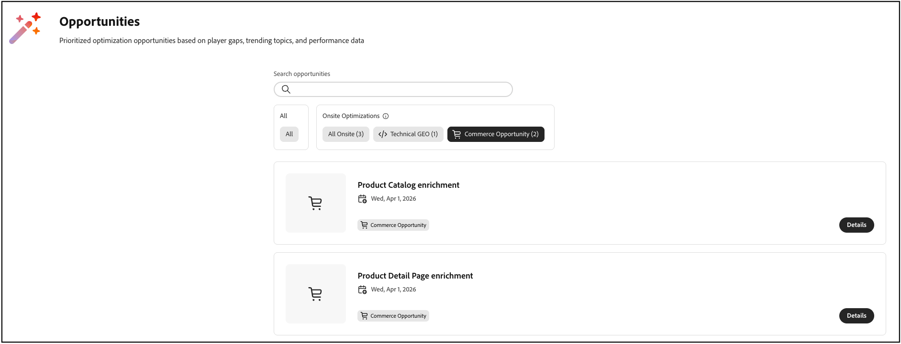

# Usar [!DNL Adobe LLM Optimizer] con [!DNL Adobe Commerce]

>[!IMPORTANT]
>
>El acceso a esta integración está restringido. Póngase en contacto con el administrador de cuentas técnico para obtener más información.

Después de [conectar Commerce a LLM Optimizer](connect-to-llmo.md), usted trabaja principalmente en la interfaz de usuario de **[!DNL Adobe LLM Optimizer]** para revisar las oportunidades e insertar los cambios aprobados en el catálogo cuando esté listo. En este artículo se describen los dos tipos de optimización centrados en Commerce: cómo usar **[!UICONTROL Opportunities]**, cómo se comportan las acciones de implementación en [!DNL Adobe Commerce] y cómo las actualizaciones externas interactúan con las sugerencias de LLM Optimizer. Para obtener una imagen más amplia de la integración, vea la [descripción general de la integración](../overview.md).

## Comprender las optimizaciones de Commerce en LLM Optimizer {#understand-optimizations}

Para los catálogos respaldados por Commerce, LLM Optimizer ofrece **[!UICONTROL Product Detail Page Enrichment]** y **[!UICONTROL Product Catalog Enrichment]**.

| Enfoque | Para qué sirve |
| --- | --- |
| **[!UICONTROL Product Detail Page Enrichment]** (enriquecimiento de PDP) | Sugerencias que mejoran la forma en que una página de producto lee los informes de detección impulsada por IA, sin reemplazar el diseño de la tienda. |
| **[!UICONTROL Product Catalog Enrichment]** | **nombre del producto** y **descripción del producto** sugeridos para productos específicos que puede revisar, editar si es necesario y aplicar a su catálogo de Commerce. |

Use **[!UICONTROL Opportunities]** para abrir la lista de productos o direcciones URL y resolver las sugerencias del tipo seleccionado.

## Navegue por oportunidades de Commerce {#navigate-commerce-opportunities}

**Para abrir oportunidades relacionadas con Commerce:**

1. En el carril izquierdo, haga clic en **[!UICONTROL Opportunities]**.
1. Haga clic en **[!UICONTROL Commerce Opportunity]** para mostrar los tipos de optimización destinados a su catálogo [!DNL Adobe Commerce].
1. Seleccione **[!UICONTROL Product Catalog Enrichment]** o **[!UICONTROL Product Detail Page Enrichment]**, dependiendo de en qué desee trabajar.

### Comprender las métricas de oportunidad {#opportunity-metrics}

Cada vista de oportunidad resume el impacto para que pueda priorizar el trabajo:

- **Páginas de producto** o **URL**: Las páginas o productos evaluados para ese tipo de optimización.
- **Tráfico agéntico**: visitas e interacciones iniciadas por agentes de IA que pueden ayudarle a priorizar primero las oportunidades de alto impacto.

### Comprender los estados de sugerencias {#suggestion-states}

Ambos tipos de enriquecimiento utilizan las mismas vistas de flujo de trabajo:

- **[!UICONTROL Current Suggestions]**: elementos nuevos o activos para revisar.
- **[!UICONTROL Fixed Suggestions]**: elementos que ya implementó o resolvió.
- **[!UICONTROL Ignored Suggestions]**: elementos que ha excluido intencionadamente de la acción.

### Revisión e implementación del enriquecimiento de PDP {#review-deploy-pdp}

El enriquecimiento de PDP es para equipos que desean una mensajería de página de productos más clara en el descubrimiento impulsado por IA, mientras mantienen la experiencia de tienda que sus comerciantes diseñaron.

**Para revisar e implementar el enriquecimiento de PDP:**

1. Abrir **[!UICONTROL Product Detail Page Enrichment]** desde **[!UICONTROL Opportunities]**.
1. En la tabla **[!UICONTROL URLs with Suggestions]**, seleccione **[!UICONTROL Current Suggestions]**.
1. Para una URL o SKU, haga clic en **[!UICONTROL Preview]** para revisar el análisis de IA y el enriquecimiento propuesto.
1. Opcional: haga clic en **[!UICONTROL Copy]** para pegar el contenido en un editor externo, o haga clic en **[!UICONTROL Edit suggestion]** para editarlo in situ.
1. Opcional: Si una sugerencia no coincide con su estrategia, muévala a **[!UICONTROL Ignored Suggestions]**.
1. Una vez revisada y aprobada, seleccione la fila de la URL o SKU que desea actualizar, haga clic en **[!UICONTROL Deploy optimizations]** y confirme la acción.

Después de la implementación, las sugerencias pasan a **[!UICONTROL Fixed Suggestions]** con un estado de optimización en LLM Optimizer.

>[!NOTE]
>
>La implementación de enriquecimiento de PDP requiere la incorporación de **Optimize at Edge** completada en LLM Optimizer. Si la incorporación está incompleta, la interfaz de usuario le pedirá que finalice la instalación antes de la implementación.

### Revisión e implementación del enriquecimiento del catálogo de productos {#review-deploy-catalog}

El enriquecimiento del catálogo es para equipos que desean ajustar nombres de productos y descripciones largas directamente en Commerce, con sugerencias que puede revisar antes de guardar cualquier cosa.

**Para revisar e implementar el enriquecimiento del catálogo de productos:**

1. Abrir **[!UICONTROL Product Catalog Enrichment]** desde **[!UICONTROL Opportunities]**.
1. En la tabla **[!UICONTROL URLs with Suggestions]**, seleccione **[!UICONTROL Current Suggestions]**.
1. Haga clic en el control de expansión de la fila de la dirección URL o la SKU para mostrar las actualizaciones **Nombre de producto** y **Descripción de producto** propuestas.
1. Opcional: Haga clic en el icono de edición para ajustar el nombre o la descripción propuestos antes de la implementación.
1. Opcional: Si una sugerencia no coincide con su estrategia, muévala a **[!UICONTROL Ignored Suggestions]**.
1. Una vez revisada y aprobada, seleccione la fila de la URL o SKU que desea actualizar, haga clic en **[!UICONTROL Deploy optimizations]** y confirme la acción.

Los cambios de nombre y descripción aprobados se guardan en el catálogo [!DNL Adobe Commerce] como otras actualizaciones de productos.

>[!IMPORTANT]
>
>Trate la implementación como un cambio en el catálogo de producción. Utilice sus prácticas normales de control de cambios, ensayo y control de calidad. Implementar solo después de que las partes interesadas en la SEO y la comercialización acuerden la copia final.

Después de la implementación, las sugerencias pasan a **[!UICONTROL Fixed Suggestions]** con el estado **Aplicado**.

## Verificar actualizaciones en el administrador de Commerce {#verify-in-admin}

**Para comprobar el enriquecimiento del catálogo implementado:**

1. Inicie sesión en [!DNL Adobe Commerce] **Admin**.
1. Ir a **[!UICONTROL Catalog]** > **[!UICONTROL Products]**.
1. Use los filtros y el selector **vista de tienda** según sea necesario (por ejemplo, **[!UICONTROL Default Store View]**) y luego busque el **SKU**.
1. Abra el producto en modo de edición.

   El formulario del producto muestra el **nombre del producto** enriquecido.

   

1. Opcional: seleccione **[!UICONTROL Override LLM Optimizer provided Product Name]** si desea conservar un nombre ingresado manualmente en su lugar.

Las invalidaciones manuales afectan la forma en que las oportunidades se sincronizan con el catálogo. Consulte [Anulación manual en el administrador](#manual-override-in-the-admin).

1. Expanda la sección **[!UICONTROL Content]** y busque el campo **description**.

   La descripción enriquecida aparece cuando ha implementado cambios de descripción.

   

1. Opcional: seleccione **[!UICONTROL Override LLM Optimizer provided Description]** si desea conservar una descripción introducida manualmente en su lugar.

## Verificar actualizaciones en la tienda {#verify-storefront}

Busque el SKU en su tienda y abra el PDP. Confirme que **name** y cualquier región que aparezca en la **descripción** larga reflejen lo que ha aprobado. Confirme también cualquier canal descendente que consuma los mismos atributos de catálogo, cuando sean relevantes para el despliegue.

<!--
## PDP enrichment rollback {#pdp-rollback}

If your project includes PDP enrichment opportunities, **rollback** behavior may support **bulk** or **per-URL** actions, depending on your LLM Optimizer release. Follow the in-product options for rollback. For **[!UICONTROL Product Catalog Enrichment]**, undoing a name or description in Commerce is effectively a new catalog edit or a follow-up opportunity, not a separate undo control in the Admin unless your team implements one.
-->

## Invalidaciones, ingestas y oportunidades de obsolescencia {#overrides-ingestion}

Después de que LLM Optimizer actualice el nombre o la descripción de un producto, otros sistemas de ingesta, como llamadas a la API de REST, importaciones de CSV, fuentes PIM o procesos similares, pueden cambiar los mismos campos. Las secciones siguientes describen lo que sucede en este caso.

### La ingesta vuelve a enviar el valor del catálogo original

Si un proceso externo escribe el nombre o la descripción originales (el valor que existía antes de la implementación de LLM Optimizer), Commerce sigue respetando el valor implementado por LLM Optimizer para ese campo según las reglas de integración. Es posible que la oportunidad no se revierta automáticamente solo en función de esa ingesta.

### La ingesta envía un nuevo valor

Si el proceso externo envía un nuevo valor que no se limita a repetir el texto anterior a LLM Optimizer (por ejemplo, cambiar el nombre de &quot;Zapatos rojos&quot; por &quot;Zapatos rojos icónicos&quot;), se respeta ese nuevo valor de catálogo y la oportunidad de LLM Optimizer relacionada suele marcarse como *Antiguo* en LLM Optimizer porque el catálogo en directo ya no coincide con el contexto de la sugerencia.

### Anulación manual en el administrador {#manual-override-in-the-admin}

Si edita manualmente el nombre o la descripción del producto en [!DNL Adobe Commerce] *Administrador*:

- El valor *Admin* gana como sistema de registro para ese cambio manual.
- La oportunidad de LLM Optimizer está marcada como *obsoleta*.
- En LLM Optimizer, la IU vuelve al estado original para esa oportunidad, de modo que puede volver a establecer la línea de base o aceptar una nueva sugerencia si el análisis se ejecuta de nuevo.

Estas reglas le ayudan a saber si LLM Optimizer, las fuentes de ingesta o las ediciones de *Admin* son autorizadas cuando varios canales tocan el mismo SKU.

## Prácticas recomendadas

- **Identifique la propiedad del sistema** para el nombre y la descripción del producto, de modo que los trabajos de fuentes o PIM no entren en conflicto involuntario con las expectativas de LLM Optimizer.
- **Coordínese con los equipos de optimización de los motores de búsqueda y de marcas** antes de implementar títulos o descripciones por lotes.
- **Volver a sincronizar** o **volver a analizar** después de las importaciones de catálogo principales, de modo que las oportunidades reflejen el estado de catálogo actual.

## Probar en la demostración

Utilice el entorno de demostración de Frescopa para ver ambos tipos de oportunidades de Commerce en acción:

- [Ver demostración de enriquecimiento del catálogo de productos](https://play.llmo.now/org/demo-org/opportunities/commerce-product-catalog-enrichment/e5f2a854-7477-421c-820f-74d5dd595647?siteId=9ae8877a-bbf3-407d-9adb-d6a72ce3c5e3)
- [Ver demostración de enriquecimiento de página de detalles del producto](https://play.llmo.now/org/demo-org/opportunities/commerce-product-page-enrichment/4e8b0428-0893-4864-a00e-fc1d77fb3372?siteId=9ae8877a-bbf3-407d-9adb-d6a72ce3c5e3)

## Temas relacionados

- [Conectar Adobe Commerce a LLM Optimizer](connect-to-llmo.md)
- [Resumen de integración](../overview.md)
- [Límites y límites de integración](../boundaries-limits.md)
