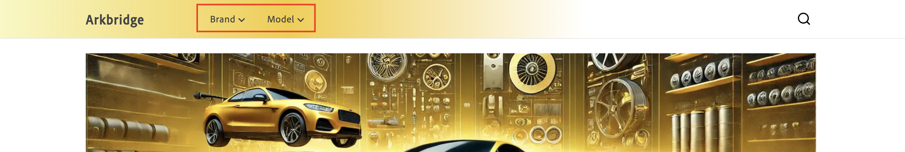

# Políticas

>[!NOTE]
>
>Esta documentación describe un producto en desarrollo de acceso anticipado y no refleja todos los funcionalidad destinados a la disponibilidad general.

Las políticas son filtros de acceso a datos contenidos dentro de canales que refinan aún más los datos entregados a cada canal. Las políticas garantizan que se envíen los contenido correctos al destino correcto. Por ejemplo, punto de venta tiendas físicas, mercados, canales de anuncios (Google, Facebook, Instagram).

Las directivas se basan en atributos del producto, como marca, modelo o parte categoría, y se utilizan para adaptar los datos del catálogo a fin de satisfacer requisitos empresariales específicos.

## Filtros

Los filtros son el mecanismo dentro de una directiva que impone la segmentación del catálogo. Los filtros permiten a las empresas adaptar escaparates y canales a conjuntos de productos específicos en función de las necesidades operativas. Utilice criterios como atributos de producto, operadores y valores para definir un regla o condición que indique qué productos se incluyen o excluyen en una canal o escaparate.

### Partes de un filtro

Un filtro consta de las siguientes partes:

| Parte | Descripción | Ejemplo |
|---|---|---|
| **Atributo** | Atributo de producto utilizado para el filtrado. | `part_category` |
| **Operador** | La condición aplicada al atributo. | `IN`, `EQUALS`, `CONTAINS` |
| **Origen del valor** | Especifica si los valores son `STATIC` o `TRIGGER`. | `STATIC` |
| **Valor** | Los valores específicos que cumplen la condición. | `brakes, suspension` |

### Ejemplo

Un filtro con el atributo `part_category`, un operador de `IN` y valores `brakes, suspension` garantiza que sólo se incluyan en la directiva los productos clasificados como frenos y suspensión.

### Tipos de origen de valor

Existen dos tipos de orígenes de valores: **STATIC** y **DÉCLENCHEUR**.

Las directivas con un **origen Value** de **STATIC** se consideran directivas universales. Las políticas universales definen la experiencia de un sitio web en su conjunto. Esto significa que el canal siempre ejecutará esa directiva. En otras palabras, la ejecución de esa política no se basa en ninguna interacción del usuario en la tienda.

Las directivas con un **origen de valor** de **DÉCLENCHEUR** se denominan directivas exclusivas. Esto significa que el canal ejecutará esa directiva solo cuando el déclencheur se especifique en el encabezado de la llamada de API. En la tienda, esto significa que la información se muestra en función de lo que seleccione el comprador. Por ejemplo, en la siguiente imagen hay dos menús desplegables: **Marca** y **Modelo**.

**La marca** y **el modelo** son activadores definidos:

- `AC-Policy-Brand`
- `AC-Policy-Model`

Si el comprador hace clic en la **lista desplegable Marca** , el encabezado de la llamada API contiene `AC-Policy-Brand`, que está configurado para mostrar solo productos específicos del `AC-Policy-Brand` directiva.

## Crear directiva

En esta sección, creará una nueva directiva. La directiva puede ser **STATIC** o **DÉCLENCHEUR**.

### Crear una política STATIC

1. En el menú de la izquierda, abra la **[!UICONTROL Catalog]** sección y haga clic en **[!UICONTROL Policies]**.

1. Haga clic en el **[!UICONTROL Add Policy]** botón.

   Se abre un nuevo Página para que pueda rellenar los detalles de la directiva.

1. Introduzca el nombre del directiva, por ejemplo &quot;Celport Part Categories&quot;.

1. Haga clic en el **[!UICONTROL Add Filter]** botón.

   Se abre un cuadro de diálogo para que agregue detalles del filtro.

1. añadir los detalles del filtro. Por ejemplo:

   1. **Atributo** : introduzca un atributo del catálogo. Por ejemplo, &quot;part_categoría&quot;. Este nombre debe coincidir exactamente con el nombre del atributo del catálogo.
   1. **Operador** : elija el operador. Por ejemplo, **IN.**
   1. **Valor Origen** - Seleccione **STATIC**.
   1. **** Valor - Introduzca los valores dentro del atributo que especificó anteriormente. Por ejemplo, &quot;frenos, suspensión&quot;.Estos nombres deben coincidir exactamente con los nombres de los valores del atributo especificado anteriormente.

1. Haga clic en la **[!UICONTROL Save]** botón del cuadro de diálogo de detalles del filtro.

1. Haga clic en los puntos de acción (...) junto al filtro que ha creado y seleccione **Habilitar**. Desde aquí, también puedes **Editar**, **Deshabilitar** o **Eliminar** el filtro.

   La columna **Estado** muestra un icono verde y la palabra &quot;Habilitado&quot;.

1. Haga clic en el **[!UICONTROL Save]** botón para guardar el nuevo directiva. Si el botón no está activo, asegúrese de agregar el nombre del directiva haciendo clic en el icono de lápiz junto a **Nuevo directiva**.

1. Para verificar su nuevo directiva, vuelva al lista de las políticas haciendo clic en la flecha hacia atrás.Verá su nueva directiva en la lista.

### Crear UN directiva DESENCADENANTE

1. En el menú de la izquierda, abra la **[!UICONTROL Catalog]** sección y haga clic en **[!UICONTROL Policies]**.

1. Haga clic en el **[!UICONTROL Add Policy]** botón.

   Se abre un nuevo Página para que pueda rellenar los detalles de la directiva.

1. Introduzca el nombre del directiva, por ejemplo &quot;Celport Part Categories&quot;.

1. Haga clic en el **[!UICONTROL Add Trigger]** botón.

   Aparecerá el **cuadro de diálogo Activar detalles** .

1. Escriba un nombre para el activador, como **AC-Policy-Brand**.

1. Seleccione el tipo **de** transporte. **** HTTP_HEADER es actualmente el único tipo admitido.

1. Haga clic en la **[!UICONTROL Save]** botón para guardar el activador.

1. Haga clic en el botón **[!UICONTROL Add Filter]**.

   Se abrirá un cuadro de diálogo para que pueda añadir detalles del filtro.

1. Añada los detalles del filtro. Por ejemplo:

   1. **Atributo** - Escriba un atributo de su catálogo. Por ejemplo, &quot;part_category&quot;. Este nombre debe coincidir exactamente con el nombre del atributo del catálogo.
   1. **Operador**: elija el operador. Por ejemplo, **IN**.
   1. **Valor Source** - Seleccionar **DÉCLENCHEUR**.
   1. **Valor** - Escriba el nombre del déclencheur que creó anteriormente (**AC-Policy-Brand**).

1. Haga clic en el botón **[!UICONTROL Save]** en el cuadro de diálogo de detalles del filtro. palo de golf

1. Haga clic en los puntos de acción (...) junto al filtro que ha creado y seleccione **Habilitar**. Desde aquí, también puedes **Editar**, **Deshabilitar** o **Eliminar** el filtro.

   La columna **Estado** muestra un icono verde y la palabra &quot;Habilitado&quot;.

1. Haga clic en el botón **[!UICONTROL Save]** para guardar la nueva directiva&#x200B; Si el botón no está activo, asegúrese de agregar el nombre de la directiva haciendo clic en el icono de lápiz junto a **Nueva directiva**.

1. Para comprobar la nueva directiva, vuelva a la lista de directivas haciendo clic en la flecha hacia atrás. palo de golfVerá su nueva política en la lista.

Al seguir estos pasos, la directiva se crea y está lista para vincularse a un canal para controlar la visibilidad del producto.
