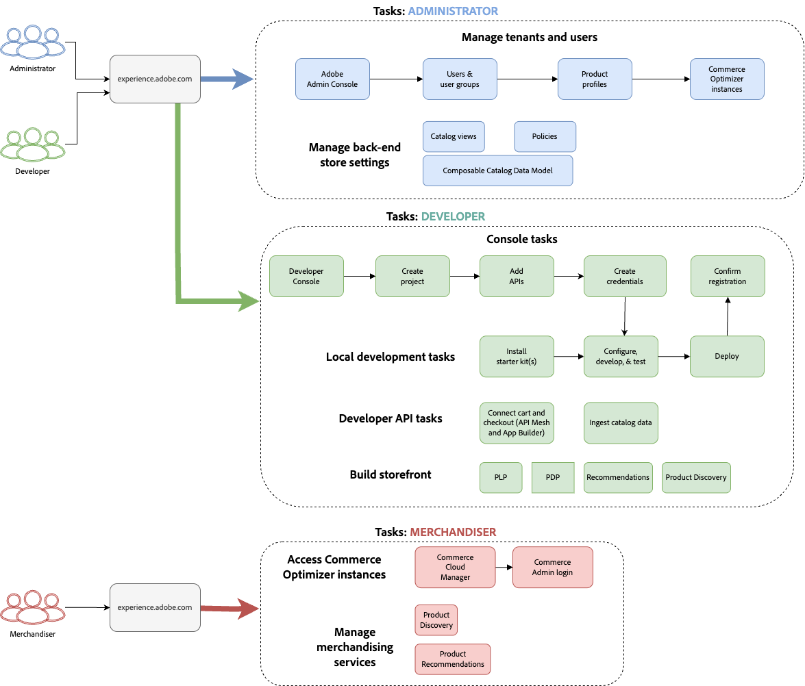

# Primeros pasos

Esta guía lo acompaña en la configuración de [!DNL Adobe Commerce Optimizer] de principio a fin. Aunque esta guía cubre todas las funciones, consulte la [documentación para desarrolladores](https://developer.adobe.com/commerce/services/optimizer/) para obtener contenido detallado específico para desarrolladores.

## Requisitos previos

Antes de empezar, asegúrese de que dispone de lo siguiente:

- **Cuenta de Adobe Experience Cloud** con [!DNL Adobe Commerce Optimizer] derechos
- **Acceso de administrador de organización** para crear instancias y administrar usuarios
- **Cuenta de GitHub** para cargar datos de muestra y desarrollar tienda
- **Comprensión básica** de los conceptos de comercio electrónico

## Guía de inicio rápido

Siga estos pasos esenciales para ejecutar el entorno [!DNL Adobe Commerce Optimizer]:

### Paso 1. Crear una instancia

1. Inicie sesión en [Adobe Experience Cloud](https://experience.adobe.com/).
1. Vaya a **Commerce** > **Commerce Cloud Manager**.
1. Haga clic en **Agregar instancia** > **Commerce Optimizer**.

   {width="60%" zoomable="yes"}

1. Configure las opciones de instancia:
   - **Nombre de instancia**: Nombre descriptivo (por ejemplo, &quot;Mi espacio aislado de la compañía&quot;)
   - **Descripción**: Breve descripción del propósito
   - **Tipo de entorno**: Comience con un entorno de **espacio aislado** para realizar pruebas
   - **Región**: selecciona tu región preferida

1. Haga clic en **Agregar instancia**.

   Cloud Manager se actualiza para incluir la nueva instancia. Para obtener más información sobre cómo obtener acceso y administrarla, consulte [Administrar una instancia](#manage-instances).

>[!NOTE]
>
>Solo puede crear entornos de zona protegida en la región de América del Norte. Una vez creada una instancia, no se puede cambiar la región.

### Paso 2. Configurar su entorno

Después de crear la instancia:

1. [Administre su instancia](#manage-instances) desde Commerce Cloud Manager.
1. Configure el acceso de los usuarios mediante la [Guía de administración de usuarios](./user-management.md).

### Paso 3. Añadir datos de ejemplo (opcional)

Para pruebas y aprendizaje, siga las instrucciones [Cargar datos de muestra](#add-sample-data).

## Flujos de trabajo basados en roles

La configuración y administración de [!DNL Adobe Commerce Optimizer] dependen de tres funciones clave. Cada función tiene tareas y responsabilidades específicas:

{zoomable="yes"}

### Tareas del administrador

Los administradores administran instancias, usuarios y configuración organizativa.

| Tarea | Descripción | Vínculo |
|---|---|---|
| **Administrar usuarios** | Añadir usuarios, desarrolladores y administradores | [Administración de usuarios](./user-management.md) |
| **Crear instancias** | Configuración de entornos de zona protegida y producción | [Crear instancia](#create-an-instance) |
| **Administrar instancias** | Compruebe el estado, actualice el nombre y la descripción de la instancia y obtenga las URL clave para el acceso a la aplicación y la API | [Administrar instancias](#manage-instances) |
| **Configurar acceso** | Configuración de vistas de catálogo y políticas | [Vistas de catálogo](./setup/catalog-view.md) |

### Tareas del desarrollador

Los desarrolladores gestionan la implementación técnica y la integración de datos, incluidas las tareas de arquitectura de la plataforma.

| Tarea | Descripción | Vínculo |
|---|---|---|
| **Acceder a Developer Console** | Crear proyectos y generar credenciales | [Developer Console](https://developer.adobe.com/developer-console/docs/guides/getting-started) |
| **Ingesta de datos de catálogo** | Importar datos de productos de sistemas existentes | [API de ingesta de datos](https://developer.adobe.com/commerce/services/optimizer/data-ingestion/) |
| **Configurar la tienda** | Configurar la tienda de Edge Delivery Services | [Configuración de tienda](./storefront.md) |

### Tareas del comerciante

Los comerciantes optimizan y personalizan la experiencia de compra a través de la detección de productos y recomendaciones. También usan datos y análisis de compradores para tomar decisiones estratégicas acerca de la ubicación de productos, precios y promociones en la tienda.

| Tarea | Descripción | Vínculo |
|---|---|---|
| **Descubrimiento de productos** | Configuración de la búsqueda y el filtrado | [Información general de comercialización](./merchandising/overview.md) |
| **Recomendaciones** | Configurar recomendaciones de productos con tecnología de IA | [Recomendaciones de productos](./merchandising/recommendations/overview.md) |
| **Seguimiento del rendimiento** | Monitorización de métricas de éxito | [Métricas de éxito](./manage-results/success-metrics.md) |

## Administrar instancias

Administre instancias desde Commerce Cloud Manager.

>[!NOTE]
>
>No todos los usuarios de Adobe Commerce Optimizer tienen acceso a Cloud Manager. El acceso depende de la función y los permisos asignados a la cuenta de usuario.

1. Inicie sesión en [Adobe Experience Cloud](https://experience.adobe.com/).

1. Abra Commerce Cloud Manager:

   - En **Acceso rápido**, haga clic en **Commerce**.
   - Ver las instancias disponibles.

### Buscar y filtrar instancias

Después de iniciar sesión, el panel muestra todas las instancias de productos de Commerce disponibles en la organización.
La columna Product indica para qué aplicación de Commerce se aprovisiona la instancia.

{zoomable="yes"}

Utilice las herramientas Filtro y Búsqueda para buscar rápidamente instancias específicas por fecha de creación, región, creador, tipo de producto, entorno o estado.

### Obtener acceso a la aplicación [!DNL Adobe Commerce Optimizer]

Una vez abierta la aplicación, cambie fácilmente entre entornos como zona protegida y producción para ver los datos y la configuración de cada uno sin volver al Administrador de Commerce Cloud.

1. En Commerce Cloud Manager, haga clic en el nombre de la instancia para abrir la aplicación [!DNL Adobe Commerce Optimizer].

1. Cambiar entre [!DNL Adobe Commerce Optimizer] instancias sin salir de la aplicación.

   La lista desplegable de instancias enumera todas las instancias de Optimizer disponibles en la organización. Seleccione la instancia que desea ver.

   {zoomable="yes"}

### Obtener detalles de la instancia

Vea los detalles de la instancia haciendo clic en el icono de información junto al nombre de la instancia.

{width="60%" zoomable="yes"}

Tenga en cuenta la siguiente información clave:

- **Extremo de GraphQL** para recuperar datos del catálogo de Commerce mediante la API de comercialización
- **Punto final del servicio de catálogo** para la ingesta de datos mediante la API de REST
- **URL de Commerce Optimizer** para acceder a la aplicación [!DNL Adobe Commerce Optimizer]
- **ID de instancia**: el ID único de inquilino que identifica la instancia

Si es desarrollador, necesita estos detalles para configurar su entorno de desarrollo y conectarse a las API de [!DNL Adobe Commerce Optimizer].

>[!NOTE]
>
>Para acceder a los detalles de la instancia, debe tener los permisos necesarios en la organización IMS de Adobe. Si no ve los detalles de la instancia o no puede acceder a la aplicación, póngase en contacto con el administrador de la organización.

### Editar nombre y descripción de instancia

Actualice el nombre y la descripción de la instancia según sea necesario.

1. Haga clic en el icono **Editar** junto al nombre de una instancia.
1. Actualice **Instance name** y **Description** según sea necesario.
1. Haga clic en **Guardar**.

## Añadir datos de ejemplo

Adobe proporciona un repositorio de GitHub con datos de ejemplo y herramientas que le ayudarán a aprender y probar las características de [!DNL Adobe Commerce Optimizer].
Los datos de ejemplo se basan en el [escenario comercial de Carvelo](./use-case/admin-use-case.md) e incluyen:

- Catálogo de productos con piezas de automóvil
- Varios libros de precios y escenarios de precios
- Vistas del catálogo y políticas para diferentes distribuidores
- Completar ejemplos de flujo de trabajo de extremo a extremo

**Cargar los datos de ejemplo:**

1. Acceda al repositorio de GitHub [Ingesta de datos de catálogo de muestra](https://github.com/adobe-commerce/aco-sample-catalog-data-ingestion).

1. Siga las instrucciones de configuración del archivo LÉAME del repositorio para completar las siguientes tareas:

   - Configurar su entorno
   - Completar el proceso de ingesta de datos
   - Creación de vistas de catálogo y políticas con los datos de ejemplo
   - Compruebe la ingesta de datos comprobando los datos del servicio de catálogo en la página [Sincronización de datos](./setup/data-sync.md)

## Pasos siguientes

Después de completar la configuración:

1. Configura tu tienda:
   - Configurar [tienda de Edge Delivery Services](./storefront.md)
   - Conexión a los datos del catálogo

1. Explore el caso de uso de Carvelo:
   - Siga el [flujo de trabajo de extremo a extremo](./use-case/admin-use-case.md)
   - Práctica con escenarios reales

1. Configurar la comercialización:
   - Configurar [descubrimiento de productos](./merchandising/overview.md)
   - Crear [recomendaciones](./merchandising/recommendations/overview.md)

1. Monitorización del rendimiento:
   - Rastrear [métricas de éxito](./manage-results/success-metrics.md)
   - Analizar [rendimiento de búsqueda](./manage-results/search-performance.md)

## Resolución de problemas

### Problemas comunes

| Problema | Solución |
|---|---|
| **No se puede crear una instancia** | Compruebe que tiene [!DNL Adobe Commerce Optimizer] derechos y permisos de administración. |
| **La instancia no aparece** | Compruebe la organización IMS de Adobe y actualice la página. |
| **No se puede obtener acceso a la instancia** | Asegúrese de que se le añade como usuario en Admin Console. |
| **No se cargan los datos de muestra** | Compruebe las credenciales de la instancia y los extremos de la API. |

### Obtener ayuda

- **Recursos para desarrolladores**: [Documentación para desarrolladores](https://developer.adobe.com/commerce/services/optimizer/)
- **Recursos de tienda**: [documentación de tienda Commerce](https://experienceleague.adobe.com/developer/commerce/storefront/?lang=es)
- **Tutoriales**: [Tutoriales de Commerce Optimizer](https://experienceleague.adobe.com/es/docs/commerce-learn/tutorials/adobe-commerce-optimizer/overview)
- **Soporte**: [Recursos de soporte de Adobe Commerce](https://experienceleague.adobe.com/es/docs/commerce-knowledge-base/kb/overview)
