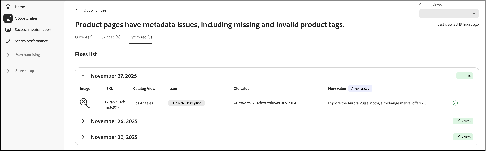

# Oportunidades

La página **Oportunidades** le ayuda a identificar e implementar optimizaciones para mejorar el tráfico del sitio, la participación del usuario y las tasas de conversión mediante la integración con Adobe Sites Optimizer.

## ¿Qué son las oportunidades?

[Las oportunidades](https://experienceleague.adobe.com/en/docs/experience-manager-sites-optimizer/content/documentation/opportunities/overview) son recomendaciones basadas en IA que ayudan a los comerciantes a identificar y abordar los problemas que afectan el rendimiento de su sitio comercial. Estas recomendaciones están impulsadas por [Adobe Experience Manager Sites Optimizer](https://experienceleague.adobe.com/en/docs/experience-manager-sites-optimizer/content/home), un servicio basado en la nube que analiza y mejora el rendimiento del sitio web.

## Funcionalidades clave

- **Detección automatizada de problemas**: Sites Optimizer analiza continuamente los catálogos de productos, los registros de búsqueda y los datos de recomendaciones para identificar los problemas que afectan a la detección.
- **Recomendaciones impulsadas por IA**: reciba sugerencias inteligentes para resolver los problemas detectados.
- **Categorización del impacto**: los problemas se clasifican por impacto en la empresa (búsqueda, recomendaciones, exploración/navegación, calidad de datos del producto).
- **Informes de panel**: vea las tendencias de problemas, los productos o consultas más afectados y las mejoras a lo largo del tiempo.

## Introducción

Para habilitar oportunidades en [!DNL Adobe Commerce Optimizer], póngase en contacto con el administrador de éxito del cliente (CSM). Las oportunidades están disponibles con la licencia de Adobe Sites Optimizer **Ultima**.

## Recorrido rápido

La página Oportunidades está organizada en tres pestañas que le ayudan a administrar las recomendaciones de optimización:

- **Actual (Activo)**: muestra las oportunidades detectadas recientemente que requieren revisión y acción. Son problemas activos que pueden afectar el rendimiento del sitio.
- **Omitido**: contiene oportunidades que ha elegido descartar o posponer. Puede mover oportunidades aquí si no son relevantes para sus objetivos comerciales actuales.
- **Optimizado (listo)**: muestra las oportunidades que se han solucionado correctamente mediante la implementación de corrección automática. Las oportunidades abordadas manualmente no aparecen en esta pestaña. Esta pestaña le ayuda a realizar un seguimiento de las oportunidades de corrección automática a lo largo del tiempo.

## Detectar automáticamente el flujo de trabajo

El flujo de trabajo de detección automática utiliza análisis con tecnología de IA para identificar automáticamente las oportunidades de optimización en todo el catálogo de productos. Este proceso de digitalización automatizada supervisa continuamente los datos del producto, los registros de búsqueda y el rendimiento de las recomendaciones para detectar problemas que podrían afectar el rendimiento del sitio, la SEO y la participación de los clientes.

### Cómo funciona

La detección automática aprovecha Adobe Experience Manager Sites Optimizer para lo siguiente:

- **Analizar páginas de productos**: el sistema examina las 200 páginas y filtros principales para buscar páginas de detalles de productos a fin de identificar los objetivos de optimización.
- **Extraer metadatos**: las etiquetas Meta (títulos, descripciones, encabezados H1) se extraen de cada página para su análisis.
- **Generar recomendaciones de IA**: los datos extraídos se procesan a través del flujo de trabajo de IA de Adobe para crear sugerencias de optimización procesables.
- **Rellenar oportunidades**: las sugerencias detectadas automáticamente aparecen en la ficha **Actual (activo)** para que las revise.

### Requisito previo

Para que la detección automática pueda generar recomendaciones, los datos del catálogo deben sincronizarse y actualizarse para garantizar recomendaciones precisas.

### Qué sucede a continuación

Una vez que la detección automática identifica las oportunidades de optimización, puede:

- Revise las optimizaciones sugeridas en la ficha **Actual (Activo)**.
- Implementar correcciones automáticamente usando el [flujo de trabajo de correcciones automáticas](#auto-fix-workflow) (para [tipos de oportunidades](#supported-opportunity-types) compatibles).
- Implemente los cambios manualmente en el administrador de Commerce.
- Ignore las oportunidades que no se alinean con sus objetivos empresariales.

## Flujo de trabajo de corrección automática

El flujo de trabajo de corrección automática permite implementar rápidamente optimizaciones generadas por IA con un solo clic. Al aplicar una corrección automática, el sistema crea una capa de optimización del catálogo que anula atributos de producto específicos sin modificar los datos de producto originales. Los datos originales del producto permanecen intactos, lo que le permite aplicar optimizaciones y revertir cambios de forma segura en cualquier momento. Consulte [Cómo funcionan las capas de catálogo con la corrección automática](#how-catalog-layers-work-with-auto-fix) para obtener más información.

### Tipos de oportunidades admitidos

A continuación se enumeran los tipos de oportunidades admitidos:

- Título demasiado largo
- Título demasiado corto
- Título duplicado
- Falta el título
- Título vacío
- Descripción demasiado larga
- Descripción demasiado corta
- Falta la descripción
- Descripción vacía
- Descripción duplicada
- Falta H1
- Duplicar H1
- H1 demasiado largo

>[!NOTE]
>
>Actualmente no se admiten varios H1 en la página.

### Requisitos previos

Antes de usar la corrección automática, asegúrese de lo siguiente:

- Su catálogo de productos se ha ingerido completamente en [!DNL Adobe Commerce Optimizer].
- El tipo de oportunidad admite la corrección automática (algunos tipos de optimización requieren implementación manual).
- Tiene los permisos adecuados para crear y administrar capas de catálogo.

>[!IMPORTANT]
>
>La función de corrección automática requiere un catálogo de productos completamente ingerido. Si el catálogo aún no se ha introducido, puede ver las oportunidades e implementar las correcciones manualmente con el archivo CSV proporcionado. Tenga en cuenta que las implementaciones manuales no se rastrean en la pestaña **Optimizado (listo)**.

### Implementación de una optimización de corrección automática

Siga estos pasos para implementar una optimización sugerida por IA:

1. Vaya a **Administrar resultados** > **Oportunidades**.

1. En la ficha **Actual (Activo)**, revise las sugerencias de optimización disponibles.

1. Seleccione una oportunidad.

   

   >[!NOTE]
   >
   >El botón **Implementar optimización** solo está disponible para [tipos de sugerencias compatibles](#supported-opportunity-types). Para los tipos no compatibles, la casilla de verificación está desactivada y debe aplicar correcciones manualmente en el catálogo.

1. Haga clic en **Implementar optimización** y, a continuación, haga clic en **Implementar** para almacenar en déclencheur el proceso de corrección automática.

   

   El sistema realiza las siguientes acciones en segundo plano:

   - Crea una nueva capa de catálogo para el producto (si aún no existe).
   - Actualiza el atributo relevante (como el metatítulo, la descripción o H1) según la recomendación de la API.
   - Asigna la nueva capa como la prioridad más alta (número más alto) en la vista de catálogo.
   - Valida el cambio mediante el servicio de tienda de catálogos.

1. Monitorice el estado de implementación. El sistema actualiza el estado de la sugerencia automáticamente una vez completada la validación.

1. Una vez optimizada, la sugerencia se mueve a la pestaña **Optimizada (lista)** con un indicador de estado:

   - **Marca de verificación verde**: la capa de optimización se establece como primera prioridad y se aplica activamente a la tienda.
   - **Icono de advertencia**: la capa existe pero no es la prioridad superior, lo que significa que puede ser anulada por otra capa.

   

>[!NOTE]
>
>La corrección automática admite la optimización de metadatos para sitios en cualquier idioma. Sites Optimizer analiza las páginas de detalles del producto en su idioma original, genera recomendaciones de IA localizadas y crea capas de catálogo basadas en la configuración regional de origen configurada en la vista de catálogo.

### Cómo funcionan las capas del catálogo con la corrección automática

Si no existe una capa de Adobe Sites Optimizer en la vista de catálogo, la corrección automática crea una y la asigna como la prioridad más alta (número más alto). Si elimina esta capa, se volverá a crear la próxima vez que se ejecute la corrección automática y cambiará las capas existentes a números de orden inferior. Si la capa Adobe Sites Optimizer ya existe en un número de pedido diferente, la corrección automática no cambiará su prioridad. Si desea mantener una capa de corrección automática, pero no utilizarla inmediatamente, puede desactivar la capa. Más información sobre cómo administrar [capas de catálogo](../setup/catalog-layer.md#activate-deactivate-or-delete-layers).

El diagrama muestra una sola fila denominada **optimización de ASO**. Esta entrada representa todas las oportunidades que elige corregir automáticamente. Tanto si se arregla automáticamente una sola oportunidad como si se ofrecen varias, todas aparecerán en esta única fila de **Optimización ASO**. Las capas son específicas de cada vista de catálogo, por lo que la vista de catálogo **Los Angeles** que se muestra aquí aplica su capa **Optimización ASO** solo cuando esa vista está activa.

### Consideraciones importantes

Tenga en cuenta lo siguiente al utilizar la corrección automática:

- El estado que se muestra para cada sugerencia refleja el estado en el momento en que se ejecutó el trabajador de corrección automática. El estado no se actualiza dinámicamente si se reordenan manualmente las capas del catálogo posteriormente.

- Para garantizar que las optimizaciones permanezcan activas, evite cambiar manualmente las prioridades de la capa de catálogo después de implementar las recomendaciones de corrección automática.

### Resolución de problemas

Si no parece que se aplique una optimización en su tienda:

1. Compruebe el indicador de estado en la ficha **Optimizado (listo)**.
1. Si ve un icono de advertencia, compruebe la configuración de prioridad de la capa de catálogo.
1. Asegúrese de que la capa de optimización esté establecida como la prioridad más alta (número más alto) en la vista de catálogo.
1. Confirme que la sincronización de datos del catálogo esté activa y actualizada.
1. Deje tiempo para que los cambios se propaguen. Incluso con una capa configurada correctamente en el número de pedido más alto, los cambios pueden tardar en aparecer en la tienda, de forma similar al retraso al publicar nuevos productos.

## Cómo funcionan juntas las métricas de éxito de Sites Optimizer y

Las métricas de éxito supervisan los indicadores de rendimiento clave, como la detección de productos y la eficacia empresarial de los catálogos, mientras que las oportunidades dentro de Sites Optimizer le permiten saber cómo puede impulsar la optimización de los motores de búsqueda, la velocidad de carga, la accesibilidad y la participación. En conjunto, los comerciantes y los especialistas en marketing pueden mejorar la eficiencia operativa, lo que permite obtener un rendimiento integral y unas ganancias de conversión más rápidas con una asistencia informática mínima. Para saber cómo aprovechar estas dos tecnologías para mejorar el rendimiento y la experiencia de tu tienda, consulta [Usar métricas de éxito y Sites Optimizer juntos](./success-metrics.md#using-success-metrics-and-sites-optimizer-together).

## Más información sobre Sites Optimizer

Para obtener información detallada acerca de las funcionalidades y características de Sites Optimizer, consulte la [documentación de Adobe Experience Manager Sites Optimizer](https://experienceleague.adobe.com/en/docs/experience-manager-sites-optimizer/content/home).

Recursos adicionales:

- [Tipos de oportunidades](https://experienceleague.adobe.com/en/docs/experience-manager-sites-optimizer/content/opportunities): obtenga información sobre las oportunidades de optimización disponibles.
- [Funciones de Sites Optimizer](https://experienceleague.adobe.com/en/docs/experience-manager-sites-optimizer/content/capabilities): explore lo que Sites Optimizer puede hacer.

## Más parecido a esto

- [Métricas de éxito](success-metrics.md): supervise los indicadores clave de rendimiento.
- [Rendimiento de búsqueda](search-performance.md) - Analizar términos de búsqueda y optimizar la relevancia.
- [Rendimiento de recomendaciones](recommendation-performance.md) - Supervisar la eficacia de las recomendaciones.
