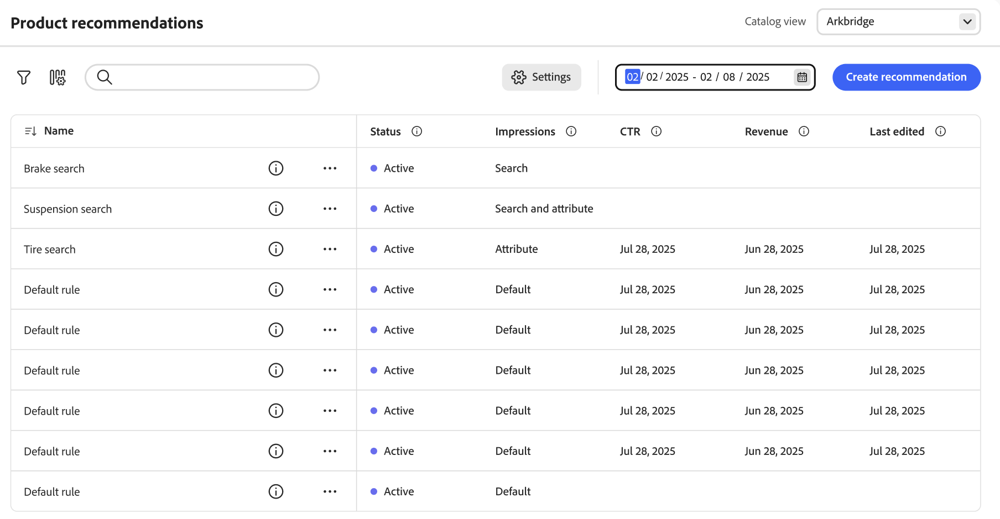

# Rendimiento de Recommendations

La página Rendimiento de las Recomendaciones muestra una lista de recomendaciones configuradas junto con métricas clave para ayudarle a evaluar su eficacia. Puede configurar la vista para que muestre las métricas del día, la semana o el mes pasados. Estas perspectivas muestran la frecuencia con la que se visualiza o se hace clic en cada unidad de recomendación, lo que le ayuda a evaluar el rendimiento e identificar oportunidades para la optimización.

>[!INFO]
>
>Una unidad de recomendación es un widget que contiene el producto recomendado _items_.

{zoomable="yes"}

## Elija la **vista de catálogo**

Seleccione la [vista de catálogo](../setup/catalog-view.md) donde se aplican sus recomendaciones.

## Ver un informe

Haga clic en el calendario y realice una de las siguientes acciones:

- Para especificar una sola fecha, haga doble clic en la fecha del calendario.
- Para especificar un intervalo de fechas, haga clic en la primera y en la última fecha del calendario.

>[!NOTE]
>
>El intervalo de fechas no puede superar un año.

## Personalizar tabla

1. En la esquina superior izquierda, haga clic en el icono  para personalizar la tabla.

   Las columnas visibles tienen una marca de verificación.

1. En el menú, realice una de las acciones siguientes:

   - Para mostrar una columna oculta, haga clic en cualquier nombre de columna sin marca de verificación.
   - Para ocultar una columna visible, haga clic en cualquier nombre de columna con una marca de verificación.

   La tabla se actualiza para incluir solo las columnas seleccionadas.

## Definición de filtros

Haga clic en el icono de filtro para filtrar las métricas en el espacio de trabajo de rendimiento de Recommendations.

Puede configurar varios valores para cada uno de los filtros. Consulte la [tabla siguiente](#column-descriptions) para obtener descripciones de cada filtro.

## Ver detalles

1. En la tabla, haga clic en el icono () que aparece junto a la recomendación que desea examinar.

1. Para cambiar el estado de la recomendación, haga clic en **Activar** o **Desactivar**.

## Crear o administrar recomendaciones

Aprenda a [crear una nueva recomendación o a administrar una existente](../merchandising/recommendations/create.md).

## Controles de Workspace

| Control | Descripción |
|---|---|
|  | Determina el intervalo de tiempo que se utiliza para los cálculos de métricas. |
|  | Determina las columnas que aparecen en la tabla Recommendations. |
| Crear recomendación | Abre la página [Crear nueva recomendación](../merchandising/recommendations/create.md). |

## Descripciones de columna

| Columna | Descripción |
|---|---|
| Nombre | El nombre de la recomendación. |
| Página | Página en la que aparece la recomendación. |
| Tipo | El tipo de recomendación. |
| Estado | El estado de la recomendación. Opciones: Inactivo/Activo/Borrador |
| Creado | La fecha en la que se creó la recomendación. |
| Última edición | Fecha en la que se editó la recomendación por última vez. |
| Impresiones | El número de veces que se carga y procesa una unidad de recomendación en una página. En la página se representa una unidad de recomendación que está por debajo del pliegue de la ventanilla del explorador, aunque el comprador no la vea. En este caso, la unidad procesada se cuenta como una impresión, pero una vista solo se cuenta si el comprador desplaza la unidad a la vista. |
| vImpresiones | (Impresiones visibles) El número de unidades de recomendación que registran al menos una vista. Por ejemplo, si la unidad de recomendación tiene dos líneas, cada una con dos productos, y el comprador no ve los dos últimos productos, pero los dos primeros sí, la actividad seguirá contando como una impresión. |
| Vistas | El número de unidades de recomendación que aparecen en la ventanilla móvil del explorador del comprador. Si el comprador desplaza la página hacia arriba o hacia abajo varias veces, el evento se activa varias veces, cada vez que se puede ver la unidad. |
| Clics | La suma del número de veces que un comprador hace clic en un artículo de la unidad de recomendación y el número de veces que el comprador hace clic en el botón **Agregar al carro** de la unidad de recomendación |
| Ingresos | Ingresos impulsados por la recomendación para el intervalo de tiempo actual. |
| Ingresos Lt | (Ingresos de por vida) Ingresos de por vida impulsados por una recomendación. |
| Visibilidad | Porcentaje de unidades de recomendación que se registran para la vista. |
| CTR | (Tasa de pulsaciones) El porcentaje de impresiones unitarias de la recomendación que registra un clic. CTR cuenta todas las impresiones, incluso si la unidad no entra en la vista del comprador. Si no se ve la unidad de recomendación, es poco probable que se haga clic en ella. Sin embargo, las impresiones invisibles se contabilizan en la puntuación de CTR y reducen el porcentaje de CTR general. |
| vCTR | (Tasa de clics visibles) mide los clics basados únicamente en impresiones visibles (recomendaciones que aparecieron en la parte visible de la pantalla del comprador), lo que proporciona una medición más precisa de la participación del comprador. |
