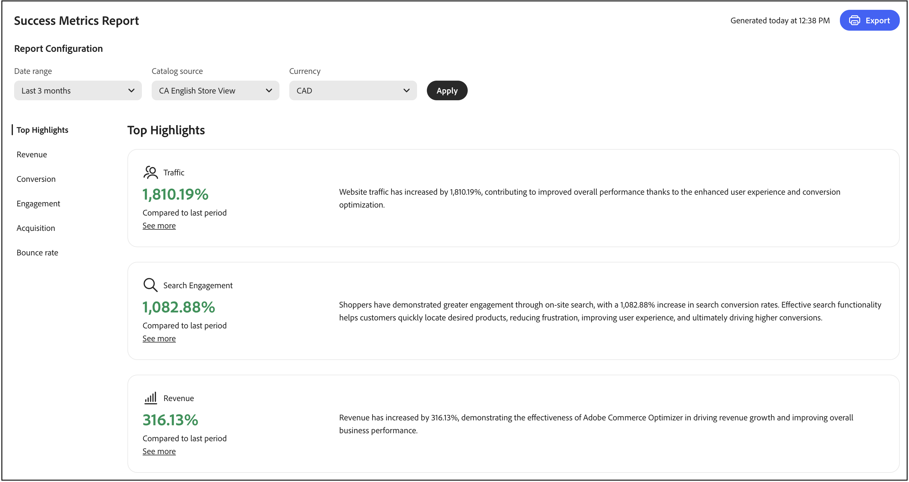

# Métricas de éxito

Esta página proporciona información general sobre las métricas clave de rendimiento para su tienda [!DNL Adobe Commerce Optimizer]. El objetivo es que usted entienda rápidamente los resultados de implementar [!DNL Adobe Commerce Optimizer], luego lo ayude a usted y a su equipo a identificar oportunidades de crecimiento y a destacar áreas para la optimización.

Las métricas del informe se extraen de los datos de evento de la tienda. [Más información](../setup/events/overview.md) acerca de los datos de evento recopilados.

## Explicación de las métricas

El informe de métricas de éxito ofrece perspectivas procesables en cinco áreas de rendimiento clave que afectan directamente a los resultados de su negocio. Cada métrica revela patrones en el comportamiento de los clientes y el rendimiento de las tiendas que le ayudan a descubrir oportunidades y a abordar desafíos. Aproveche estas perspectivas para impulsar decisiones más inteligentes y optimizar su experiencia comercial.

**Aspectos destacados** resume las métricas clave de cada área de rendimiento. Utilice esta sección para identificar rápidamente las principales oportunidades de mejora.

Los indicadores clave de rendimiento son:

- **Ingresos**: la métrica financiera principal que muestra el rendimiento total de ventas.
- **Conversión**: el porcentaje de visitantes que completaron compras.
- **Participación**: la forma en que los usuarios interactúan activamente con el sitio.
- **Adquisición**: La eficacia de los esfuerzos de adquisición de clientes.
- **Tasa de salida hacia otro sitio**: porcentaje de visitantes que se van después de ver una sola página.

## Generación de un informe

1. En el carril izquierdo, seleccione **Métricas de éxito**.
1. En **Configuración de informes**, especifique el **intervalo de fechas**, el **origen del catálogo** en función de la configuración regional y **Moneda**.
1. Haga clic en **[!UICONTROL Apply]**.

   Las **características más destacadas**, **Ingresos**, **Conversión**, **Participación**, **Adquisición** y **Tasa de salida hacia otro sitio** se actualizan según la configuración del informe.

1. Haga clic en **[!UICONTROL Export]** para guardar el informe como un PDF.

## Pasos siguientes y estrategias de optimización

Utilice sus datos de métricas de éxito para identificar oportunidades de mejora e implementar estrategias de optimización dirigidas. Las siguientes secciones proporcionan directrices específicas y procesables para cada área de métrica.

### Optimización de ingresos

Para los ingresos, su objetivo es aumentar las ventas totales y el valor de pedido promedio.

#### Estrategias

- **Implementar recomendaciones con tecnología de IA**: Utilice el motor de recomendaciones del optimizador para que aparezcan productos relevantes que generen tasas de conversión más altas. Implementar *Los clientes que vieron esto también vieron* y *Compraron esto, compraron esos* tipos de recomendaciones para aumentar las oportunidades de ventas cruzadas.

- **Crear reglas de comercialización**: Impulse los productos con márgenes elevados en los resultados de búsqueda mediante [reglas de comercialización](../merchandising/rules/overview.md). Anclar los artículos más vendidos a la parte superior de los resultados de búsqueda para consultas de alto tráfico.

- **Optimizar la detección de productos**: use [facetas inteligentes](../merchandising/facets/overview.md) para ayudar a los clientes a encontrar productos de forma más eficiente, lo que aumentará las tasas de conversión y los ingresos.

- **Aproveche las oportunidades de temporada**: Cree reglas de comercialización basadas en el tiempo para promocionar artículos de temporada o promocionales durante los períodos de mayor volumen de compras.

### Mejora de la tasa de conversión

Para mejorar la tasa de conversión, el objetivo es convertir a más visitantes en clientes.

#### Estrategias

- **Optimizar la relevancia de la búsqueda**: Implemente [sinónimos](../merchandising/synonyms/overview.md) para asegurarse de que los clientes encuentren lo que están buscando, incluso con términos de búsqueda diferentes. Utilice faceteado dinámico para proporcionar opciones de filtrado relevantes.

- **Ubicación de recomendación estratégica**: implemente unidades de recomendación en páginas de alto tráfico, como páginas de detalles de productos y páginas de categorías. Use las recomendaciones *Más visitados* y *Más comprados* para generar confianza y urgencia.

- **Mejore la visibilidad del producto**: utilice reglas de comercialización para asegurarse de que los productos más vendidos y de alta conversión aparezcan de forma destacada en los resultados de búsqueda.

- **Tipos de recomendaciones de pruebas A/B**: experimente con diferentes tipos y ubicaciones de recomendaciones para encontrar lo que mejor funcione para su audiencia.

### Mejora de la participación

Para mejorar la participación, el objetivo es aumentar la interacción con el cliente y el tiempo en el sitio.

#### Estrategias

- **Diversificar tipos de recomendación**: evite mostrar las mismas recomendaciones repetidamente. Usa una combinación de *Recomendado para ti*, *Tendencia* y *Vistos recientemente* para mantener el contenido fresco y atractivo.

- **Implementar búsqueda inteligente**: Use faceteo dinámico impulsado por IA y cambio de clasificación de resultados para adaptar los resultados de búsqueda en tiempo real en función del comportamiento del comprador.

- **Crear experiencias personalizadas**: implementa las unidades &quot;Recomendado para ti&quot; en la página de inicio y en todo el recorrido del cliente para ofrecer sugerencias de productos personalizadas.

- **Optimizar la experiencia de búsqueda**: Use sinónimos para mejorar la relevancia de la búsqueda y garantizar que los clientes encuentren lo que buscan rápidamente.

### Crecimiento de adquisición

Para adquirir más crecimiento, su objetivo es atraer a más clientes nuevos y mejorar la eficiencia de adquisición.

#### Estrategias

- **Aprovechar los datos de rendimiento de la búsqueda**: Use el informe [rendimiento de la búsqueda](../manage-results/search-performance.md) para identificar los productos de tendencias y los términos de búsqueda más populares. Cree reglas de comercialización para resaltar estos artículos.

- **Optimizar el rendimiento de las recomendaciones**: supervise las métricas de [rendimiento de las recomendaciones](../manage-results/recommendation-performance.md) para identificar qué tipos de recomendaciones generan la mayor cantidad de tráfico y conversiones.

- **Resaltar artículos nuevos y promocionales**: Use reglas de comercialización para impulsar nuevos productos o artículos promocionales en los resultados de búsqueda y así atraer la atención de nuevos visitantes.

- **Rastrear fuentes de tráfico**: Use los datos de evento para comprender qué canales aportan el tráfico más valioso y optimizar los esfuerzos de marketing en consecuencia.

### Reducción de tasa de devolución

Para reducir la tasa de salida hacia otro sitio, el objetivo es mantener el interés de los visitantes y reducir las visitas de una sola página.

#### Estrategias

- **Mejorar la relevancia de la búsqueda**: Use sinónimos y faceteo inteligente para garantizar que los clientes encuentren productos relevantes rápidamente. Los resultados de búsqueda deficientes son una causa importante de las altas tasas de devolución.

- **Implementar unidades de recomendación**: Implemente unidades de recomendación en páginas de categoría y resultados de búsqueda para proporcionar opciones de producto adicionales y mantener el interés de los visitantes.

- **Optimizar la detección de productos**: use reglas de comercialización para asegurarse de que los productos más relevantes y populares aparezcan primero en los resultados de búsqueda.

- **Cree experiencias atractivas en la página principal**: use los tipos de recomendación &quot;Recomendado para usted&quot; y &quot;Tendencia&quot; en su página principal para atraer de inmediato a los visitantes con contenido relevante.

## Solución de problemas y optimización

### Cuando las métricas declinan

**Ingresos en disminución**:

- Compruebe si las unidades de recomendación siguen activas y funcionan bien
- Revise las reglas de comercialización para asegurarse de que se promocionan los productos con un alto margen
- Analice el rendimiento de la búsqueda para identificar si los productos populares siguen teniendo una buena clasificación

**Disminución de la tasa de conversión**:

- Compruebe que se mantiene la relevancia de la búsqueda (compruebe sinónimos y facetas)
- Asegúrese de que las unidades de recomendación se muestran correctamente
- Revisar las reglas de comercialización para cualquier conflicto o problema

**Altas tasas de devolución**:

- Compruebe la relevancia de los resultados de búsqueda e implemente sinónimos si es necesario
- Asegúrese de que las unidades de recomendación se cargan correctamente
- Revisar la calidad y disponibilidad de los datos del producto

**Baja participación**:

- Diversificar los tipos de recomendaciones para evitar la fatiga de los clientes
- Implementación de estrategias de recomendación más personalizadas
- Optimizar la experiencia de búsqueda con mejores facetas y sinónimos

## Descripciones de campos

### Configuración del informe

| Campo | Descripción |
|---|---|
| Intervalo de fechas | Las opciones incluyen **Últimos 3 meses**, **Últimos 7 días**, **Últimos 30 días**, **Últimos 6 meses**, **Últimos 12 meses** y **Año hasta la fecha**. Utilice intervalos más cortos para obtener perspectivas de optimización inmediatas e intervalos más largos para el análisis de tendencias. |
| País | Basado en el origen de catálogo especificado para su [vista de catálogo](../setup/catalog-view.md). Seleccione el mercado apropiado para un análisis preciso del rendimiento. |
| Moneda | La moneda especificada para la vista de catálogo. Asegúrese de que coincida con su mercado objetivo para obtener informes de ingresos precisos. |
| Exportar | Guarda el informe como un PDF para compartirlo con las partes interesadas o para analizarlo sin conexión. |

## Más parecido a esto

- [Rendimiento de búsqueda](../manage-results/search-performance.md): Analice los términos de búsqueda y optimice la relevancia de la búsqueda
- [Rendimiento de recomendaciones](../manage-results/recommendation-performance.md) - Supervisar y optimizar la eficacia de las recomendaciones
- [Resumen de recomendaciones](../merchandising/recommendations/overview.md) - Más información acerca de recomendaciones de productos con tecnología de IA
- [Reglas de comercialización](../merchandising/rules/overview.md): aumenta, entierra, fija u oculta productos en los resultados de búsqueda
- [Facetas](../merchandising/facets/overview.md): mejore la búsqueda con filtrado inteligente
- [Sinónimos](../merchandising/synonyms/overview.md): mejore la relevancia de búsqueda y la experiencia del cliente
- [Información general sobre eventos](../setup/events/overview.md): comprenda los datos que alimentan sus métricas
