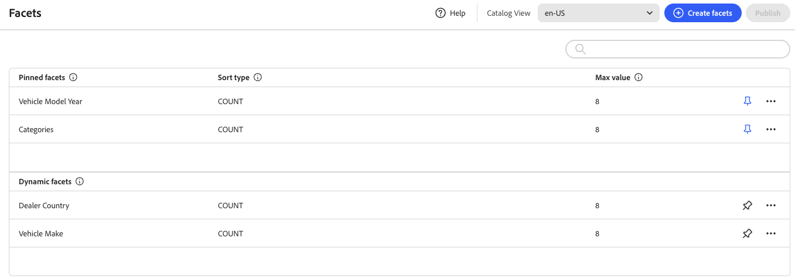

# Workspace de facetas

El área de trabajo *Facetas* enumera todas las facetas que están disponibles actualmente y proporciona acceso a las herramientas que necesita para configurar y administrar facetas. Las facetas ancladas aparecen primero en la lista de facetas existentes, seguidas de las facetas dinámicas. Puede buscar en la lista de facetas.

## Descripciones de campos

| Campo | Descripción |
|--- |--- |
| Crear facetas | Abre el [editor de facetas](add.md). |
| Etiqueta | La [etiqueta de faceta](type.md#facet-labels) que está visible en la tienda se puede editar para mantener la coherencia con la marca. |
| Tipo de orden | El método usado para [ordenar](type.md#sort-type) facetas. Las [!DNL Adobe Commerce Optimizer] tiendas ordenan las facetas alfabéticamente y por `Count`. Opciones: Alfabético: ordena las facetas alfabéticamente. Recuento: ordena las facetas según el número de coincidencias encontradas. |
| Valor máximo | Número máximo de valores que se pueden mostrar en la tienda para cada faceta. Las facetas que representan un rango de valores se distribuyen de forma uniforme. Entradas válidas: 0 - 100; Predeterminado: 8. |

## Controles

| Control | Descripción |
|--- |--- |
|  | Fija o libera una faceta al principio de la lista *Filtros*. |
|  | Muestra un menú de más acciones que se pueden aplicar a la faceta seleccionada. Opciones: Editar, Eliminar |
