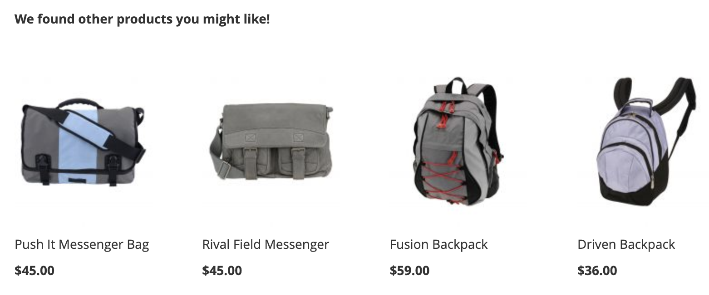

# Crear y administrar recomendaciones

Cuando crea una recomendación, crea una _unidad de recomendación_ o widget que contiene _elementos_ del producto recomendado.

_Unidad de recomendación_

Cuando activa la unidad de recomendación, Adobe Commerce empieza a [recopilar datos](../../manage-results/recommendation-performance.md) para medir impresiones, vistas, clics, etc. La tabla Recommendations muestra las métricas de cada unidad de recomendación para ayudarle a tomar decisiones comerciales fundadas.

1. En la barra lateral de _Adobe Commerce Optimizer_, ve a _Comercialización_ > **Recommendations** para mostrar el espacio de trabajo de _Recommendations_.

1. Haga clic en **Crear recomendación**.

1. En la sección _Asigne un nombre a la recomendación_, escriba un nombre descriptivo para la referencia interna, como `Home page most popular`.

1. En la sección _Seleccionar tipo de recomendación_, especifique el [tipo de recomendación](types.md) que desee en función de su estrategia.

1. En la sección _Etiqueta para mostrar en la tienda_, escribe la [etiqueta](best-practice.md#recommendation-labels) que sea visible para tus compradores, como &quot;Principales vendedores&quot;.

1. En la sección _Elegir número de productos_, use el control deslizante para especificar cuántos productos desea que aparezcan en la unidad de recomendación.

   El valor predeterminado es `5`, con un máximo de `20`.

1. (Opcional) En la sección _Filtros_, [aplique filtros](filters.md) para controlar qué productos aparecen en la unidad de recomendación.

1. Cuando termine, haga clic en una de las siguientes opciones:

   - **Guardar como borrador** para editar la unidad de recomendación más adelante. No se puede modificar el tipo de recomendación para una unidad de recomendación en estado de borrador.

   - **Activar** para habilitar la unidad de recomendación en tu tienda.

1. Cuando se le solicite, copie el ID de recomendación. Utilice este ID para identificar qué unidad de recomendación se está usando en el menú desplegable de recomendaciones de su tienda de Edge Delivery Services.

>[!NOTE]
>
> Puede crear hasta 50 unidades de recomendación activas.

>[!IMPORTANT]
>
>Algunos exploradores pueden bloquear los scripts esenciales que impiden que Recommendations funcione según lo esperado.

## Administrar recomendaciones existentes

Puede editar, desactivar o eliminar una recomendación existente.

1. En la barra lateral de _Adobe Commerce Optimizer_, ve a _Comercialización_ > **Recommendations**.

1. Seleccione la recomendación que desee modificar.

1. Haga clic en el selector más ().

1. En el menú, puedes **Desactivar**, **Eliminar** o **Editar** la recomendación. Si selecciona **Editar**, puede ajustar la siguiente configuración según sea necesario:

   - Nombre de recomendación
   - Etiqueta de tienda
   - Número de productos
   - Filtrar productos

   No puede cambiar el tipo de recomendación.

1. Una vez finalizado, haga clic en **Guardar cambios**.

## Indicadores de preparación

Los indicadores de preparación muestran qué tipos de recomendación funcionan mejor según los datos de catálogo y de comportamiento disponibles. También puede usar indicadores de preparación para determinar si tiene problemas con [la colección de eventos](../../setup/events/overview.md) o si no tiene tráfico suficiente para rellenar el tipo de recomendación.

Los indicadores de preparación se clasifican en [estáticos](#static-based) o [dinámicos](#dynamic-based). Solo se utilizan datos de catálogo de uso basados en estáticos, mientras que los basados en dinámicos utilizan datos de comportamiento de sus compradores. Esos datos de comportamiento se usan para [entrenar modelos de aprendizaje automático](../../setup/events/overview.md) para generar recomendaciones personalizadas y calcular su puntuación de preparación.

### Cálculo de los indicadores de disponibilidad

Los indicadores de disponibilidad indican cuánto se ha entrenado el modelo. Los indicadores dependen de los tipos de eventos recopilados, la amplitud de los productos con los que interactuó y el tamaño del catálogo.

El porcentaje del indicador de preparación se deriva de un cálculo que indica cuántos productos se pueden recomendar según el tipo de recomendación. Las estadísticas se aplican a los productos en función del tamaño general del catálogo, el volumen de interacciones (como vistas, clics, complementos a los carros de compras) y el porcentaje de SKU que registran esos eventos en un intervalo de tiempo determinado. Por ejemplo, durante el tráfico máximo de la temporada de vacaciones, los indicadores de disponibilidad pueden mostrar valores más altos que en tiempos de volumen normal.

Como resultado de estas variables, el porcentaje del indicador de disponibilidad puede fluctuar. Esto explica por qué podría ver que los tipos de recomendación entran y salen de &quot;Listo para implementar&quot;.

Los indicadores de preparación se calculan en función de un par de factores:

- Tamaño suficiente del conjunto de resultados: ¿Se devuelven suficientes resultados en la mayoría de los casos para evitar el uso de [recomendaciones de copia de seguridad](../../setup/events/overview.md#backuprecs)?
- Variedad del conjunto de resultados suficiente: ¿los productos que se devuelven representan una variedad de productos del catálogo? El objetivo con este factor es evitar tener una minoría de productos siendo los únicos recomendados en todo el sitio.

En función de los factores anteriores, se calcula un valor de disponibilidad y se muestra de la siguiente manera:

- 75 % o más significa que las recomendaciones sugeridas para ese tipo de recomendación serán muy relevantes.
- Al menos el 50 % significa que las recomendaciones sugeridas para ese tipo de recomendación serán menos relevantes.
- Menos del 50 % significa que las recomendaciones sugeridas para ese tipo de recomendación pueden no ser relevantes. En este caso, se utilizan [recomendaciones de copia de seguridad](../../setup/events/overview.md#backuprecs).

Obtenga más información acerca de [por qué los indicadores de preparación podrían ser bajos](#what-to-do-if-the-readiness-indicator-percent-is-low).

### Basado en estáticas

Los siguientes tipos de recomendación son de base estática porque solo requieren datos de catálogo. No se utilizan datos de comportamiento.

- _Más como este_

### Basado en dinámico

Los siguientes tipos de recomendación son dinámicos, ya que utilizan datos de comportamiento de tienda.

Últimos seis meses de datos de comportamiento de la tienda:

- _Vio esto, vio aquello_
- _Vio esto, compró aquello_
- _Compró esto, compró aquello_
- _Recomendado para usted_

Últimos siete días de datos de comportamiento de la tienda:

- _Más visitados_
- _Más comprados_
- _Más Añadidos al Carro_
- _Tendencia_
- _Conversión de vista a compra_
- _Conversión de vista a carro_

Datos más recientes del comportamiento del comprador (solo vistas):

- _Vistos recientemente_

### Visualización del progreso

Para ayudarle a visualizar el progreso de formación de cada tipo de recomendación, la sección _Seleccionar tipo de recomendación_ muestra una medida de preparación para cada tipo.

_Tipo de recomendación_

>[!NOTE]
>
>Los indicadores nunca pueden alcanzar el 100%.

El porcentaje del indicador de preparación para los tipos de recomendación que dependen de los datos del catálogo no cambia mucho, ya que el catálogo del comerciante no cambia con frecuencia. Sin embargo, el porcentaje del indicador de preparación para los tipos de recomendación basados en los datos de comportamiento del comprador puede cambiar a menudo según la actividad diaria del comprador.

#### Qué hacer si el porcentaje del indicador de disponibilidad es bajo

Un porcentaje de preparación bajo indica que no hay muchos productos del catálogo que puedan incluirse en las recomendaciones de este tipo de recomendación. Esto significa que existe una alta probabilidad de que se devuelvan [recomendaciones de copia de seguridad](../../setup/events/overview.md#backuprecs) si implementa este tipo de recomendación de todos modos.

>[!IMPORTANT]
>
>No se admiten los tipos de producto _Paquete_, _agrupado_ y personalizado. Si el catálogo contiene un gran número de estos tipos de productos, puede esperar una puntuación de preparación baja. Además, cualquier SKU con espacios puede reducir la relevancia de las recomendaciones y debe evitarse.

A continuación se enumeran los posibles motivos y soluciones para puntuaciones de preparación bajas comunes:

- **Basado en estática**: los porcentajes bajos de estos indicadores pueden deberse a la falta de datos de catálogo para los productos que se pueden mostrar. Si son inferiores a lo esperado, una sincronización completa puede solucionar este problema.
- **Basado en dinámico**: los porcentajes bajos de los indicadores basados en dinámico pueden deberse a:

   - Faltan campos en los [eventos de tienda](../../setup/events/overview.md) necesarios para los tipos de recomendación respectivos (requestId, contexto de producto, etc.).
   - Poco tráfico en la tienda, por lo que el volumen de eventos de comportamiento que recibimos es bajo.
   - La variedad de eventos de comportamiento de la tienda en diferentes productos es baja. Por ejemplo, si solo el diez por ciento de sus productos se ven o se compran la mayor parte del tiempo, los indicadores de preparación respectivos serán bajos.

## Previsualizar recomendaciones

>[!IMPORTANT]
>
>Esta función aún no está disponible.

El panel _Vista previa de productos recomendados_ siempre está disponible con una selección de muestra de productos que podrían aparecer en la unidad de recomendación cuando se implemente en la tienda.

Para probar una recomendación cuando se trabaja en un entorno que no es de producción, puede recuperar datos de recomendación de una fuente diferente. Esto permite a los comerciantes experimentar con las reglas y previsualizar las recomendaciones antes de implementarlas en la producción.

| Campo | Descripción |
|---|---|
| Nombre | El nombre del producto. |
| SKU | La unidad de stock asignada al producto |
| Precio | El precio del producto. |
| Tipo de resultado | Principal: indica que hay suficientes datos de formación recopilados para mostrar una recomendación. Copia de seguridad: indica que no se recopilaron suficientes datos de formación, por lo que se utiliza una recomendación de copia de seguridad para rellenar el espacio. Vaya a [Datos de comportamiento](../../setup/events/overview.md) para obtener más información acerca de los modelos de aprendizaje automático y las recomendaciones de copia de seguridad. |

A medida que cree su unidad de recomendación, experimente con el tipo de recomendación y los filtros para obtener comentarios inmediatos en tiempo real sobre los productos que se incluirán. A medida que empiece a comprender qué productos aparecen, puede configurar la unidad de recomendación para satisfacer sus necesidades comerciales.

[!DNL Adobe Commerce Optimizer] [filtra](filters.md) recomendaciones para evitar mostrar productos duplicados cuando se implementan varias unidades de recomendación en una sola página. Como resultado, los productos que aparecen en el panel de vista previa pueden diferir de los que aparecen en la tienda.
