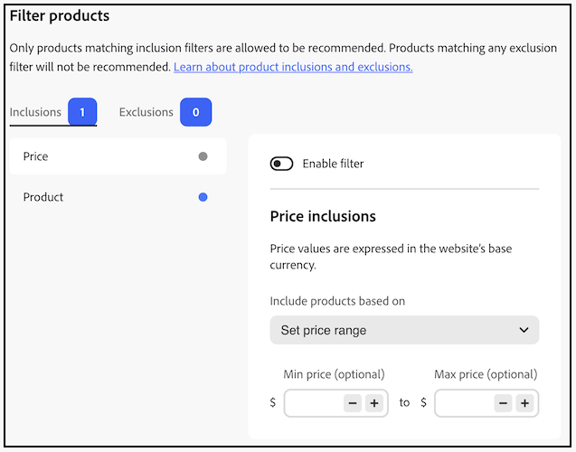

# Filtrar productos

[!DNL Adobe Commerce Optimizer] aplica automáticamente filtros predeterminados no configurables a las unidades de recomendación. Si tiene varias unidades de recomendación implementadas en una página, [!DNL Adobe Commerce Optimizer] filtra los productos que se repiten en las unidades. Solo se usa la primera referencia a un producto repetido, para dejar espacio a otros productos que se recomienden. [!DNL Adobe Commerce Optimizer] también filtra los productos comprados anteriormente y los que están en el carro de compras.

Cuando [crea](create.md) una unidad de recomendación, puede definir filtros que controlen qué productos se pueden mostrar en las recomendaciones. Estos filtros se basan en un conjunto de condiciones de inclusión o exclusión que usted defina. En las recomendaciones solo aparecen los productos que cumplen todas las condiciones de inclusión. No se recomiendan los productos que coinciden con cualquiera de las condiciones de exclusión.

Puede configurar varios filtros y habilitar solo los que desee seleccionando la opción en cada página de filtro. Esto le permite crear borradores de filtros para su uso futuro. El número de filtros habilitados se muestra en cada pestaña.

## Condiciones

Las condiciones pueden ser estáticas o dinámicas.

- Una condición estática utiliza atributos de producto existentes para determinar qué productos pueden aparecer en la unidad. Por ejemplo, puede especificar que solo aparezcan en la unidad los productos en existencias con un precio mayor que 25 $.

- Una condición dinámica elimina el contexto actual de un comprador, como la categoría o el producto que se está viendo en ese momento. Por ejemplo, al crear una recomendación de producto para implementarla en páginas de detalles de producto, puede crear una condición para recomendar solo productos que se encuentren dentro de un rango de precios relativo del producto que se está viendo en ese momento.

### Operadores lógicos

Los operadores lógicos `AND` y `OR` se utilizan para unir varias condiciones. Si utiliza filtros de inclusión y exclusión, las inclusiones se evalúan primero para determinar todos los productos posibles que se pueden recomendar y, a continuación, se eliminan de la lista los productos que coinciden con cualquier filtro de exclusión.

- `AND` - Une dos condiciones de filtrado de inclusión
- `OR` - Une dos condiciones de filtrado de exclusión

## Tipos de filtros

Cada tipo de filtro se dirige a un aspecto diferente del catálogo, como el producto y el precio, para que pueda reducir o ampliar qué productos son aptos para una unidad. Elija los tipos que coincidan con sus objetivos de comercialización y, a continuación, combine las condiciones de inclusión y exclusión según sea necesario; las subsecciones siguientes describen cómo se comporta cada tipo y cómo lo aplica [!DNL Adobe Commerce Optimizer].

>[!NOTE]
>
>Solo se pueden recomendar los productos que coincidan con los filtros de **inclusión** y se eliminará cualquier producto que coincida con un filtro de **exclusión**.

### Precio

>[!IMPORTANT]
>
>La siguiente función está en versión beta.

El filtrado de precios usa el **precio calculado final** de cada producto para el **libro de precios activo** de la tienda, el asignado a la tienda donde se representa la unidad de recomendación. Ese valor refleja descuentos, promociones y precios especiales definidos en ese libro de precios, no solo el precio de lista. La evaluación utiliza únicamente el libro de precios de esa tienda; no se aplican otras tiendas ni libros de precios. Cómo se configura la asignación de libros de precios a una tienda con el catálogo y la configuración de [libros de precios](../../setup/pricebooks.md).

#### Cómo se incluyen y excluyen las reglas para utilizar el precio

- **Reglas de inclusión**: solo siguen siendo aptos los productos cuyo precio final **coincida con todas las** condiciones de inclusión definidas. Esto incluye todos los filtros de inclusión habilitados (por ejemplo, su rango de precios más cualquier otra regla de inclusión).
- **Reglas de exclusión**: los productos cuyo precio final **coincide con cualquier** condición de exclusión definida se eliminan de las recomendaciones.

**Precio mostrado** - El precio mostrado en los productos dentro de la unidad de recomendación es el mismo **precio final** del libro de precios de esa tienda, por lo que lo que ven los compradores coincide con el valor utilizado para el filtrado.

#### Configurar un filtro de precios

1. Mientras [crea o edita](create.md) una unidad de recomendación, abra **[!UICONTROL Filter products]** (o vaya al paso _Filtros_ del flujo de trabajo de la unidad).
1. Seleccione la ficha **[!UICONTROL Inclusions]** o **[!UICONTROL Exclusions]**, en función de si desea permitir sólo los productos de un intervalo de precios o bloquear los productos de un intervalo. El distintivo de cada pestaña muestra cuántos filtros de ese tipo están habilitados.
1. En la lista de la izquierda, seleccione **[!UICONTROL Price]**.
1. Activar **[!UICONTROL Enable filter]**.

   Los valores de precio utilizan la **moneda base del sitio web**, como se indica en la página.

1. Abra **[!UICONTROL Include products based on]** (en la ficha **[!UICONTROL Inclusions]**) o el control equivalente de la ficha **[!UICONTROL Exclusions]** y elija **[!UICONTROL Set price range]**.
1. Establezca un(a) **[!UICONTROL Min price]** y/o **[!UICONTROL Max price]** opcional(a) utilizando los campos junto al símbolo de moneda. Puede escribir cantidades o utilizar los controles **-** y **+** para ajustar los valores. Deje un límite vacío si no necesita un mínimo o un máximo. La gama se compara con el precio calculado final de cada producto para el libro de precios activo de la tienda.
1. Termine de configurar la unidad de recomendación y guarde o publique como lo haría normalmente para que el filtro surta efecto.

### Product

Los filtros de producto están destinados a elementos de catálogo individuales por **SKU**. Agrega una o más SKU para permitir solo esos productos (**Inclusiones**) o para bloquearlos (**Exclusiones**), con la misma página de **[!UICONTROL Filter products]** que [filtros de precio](#price). No puede mostrar productos deshabilitados ni productos que no sean visibles individualmente en una unidad de recomendación; esos productos nunca aparecen en la tienda, independientemente de los filtros.

#### Configuración de un filtro de producto

1. Mientras [crea o edita](create.md) una unidad de recomendación, abra **[!UICONTROL Filter products]** (o vaya al paso _Filtros_ del flujo de trabajo de la unidad).
1. Seleccione la ficha **[!UICONTROL Inclusions]** o **[!UICONTROL Exclusions]**. El distintivo de cada pestaña muestra cuántos filtros de ese tipo están habilitados.
1. En la lista de la izquierda, seleccione **[!UICONTROL Product]**.
1. Activar **[!UICONTROL Enable filter]**.

   El encabezado del panel derecho refleja la pestaña, por ejemplo **[!UICONTROL Product inclusions]** o el equivalente para las exclusiones.

1. En **[!UICONTROL Product SKU]**, escriba un SKU y haga clic en **[!UICONTROL Add]**. Repita el proceso para añadir más SKU.

   En **[!UICONTROL Product SKUs]**, cada SKU aparece como una etiqueta extraíble. Haz clic en **X** en una etiqueta para eliminar esa SKU, o haz clic en **[!UICONTROL Clear All]** para eliminar todas las SKU de la lista.

1. Termine de configurar la unidad de recomendación y guarde o publique como lo haría normalmente para que el filtro surta efecto.

Para **inclusiones**, solo se pueden recomendar productos cuyas SKU estén en la lista (y que cumplan con los otros filtros de inclusión habilitados). Para **exclusiones**, no se recomienda ningún producto cuya SKU se haya enumerado, aunque de lo contrario se clasificaría.

>[!NOTE]
>
>Los productos secundarios de un producto configurable no se muestran en una unidad de recomendación porque tienen la visibilidad de _No visible individualmente_.

<!--### Attribute

You can filter products based on attribute criteria, including attribute values. Selected values use OR logic to either include or exclude products when any of the specified values are found.-->
