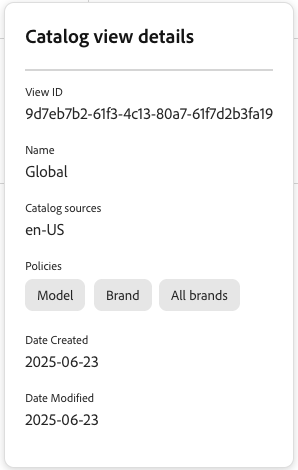

# Vistas del catálogo de servicios de comercialización

Las vistas de catálogo son la base de Adobe Commerce Optimizer Merchandising Services, lo que le permite organizar el catálogo de productos por estructura empresarial, directivas y precios. Este modelo de datos flexible admite escenarios de varias marcas, unidades de negocio y varios idiomas, a la vez que mantiene la eficacia operativa.

## ¿Qué son las vistas de catálogo?

Las vistas de catálogo definen cómo se organiza y muestra el catálogo de productos. Actúan como filtros que determinan lo siguiente:

- **Qué productos son visibles** según la estructura de la empresa (marcas, regiones, distribuidores)
- **Qué precios se muestran** a través de los libros de precios vinculados
- **Cómo se filtran los productos** mediante directivas (atributos como marca, modelo y categoría)
- **Qué origen de catálogo se usa** según atributos como la configuración regional

Considere las vistas de catálogo como &quot;lentes&quot; diferentes a través de las cuales los clientes ven el catálogo. Por ejemplo:

- Una vista del catálogo de distribuidores puede mostrar únicamente los productos disponibles para ese distribuidor específico
- Una vista de catálogo regional puede mostrar productos y precios específicos de un área geográfica
- Una vista del catálogo de marcas puede mostrar solo productos de una marca en particular

## Creación de una vista de catálogo

En esta sección, crea una vista de catálogo, selecciona una [política](policies.md) y un [libro de precios](pricebooks.md).

Antes de crear una vista de catálogo, asegúrese de lo siguiente:

- [Se crearon directivas](policies.md) para definir los filtros de producto.

- [Capas de catálogo definidas](catalog-layer.md) para definir variantes de sus productos.

- [Libros de precios ingeridos](pricebooks.md) para precios.

1. En el menú de la izquierda, ve a _Configuración de tienda_ y haz clic en **[!UICONTROL Catalog views]**.

1. Haga clic en **[!UICONTROL Create catalog view]**.

1. Configure los detalles de la vista del catálogo:

   - **Nombre**: escriba el nombre de la vista de catálogo, por ejemplo `Celport`.
   - **Orígenes del catálogo**: seleccione el origen del catálogo (configuración regional), por ejemplo `en-US`.
   - **Capas de catálogo**: revise las capas ingeridas y la prioridad.
   - **Directivas**: utilice la lista desplegable para seleccionar las directivas relevantes. Por ejemplo, &quot;Marca&quot;, &quot;Modelo&quot;. palo de golfAsegúrese de que ya ha [creado una directiva](policies.md).

1. Seleccione el libro de precios que desea vincular a la vista de catálogo.

   - **Usar todos los libros de precios disponibles**: esta opción extrae los datos de precios de todos los libros de precios disponibles.
   - **Permitir solo los libros de precios seleccionados**- Esta opción muestra el cuadro de diálogo **Agregar libros de precios permitidos** donde puede seleccionar qué libro de precios específico se va a utilizar para la vista de catálogo.
   - **Deshabilitar precios**: esta opción no está disponible en este momento.

1. Haga clic en **[!UICONTROL Add]** para crear la vista de catálogo con los libros de precios y las directivas vinculados.

La página Vistas de catálogo se actualiza para mostrar la nueva vista de catálogo&#x200B;

Después de completar estos pasos, la vista de catálogo ahora está configurada para mostrar productos y precios en función de las fuentes y directivas seleccionadas.

## Capas de catálogo

Las capas de catálogo permiten modificar los datos de producto dentro de una vista de catálogo sin cambiar los datos de origen originales. Las capas aplican cambios a atributos de producto específicos, como nombre, descripción, imágenes, vínculos y metadatos, creando una capa sobre el catálogo base. Los datos originales del producto permanecen intactos, lo que permite personalizar los productos de forma segura y revertir los cambios en cualquier momento.

Los casos de uso comunes para las capas de catálogo incluyen:

- **Optimización de SEO**: anula los metatítulos y las descripciones de los productos según las recomendaciones de IA de [Sites Optimizer](../manage-results/opportunities.md)
- **Campañas de temporada**: actualiza temporalmente nombres de productos, descripciones o imágenes para las promociones
- **Personalización regional**: muestra información de producto diferente según la ubicación geográfica o el idioma
- **Pruebas A/B**: Pruebe diferentes presentaciones de productos para optimizar las tasas de conversión
- **Administración de varias marcas**: personalice los atributos del producto para las distintas vistas del catálogo de marcas.

Para obtener más información sobre cómo crear, administrar y priorizar las capas de catálogo, consulte [Capas de catálogo](catalog-layer.md).

## Administrar vista de catálogo

Siga estas instrucciones para actualizar o ver las propiedades de las vistas de catálogo existentes.

### Editar vista de catálogo

1. En el área de trabajo *Vistas de catálogo*, busque la vista de catálogo en la cuadrícula que desea editar y haga clic en **...** para abrir el menú de acciones.
1. Haga clic en **Editar** para acceder al editor de vista de catálogo.
1. Actualice el nombre, los orígenes de catálogo, las directivas y la información del libro de precios según sea necesario.
1. Guarde los cambios.

### Eliminar vista de catálogo

1. En el área de trabajo *Vistas de catálogo*, busque la vista de catálogo en la cuadrícula que desea editar y haga clic en **...** para abrir el menú de acciones.
1. Haga clic en **Eliminar**.

   Cuando aparezca el diálogo de confirmación, haga clic en **[!UICONTROL Delete]**.

### Ver detalles

Esta opción proporciona una forma rápida de ver todos los parámetros de vista de catálogo mientras se mantiene en la tabla *Vistas de catálogo*.

En el área de trabajo *Vistas de catálogo*, busque la vista de catálogo en la cuadrícula que desee editar y haga clic en el .

Desde aquí puede ver los detalles de configuración de la vista de catálogo, como:

- Ver ID
- Nombre
- Fuentes de catálogo
- Políticas
- Fecha de creación
- Datos modificados

Algunos de estos ajustes de configuración son necesarios al configurar la tienda o utilizar la API de ingesta de datos.

## Descripción general de arquitectura

Las vistas de catálogo forman parte del marco de servicios de comercialización que reemplaza el marco de sitio web, tienda y vista de tienda utilizado en las fundaciones de Adobe Commerce por un modelo más flexible:

![[!DNL Merchandising Services] arquitectura](../assets/merchandising-svcs-architecture.png)

### Cómo funciona

**1. Ingesta de datos**
Los datos de catálogo de PIM, ERP y otros sistemas se incorporan al marco de servicios de comercialización. Cada SKU contiene información de configuración regional y atributos de producto que se asignan a vistas de catálogo, políticas y configuraciones regionales. Para obtener más información sobre la ingesta de datos, consulte la [documentación para desarrolladores](https://developer.adobe.com/commerce/services/optimizer/).

**2. Catálogo base unificado**
Los datos introducidos crean un catálogo base unificado en la canalización de datos del servicio de catálogo. Esta fuente única elimina la duplicación de datos entre unidades empresariales.

**3. Vistas de catálogo**
Varias vistas de catálogo representan diferentes unidades de negocio (por ejemplo, Texas Retail, Texas Retail Seasonal). Las configuraciones regionales, las directivas y los libros de precios se pueden compartir en las vistas de catálogo para mayor flexibilidad.

**4. Entrega multicanal**
Los datos del catálogo filtrado se envían a varios destinos, incluidos escaparates de Edge Delivery Services, mercados, plataformas de publicidad y microtiendas personalizadas. Para obtener más información sobre la entrega de datos del catálogo, consulte la [documentación para desarrolladores](https://developer.adobe.com/commerce/services/optimizer/).

### Componentes clave

| Componente | Finalidad | Ejemplo |
|---|---|---|
| **Vista de catálogo** | Unidad de negocio o canal de distribución | Red de distribuidores, Tienda regional |
| **Directiva** | Filtro de productos basado en atributos | Marca, modelo y categoría |
| **Configuración regional** | Configuración de idioma/región | en-US, fr-CA, es-MX |
| **Libro de precios** | Estructura de precios | Comercial, Mayorista, Empleado |

### Flujo de datos

1. **Ingesta**: datos de productos de sistemas PIM/ERP
2. **Proceso**: aplicar vistas de catálogo, directivas y precios
3. **Enviar**: sirve el catálogo filtrado a tiendas, mercados, etc.

## Características principales

| Función | Beneficio |
|---|---|
| **Catálogo base único** | Eliminar la duplicación de datos entre unidades empresariales |
| **Precios flexibles** | Varios libros de precios por SKU para diferentes segmentos de clientes |
| **Escalable** | Gestione más de 200 millones de SKU de forma eficaz |
| **Canal múltiple** | Ofrecer catálogos a tiendas, mercados y plataformas publicitarias. |
| **Actualizaciones en tiempo real** | Actualización rápida de los datos de catálogo para promociones y campañas |

## Casos de uso

### Conglomerado multimarca

**Desafío**: administra varias marcas, países e idiomas 
**Solución**: catálogo único con vistas de catálogo para cada combinación de marca y región

### Distribuidor de piezas de automóviles

**Desafío**: 3.000 distribuidores con los mismos productos pero precios diferentes 
**Solución**: Un catálogo con vistas de catálogo y libros de precios específicos del distribuidor

### Retailer con varias ubicaciones

**Desafío**: precios e inventario diferentes por ubicación 
**Solución**: vistas de catálogo basadas en ubicación con directivas específicas de región

>[!INFO]
>
>Para obtener información detallada acerca de la ingesta y entrega de datos de catálogo, consulte la [documentación para desarrolladores](https://developer.adobe.com/commerce/services/optimizer/).

## Más parecido a esto

- [Capas de catálogo](catalog-layer.md): aprenda a modificar los datos de productos sin cambiar el origen original
- [Directivas](policies.md): cree directivas para filtrar productos en las vistas de catálogo
- [Libros de precios](pricebooks.md): administre estructuras de precios para diferentes segmentos de clientes
