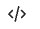

# Sincronización de datos

La página **Sincronización de datos** muestra una descripción general del estado de sincronización de los datos de producto transferidos desde su origen de datos (su catálogo de Commerce existente, sistema de administración de información de producto (PIM), sistema de planificación de recursos empresariales (ERP), etc.) a [!DNL Adobe Commerce Optimizer].

La página **Sincronización de datos** proporciona información valiosa sobre la disponibilidad de datos de productos para tu tienda, lo que garantiza que se puedan mostrar rápidamente a tus compradores.

La página **Sincronización de datos** se encuentra en *Configuración* > **Sincronización de datos**.

La página **Sincronización de datos** contiene los siguientes campos:

| Campo | Descripción |
|--- |--- |
| Origen del catálogo | Configuración regional específica para los datos sincronizados. |
| [!DNL Catalog Service] | Muestra la última actualización de sincronización, el total de productos recibidos, un campo de búsqueda y una tabla de productos sincronizados para [!DNL Catalog Service]. |
| Descubrimiento de productos | Muestra la última actualización de sincronización, el total de productos recibidos, un campo de búsqueda y una tabla de los productos sincronizados para la búsqueda. |
| Recommendations | Muestra la última actualización de sincronización, el total de productos recibidos, un campo de búsqueda y una tabla de productos sincronizados para Recommendations. |
| Productos recibidos en las últimas 3 horas | Muestra el número de productos que se han transferido del origen del catálogo a Adobe Commerce Optimizer en las últimas tres horas. Si realiza actualizaciones poco frecuentes en el catálogo, este valor suele ser cero. |
| Total de productos en el catálogo | Refleja el número total de productos de catálogo disponibles para Adobe Commerce Optimizer. |
| Productos sincronizados | Proporciona detalles sobre los productos sincronizados con Adobe Commerce Optimizer. De forma predeterminada, esta tabla está ordenada por Última actualización. Para buscar un producto específico, utilice el campo **[!UICONTROL Search by Name or SKU]**. |

## Lista de productos sincronizados

Para ver los detalles de un producto sincronizado en formato JSON, haga clic en el icono de código  en la fila del producto de la tabla Productos sincronizados.

## Resincronizar datos de catálogo

Si no ve productos específicos en la página **Sincronización de datos**, debe iniciar una resincronización desde el sistema de flujo ascendente. Sin embargo, tenga en cuenta que una resincronización puede aumentar la carga en los recursos de hardware. Sin embargo, puede que sea necesario volver a sincronizar el catálogo en los siguientes casos:

- Cuando se realizan cambios significativos en el catálogo de productos, como agregar nuevos productos, actualizar detalles del producto o modificar categorías

- Si notas discrepancias o problemas de rendimiento en la visualización de datos de productos en tus tiendas

>[!IMPORTANT]
>
>El tiempo que se tarda en completar la sincronización varía en función del tamaño del catálogo y el volumen de datos actualizados.
