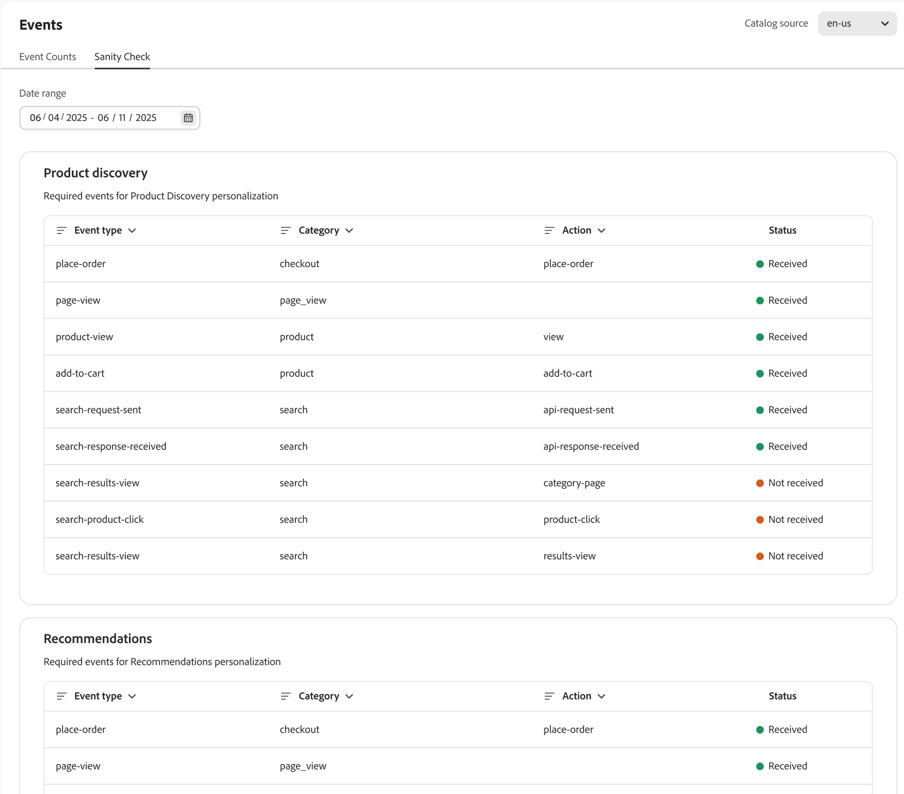

# Eventos

Los eventos son una herramienta esencial para mejorar la experiencia de compra y dirigir las conversiones mediante el aprovechamiento de las perspectivas de datos en tiempo real.

[!DNL Adobe Commerce Optimizer] implementa eventos de tienda en el sitio automáticamente. Estos eventos capturan datos de las interacciones de los compradores en el sitio. Estos datos anónimos alimentan [recomendaciones](../../manage-results/recommendation-performance.md), [descubrimiento de productos](../../manage-results/search-performance.md) y [métricas de éxito](../../manage-results/success-metrics.md).

>[!NOTE]
>
>La recopilación de datos no incluye información de identificación personal (PII). Todos los identificadores de usuario, como los ID de cookie y las direcciones IP, se anonimizan estrictamente. [Más información](https://www.adobe.com/privacy/experience-cloud.html).

La página **Eventos** le permite observar los datos de evento de tienda que se están recopilando. Ver la recopilación de datos de evento permite a los comerciantes comprobar que han implementado correctamente los eventos de tienda y que estos se han capturado correctamente. Los comerciantes pueden utilizar esta página para identificar posibles problemas y tomar medidas para resolver cualquier problema de evento.

## Recuento de eventos

La ficha **Recuentos de eventos** hace un seguimiento de las interacciones del comprador, como búsquedas, clics y compras, para ayudarle a analizar las tendencias y mejorar la experiencia de compra.

{zoomable="yes"}

| Campo | Descripción |
|---|---|
| **Intervalo de fecha** | Le permitimos especificar el intervalo de fechas para ver un subconjunto específico de datos. |
| **Eventos de tienda por hora** | Muestra un gráfico con el número de eventos activados en la tienda. |
| **Eventos de tienda totales** | Tabla filtrable que muestra los detalles de todos los eventos activados en la tienda. |

## Comprobación de coherencia

La ficha **Comprobación de coherencia** ofrece información sobre el estado de cada evento de comportamiento, lo que garantiza una recopilación de datos y una funcionalidad precisas. palo de golf

{zoomable="yes"}

| Campo | Descripción |
|---|---|
| **Intervalo de fecha** | Le permitimos especificar el intervalo de fechas para ver un subconjunto específico de datos. |
| **Descubrimiento de productos** | Muestra los eventos necesarios para personalizar los resultados de búsqueda de productos. La columna **Estado** indica si se recibieron los eventos. |
| **Recomendaciones** | Muestra los eventos necesarios para personalizar las recomendaciones de productos. La columna **Estado** indica si se recibieron los eventos. |

Las secciones siguientes describen detalles de eventos para [descubrimiento de productos](#product-discovery) y [recomendaciones](#recommendations).

### Descubrimiento de productos

La detección de productos utiliza eventos para potenciar los algoritmos de búsqueda como &quot;Más visitados&quot; y &quot;Ha visto esto, ha visto aquello&quot;.

En esta tabla se describen los eventos que usa la detección de productos [estrategias de clasificación](../../merchandising/rules/add.md#intelligent-ranking).

| Estrategia de clasificación | Eventos | Página |
| --- | --- | --- |
| Más visitados | `page-view` `product-view` | Página de detalles del producto |
| Más comprados | `page-view` `place-order` | Carro/cierre de compra |
| Más añadidos al carro | `page-view` `add-to-cart` | Página de detalles del producto Página de lista de productos Carro Lista de deseos |
| Vio esto, vio aquello. | `page-view` `product-view` | Página de detalles del producto |

#### Eventos de panel requeridos

Se requieren algunos eventos para rellenar el [panel de rendimiento de búsqueda](../../manage-results/search-performance.md)

| Área de panel | Eventos | Campo de combinación |
| ------------------- | ------------- | ---------- |
| Búsquedas únicas | `page-view`, `search-request-sent`, `search-response-received` | `searchRequestId` |
| Búsquedas sin resultados | `page-view`, `search-request-sent`, `search-response-received` | `searchRequestId` |

### Recommendations

Existen dos tipos de datos utilizados en Recommendations:

- **Comportamiento**: datos de la participación de un comprador en el sitio, como vistas de productos, elementos agregados al carro de compras y compras.
- **Catálogo**: metadatos de producto, como nombre, precio, disponibilidad, etc.

Adobe Sensei agrega los datos de comportamiento y catálogo, creando Recommendations para cada tipo de recomendación. A continuación, el servicio Recommendations implementa esas recomendaciones en la tienda en forma de widget que contiene el producto recomendado _items_.

Algunos tipos de recomendación utilizan datos de comportamiento de los compradores para entrenar modelos de aprendizaje automático y crear recomendaciones personalizadas. Otros tipos de recomendación solo utilizan datos de catálogo y no utilizan datos de comportamiento. Si desea empezar a usar Recommendations rápidamente en el sitio, puede usar el tipo de recomendación `More like this`.

#### Inicio en frío

¿Cuándo puede empezar a utilizar tipos de recomendación que utilicen datos de comportamiento? Depende de ti. Este problema se conoce como _Inicio en frío_.

El problema de _arranque en frío_ se refiere al tiempo que tarda un modelo en entrenar y en ser efectivo. En el caso de las recomendaciones, esto significa esperar a que Adobe Sensei recopile datos suficientes para entrenar sus modelos de aprendizaje automático antes de implementar unidades de recomendaciones en el sitio. Cuantos más datos tengan los modelos, más precisas y útiles serán las recomendaciones. Dado que la recopilación de datos se produce en un sitio activo, es mejor iniciar este proceso antes.

La siguiente tabla proporciona algunas directrices generales sobre la cantidad de tiempo que se tarda en recopilar suficientes datos para cada tipo de recomendación:

| Tipo de recomendación | Tiempo de formación | Notas |
|---|---|---|
| Basado en popularidad (`Most viewed`, `Most purchased`, `Most added to cart`) | Varía | Depende del volumen de eventos: las vistas son los más comunes y, por lo tanto, aprende más rápido; luego agrega al carro de compras y, por último, compra |
| `Viewed this, viewed that` | Requiere más formación | El volumen de las vistas de productos es decentemente alto |
| `Viewed this, bought that`, `Bought this, bought that` | Requiere la mayor cantidad de formación | Los eventos de compra son los eventos más inusuales en un sitio de comercio, especialmente en comparación con las vistas de productos |
| `Trending` | Se necesitan tres días de datos para establecer una línea de base de popularidad | La tendencia es una medida del impulso reciente en la popularidad de un producto en comparación con su propia línea de base de popularidad. La puntuación de tendencia de un producto se calcula mediante un conjunto en primer plano (popularidad reciente en 24 horas) y un conjunto de fondo (línea de base de popularidad en 72 horas). Si la popularidad de un artículo aumenta significativamente dentro de un periodo de 24 horas en comparación con su popularidad de línea de base, entonces recibe una puntuación de tendencia alta. Cada producto tiene esta puntuación y los artículos con la puntuación más alta en cualquier momento comprenden el conjunto de productos de tendencias principales. |

Otras variables que pueden afectar al tiempo necesario para entrenar:

- Un mayor volumen de tráfico contribuye a un aprendizaje más rápido
- Algunos tipos de recomendación se entrenan más rápido que otros
- [!DNL Adobe Commerce Optimizer] vuelve a calcular los datos de comportamiento cada cuatro horas. Las recomendaciones se vuelven más precisas cuanto más tiempo se utilizan en el sitio.

Para ayudarle a visualizar el progreso de formación de cada tipo de recomendación, la página [crear recomendación](../../merchandising/recommendations/create.md#readiness-indicators) muestra indicadores de preparación.

Mientras se recopilan los datos en el sitio activo y se imparten los modelos de aprendizaje automático, puede finalizar otras tareas de prueba y configuración necesarias para configurar las recomendaciones. Cuando haya terminado con este trabajo, los modelos tendrán datos suficientes para crear recomendaciones útiles, lo que le permitirá implementarlas en su tienda.

Si el sitio no recibe tráfico suficiente (vistas, compras, tendencias) para la mayoría de los SKU de producto, es posible que no haya suficientes datos para completar el proceso de aprendizaje. Esto puede hacer que el indicador de preparación del espacio de trabajo de Recommendations parezca atascado. Los indicadores de preparación están pensados para proporcionar a los comerciantes otro punto de datos a la hora de elegir qué tipo de recomendaciones es mejor para su tienda. Los números son una guía y es posible que nunca alcancen el 100%. [Más información](../../merchandising/recommendations/create.md#readiness-indicators) sobre los indicadores de preparación.

#### Recomendaciones de copia de seguridad

Si los datos de entrada no son suficientes para proporcionar todos los elementos de recomendación solicitados en una unidad, [!DNL Adobe Commerce Optimizer] proporciona recomendaciones de copia de seguridad para rellenar las unidades de recomendación. Por ejemplo, si implementa el tipo de recomendación `Recommended for you` en su página de inicio, un comprador que visita por primera vez su sitio no ha generado suficientes datos de comportamiento para recomendar con precisión productos personalizados. En este caso, [!DNL Adobe Commerce Optimizer] muestra artículos basados en el tipo de recomendación `Most viewed` a este comprador.

En caso de que la recopilación de datos de entrada sea insuficiente, los siguientes tipos de recomendación vuelven a `Most viewed`:

- `Recommended for you`
- `Viewed this, viewed that`
- `Viewed this, bought that`
- `Bought this, bought that`
- `Trending`
- `Conversion (view to purchase)`
- `Conversion (view to cart)`

#### Eventos específicos de la recomendación

En la tabla siguiente se enumeran los eventos que se activan cuando los compradores interactúan con las unidades de recomendación en la tienda. Los datos del evento recopilados alimentan [métricas](../../manage-results/recommendation-performance.md) para analizar el rendimiento de las recomendaciones.

| Evento | Descripción |
| --- | --- |
| `impression-render` | Se envía cuando se representa la unidad de recomendación en la página. Si una página tiene dos unidades de recomendación (comprado-comprado, ver-ver), se envían dos eventos `impression-render`. Este evento se utiliza para rastrear la métrica en busca de impresiones. |
| `rec-add-to-cart-click` | El comprador hace clic en el botón **Agregar al carro** de un artículo de la unidad de recomendación. |
| `rec-click` | El comprador hace clic en un producto de la unidad de recomendación. |
| `view` | Se envía cuando la unidad de recomendación alcanza al menos el 50 % de visibilidad, por ejemplo desplazándose hacia abajo en la página. Por ejemplo, si una unidad de recomendación tiene dos líneas, se envía un evento `view` cuando el comprador ve una línea más un píxel de la segunda línea. Si el comprador desplaza la página hacia arriba y hacia abajo varias veces, el evento `view` se envía tantas veces como vuelva a ver toda la unidad de recomendación en la página. |

#### Eventos de panel requeridos

Se requieren los siguientes eventos para rellenar el [panel de rendimiento de Recommendations](../../manage-results/recommendation-performance.md)

| Columna del panel | Eventos | Campo de combinación |
| ---------------- | --------- | ----------- |
| Impresiones | `page-view`, `recs-request-sent`, `recs-response-received`, `recs-unit-render` | `unitId` |
| Vistas | `page-view`, `recs-request-sent`, `recs-response-received`, `recs-unit-render`, `recs-unit-view` | `unitId` |
| Clics | `page-view`, `recs-request-sent`, `recs-response-received`, `recs-item-click`, `recs-add-to-cart-click` | `unitId` |
| Ingresos | `page-view`, `recs-request-sent`, `recs-response-received`, `recs-item-click`, `recs-add-to-cart-click`, `place-order` | `unitId`, `sku`, `parentSku` |
| Ingresos LT | `page-view`, `recs-request-sent`, `recs-response-received`, `recs-item-click`, `recs-add-to-cart-click`, `place-order` | `unitId`, `sku`, `parentSku` |
| CTR | `page-view`, `recs-request-sent`, `recs-response-received`, `recs-unit-render`, `recs-item-click`, `recs-add-to-cart-click` | `unitId`, `sku`, `parentSku` |
| vCTR | `page-view`, `recs-request-sent`, `recs-response-received`, `recs-unit-render`, `recs-unit-view`, `recs-item-click`, `recs-add-to-cart-click` | `unitId`, `sku`, `parentSku` |

Los siguientes eventos no son específicos de Recommendations, pero son necesarios para que Adobe Sensei interprete correctamente los datos del comprador:

- `view`
- `add-to-cart`
- `place-order`

#### Tipo de recomendación

En esta tabla se describen los eventos utilizados por cada tipo de recomendación.

| Tipo de recomendación | Eventos | Página |
| --- | --- | --- |
| Más visitados | `page-view` `product-view` | Página de detalles del producto |
| Más comprados | `page-view` `place-order` | Carro/cierre de compra |
| Más añadidos al carro | `page-view` `add-to-cart` | Página de detalles del producto Página de lista de productos Carro Lista de deseos |
| Vio esto, vio aquello. | `page-view` `product-view` | Página de detalles del producto |
| Vio esto, compró aquello. | `page-view` `product-view` | Página de detalles del producto Carro/Cierre de compra |
| Compré esto, compré aquello. | `page-view` `product-view` | Página de detalles del producto |
| Tendencia | `page-view` `product-view` | Página de detalles del producto |
| Conversión: Ver para comprar | `page-view` `product-view` | Página de detalles del producto |
| Conversión: Ver para comprar | `page-view` `place-order` | Carro/cierre de compra |
| Conversión: Ver al carro | `page-view` `product-view` | Página de detalles del producto |
| Conversión: Ver al carro | `page-view` `add-to-cart` | Página de detalles del producto Página de lista de productos Carro Lista de deseos |

## Asistencia

Si nota discrepancias en los datos o si las recomendaciones y los resultados de la búsqueda no funcionan según lo esperado, [envíe un vale de asistencia](https://experienceleague.adobe.com/en/docs/commerce-knowledge-base/kb/help-center-guide/magento-help-center-user-guide).
