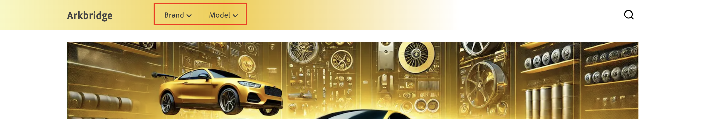

# Políticas

Las directivas son filtros de acceso a datos contenidos en vistas de catálogo que refinan aún más los datos enviados a cada vista de catálogo. Las políticas garantizan que el contenido correcto se envíe al destino correcto. Por ejemplo, tiendas físicas, mercados, canalizaciones de publicidad (Google, Facebook, Instagram).

Las directivas se basan en atributos de producto, como marca, modelo o categoría de artículo, y se utilizan para adaptar los datos del catálogo a los requisitos comerciales específicos. &#x200B;

## Filtros

Los filtros son el mecanismo dentro de una directiva que aplica la segmentación de catálogos. Los filtros permiten a las empresas adaptar las tiendas y las vistas de catálogo a conjuntos de productos específicos en función de las necesidades operativas. Los criterios, como atributos de producto, operadores y valores, se utilizan para definir una regla o condición que indique qué productos se incluyen o excluyen de una vista de catálogo o de una tienda.

### Partes de un filtro

Un filtro consta de las siguientes partes:

| Parte | Descripción | Ejemplo |
|---|---|---|
| **Atributo** | Atributo de producto utilizado para el filtrado. | `part_category` |
| **Operador** | La condición aplicada al atributo. | `IN`, `EQUALS`, `CONTAINS` |
| **Origen del valor** | Especifica si los valores son `STATIC` o `TRIGGER`. | `STATIC` [Más información](#value-source-types) |
| **Valor** | Los valores específicos que cumplen la condición. | `brakes, suspension` |

### Ejemplo

Un filtro con el atributo `part_category`, un operador de `IN` y valores `brakes, suspension` garantiza que la directiva filtre y muestre únicamente los productos con un atributo `part_category` que tenga un valor de `brake` o `suspension`.

### Tipos de origen de valor

Existen dos tipos de orígenes de valores: **STATIC** y **DÉCLENCHEUR**.

Las directivas con un **origen Value** de **STATIC** se consideran directivas universales. Las políticas universales definen la experiencia de un sitio web en su conjunto. Esto significa que la vista de catálogo siempre ejecutará esa directiva. En otras palabras, la ejecución de esa política no se basa en ninguna interacción del usuario en la tienda.

Las directivas con un **origen de valor** de **DÉCLENCHEUR** se denominan directivas exclusivas. Esto significa que la vista de catálogo ejecutará esa directiva solo cuando el déclencheur se especifique en el encabezado de la llamada de API. En la tienda, esto significa que la información se muestra en función de lo que seleccione el comprador. Por ejemplo, en la siguiente imagen, hay dos menús desplegables: **Marca** y **Modelo**.



**Marca** y **Modelo** son déclencheur definidos:

- `AC-Policy-Brand`
- `AC-Policy-Model`

Si el comprador hace clic en la lista desplegable **Marca**, el encabezado de la llamada de API contiene `AC-Policy-Brand`, que está configurado para mostrar únicamente los productos específicos de la directiva `AC-Policy-Brand`.

### Déclencheur de encabezado HTTP de varios valores {#multi-value-http-header-triggers}

Una directiva de déclencheur que use el tipo de transporte `HTTP_HEADER` puede recibir varios valores en un solo encabezado. Los valores deben separarse con comas y el operador de filtro debe ser `IN`. Cada valor se trata como una coincidencia aceptable. Los valores se evalúan con `OR` semántica.

Por ejemplo, un filtro de directiva que usa `IN` con el siguiente encabezado:

```
AC-Policy-Vehicle: UNIVERSAL,veh-bolt-mammoth-limited-2025
```

coincide con productos cuyo atributo `vehicle` es `UNIVERSAL` o `veh-bolt-mammoth-limited-2025`.

Mientras que un operador de filtro de `EQUALS`, `GREATER_THAN_EQUAL` o `LESS_THAN_EQUAL` se rechaza con un error de validación.

#### Notas de sintaxis

- El nombre del encabezado coincide con el nombre del déclencheur que configuró, por ejemplo `AC-Policy-Vehicle`.
- Las comas separan los valores individuales dentro del encabezado. Si el mismo encabezado `AC-Policy-_Name_` aparece más de una vez, sus valores se combinarán en un único valor de encabezado separado por comas
- El operador de filtro es `IN`.
- Un filtro de directiva con **origen de valor** establecido en `TRIGGER`.
- Un déclencheur cuyo **tipo de transporte** es `HTTP_HEADER`.

## Crear política

En esta sección, se crea una directiva nueva. La directiva puede ser **STATIC** o **DÉCLENCHEUR**.

### Crear una política STATIC

1. En el menú de la izquierda, abra la sección **[!UICONTROL Catalog]** y haga clic en **[!UICONTROL Policies]**.

1. Haga clic en el botón **[!UICONTROL Add Policy]**.

   Se abre una nueva página para que rellene los detalles de la directiva. &#x200B;

1. Introduzca el nombre de la política, por ejemplo &quot;Celport Part Categories&quot;.

1. Haga clic en el botón **[!UICONTROL Add Filter]**.

   Se abrirá un cuadro de diálogo para que pueda añadir detalles del filtro.

1. Añada los detalles del filtro. Por ejemplo:

   1. **Atributo** - Escriba un atributo de su catálogo. Por ejemplo, &quot;part_category&quot;. Este nombre debe coincidir exactamente con el nombre del atributo del catálogo.
   1. **Operador**: elija el operador. Por ejemplo, **IN**. &#x200B;
   1. **Valor Source** - Seleccionar **ESTÁTICO**. &#x200B;
   1. **Valor**: escriba un valor de la definición de atributo que especificó anteriormente. Por ejemplo, introduzca &quot;frenos&quot; para crear un filtro para las piezas de freno.
   1. Para guardar el valor, presione **Intro**.

      Si la directiva está diseñada para filtrar por varios valores, introduzca cada valor por separado.

1. Haga clic en el botón **[!UICONTROL Save]** en el cuadro de diálogo de detalles del filtro. &#x200B;

1. Haga clic en los puntos de acción (...) junto al filtro que creó y seleccione **Habilitar**. Desde aquí, también puedes **Editar**, **Deshabilitar** o **Eliminar** el filtro.

   La columna **Estado** muestra un icono verde y la palabra &quot;Habilitado&quot;.

1. Haga clic en el botón **[!UICONTROL Save]** para guardar la nueva directiva.&#x200B; Si el botón no está activo, asegúrese de agregar el nombre de la directiva haciendo clic en el icono de lápiz situado junto a **Nueva directiva**.

1. Para comprobar la nueva directiva, vuelva a la lista de directivas haciendo clic en la flecha hacia atrás. &#x200B;Verá su nueva política en la lista.

### Crear una política de DÉCLENCHEUR

1. En el menú de la izquierda, abra la sección **[!UICONTROL Catalog]** y haga clic en **[!UICONTROL Policies]**.

1. Haga clic en el botón **[!UICONTROL Add Policy]**.

   Se abre una nueva página para que rellene los detalles de la directiva. &#x200B;

1. Introduzca el nombre de la política, por ejemplo &quot;Celport Part Categories&quot;.

1. Haga clic en el botón **[!UICONTROL Add Trigger]**.

   Aparecerá el cuadro de diálogo **detalles del Déclencheur**.

1. Escriba un nombre para el déclencheur, como **AC-Policy-Brand**.

1. Seleccione **Tipo de transporte**. **HTTP_HEADER** es actualmente el único tipo compatible.

1. Haga clic en el botón **[!UICONTROL Save]** para guardar el déclencheur.

1. Haga clic en el botón **[!UICONTROL Add Filter]**.

   Se abrirá un cuadro de diálogo para que pueda añadir detalles del filtro.

1. Añada los detalles del filtro. Por ejemplo:

   1. **Atributo** - Escriba un atributo de su catálogo. Por ejemplo, &quot;part_category&quot;. Este nombre debe coincidir exactamente con el nombre del atributo del catálogo.
   1. **Operador**: elija el operador. Por ejemplo, **IN**. &#x200B;
   1. **Valor Source** - Seleccionar **DÉCLENCHEUR**. &#x200B;
   1. **Valor** - Escriba el nombre del déclencheur que creó anteriormente (**AC-Policy-Brand**).

1. Haga clic en el botón **[!UICONTROL Save]** en el cuadro de diálogo de detalles del filtro. &#x200B;

1. Haga clic en los puntos de acción (...) junto al filtro que creó y seleccione **Habilitar**. Desde aquí, también puedes **Editar**, **Deshabilitar** o **Eliminar** el filtro.

   La columna **Estado** muestra un icono verde y la palabra &quot;Habilitado&quot;.

1. Haga clic en el botón **[!UICONTROL Save]** para guardar la nueva directiva.&#x200B; Si el botón no está activo, asegúrese de agregar el nombre de la directiva haciendo clic en el icono de lápiz situado junto a **Nueva directiva**.

1. Para comprobar la nueva directiva, vuelva a la lista de directivas haciendo clic en la flecha hacia atrás. &#x200B;Verá su nueva política en la lista.

Al seguir estos pasos, la directiva se crea y está lista para vincularse a una vista de catálogo para controlar la visibilidad del producto.
