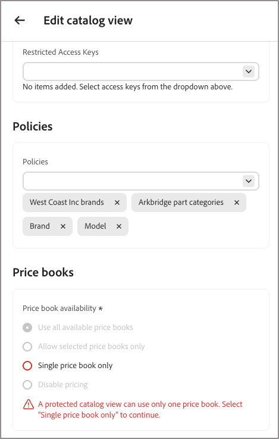

# Vistas del catálogo privado

De manera predeterminada, [la vista de catálogo](catalog-view.md) es pública. Habilite la protección del catálogo en una vista de catálogo para restringir el acceso a las solicitudes que incluyen un token firmado válido.

La protección del catálogo solo se aplica a la vista de catálogo seleccionada. No cambia las políticas ni las capas de la vista. Restringe la vista a un único libro de precios; consulte [Restricción del libro de precios en vistas de catálogo privado](#price-book-restriction-on-private-catalog-views).

Consulte [Casos de uso de claves de acceso restringido](restricted-access-keys.md#restricted-access-key-use-cases) para ver ejemplos de cuándo proteger una vista de catálogo.

## Comprender el límite de protección

La protección del catálogo solo se aplica a la vista de catálogo en la que está activada. Protege las solicitudes de catálogo y de búsqueda, pero no cambia las directivas ni las capas de la vista, protege otras vistas de catálogo ni protege el carro de compras, las operaciones de cierre de compra o de pedido.

El backend de comercio conectado debe aplicar de forma independiente la idoneidad de la compra.

## Restricción de libro de precios en vistas de catálogo privado

Una vista de catálogo privado sólo puede hacer referencia a un libro de precios. Esto difiere de una vista de catálogo público, que puede utilizar varios libros de precios.

Cuando se habilita [!UICONTROL Catalog Protection], el selector de libro de precios del formulario de vista de catálogo cambia de un control de selección múltiple a un control de selección única (botón de opción).



- Si activa [!UICONTROL Catalog Protection] en una vista de catálogo que tiene varios libros de precios asignados, no podrá guardar la vista hasta que elimine todos los libros de precios excepto uno.
- Si anteriormente ha guardado una vista de catálogo privado con varias asignaciones de libro de precios antes de que existiera esta restricción, la configuración de la vista de catálogo no cambia automáticamente. Sin embargo, la próxima vez que edite la vista, deberá eliminar todos los libros de precios excepto uno para poder guardar las actualizaciones.

En cada uno de estos casos, [!DNL Adobe Commerce Optimizer] muestra el siguiente mensaje de validación: `A protected catalog view can use only one price book. Select 'Single price book only' to continue.`

Las vistas de catálogo público no se ven afectadas por esta restricción y pueden seguir haciendo referencia a varios libros de precios.

## Proteger una vista de catálogo

Antes de empezar, [cree una clave de acceso restringido](restricted-access-keys.md) a partir de la clave pública que genere su aplicación cliente.

1. En el formulario de creación o edición de la vista de catálogo, cambie **[!UICONTROL Catalog Protection]** a **[!UICONTROL Enabled]**.

1. En **[!UICONTROL Restricted Access Keys]**, seleccione hasta tres [claves de acceso restringido](restricted-access-keys.md) para asignarlas a esta vista de catálogo.

   {width="70%" zoomable="yes"}

1. Haga clic en **[!UICONTROL Save catalog view]**.

   La vista de catálogo está ahora protegida. Solo las solicitudes que llevan un token firmado válido de una clave asignada pueden recuperar sus datos.

   >[!NOTE]
   >
   >Espere hasta cinco minutos para que los cambios de configuración de Protección de catálogos entren en vigor.

## Verificar que el acceso sea obligatorio

Para confirmar que una vista de catálogo privado rechaza solicitudes no autorizadas, llame a su [extremo GraphQL](../get-started.md#get-instance-details) con y sin un token firmado, utilizando estos encabezados:

| Header | Finalidad |
| --- | --- |
| `AC-View-ID` | La vista de catálogo que se va a consultar. |
| `AC-Price-Book-ID` | El libro de precios que aplicar. |
| `AC-Catalog-View-Access-Token` | El JWT firmado que prueba la autorización para la vista de catálogo. |

Una solicitud sin un token válido devuelve un error de GraphQL en lugar de datos de catálogo, por ejemplo:

```json
{
  "errors": [
    {
      "message": "Access key validation failed: Missing token",
      "extensions": { "x-commerce-exception": "access-key-invalid" }
    }
  ]
}
```

Una solicitud que lleva un token firmado por una clave asignada no caducada devuelve los datos del catálogo según lo esperado. Para obtener más información sobre cómo firmar un JWT y llamar a la API de comercialización, consulta la [documentación para desarrolladores](https://developer.adobe.com/commerce/services/optimizer/merchandising-services/using-the-api#authentication).

## Administrar claves de acceso restringido

Si [!UICONTROL Catalog Protection] está habilitado y todas las claves asignadas caducan, la vista de catálogo se vuelve inaccesible: las tiendas que dependen de esta vista de catálogo no pueden proporcionar datos desde ella. Asigne una clave nueva que no haya caducado para restaurar el acceso. Para obtener instrucciones, vea [Rotar claves](restricted-access-keys.md#rotate-a-key).

>[!IMPORTANT]
>
>La creación y administración automáticas de claves a través de Adobe Commerce y Adobe Commerce Optimizer Connector aún no están disponibles.

## Más parecido a esto

- [Vistas de catálogo](catalog-view.md): aprenda cómo las vistas de catálogo organizan el catálogo de productos según la estructura empresarial, las directivas y los precios.
- [Claves de acceso restringido](restricted-access-keys.md): cree, asigne y gire las claves utilizadas para firmar tokens para la protección del catálogo.
