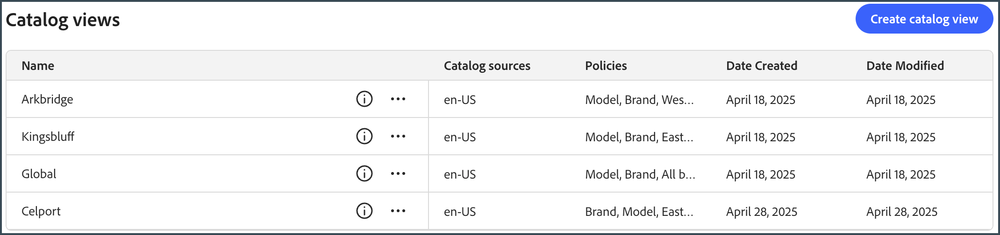

# Caso de uso completo del administrador de catálogos y tiendas

Este caso de uso se basa en un conglomerado de automóviles ficticios llamado Carvelo Automobile, que tiene una configuración operativa compleja. Muestra cómo usar [!DNL Adobe Commerce Optimizer] para administrar un catálogo que admite varias marcas, concesionarios y libros de precios, a la vez que ofrece una experiencia de tienda personalizada.

## Requisitos previos

Este caso de uso está diseñado para administradores y desarrolladores que deseen aprender a configurar una tienda y administrar un catálogo con [!DNL Adobe Commerce Optimizer]. Se supone que tiene conocimientos básicos de [!DNL Adobe Commerce Optimizer] y sus características.

**Tiempo estimado para finalizar:** 45-60 minutos

### Ajustes necesarios

Antes de comenzar este tutorial, asegúrese de que dispone de los siguientes requisitos previos:

- **Instancia de Adobe Commerce Optimizer**
   - Acceso a una instancia de prueba en Cloud Manager
   - Consulte [Introducción](../get-started.md) para obtener instrucciones de configuración

- **Permisos de usuario**
   - Acceso de administrador a Adobe Admin Console
   - Consulte [Administración de usuarios](../user-management.md) para configurar la cuenta
   - Si no tiene acceso, póngase en contacto con el representante de su cuenta de Adobe.

- **Datos de ejemplo**
   - Datos del catálogo de Carvelo Automobile cargados en su instancia
   - Siga las instrucciones del [Repositorio de ingesta de datos del catálogo de muestra](https://github.com/adobe-commerce/aco-sample-catalog-data-ingestion)
   - Puede eliminar los datos de ejemplo una vez finalizados mediante el script `reset.js` incluido

- **Entorno De Tienda**
   - Entorno de desarrollo local con Node.js
   - Proyecto de plantillas de tienda clonado y configurado
   - Consulte [Configuración de tienda](../storefront.md) para obtener instrucciones detalladas

## Vamos a empezar.

En este caso de uso, está trabajando con lo siguiente:

1. IU [!DNL Adobe Commerce Optimizer]: configure las vistas del catálogo y las directivas para administrar la compleja configuración operativa del catálogo para el caso de uso de Carvelo.

1. Commerce Storefront: procese la tienda usando los datos de catálogo de muestra cargados en su instancia de [!DNL Adobe Commerce Optimizer] y los archivos de configuración de Commerce Storefront, `fstab.yaml` y `config.json`.

>[!NOTE]
>
> Para obtener más información acerca de los archivos de configuración de tiendas, revisa el tema [Explorar las plantillas](https://experienceleague.adobe.com/developer/commerce/storefront/get-started/boilerplate-project/) en la documentación de Adobe Commerce Storefront.

### ‌Lecciones clave

Al final de este artículo, deberá hacer lo siguiente:

- Conozca los aspectos básicos de [!DNL Adobe Commerce Optimizer] con su modelo de datos de catálogo escalable y de rendimiento.
- Descubra cómo el modelo de datos de catálogo se integra con los componentes de tienda independientes de la plataforma creados por Adobe.
- Aprenda a utilizar las vistas de catálogo y las directivas de Adobe Commerce Optimizer para crear vistas de catálogo personalizadas y filtros de acceso a datos, y enviar los datos a una tienda de Adobe Commerce con tecnología de Edge Delivery.

## Escenario de negocio - Carvelo Automobile

Carvelo Automobile es un conglomerado automovilístico ficticio con una configuración operativa compleja.


En este diagrama, ven que Carvelo vende productos de automóviles de tres marcas. Cada marca es una compañía secundaria diferente:

- Aurora (vehículos eléctricos)
- Tornillo (SUV)
- Cruz (híbrido)

Vende estas marcas a través de tres distribuidores:

- Arkbridge
- Kingsbluff
- Celport

Estos concesionarios pertenecen a dos empresas matrices de concesionarios diferentes:

- West Coast Inc. (Arkbridge)
- East Coast Inc. (Kingsbluff, Celport)

Cada compañía tiene dos libros de precios que se utilizan para vender productos a un precio específico para diferentes compradores (base, VIP).

- `west_coast_inc` y `vip_west_coast_inc`
- `east_coast_inc` y `vip_east_coast_inc`

Como puede ver, este es un caso de uso empresarial muy complejo. Con [!DNL Adobe Commerce Optimizer], un comerciante puede admitir una estructura empresarial compleja mediante un único catálogo base para distribuir los datos sin duplicación de catálogos, escalar los libros de precios (más de 30 000 libros de precios) y enviar todos estos datos a una tienda de Edge Delivery Services.

Ahora que tiene una visión general del caso práctico empresarial, este es su objetivo a medida que trabaja en este tutorial:

>[!BEGINSHADEBOX]

Carvelo quiere vender piezas en sus tres marcas (Aurora, Bolt y Cruz) a través de los diferentes concesionarios (Arkbridge, Kingsbluff y Celport). Carvelo quiere asegurarse de que los concesionarios solo tengan acceso a las piezas y precios correctos según sus respectivos acuerdos de licencia.

En última instancia, Carvelo tiene dos objetivos principales:

1. Mantenga un sitio web &quot;global&quot; que tenga todos los SKU de las tres marcas.
1. Proporcione una ruta para que los concesionarios configuren sus propias tiendas en función de la visibilidad del SKU único y los precios de cada SKU para cada concesionario. Todo mientras se utiliza un único catálogo base, lo que elimina la duplicación de catálogos.

>[!ENDSHADEBOX]

## &#x200B;1. Acceder a la instancia [!DNL Adobe Commerce Optimizer]

Vaya a la dirección URL de la aplicación de Commerce Optimizer preconfigurada con los datos de ejemplo. Puede encontrar la URL en el Administrador de Commerce Cloud a partir de los detalles de la instancia del proyecto de Commerce Optimizer u obtenerla del administrador del sistema. (Consulte [Acceso a una instancia](../get-started.md#access-an-instance).)

Cuando inicie [!DNL Adobe Commerce Optimizer], verá lo siguiente:

IU ![[!DNL Adobe Commerce Optimizer]](../assets/user-interface.png)

>[!NOTE]
>
>Consulte el artículo de [descripción general](../overview.md) para obtener más información sobre los componentes clave de la interfaz de usuario de [!DNL Adobe Commerce Optimizer].

En el panel de navegación izquierdo, expanda la sección _Configuración de tienda_ y haga clic en **[!UICONTROL Catalog views]**. Observe que los concesionarios Arkbridge y Kingsbluff ya tienen vistas de catálogo creadas:


>[!NOTE]
>
>Por ahora, puedes ignorar la vista del catálogo **Global**.

Haga clic en el icono de información para revisar los detalles de la vista del catálogo.

Arkbridge tiene las siguientes políticas:

- Marca
- Modelo
- Marcas West Coast Inc
- Categorías de piezas de Arkbridge

Kingsbluff tiene las siguientes políticas:

- Marca
- Modelo
- Marcas East Coast Inc
- Categorías de partes de Kingsbluff

En la siguiente sección, creará una vista de catálogo y políticas para el concesionario Celport.

## &#x200B;2. Crear una directiva y una vista de catálogo

El gerente comercial de Carvelo necesita configurar una nueva tienda para un distribuidor llamado *Celport* que pertenece a la compañía *East Coast Inc*. Celport venderá frenos y suspensiones para las marcas Bolt y Cruz.


Con [!DNL Adobe Commerce Optimizer], el administrador de comercio:

1. Cree una nueva póliza llamada *Celport part categories* para que Celport venda solamente piezas de frenos y suspensión.
1. Cree una nueva vista de catálogo para la tienda de Celport.

   Esta vista del catálogo usa las *categorías de piezas de Celport* de la directiva recién creada y las marcas *East Coast Inc* para garantizar que Celport pueda vender solamente las marcas Bolt y Cruz como parte del acuerdo con East Coast Inc. La vista del catálogo de Celport usa el libro de precios `east_coast_inc` para admitir las programaciones de precios de productos que se alinean con los acuerdos de licencia de marca.
1. Actualice la configuración de la tienda de comercio para utilizar los datos de la vista de catálogo de Celport que ha creado.

Al final de esta sección, Celport estará lista para vender los productos de Carvelo.

### Crear una directiva

Vamos a crear una nueva directiva llamada *categorías de piezas Celport* para filtrar las SKU que vende el concesionario Celport, que incluyen piezas de frenos y suspensión.

1. En el carril izquierdo, expanda la sección _Configuración de tienda_ y haga clic en **[!UICONTROL Policies]**.

1. Haga clic en **[!UICONTROL Create Policy]**.

   Aparece una nueva página para agregar los detalles de la directiva.

1. Añada los detalles necesarios:

   **Nombre** = *Categorías de piezas de Celport*

1. Haga clic en **[!UICONTROL Add Filter]**.

   Se muestra un cuadro de diálogo para añadir detalles del filtro.

1. Añada los detalles del filtro:

   - **Atributo** = *part_category*
   - **Operador** = **IN**
   - **Valor Source** = **ESTÁTICO**
   - **Valor** = *frenos*
   - **Valor** = *suspensión*

   >[!IMPORTANT]
   >
   >Cada valor de atributo debe introducirse por separado. Después de escribir un valor, presione **Entrar** para agregarlo a la configuración del filtro. A continuación, introduzca el siguiente valor. Todos los valores deben coincidir exactamente con el nombre de atributo SKU del catálogo.

   Para obtener más información acerca de la diferencia entre un origen de valor ESTÁTICO y de DÉCLENCHEUR, vea [tipos de origen de valor](../setup/policies.md#value-source-types).

1. En el diálogo **[!UICONTROL Filter details]**, haga clic en **[!UICONTROL Save]**.

1. Para habilitar el filtro que acaba de crear, haga clic en los puntos de acción (...) y seleccione **Habilitar**.

1. Haga clic en **[!UICONTROL Save]**.

   >[!NOTE]
   >
   >Si el botón **[!UICONTROL Save]** no está activo (azul), es posible que falte el nombre de la directiva. Haga clic en el icono de lápiz junto a *Nueva directiva* para agregarla.

1. Vuelva a la lista de directivas haciendo clic en la flecha hacia atrás.

   Su nueva directiva *Celport* categorías de partes aparece en la lista.

**Para comprobar que este paso se completó correctamente:**

- La directiva aparece en la lista de directivas
- El estado de la política se muestra como habilitada (indicador verde)
- Los detalles del filtro muestran &quot;part_category IN (frenos, suspensión)&quot;
- El nombre de la política es &quot;Celport Part Categories&quot;

### Creación de una vista de catálogo

Cree una nueva vista de catálogo para el distribuidor *Celport* y vincule las siguientes políticas: *marcas East Coast Inc* y *Categorías de piezas Celport*.

1. En el carril izquierdo, expanda la sección _Configuración de tienda_ y haga clic en **[!UICONTROL Catalog views]**.

   Observe las vistas de catálogo existentes: *Arkbridge*, *Kingsbluff* y *Global*.

   

1. Haga clic en **[!UICONTROL Add catalog view]**.

1. Rellene los detalles de la vista de catálogo:

   - **Nombre** = *Celport*
   - **Orígenes de catálogo** = *en-US*
   - **Políticas** (usar lista desplegable) = *Marcas de East Coast Inc*; *Categorías de partes de Celport*; *Marca*; *Modelo*
                         
1. Haga clic en **[!UICONTROL Add]** para crear la vista de catálogo.

   La página Vistas de catálogo se actualiza para mostrar la nueva vista de catálogo.

   

1. Obtenga el ID de vista de catálogo de Celport.

   Haga clic en el icono de información para la vista de catálogo Celport en la página **Vistas de catálogo**.

   

   Copie y guarde el ID de vista de catálogo. Necesita este ID cuando actualice la configuración de la tienda para enviar datos al nuevo catálogo de Celport.

   **Para comprobar que este paso se completó correctamente:**
   - El nombre de la vista de catálogo es &quot;Celport&quot;
   - La vista de catálogo muestra 4 directivas asociadas
   - El ID de vista de catálogo se muestra y se puede copiar
   - La fuente del catálogo muestra &quot;en-US&quot;

Después de crear la vista de catálogo de Celport y las políticas asociadas, el siguiente paso es configurar la tienda para que use su nuevo catálogo de Celport.

## &#x200B;3. Actualiza tu tienda

La parte final de este tutorial implica actualizar la tienda que [ya has creado](#prerequisite) para enviar datos al nuevo catálogo de Celport. En esta sección, reemplace el ID de vista de catálogo del archivo de configuración de la tienda por el ID de vista de catálogo de Celport.

1. En su entorno de desarrollo local, abra la carpeta donde clonó el repositorio de GitHub con los archivos de configuración de las plantillas de tienda.

1. En el directorio raíz de la carpeta, abra el archivo `config.json`.

   +++código config.json

   ```json
   {
    "public": {
      "default": {
      "commerce-core-endpoint": "https://www.aemshop.net/graphql",
      "commerce-endpoint": "https://na1-sandbox.api.commerce.adobe.com/Fwus6kdpvYCmeEdcCX7PZg/graphql",
      "headers": {
         "cs": {
            "ac-view-id": "9ced53d7-35a6-40c5-830e-8288c00985ad",
            "ac-price-book-id": "west_coast_inc",
            "ac-source-locale": "en-US"
           }
         },
         "analytics": {
            "base-currency-code": "USD",
            "environment": "Production",
            "store-id": 1,
            "store-name": "ACO Demo",
            "store-url": "https://www.aemshop.net",
            "store-view-id": 1,
            "store-view-name": "Default Store View",
            "website-id": 1,
            "website-name": "Main Website"
          }
       }
      }
   }
   ```

   Tenga en cuenta que el encabezado de la vista de catálogo incluye los siguientes valores:

   - `commerce-endpoint`: `"https://na1-sandbox.api.commerce.adobe.com/Fwus6kdpvYCmeEdcCX7PZg/graphql"`
   - `ac-view-id`:`"9ced53d7-35a6-40c5-830e-8288c00985ad"`
   - `ac-price-book-id`: `"west_coast_inc"`
   - `ac-source-locale`: `"en-US"`

1. En el valor `commerce-endpoint`, reemplace el ID de inquilino en la URL por la URL de su instancia [!DNL Adobe Commerce Optimizer].

   Puede encontrar el ID de inquilino en la URL de la interfaz de usuario de Commerce Optimizer. Por ejemplo, en la siguiente URL, el ID de inquilino es `XDevkG9W6UbwgQmPn995r3`.

   ```text
   https://experience.adobe.com/#/@commerceprojectbeacon/in:XDevkG9W6UbwgQmPn995r3/commerce-optimizer-studio/catalog
   ```

1. Reemplace el valor `ac-view-id` por el ID de vista de catálogo de Celport que copió anteriormente.

1. Reemplazar el valor `ac-price-book-id` por `"east_coast_inc"`.

   Después de realizar estos cambios, el archivo `config.json` debería tener un aspecto similar al siguiente, con los marcadores de posición `ACO-tenant-id` y `celport-catalog-view-id` reemplazados por sus valores:

   ```json
   {
     "public": {
        "default": {
        "commerce-core-endpoint": "https://www.aemshop.net/graphql",
        "commerce-endpoint": "https://na1-sandbox.api.commerce.adobe.com/{{ACO-tenant-id}}/graphql",
        "headers": {
            "cs": {
                "ac-view-id": "{{celport-catalog-view-id}}",
                "ac-price-book-id": "east_coast_inc",
                "ac-source-locale": "en-US"
              }
            },
            "analytics": {
                "base-currency-code": "USD",
                "environment": "Production",
                "store-id": 1,
                "store-name": "ACO Demo",
                "store-url": "https://www.aemshop.net",
                "store-view-id": 1,
                "store-view-name": "Default Store View",
                "website-id": 1,
                "website-name": "Main Website"
             }
         }
     }
   }
   ```

1. Guarde el archivo.

   Cuando guarde los cambios, actualice la configuración del catálogo para utilizar la vista del catálogo Carvelo, que se ha configurado para vender solo piezas de freno y suspensión.

## &#x200B;4. Previsualizar la tienda

Ahora que ha actualizado la configuración de la tienda para utilizar la vista del catálogo de Celport, puede obtener una vista previa de la tienda para ver cómo procesa los datos del catálogo.

1. Inicia la tienda para ver la experiencia de catálogo específica de Celport creada por la configuración de tu tienda.

   1. Desde la ventana de terminal del IDE, inicie la previsualización de la tienda local.

      ```shell
      npm start
      ```

      El explorador se abre en la vista previa de desarrollo local en `http://localhost:3000`.

      Si el comando falla o el explorador no se abre, revise las [instrucciones para el desarrollo local](../storefront.md) en el tema de configuración de Storefront.

1. En el explorador, busque `brakes` y presione **Entrar**.

   La tienda se actualiza para mostrar la página de la lista de productos con las piezas de freno.

   

   Haga clic en una imagen de la pieza de freno para ver los detalles del producto con información sobre el precio y anote la información sobre el precio del producto.

1. Busque `tires`, que es otra categoría de artículo disponible en los datos del caso de uso de la instancia [!DNL Adobe Commerce Optimizer].

   

   Observe que no se devuelve ningún resultado. Esto se debe a que la vista del catálogo de Celport se ha configurado para vender únicamente piezas de freno y suspensión.

1. Experimente con la actualización del archivo de configuración de la tienda (`config.json`).

   1. Cambie los valores `ac-view-id` y `ac-price-book`.

   Por ejemplo, puede cambiar el identificador de la vista de catálogo a la vista de catálogo de Kingsbluff y el identificador del libro de precios a `east_coast_inc`. Puedes ver las categorías de piezas disponibles para Kingsbluff revisando la *política de categorías de piezas de Kingsbluff*.

   1. Guarde el archivo.

      Al guardar el archivo, la vista previa de la tienda local se actualiza automáticamente.

   1. Vista previa de los cambios en el navegador mediante la función de búsqueda para encontrar las piezas de neumáticos.

      Observe los diferentes tipos de piezas disponibles y los precios asignados a la vista de catálogo de Kingsbluff.

   Estos experimentos demuestran la flexibilidad de Adobe Commerce Optimizer: puede cambiar rápidamente entre diferentes vistas de catálogo y libros de precios para crear experiencias de compra personalizadas para diferentes audiencias sin duplicar los datos del catálogo.

## Resolución de problemas

Si tiene problemas durante este tutorial, pruebe las siguientes soluciones:

### Problemas de creación de directivas

**Problema:** El botón Guardar no está activo

- **Solución:** Asegúrese de escribir el nombre de la directiva y de completar todos los campos obligatorios

**Problema:** El filtro no funciona como se esperaba

- **Solución:** Compruebe que el nombre del atributo coincide exactamente con el atributo SKU del catálogo

### Problemas de vista de catálogo

**Problema:** La vista de catálogo no aparece en la lista

- **Solución:** Compruebe que todas las directivas asociadas están habilitadas y configuradas correctamente

### Problemas de configuración de tienda

**Problema:** La Tienda No Se Carga

- **Solución:** Compruebe que el id. de inquilino y el id. de vista de catálogo se hayan especificado correctamente en el archivo config.json

**Problema:** No se muestran productos

- **Solución:** Compruebe que el identificador de la libreta de precios coincide con el que está disponible en la instancia de Adobe Commerce Optimizer

**Problema:** La búsqueda no devuelve resultados

- **Solución:** Confirme que las directivas de vista de catálogo permiten la categoría de producto buscada

Para obtener ayuda adicional, consulta la [documentación de Adobe Commerce Optimizer](../overview.md) o ponte en contacto con el servicio de asistencia de Adobe.

## Resumen

En este tutorial, ha realizado correctamente lo siguiente:

- Se ha creado una nueva directiva para filtrar las categorías de productos para el concesionario Celport
- Configurar una vista de catálogo con varias directivas para controlar la visibilidad del producto
- Configuró una tienda para usar la nueva vista de catálogo
- Se ha verificado la configuración probando la visibilidad y los precios del producto

## Pasos siguientes

Para continuar aprendiendo sobre Adobe Commerce Optimizer:

- Explore [las características de comercialización](../merchandising/overview.md) para personalizar la experiencia de compra
- Obtenga información acerca de [configuraciones de directivas avanzadas](../setup/policies.md)
- Configurar [vistas de catálogo adicionales](../setup/catalog-view.md) para otros concesionarios
- Revise la [documentación de API](https://developer.adobe.com/commerce/services/optimizer/) para la administración programática del catálogo
- Aprenda a configurar componentes desplegables para su tienda Edge Delivery Services a fin de crear experiencias de tienda personalizadas para la detección de productos, recomendaciones y otras capacidades de tienda. Ver la [documentación de la tienda](https://experienceleague.adobe.com/developer/commerce/storefront/dropins/all/introduction/)
