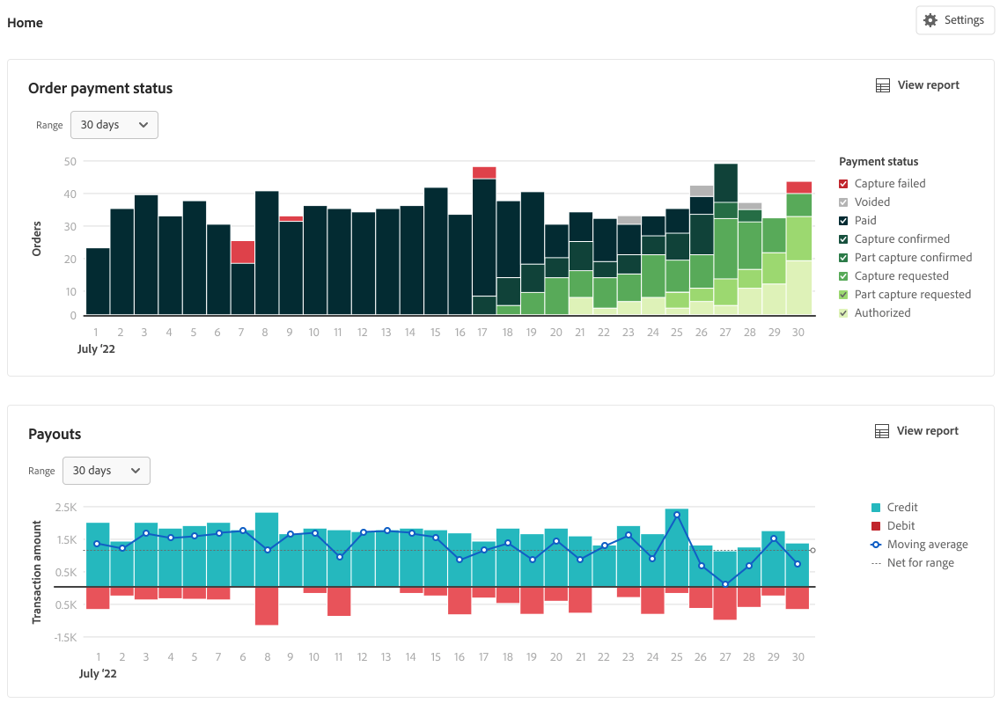

# Informes financieros

[!DNL Payment Services] para [!DNL Adobe Commerce] y [!DNL Magento Open Source] le ofrece un informe completo para que pueda obtener una visión clara de los pedidos y pagos de su tienda.

{width="600" zoomable="yes"}

Los informes de gestión de flujo de efectivo (Pagos, Transacciones y Estado de pago del pedido) sincronizan los detalles de pago con la información del pedido para ofrecerle una total transparencia del volumen procesado, el saldo de pago y la creación de informes detallados a nivel de transacción para la reconciliación financiera.
