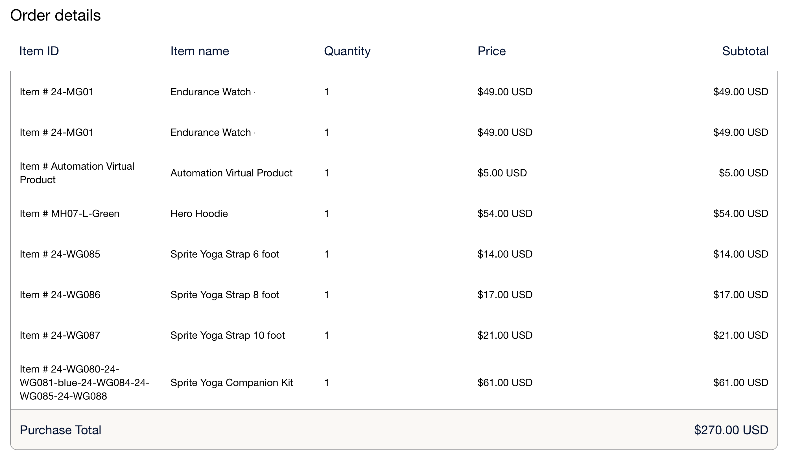

# Elementos de línea de [!DNL Payment Services]

Los elementos de línea de [!DNL Payment Services] son los elementos incluidos en un pedido. Estos elementos de línea proporcionan información como:

* Detalles del producto
* Cantidad
* Precio (incluidos impuestos, descuentos y otra información relevante)

Esta información es útil para el servicio al cliente, la gestión de pedidos y la facturación adecuada.

Esta característica está habilitada de manera predeterminada para [!DNL Payment Services]. Para consultar artículos de línea:

1. Vaya a su [panel de comerciantes de PayPal](https://www.paypal.com/merchant/){target=_blank}.

1. Haga clic en **Actividad** > **Todas las transacciones**.

1. Seleccione el pedido deseado y consulte sus artículos de línea:

   > Ejemplo de elementos de línea en la vista del panel del comprador

   {width="500" zoomable="yes"}

## Atributos de artículos de línea

Los artículos de línea se generan cuando el pedido se realiza a través de Adobe Commerce y la información se envía a PayPal, con los atributos siguientes:

| Atributo | Tipo de datos | Descripción |
| --- | --- | --- |
| `name` | ¡String! | El nombre del elemento. Si un artículo tiene más de una línea debido a varias cantidades o a un problema de redondeo de impuestos, el nombre del artículo sigue siendo el mismo para todas las líneas, pero el precio mostrado puede variar ligeramente debido al redondeo. |
| `unit_amount` | Objeto. | El precio o tarifa del artículo por unidad. Incluye los atributos siguientes: `currency_code` y `value`. |
| `tax` | Objeto | El impuesto de artículo de cada unidad. Incluye los atributos siguientes: `currency_code` y `value`. |
| `quantity` | ¡String! | La cantidad del artículo. Será un número entero. |
| `description` | Cadena | La descripción detallada del artículo. |
| `sku` | Cadena | La unidad de stock (o SKU) del artículo. |
| `url` | Cadena | El `URL` al artículo que se está comprando. Visible para el comprador y utilizado en las experiencias del comprador. |
| `upc` | Objeto | El código de producto universal (o UPC) del artículo. |
| `category` | Cadena | El tipo de categoría de artículo. |

### `unit_amount` atributos

El objeto `unit_amount` contiene los atributos siguientes:

| Atributo | Tipo de datos | Descripción |
| --- | --- | --- |
| `currency_code` | ¡String! | El [código de moneda ISO-4217 de tres caracteres](https://developer.paypal.com/api/rest/reference/currency-codes/) que identifica la moneda. |
| `value` | ¡String! | Indica el valor del elemento. `currency_code` determina el número de decimales necesario, si lo hay. |

### `tax` atributos

El objeto `tax` contiene los atributos siguientes:

| Atributo | Tipo de datos | Descripción |
| --- | --- | --- |
| `currency_code` | ¡String! | El [código de moneda ISO-4217 de tres caracteres](https://developer.paypal.com/api/rest/reference/currency-codes/) que identifica la moneda. |
| `value` | ¡String! | Indica el valor del elemento. Depende de cada `currency_code` para el número requerido de decimales. |

### `upc` atributos

El objeto `upc` contiene los atributos siguientes:

| Atributo | Tipo de datos | Descripción |
| --- | --- | --- |
| `type` | ¡string! | El tipo UPC. |
| `code` | ¡string! | El código de producto UPC del artículo. |

+++Ejemplo de elementos de línea

```json
{
    "name": "Crown Summit Backpack - 1",
    "unit_amount": {
        "currency_code": "USD",
        "value": "38.50"
    },
    "tax": {
        "currency_code": "USD"
        "value": "3.13"
    },
    "quantity": "1",
    "description": "The Crown Summit Backpack is equally at home in a gym locker, study cube or a pup tent, so be sure yours is packed with books,",
    "sku": "24-MB03",
    "url": "https://magento.test/crown-summit-backpack.html",
    "upc": {
        "type": "UPC-A",
        "code": "000003"
    },
    "category": "PHYSICAL_GOODS"
},
{
    "name": "Crown Summit Backpack - 2",
    "unit_amount": {
        "currency_code": "USD",
        "value": "38.50"
    },
    "tax": {
        "currency_code": "USD",
        "value": "3.14"
    },
    "quantity": "1",
    "description": "The Crown Summit Backpack is equally at home in a gym locker, study cube or a pup tent, so be sure yours is packed with books,",
    "sku": "24-MB03",
    "url": "https://magento.test/crown-summit-backpack.html",
    "upc": {
        "type": "UPC-A",
        "code": "000003"
    },
    "category": "PHYSICAL_GOODS"
}
```

+++

Consulte [Documentación para desarrolladores de PayPal sobre los elementos de línea](https://developer.paypal.com/docs/api/orders/v2/#definition-line_item){target=_blank} para obtener más información sobre estos campos y sus limitaciones.

## Administrar elementos de línea

Adobe Commerce [calcula los impuestos en función del importe total de cada fila](https://experienceleague.adobe.com/es/docs/commerce-admin/stores-sales/site-store/taxes/taxes#warning-messages){target=_blank}, lo que puede provocar problemas de redondeo si se solicitan varias cantidades del mismo artículo o si se muestran precios que incluyen impuestos en el catálogo. En estos casos, la cantidad total puede dividirse en dos líneas, pero la cantidad equivale al total de artículos pedidos.

> Ejemplo de artículos de línea con problemas de redondeo en la vista del panel de comerciantes

{width="600" zoomable="yes"}

+++Cómo calcula Adobe Commerce un problema de redondeo en los elementos de línea

Los elementos de línea de [!DNL Payment Services] equilibran este problema de redondeo de modo que el valor de `unit_amount` o `unit_tax` corresponda con el importe total del pedido. Un artículo se puede dividir en dos líneas para resolver este problema de redondeo:

* Cuando el problema de redondeo aparece en `unit_amount`, el comerciante debería ver una diferencia en el precio de esta línea adicional.
* Cuando el problema de redondeo aparece en `unit_tax`, no se observará ninguna diferencia en los elementos de línea individuales porque `tax` no se muestra en la cuadrícula, sino únicamente como un total en la parte inferior.

+++
