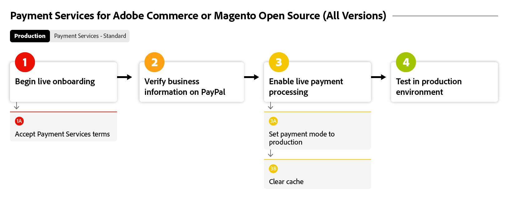

# Incorporando flujo de [!DNL Payment Services]

Para empezar a usar [!DNL Payment Services], debe completar algunos pasos de incorporación. Para obtener instrucciones precisas, seleccione la opción de Adobe Commerce que se ajuste mejor a la instancia y la versión de su organización.

Este diagrama de flujo muestra el proceso general de incorporación de [!DNL Payment Services] en todas las versiones:

{width="700" zoomable="yes"}

Vea a continuación su versión de Adobe Commerce específica para incorporar con [!DNL Payment Services].

## Ayudarme a encontrar mi instancia y versión

### ADOBE COMMERCE o MAGENTO OPEN SOURCE | v2.4.7+

Estos diagramas de flujo muestran el proceso general de incorporación de [!DNL Payment Services] con un Adobe Commerce o Magento Open Source posterior a la versión 2.4.7.

>[!BEGINTABS]

>[!TAB espacio aislado]

Este diagrama de flujo muestra el proceso de incorporación de la zona protegida con una Adobe Commerce o Magento Open Source posterior a la versión 2.4.7, donde [!DNL Payment Services] está integrado con Adobe Commerce.

{width="700" zoomable="yes"}

**Pasos de incorporación para las versiones v2.4.7+, parte 1: espacio aislado**

1. [Conecte su instancia](connect.md#configure-commerce-services) a los servicios de Commerce. Esta conexión solo debe completarse una vez por cada instancia de Commerce. [!BADGE Solo PaaS]{type=Informative tooltip="Solo se aplica a proyectos de Adobe Commerce en la nube (infraestructura PaaS administrada por Adobe)."}
1. [Configura el servicio de zona protegida](sandbox.md#enable-sandbox-testing) (o, alternativamente, continúa con [habilitar pagos activos](sandbox.md#enable-live-payments) si has probado la funcionalidad en otro entorno) con una cuenta de procesamiento de pagos PayPal de prueba.
1. Probar pagos en un entorno [sandbox](sandbox.md#test-in-sandbox-environment).

>[!TAB Producción]

Este diagrama de flujo muestra los pasos de producción necesarios para habilitar [!DNL Payment Services].

{width="700" zoomable="yes"}

**Pasos de incorporación para las versiones v2.4.7+, parte 2: producción**

1. [Establece [!DNL Payment Services] como tu método de pago](production.md#set-payment-services-as-payment-method), en modo de espacio aislado, para comenzar a procesar pagos de prueba.
1. [Solicite el derecho de pagos](production.md#request-payments-entitlement-from-adobe) para habilitar la incorporación activa.
1. [Incorporación completa del comerciante](production.md#complete-merchant-onboarding) para habilitar los pagos activos para los sitios web de Commerce.
1. [Obtén tu [!DNL Payment Services] ID de comerciante](production.md#configure-pricing-tier) y entrégaselo a Ventas para configurar el nivel de precios correcto.
1. [Activar [!DNL Payment Services] en el modo Activo](production.md#enable-live-payments) para comenzar a procesar pagos activos.
1. Pagos de prueba, tanto en entornos de [espacio aislado](sandbox.md#test-in-sandbox-environment) como de [producción](production.md#test-in-production).

>[!ENDTABS]

### ADOBE COMMERCE o MAGENTO OPEN SOURCE | v2.4.0-2.4.6 [!BADGE Solo PaaS]{type=Informative tooltip="Solo se aplica a proyectos de Adobe Commerce en la nube (infraestructura PaaS administrada por Adobe)."}

Estos diagramas de flujo muestran el proceso general de incorporación de [!DNL Payment Services] con Adobe Commerce o Magento Open Source versiones 2.4.0 a 2.4.6. Es necesario descargar e instalar [!DNL Payment Services] para comenzar la incorporación.

>[!BEGINTABS]

>[!TAB espacio aislado]

Este diagrama de flujo muestra los pasos de la zona protegida necesarios para incorporar [!DNL Payment Services] con Adobe Commerce o las versiones 2.4.0 a 2.4.6 de Magento Open Source.

{width="700" zoomable="yes"}

**Pasos de incorporación para las versiones v2.4.0-2.4.6, parte 1: espacio aislado**

1. [Instale la [!DNL Payment Services] extensión](install.md#get-payment-services) si es necesario.
1. [Obtener credenciales de API](connect.md#obtain-api-credentials).
1. [Conecte su instancia](connect.md#configure-commerce-services) a los servicios de Commerce. Esta conexión solo debe completarse una vez por cada instancia de Commerce.
1. [Configura el servicio de zona protegida](sandbox.md#enable-sandbox-testing) (o, alternativamente, continúa con [habilitar pagos activos](sandbox.md#enable-live-payments) si has probado la funcionalidad en otro entorno) con una cuenta de procesamiento de pagos PayPal de prueba.
1. Probar pagos en un entorno [sandbox](sandbox.md#test-in-sandbox-environment).

>[!TAB Producción]

Este diagrama de flujo muestra el proceso general para habilitar [!DNL Payment Services] en un entorno de producción con las versiones 2.4.0 a 2.4.6 de Adobe Commerce o Magento Open Source.

{width="700" zoomable="yes"}

**Pasos de incorporación para las versiones v2.4.0-2.4.6, parte 2: Producción**

1. [Establece [!DNL Payment Services] como tu método de pago](production.md#set-payment-services-as-payment-method), en modo de espacio aislado, para comenzar a procesar pagos de prueba.
1. [Solicite el derecho de pagos](production.md#request-payments-entitlement-from-adobe) para habilitar la incorporación activa.
1. [Incorporación completa del comerciante](production.md#complete-merchant-onboarding) para habilitar los pagos activos para los sitios web de Commerce.
1. [Obtén tu [!DNL Payment Services] ID de comerciante](production.md#configure-pricing-tier) y entrégaselo a Ventas para configurar el nivel de precios correcto.
1. [Activar [!DNL Payment Services] en el modo Activo](production.md#enable-live-payments) para comenzar a procesar pagos activos.
1. Pagos de prueba, tanto en entornos de [espacio aislado](sandbox.md#test-in-sandbox-environment) como de [producción](production.md#test-in-production).

>[!ENDTABS]

>[!NOTE]
>
>Si no configura los servicios de Commerce en el Administrador (parte 1), no puede configurar la zona protegida ni los pagos activos.

>[!MORELIKETHIS]
>
> * [Solucionar problemas [!DNL Payment Services] instalación](https://experienceleague.adobe.com/docs/commerce-knowledge-base/kb/troubleshooting/payments/payservices-install.html?lang=en)
> * [Cuenta de zona protegida de PayPal no verificada](https://experienceleague.adobe.com/docs/commerce-knowledge-base/kb/troubleshooting/payments/payservices-paypal-acct.html)
> * [Datos de informe [!DNL Payment Services] aplazados](https://experienceleague.adobe.com/docs/commerce-knowledge-base/kb/troubleshooting/payments/payservices-report-info-delayed.html)
> * [La tarjeta de crédito de prueba falla con PayPal al procesar pagos en un entorno limitado](https://experienceleague.adobe.com/docs/commerce-knowledge-base/kb/troubleshooting/payments/payservices-cc-sandbox-failure.html?lang=en)