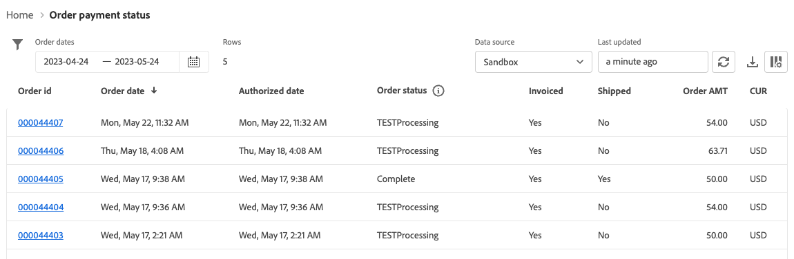

# Informe Estado de Pago del Pedido

[!DNL Payment Services] para [!DNL Adobe Commerce] y [!DNL Magento Open Source] le ofrece informes completos para que pueda obtener una visión clara de las [transacciones](transactions.md), pedidos y pagos de su tienda.

Existen dos vistas de informes de estado de pagos de pedidos disponibles para que pueda consultar rápidamente el estado de pago de sus pedidos:

* **[Vista de visualización del estado de pago del pedido](#order-payment-status-data-visualization-view)**: gráfico disponible en la página principal de servicios de pago que es una representación visual de los estados de pago agregados por día desde la vista de informe de estado de pago del pedido.
* **[Vista del informe de estado de pago del pedido](#order-payment-status-report-view)**: informe disponible en el estado de pago del pedido que muestra los estados detallados de pago, facturado, enviado, reembolso y disputa de todas las transacciones

Las vistas de estado de pago de pedido le ayudan a comprender fácilmente dónde se encuentra un pedido específico dentro del flujo de proceso de pago en efectivo. Estos informes le permiten ver rápidamente los pedidos (según su estado de pago y fecha de pago) e identificar cualquier problema potencial.

Puede [descargar estados de pago de pedidos](#download-order-payment-statuses) en formato de archivo .csv para usarlos con el software de contabilidad o administración de pedidos existente.

>[!NOTE]
>
>No puede ver informes financieros si no ha [incorporado y activado el modo Activo](production.md#enable-live-payments) para [!DNL Payment Services].

## Vista de visualización de datos del estado de pago del pedido

La vista de visualización de datos del estado de pago del pedido está disponible en la página de inicio de Payment Services. Es una representación visual de los estados de pago agregados por día de la tabla detallada [Vista del informe de estado de pago del pedido](#order-payment-status-report-view).

En la barra lateral de _Administración_, vaya a **Ventas** > **Servicios de pago** > _Pedidos_ para ver la visualización de datos [gráfico de estados de pago](#statuses-information).

{width="800" zoomable="yes"}

Haga clic en **[!UICONTROL View Report]** para ir a la tabla detallada [Vista del informe de estado de pago del pedido](#order-payment-status-report-view).

### Personalizar intervalo de tiempo de estados

De forma predeterminada, se muestran los 30 días de estados de pago.

Desde la vista de visualización Estado de pago del pedido, puede personalizar el periodo de tiempo para los estados de pago que desea consultar seleccionando un intervalo de fechas:

1. En la barra lateral _Admin_, vaya a **[!UICONTROL Sales]** > **[!UICONTROL Payment Services]**. La vista de visualización de los datos del estado de pago del pedido está visible en la sección _Pedidos_.
1. Haga clic en el filtro de selector **[!UICONTROL Range]**.
1. Elija el intervalo de fechas aplicable: 30 días, 15 días o 7 días.
1. Ver la información de estado de las fechas especificadas.

### Información de estados

Los estados de pago de un intervalo de fechas seleccionado se muestran a la izquierda de la vista de visualización de datos Estado de pago del pedido. Las fechas del intervalo de fechas seleccionado se muestran en la parte inferior de la vista. Si no ha habido pedidos en una fecha determinada, esa fecha no aparece.

La vista de visualización de datos de estado de pago del pedido incluye la siguiente información.

| Datos | Descripción |
| ------------ | -------------------- |
| [!UICONTROL Orders] | Intervalo de importes para pedidos en un período de tiempo especificado; datos en el eje Y (izquierda) |
| Intervalo de fechas | Intervalo de fechas para el lapso de tiempo especificado; datos en el eje X (inferior) |
| Autorizado | Pedido autorizado |
| Captura solicitada | Captura solicitada para pedido |
| Captura confirmada | Captura de pedidos completada |
| Captura parcial | Pedido capturado parcialmente |
| Error de captura | Error de captura de pedido |
| Anulado | Pedido anulado |

## Vista del informe de estado del pago del pedido

La vista Informe de estado de pago del pedido está disponible en la vista Inicio de Servicios de pago. Incluye estados detallados (pago, facturado, enviado, reembolso, disputa y más) de todas las transacciones.

En la barra lateral _Admin_, vaya a **[!UICONTROL Sales]** > **[!UICONTROL Payment Services]** > _[!UICONTROL Orders]_>**[!UICONTROL View Report]**&#x200B;para ver la tabla detallada del informe de estado del pago de pedidos.

{width="800" zoomable="yes"}

Puede configurar esta vista, según las secciones de este tema, para presentar mejor los datos que desee ver.

Puede [descargar transacciones de pago](#download-order-payment-statuses) en formato de archivo .csv para usarlas con el software de contabilidad o de gestión de pedidos existente.

>[!NOTE]
>
>Los datos mostrados en esta tabla se ordenan en orden descendente (`DESC`) de forma predeterminada mediante `TRANS DATE`. `TRANS DATE` es la fecha y hora en que se inició la transacción.

### Actualizaciones del estado de pago

Determinados métodos de pago requieren un período de tiempo para capturar el pago. [!DNL Payment Services] detecta ahora los estados pendientes de una transacción de pago en un pedido mediante:

* Detectando sincrónicamente `pending capture` transacciones
* Supervisando `pending capture` transacciones de forma asincrónica

>[!NOTE]
>
>La detección de los estados pendientes de las transacciones de pago de un pedido evita el envío accidental de pedidos si el pago aún no se ha recibido. Esto puede ocurrir en las transacciones de cheques electrónicos y PayPal.

#### Detección sincrónica de transacciones de captura pendientes

Detectar automáticamente las transacciones de captura en un estado `Pending` e impedir que los pedidos entren en un estado `Processing` cuando se detecte una transacción de este tipo.

Durante el cierre de compra del cliente o cuando un administrador crea una factura para un pago previamente autorizado, [!DNL Payment Services] detecta automáticamente las transacciones de captura en un estado `Pending` y cambia los pedidos correspondientes al estado `Payment Review`.

#### Monitorización asíncrona de transacciones de captura pendientes

Detectar cuándo una transacción de captura pendiente introduce un estado `Completed` para que los comerciantes puedan reanudar el procesamiento del pedido afectado.

Para asegurarse de que este proceso funciona según lo esperado, los comerciantes deben configurar un nuevo trabajo cron. Una vez configurado el trabajo para que se ejecute automáticamente, no se esperan otras intervenciones del comerciante.

Consulte [Configurar trabajos cron](https://experienceleague.adobe.com/docs/commerce-operations/configuration-guide/cli/configure-cron-jobs.html?lang=es). Una vez configurado, el nuevo trabajo se ejecuta cada 30 minutos para recuperar las actualizaciones de los pedidos que están en estado `Payment Review`.

Los comerciantes pueden comprobar el estado de pago actualizado a través de la vista Informe de estado de pago del pedido.

### Datos utilizados en el informe

[!DNL Payment Services] usa datos de pedidos y los combina con datos de pagos agregados de otras fuentes (incluido PayPal) para ofrecer informes significativos y muy útiles.

Los datos de pedidos se exportan y se mantienen en el servicio de pago. Al [cambiar o agregar estados de pedidos](https://experienceleague.adobe.com/es/docs/commerce-admin/stores-sales/order-management/orders/order-status#custom-order-status) o [editar una vista de tienda](https://experienceleague.adobe.com/es/docs/commerce-admin/stores-sales/site-store/store-views#edit-a-store-view), [tienda](https://experienceleague.adobe.com/es/docs/commerce-admin/start/setup/store-details#store-information) o nombre de sitio web, esos datos se combinan con los datos de pago y el informe de estado de pago de pedidos se rellena con la información combinada.

Este proceso consta de dos pasos:

1. El índice cambia los datos `ON SAVE` (cada vez que se cambia la información de pedido o la información de almacén) o `BY SCHEDULE` (en una programación cron preconfigurada), según cómo se configure en [Administración de índices](https://experienceleague.adobe.com/es/docs/commerce-admin/systems/tools/index-management) en el administrador.

   De manera predeterminada, la indexación de datos se produce `ON SAVE`, lo que significa que siempre que algo cambia en el pedido, el estado del pedido, la vista del almacén, el almacén o el sitio web, el proceso de reindexación se produce inmediatamente.

1. Los datos indexados se envían al servicio de pago, que a continuación se rellena en el informe de estado de pago del pedido.

Los únicos datos que se exportan y recopilan con fines informativos son los datos utilizados por el informe de estado del pago del pedido.

>[!NOTE]
>
>Los datos mostrados en esta tabla se ordenan en orden descendente (`DESC`) de forma predeterminada mediante `ORDER DATE`. `ORDER DATE` es la marca de fecha y hora en que se creó el pedido.

#### Configuración de exportación de datos

Aunque, de forma predeterminada, la reindexación se produce en el modo `ON SAVE`, se recomienda indexar en el modo `BY SCHEDULE`. El índice `BY SCHEDULE` se ejecuta según una programación cron de un minuto, y cualquier dato modificado aparece en el informe de estado del pedido en un plazo de dos minutos a partir de cualquier cambio de datos. Esta reindexación programada le ayuda a reducir cualquier tensión en su tienda, especialmente si tiene un gran volumen de pedidos entrantes, ya que se produce en una programación (no como cada pedido se realiza).

Puede cambiar el modo de índice—`ON SAVE` o `BY SCHEDULE`—[en el administrador](https://experienceleague.adobe.com/es/docs/commerce-admin/systems/tools/index-management#change-the-index-mode).

Para obtener información sobre cómo configurar la exportación de datos, vea [Configuración de la línea de comandos](configure-cli.md#configure-data-export).

### Seleccionar fuente de datos

En la vista Informe de estado de pago del pedido, puede seleccionar el origen de datos (**[!UICONTROL Live]** _ o **[!UICONTROL Sandbox]**) cuyos resultados desea ver.

{width="300" zoomable="yes"}

Si _[!UICONTROL Live]_&#x200B;es el origen de datos seleccionado, puede ver información de informes de las tiendas que usan [!DNL Payment Services] en el modo de producción. Si&#x200B;_[!UICONTROL Sandbox]_ es el origen de datos seleccionado, puede ver información del informe para el modo de espacio aislado.

Las selecciones de fuentes de datos funcionan de la siguiente manera:

* Si no tiene ningún almacén que use [!DNL Payment Services] en el modo Activo, la selección de origen de datos toma como valor predeterminado _[!UICONTROL Sandbox]_.
* Si tiene tiendas (una o varias) que usan [!DNL Payment Services] en el modo Activo, la selección de origen de datos toma como valor predeterminado _[!UICONTROL Live]_.
* Las exportaciones de informes siempre respetan la selección de fuente de datos.

Para seleccionar el origen de datos de su informe [!UICONTROL Order Payment Status]:

1. En la barra lateral _Admin_, vaya a **[!UICONTROL Sales]** > **[!UICONTROL [!DNL Payment Services]]** > **[!UICONTROL Orders]** > **[!UICONTROL View Report]**.
1. Haga clic en el filtro selector _[!UICONTROL Data source]_&#x200B;y seleccione **[!UICONTROL Live]**&#x200B;o **[!UICONTROL Sandbox]**.

   Los resultados del informe se regeneran en función del origen de datos seleccionado.

### Personalizar intervalo de fechas de pedidos

Desde la vista Informe de estado de pago del pedido, puede personalizar el periodo de tiempo de los resultados de estado que desea consultar seleccionando fechas específicas. De forma predeterminada, se muestran en la cuadrícula 30 días de estados de pago del pedido.

1. En la barra lateral _Admin_, vaya a **[!UICONTROL Sales]** > **[!UICONTROL [!DNL Payment Services]]** > _[!UICONTROL Orders]_>**[!UICONTROL View Report]**.
1. Haga clic en el filtro de selector de calendario _[!UICONTROL Order dates]_.
1. Seleccione el intervalo de fechas aplicable.
1. Permite ver los estados de pago de los pedidos para las fechas especificadas en la cuadrícula.

### Filtrar información del informe

En la vista Informe de estado de pagos de pedidos, puede filtrar los resultados de estado que desee consultar seleccionando criterios de filtro.

1. En la barra lateral _Admin_, vaya a **[!UICONTROL Sales]** > **[!UICONTROL [!DNL Payment Services]]** > _[!UICONTROL Orders]_>**[!UICONTROL View Report]**.
1. Haga clic en el selector **[!UICONTROL Filter]**.
1. Cambie las opciones _Estado de pago_ para ver los resultados del informe solo para los estados de pago de pedidos seleccionados.
1. Ver los resultados del informe dentro de un intervalo de importe de pedido introduciendo un _[!UICONTROL Min Order Amount]_&#x200B;o _[!UICONTROL Max Order Amount_].
1. Haga clic en **[!UICONTROL Hide filters]** para ocultar el filtro.

### Mostrar y ocultar columnas

El informe Estado de Pago del Pedido muestra todas las columnas de información disponibles de forma predeterminada. Sin embargo, puede personalizar qué columnas ve en el informe.

1. En la barra lateral _Admin_, vaya a **[!UICONTROL Sales]** > **[!UICONTROL [!DNL Payment Services]]** > _[!UICONTROL Orders]_>**[!UICONTROL View Report]**.
1. Haga clic en el icono _Configuración de columna_ ({width="20" zoomable="yes"}).
1. Para personalizar qué columnas ve en el informe, marque o desmarque columnas en la lista.

   El informe Estado de pago del pedido muestra inmediatamente los cambios realizados en el menú Configuración de columna. Las preferencias de columna se guardan y se mantienen en vigor si se aleja de la vista Informes.

### Ver estados

La vista de informe Estado de Pago del Pedido muestra información completa sobre el estado de pago de cada pedido.

De forma predeterminada, se muestran en la cuadrícula 30 días de estados de pago del pedido.

Desplácese a la izquierda y a la derecha para ver [información sobre el estado de pago del pedido](#column-descriptions), incluida la fecha de pedido, la fecha de autorización, la factura, el envío, el estado de pago y mucho más.

El número de filas devueltas en una búsqueda, o que se muestran en los 30 días predeterminados de estados de pago del pedido, se muestra encima de la cuadrícula de vista de estado de pago del pedido junto con el filtro de selector de calendario de fechas del pedido.

#### Estado de pago

La columna Estado de pago muestra el estado actual de cualquier pago. Un pago de `Capture failed` muestra un estado de alerta rojo y un pago de `Voided` muestra un estado de alerta gris.

#### Estado del reembolso

La columna Estado de reembolso muestra el estado actual de cualquier reembolso. Un pago de `Capture failed` muestra un estado de alerta rojo y un pago de `Voided` muestra un estado de alerta gris.

### Actualización de datos del informe

La vista del informe Estado de pago del pedido muestra una marca de tiempo _[!UICONTROL Last updated]_&#x200B;que indica la última vez que se actualizó la información del informe. De forma predeterminada, los datos del informe Estado de los pagos de los pedidos se actualizan automáticamente cada tres horas.

También puede forzar manualmente la actualización de los datos del informe de estado de los pagos de pedidos para ver la información del informe más actualizada.

1. En la barra lateral _Admin_, vaya a **[!UICONTROL Sales]** > **[!UICONTROL [!DNL Payment Services]]** > _[!UICONTROL Orders]_>**[!UICONTROL View Report]**.
1. Haga clic en el icono _Actualizar_ ({width="20" zoomable="yes"}).

   Los datos del informe de estado de pago del pedido se actualizan, aparece una confirmación *[!UICONTROL Update complete]* y la información más reciente está presente en la cuadrícula.

### Ver disputas

Puedes ver cualquier disputa sobre los pedidos de tu tienda y navegar hasta el Centro de resolución de PayPal para tomar medidas al respecto, desde el informe de estado de pago del pedido.

1. En la barra lateral _Admin_, vaya a **[!UICONTROL Sales]** > **[!UICONTROL [!DNL Payment Services]]** > _[!UICONTROL Orders]_>**[!UICONTROL View Report]**.
1. Vaya a **[!UICONTROL Disputes column]**.
1. Consulta las disputas de un pedido específico y consulta [el estado de la disputa](#order-payment-status-information).
1. Revisa los detalles de la disputa del [Centro de resolución de disputas de PayPal](https://www.paypal.com/us/cshelp/article/what-is-the-resolution-center-help246) haciendo clic en el vínculo de identificación de la disputa que comienza con _PP-D-_.
1. Tome las medidas apropiadas para la disputa, según sea necesario.

   Para ordenar las disputas por estado, haga clic en el encabezado de columna [!UICONTROL Disputes].

### Descargar estados de pago de pedidos

Puede descargar un archivo .csv con todos los estados visibles en la cuadrícula de la vista Estado de los pagos de pedidos, tanto si visualiza los 30 días de estados predeterminados como si utiliza un periodo de tiempo personalizado.

1. En la barra lateral _Admin_, vaya a **[!UICONTROL Sales]** > **[!UICONTROL [!DNL Payment Services]]** > _[!UICONTROL Orders]_>**[!UICONTROL View Report]**.
1. Si desea ver los estados de un intervalo de tiempo que no sea los últimos 30 días, [personalice el intervalo de tiempo para los estados](#customize-dates-timeframe).
1. Haga clic en el icono _Descargar_ ({width="20" zoomable="yes"}).

Los estados de pago del pedido se descargan en formato .csv.

### Descripciones de columna

Los informes de estado de pago del pedido incluyen la siguiente información.

| Columna | Descripción |
| ------------ | -------------------- |
| [!UICONTROL Order ID] | ID de pedido de Commerce    Para ver [información de pedido](https://experienceleague.adobe.com/es/docs/commerce-admin/stores-sales/order-management/orders/orders){target="_blank"} relacionada, haga clic en el identificador. |
| [!UICONTROL Order Date] | Marca de fecha y hora del pedido |
| [!UICONTROL Authorized Date] | Fecha y hora de la autorización de pago |
| [!UICONTROL Order Status] | Estado de pedido [actual de Commerce](https://experienceleague.adobe.com/es/docs/commerce-admin/stores-sales/order-management/orders/order-status){target="_blank"} |
| [!UICONTROL Invoiced] | Estado de factura del pedido—*[!UICONTROL No]*, *[!UICONTROL Partial]* o *[!UICONTROL Yes]* |
| [!UICONTROL Shipped] | Estado de envío del pedido: *[!UICONTROL No]*, *[!UICONTROL Partial]* o *[!UICONTROL Yes]* |
| [!UICONTROL Order Amt] | Importe total general del pedido |
| [!UICONTROL Cur] | Tipo de divisa del pedido |
| [!UICONTROL Pay Status] | Estado del pago de un pedido específico |
| [!UICONTROL Paid Amt] | Importe pagado en un pedido |
| [!UICONTROL Cur] | Tipo de divisa del importe pagado de un pedido |
| [!UICONTROL Refund Status] | Estado de un reembolso de un pedido (por ejemplo, información de devoluciones, autorizaciones de devolución de material y notas de abono)—   *[!UICONTROL Requires refund]*, *[!UICONTROL Refund requested]*, *[!UICONTROL Refunded]*, *[!UICONTROL Refund failed]* o *[!UICONTROL Voided]* |
| [!UICONTROL Refund Amount] | Total del importe reembolsado de un pedido |
| [!UICONTROL Cur] | Tipo de divisa del importe reembolsado de un pedido |
| [!UICONTROL Disputes] | Estado de cualquier disputa en un pedido (información de disputas y rechazos de cargos)—*[!UICONTROL Open]*, *[!UICONTROL Waiting for buyer response]*, *[!UICONTROL Waiting for seller response]*, *[!UICONTROL Under review]*, *[!UICONTROL Resolved]* o *[!UICONTROL Other]* |
| [!UICONTROL Payment Method] | Método de pago utilizado en la transacción de Commerce para un pedido |
| [!UICONTROL Website] | Sitio web desde el que se realizó el pedido |
| [!UICONTROL Store] | Almacén desde el que se realizó el pedido |
| [!UICONTROL Store View] | Vista de tienda desde la que se realizó el pedido |
