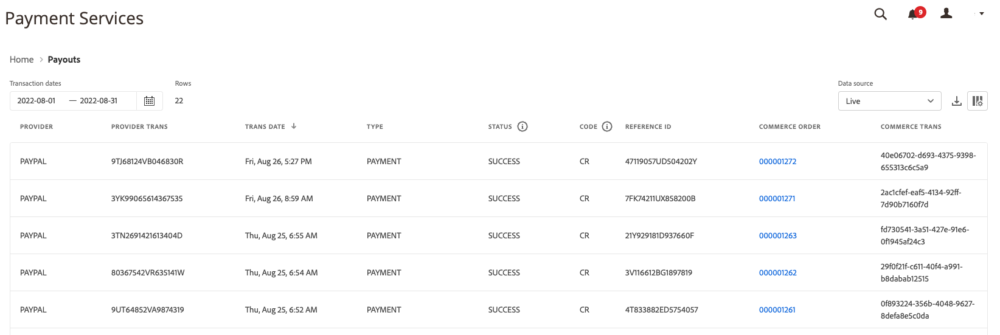

# Informe de pagos

[!DNL Payment Services] para [!DNL Adobe Commerce] y [!DNL Magento Open Source] le ofrece informes completos para que pueda obtener una visión clara de las transacciones, pedidos y pagos de su tienda.

Hay dos vistas de informes de pagos disponibles para que pueda ver información detallada sobre todos los pagos:

* **[Vista de visualización de datos de pagos](#payouts-data-visualization-view)**: gráfico disponible en la página principal de servicios de pago que representa de forma visual los importes agregados por día en la vista de informe Pagos
* **[Vista de informe de pagos](#payouts-report-view)**: informe disponible en Pagos que muestra información detallada sobre los pagos de todas las transacciones

Las vistas de pagos muestran información completa sobre los pagos de un vistazo, lo que permite una total transparencia del importe del pago, el volumen procesado y la creación de informes detallados sobre la transacción para la reconciliación financiera.

Puede [descargar transacciones de pago](#download-transactions) en formato de archivo .csv para usarlas con el software de contabilidad o de gestión de pedidos existente.

>[!NOTE]
>
>Los informes de pagos solo muestran los pedidos capturados (la acción de pago se ha establecido en [`Authorize and Capture`](https://experienceleague.adobe.com/docs/commerce-merchant-services/payment-services/get-started/production.html#set-payment-services-as-payment-method)) o [marcados como `Invoiced`](https://experienceleague.adobe.com/en/docs/commerce-admin/stores-sales/order-management/invoices#create-an-invoice).

## Vista de visualización de datos de pagos

La vista de visualización de datos Pagos está disponible en la página de inicio de Servicios de pago. Es una representación visual de las cantidades agregadas por día de la tabla detallada [Pagos vista del informe](#payouts-report-view).

En la barra lateral _Admin_, vaya a **[!UICONTROL Sales]** > **[!UICONTROL Payment Services]** para ver el gráfico de visualización de datos de los créditos frente a los débitos y los promedios móviles a lo largo del tiempo.

{width="800" zoomable="yes"}

Haga clic en **[!UICONTROL View Report]** para navegar a la tabla detallada [Vista de informe de pagos](#payouts-report-view).

### Personalizar periodo de transacciones

De forma predeterminada, se muestran 30 días de transacciones.

Desde la vista de visualización de datos de pagos, puede personalizar el periodo de tiempo para las transacciones de pago que desee ver seleccionando un intervalo de fecha:

1. En la barra lateral _Admin_, vaya a **[!UICONTROL Sales]** > **[!UICONTROL Payment Services]**. La vista de visualización de datos Pagos se puede ver en la sección Pagos.
1. Haga clic en el filtro de selector **[!UICONTROL Range]**.
1. Elija el intervalo de fechas aplicable: 30 días, 15 días o 7 días.
1. Ver la información de transacciones de las fechas especificadas.

### Información de transacciones

Los importes de transacción para un intervalo de fechas seleccionado se muestran a la izquierda de la vista de visualización de datos Pagos. Las fechas del intervalo de fechas seleccionado se muestran en la parte inferior de la vista. Si no hubo pagos en una fecha en particular, esa fecha no aparecerá.

La vista de visualización de datos Pagos incluye la siguiente información.

| Datos | Descripción |
| ------------ | -------------------- |
| [!UICONTROL Transaction amount] | Rango de importes para las transacciones en un lapso de tiempo específico; datos en el eje Y (izquierda) |
| Intervalo de fechas | Intervalo de fechas para el lapso de tiempo especificado; datos en el eje X (inferior) |
| Crédito | Pagos por el período de tiempo especificado |
| Débito | Débitos (devoluciones) para el período especificado |
| Promedio móvil | Representación del pago promedio para cada fecha en el lapso de tiempo especificado |
| Neto para rango | Importe de pago neto para el lapso de tiempo especificado (rango) |

## Vista de informe de pagos

La vista Informe de pagos está disponible en la vista Pagos de Payment Services. Incluye toda la información disponible sobre los pagos de tu tienda.

En la barra lateral _Admin_, vaya a **[!UICONTROL Sales]** > **[!UICONTROL Payment Services]** > _[!UICONTROL Payouts]_>**[!UICONTROL View Report]**&#x200B;para ver la vista detallada del informe Pagos en tablas.

{width="800" zoomable="yes"}

Puede configurar esta vista, según las secciones de este tema, para presentar mejor los datos que desee ver.

Consulte los ID de pedido y transacción de Commerce vinculados, los importes de transacción, el método de pago por transacción y mucho más, todo dentro de este informe.

Puede [descargar transacciones de pago](#download-transactions) en formato de archivo .csv para usarlas con el software de contabilidad o de gestión de pedidos existente.

>[!NOTE]
>
>Los datos mostrados en esta tabla se ordenan en orden descendente (`DESC`) de forma predeterminada mediante `TRANS DATE`. `TRANS DATE` es la fecha y hora en que se inició la transacción.

### Seleccionar fuente de datos

En la vista Informe de pagos, puede seleccionar el origen de datos (**[!UICONTROL Live]** o **[!UICONTROL Sandbox]**) cuyos resultados desea ver.

{width="300" zoomable="yes"}

Si _[!UICONTROL Live]_&#x200B;es el origen de datos seleccionado, puede ver la información de informes de las tiendas en el modo de producción. Si&#x200B;_[!UICONTROL Sandbox]_ es el origen de datos seleccionado, puede ver los almacenes de información de informes en el modo de espacio aislado.

Las selecciones de fuentes de datos funcionan de la siguiente manera:

* Si no tiene ningún almacén que esté en el modo Activo, el valor predeterminado de la selección del origen de datos es _[!UICONTROL Sandbox]_.
* Si tiene tiendas (una o varias) en el modo Activo, la selección del origen de datos toma el valor predeterminado _[!UICONTROL Live]_.
* Las exportaciones de informes siempre respetan la selección de fuente de datos.

Para seleccionar la fuente de datos del informe Estado de Pagos del Pedido:

1. En la barra lateral _Admin_, vaya a **[!UICONTROL Sales]** > **[!UICONTROL Payment Services]** > _[!UICONTROL Payouts]_>**[!UICONTROL View Report]**.
1. Haga clic en **[!UICONTROL Data source]** y seleccione **[!UICONTROL Live]** o **[!UICONTROL Sandbox]**.

   Los resultados del informe se regeneran en función del origen de datos seleccionado.

### Ver transacciones

De forma predeterminada, se muestran 30 días de transacciones.

El número de filas devueltas en una búsqueda, o mostradas en los 30 días predeterminados de transacciones, se muestra encima de la cuadrícula de la vista Pagos junto con el filtro del selector de calendario de fechas de transacción.

Desplácese hacia la izquierda y la derecha para ver [información sobre cada transacción de pago](#column-descriptions) en el informe diario, incluida la fecha de transacción, el identificador de referencia, el número de factura y los detalles del método de pago.

#### Personalizar periodo de transacciones

En la vista de informe Pagos, puede personalizar el periodo de tiempo de las transacciones de pago que desee consultar introduciendo fechas específicas o seleccionando un rango de fechas en el selector de fechas:

1. En la barra lateral _Admin_, vaya a **[!UICONTROL Sales]** > **[!UICONTROL Payment Services]** > _[!UICONTROL Payouts]_>**[!UICONTROL View Report]**.
1. Haga clic en el filtro de selector de calendario _[!UICONTROL Transaction dates]_.
1. Seleccione el intervalo de fechas aplicable.
1. Ver los estados de pagos en la cuadrícula para las fechas especificadas.

### Mostrar y ocultar columnas

La vista de informe Pagos muestra la mayoría de las columnas de información disponibles de forma predeterminada. Sin embargo, puede personalizar qué columnas ve en el informe.

1. En la barra lateral _Admin_, vaya a **[!UICONTROL Sales]** > **[!UICONTROL [!DNL Payment Services]]** > _[!UICONTROL Payouts]_>**[!UICONTROL View Report]**.
1. Haga clic en el icono _Configuración de columna_ ({width="20" zoomable="yes"}).
1. Para personalizar qué columnas ve en el informe, marque o desmarque columnas en la lista.

   La vista de informe Pagos mostrará inmediatamente los cambios realizados en el menú Configuración de columna. Las preferencias de columna se guardarán y permanecerán en vigor si se aleja de la vista Informes.

### Descargar transacciones

Puede descargar un archivo .csv que contenga todas las transacciones visibles en la cuadrícula de la vista Pagos.

1. En la barra lateral _Admin_, vaya a **[!UICONTROL Sales]** > **[!UICONTROL Payment Services]** > _[!UICONTROL Payouts]_>**[!UICONTROL View Report]**.
1. [Personalice el intervalo de fecha y hora para sus transacciones](#customize-transactions-timeframe).
1. Haga clic en el icono _Descargar_ ( {width="20" zoomable="yes"} ).

Las transacciones de pago se descargan en formato .csv.

### Descripciones de columna

Los informes de pago incluyen la siguiente información.

| Columna | Descripción |
| ------------ | -------------------- |
| [!UICONTROL Provider] | Proveedor de pago |
| [!UICONTROL Provider trans] | ID de transacción |
| [!UICONTROL Trans date] | Fecha y hora en que se inició la transacción |
| [!UICONTROL Type] | Tipo de transacción: *[!UICONTROL PAYMENT]*, *[!UICONTROL BONUS]*, *[!UICONTROL CHARGEBACK]*, *[!UICONTROL CORRECTION]*, *[!UICONTROL CURRENCY_CONVERSATION]*, *[!UICONTROL DEPOSIT]*, *[!UICONTROL DISBURSEMENT]*, *[!UICONTROL DISPUTE]*, *[!UICONTROL FEES]*, *[!UICONTROL HOLD]*, *[!UICONTROL HOLD_RELEASE]*, *[!UICONTROL INCENTIVES]*, *[!UICONTROL OTHERS]*, *[!UICONTROL RECOUP]*, *[!UICONTROL REFUND]*, *[!UICONTROL REVERSAL]*, *[!UICONTROL WITHDRAWAL]*    Consulte [Tipos de transacciones](#transaction-types) para obtener más información. |
| [!UICONTROL Status] | Estado actual de la transacción—*[!UICONTROL SUCCESS]*, *[!UICONTROL DENIED]*, *[!UICONTROL PENDING]* |
| [!UICONTROL Code] | Código de transacción que indica crédito (*CR*) o débito (*DR*) |
| [!UICONTROL Reference ID] | ID de transacción original con el que se relaciona este evento |
| [!UICONTROL Invoice] | ID de factura (uno por pedido) de la transacción |
| [!UICONTROL Commerce order] | ID de pedido de Commerce    Para ver [información de pedido](https://experienceleague.adobe.com/en/docs/commerce-admin/stores-sales/order-management/orders/orders) relacionada, haga clic en el identificador. |
| [!UICONTROL Commerce trans] | ID de transacción de Commerce |
| [!UICONTROL Pay method] | Tipo de tarjeta de crédito—*[!UICONTROL BANK]*, *[!UICONTROL PAYPAL]*, *[!UICONTROL CREDIT_CARD]*—y proveedor de tarjeta asociado (como *Visa* o *MasterCard*) |
| [!UICONTROL TRANS AMT] | Importe de la transacción |
| [!UICONTROL CUR] | Unidad de divisa para importe de transacción |
| [!UICONTROL PENDING] | Importe aún por desembolsar |
| [!UICONTROL CUR] | Unidad de divisa para el importe pendiente |
| [!UICONTROL SELLER AMT] | Cantidad de fondos transferidos a o desde un cliente    Los fondos que salen de la cuenta de vendedor muestran un prefijo de guión (-). |
| [!UICONTROL CUR] | Unidad de divisa del importe del vendedor |
| [!UICONTROL PARTNER FEE] | Tarifas de socio asociadas con la transacción    Los fondos que salen de la cuenta de cuota de socio muestran un prefijo (-). |
| [!UICONTROL CUR] | Unidad monetaria de la tarifa de socio |
| [!UICONTROL PROV FEES] | Tarifas asociadas con la transacción    Los fondos que salen de la cuenta de tarifas del proveedor muestran un prefijo guión (-). |
| [!UICONTROL CUR] | Unidad monetaria de la tarifa de proveedor |
| [!UICONTROL FEE %] | Porcentaje del importe de la transacción cargado como tarifa |
| [!UICONTROL FIXED FEE] | Importe fijo de tarifa de proveedor |
| [!UICONTROL CHBK FEE] | Cargo por devolución de cargo asociado con la transacción    Un prefijo de guión (-) indica que se revirtió la tarifa de refacturación. |
| [!UICONTROL CUR] | Unidad de divisa de la tarifa de refacturación |
| [!UICONTROL HOLD AMT] | Cantidad puesta en espera o liberada de la retención    Un prefijo de guión (-) indica que se están liberando fondos en espera. |
| [!UICONTROL CUR] | Unidad de divisa para el importe de retención |
| [!UICONTROL RECOUP AMT] | Importe recuperado de la cuenta de recuperación    Los fondos que salen de la cuenta de recuperación muestran un prefijo de guión (-). |
| [!UICONTROL CUR] | Unidad de divisa para el importe de recuperación |

### Tipos de transacciones

Estos tipos de transacciones se pueden anotar en las transacciones de pago.

| Informe | Descripción |
| ------------ | -------------------- |
| [!UICONTROL PAYMENT] | Dinero movido entre un comprador y un vendedor para un pedido |
| [!UICONTROL AUTH] | Transacciones de anulación de autorización y autorización |
| [!UICONTROL BONUS] | — |
| [!UICONTROL CHARGEBACK] | Transacciones de reversión de comisión y comisión de reintegro |
| [!UICONTROL CORRECTION] | — |
| [!UICONTROL CURRENCY_CONVERSION] | — |
| [!UICONTROL DEPOSIT] | — |
| [!UICONTROL DISBURSEMENT] | — |
| [!UICONTROL DISPUTE] | — |
| [!UICONTROL FEES] | Comisiones de socios, cuotas de pago y transacciones de inversión de cuotas |
| [!UICONTROL HOLD] | — |
| [!UICONTROL HOLD_RELEASE] | — |
| [!UICONTROL INCENTIVES] | — |
| [!UICONTROL OTHERS] | — |
| [!UICONTROL RECOUP] | Recuperaciones de cuentas bancarias o de pérdidas |
| [!UICONTROL REFUND] | — |
| [!UICONTROL REVERSAL] | — |
| [!UICONTROL WITHDRAWAL] | — |
