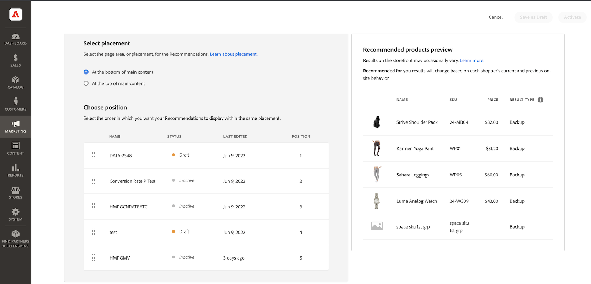

# Crear nueva recomendación

Cuando crea una recomendación, crea una _unidad de recomendación_ o widget que contiene _elementos_ del producto recomendado.

_Unidad de recomendación_

Cuando activa la unidad de recomendación, Adobe Commerce empieza a [recopilar datos](workspace.md) para medir impresiones, vistas, clics, etc. La tabla [!DNL Product Recommendations] muestra las métricas de cada unidad de recomendación para ayudarle a tomar decisiones comerciales fundamentadas.

>[!NOTE]
>
>Las métricas de Recomendación de producto están optimizadas para las tiendas de Luma. Si la tienda no está basada en Luma, el modo en que las métricas rastrean los datos depende de cómo [implemente la colección de eventos](events.md).

1. En la barra lateral de _Admin_, ve a **Marketing** > _Promociones_ > **Recomendaciones de productos** para mostrar el espacio de trabajo de _Recomendaciones de productos_.

1. Especifique la [Vista de tienda](https://experienceleague.adobe.com/es/docs/commerce-admin/start/setup/websites-stores-views) donde desea que se muestren las recomendaciones.

   >[!NOTE]
   >
   > Las unidades de recomendación de Page Builder deben crearse en la vista de tienda predeterminada, pero luego pueden utilizarse en cualquier lugar. Para obtener más información sobre cómo crear recomendaciones de productos con Page Builder, consulte [Agregar contenido: recomendaciones de productos](https://experienceleague.adobe.com/es/docs/commerce-admin/page-builder/add-content/recommendations).

1. Haga clic en **Crear recomendación**.

1. En la sección _Asigne un nombre a la recomendación_, escriba un nombre descriptivo para la referencia interna, como `Home page most popular`.

1. En la sección _Seleccionar tipo de página_, seleccione la página en la que desea que aparezca la recomendación entre las siguientes opciones:

   >[!NOTE]
   >
   > Las recomendaciones de productos no se admiten en la página del carro de compras cuando la tienda está configurada para [mostrar la página del carro de compras inmediatamente después de agregar un producto al carro de compras](https://experienceleague.adobe.com/es/docs/commerce-admin/stores-sales/point-of-purchase/cart/cart-configuration).

   * Página principal
   * Categoría
   * Detalles del producto
   * Carrito
   * Confirmación
   * [Page Builder](https://experienceleague.adobe.com/es/docs/commerce-admin/page-builder/add-content/recommendations)

   Puede crear hasta 50 unidades de recomendación activas para cada tipo de página. El tipo de página aparece atenuado cuando se alcanza el límite.

   
   _Nombre de recomendación y ubicación de página_

1. En la sección _Seleccionar tipo de recomendación_, especifique el [tipo de recomendación](type.md) que desea que aparezca en la página seleccionada. En algunas páginas, la [ubicación](placement.md) de las recomendaciones está limitada a ciertos tipos.

1. En la sección _Etiqueta para mostrar en la tienda_, escribe la [etiqueta](placement.md#recommendation-labels) que sea visible para tus compradores, como &quot;Principales vendedores&quot;.

1. En la sección _Elegir número de productos_, use el control deslizante para especificar cuántos productos desea que aparezcan en la unidad de recomendación.

   El valor predeterminado es `5`, con un máximo de `20`.

1. En la sección _Seleccionar ubicación_, especifique la ubicación donde aparecerá la unidad de recomendación en la página.

   * Al final del contenido principal
   * Al principio del contenido principal

1. (Opcional) Para cambiar el orden de las recomendaciones, seleccione y mueva las filas de la tabla _Choose position_.

   La sección _Elegir posición_ muestra todas las recomendaciones (si las hay) creadas para el tipo de página que seleccionó.

   
   _Pedido de recomendación en la página_

1. (Opcional) Para controlar qué productos aparecen en la unidad de recomendación, [aplique filtros](filters.md) en la sección _Filtros_.

   
   _Filtros de productos recomendados_

1. Cuando termine, haga clic en una de las siguientes opciones:

   * **Guardar como borrador** para editar la unidad de recomendación más adelante. No se puede modificar el tipo de página o el tipo de recomendación de una unidad de recomendación en estado de borrador.

   * **Activar** para habilitar la unidad de recomendación en tu tienda.

>[!IMPORTANT]
>
>Algunos exploradores pueden bloquear los scripts esenciales que impiden que las recomendaciones de productos funcionen según lo esperado.

## Indicadores de preparación

Los indicadores de preparación muestran qué tipos de recomendaciones funcionan mejor con los datos de catálogo y de comportamiento disponibles. Utilícelos para identificar problemas relacionados con eventos o tráfico insuficiente para rellenar un tipo de recomendación.

Los indicadores de preparación se dividen en dos categorías: [estáticos](#static-based) y [dinámicos](#dynamic-based). Las recomendaciones basadas en estáticas solo utilizan datos de catálogo. Las recomendaciones basadas en dinámicas utilizan datos de comportamiento de los compradores para entrenar modelos de aprendizaje automático, generar recomendaciones personalizadas y calcular la puntuación de preparación de cada recomendación.

### Cálculo de los indicadores de disponibilidad

Los indicadores de disponibilidad indican cuánto se ha entrenado el modelo. Los indicadores dependen de los tipos de eventos recopilados, la amplitud de los productos con los que interactuó y el tamaño del catálogo.

El porcentaje del indicador de preparación calcula la proporción de productos que se pueden recomendar para un tipo de recomendación determinado. Se calcula mediante el tamaño del catálogo, el volumen de interacción y el porcentaje de SKU que registran los eventos relevantes en un intervalo de tiempo definido. Por ejemplo, los indicadores de disponibilidad pueden ser más altos durante el tráfico festivo máximo que durante los períodos de tráfico normal.

Como resultado de estas variables, el porcentaje del indicador de disponibilidad puede fluctuar. Esto explica por qué los tipos de recomendación fluctúan entre estar &quot;Listo para implementar&quot;.

Los indicadores de preparación se calculan en función de dos factores:

* Tamaño suficiente del conjunto de resultados: ¿Se devuelven suficientes resultados en la mayoría de los casos para evitar el uso de [recomendaciones de copia de seguridad](events.md#backuprecs)?

* ¿Los productos devueltos representan una variedad de productos de su catálogo? Este factor ayuda a garantizar que las recomendaciones en todo el sitio no se limiten a un pequeño subconjunto de productos.

En función de los factores anteriores, se calcula un valor de disponibilidad y se muestra de la siguiente manera:

* 75 % o más significa que las recomendaciones sugeridas para ese tipo de recomendación serán muy relevantes.
* Al menos el 50 % significa que las recomendaciones sugeridas para ese tipo de recomendación serán menos relevantes.
* Menos del 50 % significa que las recomendaciones sugeridas para ese tipo de recomendación pueden no ser relevantes. En este caso, se utilizan [recomendaciones de copia de seguridad](events.md#backuprecs).

Obtenga más información acerca de [por qué los indicadores de preparación podrían ser bajos](#what-to-do-if-the-readiness-indicator-percent-is-low).

### Basado en estáticas

Los siguientes tipos de recomendación son de base estática porque solo requieren datos de catálogo. No se utilizan datos de comportamiento.

* _Más como este_
* _Similitud visual_

### Basado en dinámico

Los siguientes tipos de recomendación son dinámicos, ya que utilizan datos de comportamiento de tienda.

Últimos seis meses de datos de comportamiento de la tienda:

* _Vio esto, vio aquello_
* _Vio esto, compró aquello_
* _Compró esto, compró aquello_
* _Recomendado para usted_

Últimos siete días de datos de comportamiento de la tienda:

* _Más visitados_
* _Más comprados_
* _Más Añadidos al Carro_
* _Tendencia_
* _Conversión de vista a compra_
* _Conversión de vista a carro_

Datos más recientes del comportamiento del comprador (solo vistas):

* _Vistos recientemente_

### Visualización del progreso

Para ayudarle a visualizar el progreso de formación de cada tipo de recomendación, la sección _Seleccionar tipo de recomendación_ muestra una medida de preparación para cada tipo.

_Tipo de recomendación_

>[!NOTE]
>
>Los indicadores nunca pueden alcanzar el 100%.

El porcentaje de preparación para los tipos de recomendación basados en catálogos suele cambiar poco porque los catálogos son relativamente estables. Por el contrario, el porcentaje de preparación para los tipos de recomendación basados en los datos de comportamiento del comprador puede cambiar con frecuencia con la actividad diaria del comprador.

#### Qué hacer si el porcentaje del indicador de disponibilidad es bajo

Un porcentaje de preparación bajo indica que no hay muchos productos del catálogo que puedan incluirse en las recomendaciones de este tipo de recomendación. Esto significa que existe una alta probabilidad de que se devuelvan [recomendaciones de copia de seguridad](events.md#backup-recommendations) si implementa este tipo de recomendación de todos modos.

>[!IMPORTANT]
>
>No se admiten los tipos de producto _Paquete_, _agrupado_ y personalizado. Si el catálogo contiene un gran número de estos tipos de productos, puede esperar una puntuación de preparación baja. Además, cualquier SKU con espacios puede reducir la relevancia de las recomendaciones y debe evitarse.

A continuación se enumeran los posibles motivos y soluciones para puntuaciones de preparación bajas comunes:

* **Basado en estáticas**: La falta de datos de catálogo para los productos mostrables causa porcentajes bajos para estos indicadores. Si son inferiores a lo esperado, una sincronización completa puede solucionar este problema.
* **Basado en dinámica**: los siguientes factores causan porcentajes bajos para los indicadores basados en dinámica:

  * Faltan campos en los [eventos de tienda](https://developer.adobe.com/commerce/services/shared-services/storefront-events/#product-recommendations) necesarios para los tipos de recomendación respectivos (requestId, contexto de producto, etc.).
  * Poco tráfico en la tienda, por lo que el volumen de eventos de comportamiento que recibimos es bajo.
  * La variedad de eventos de comportamiento de la tienda en diferentes productos es baja. Por ejemplo, si solo el diez por ciento de sus productos se ven o se compran la mayor parte del tiempo, los indicadores de preparación respectivos serán bajos.

## Previsualizar recomendaciones {#preview}

El panel _Vista previa de productos recomendados_ siempre está disponible con una selección de muestra de productos que aparecen en la unidad de recomendación cuando se implementa en la tienda.

Para probar una recomendación cuando trabaje en un entorno que no sea de producción, puede recuperar datos de recomendación de un [origen diferente](settings.md). Esto permite a los comerciantes experimentar con las reglas y previsualizar las recomendaciones antes de implementarlas en la producción.

| Campo | Descripción |
|---|---|
| Nombre | El nombre del producto. |
| SKU | La unidad de stock asignada al producto |
| Precio | El precio del producto. |
| Tipo de resultado | Principal: indica que hay suficientes datos de formación recopilados para mostrar una recomendación. Copia de seguridad: indica que no se recopilaron suficientes datos de formación, por lo que se utiliza una recomendación de copia de seguridad para rellenar el espacio. Vaya a [Datos de comportamiento](events.md) para obtener más información acerca de los modelos de aprendizaje automático y las recomendaciones de copia de seguridad. |

Para ver qué productos incluye una unidad de recomendación en tiempo real, experimente con el tipo de página, el tipo de recomendación y los filtros a medida que la crea. A continuación, configure la unidad para satisfacer sus necesidades comerciales en función de los productos que devuelva.

Cuando se implementan varias unidades de recomendaciones en la misma página, Adobe Commerce usaba [filters](#filters.md) para quitar los productos duplicados de las recomendaciones que muestra. Como resultado, el panel de vista previa puede mostrar un conjunto de productos diferente a la tienda.

>[!NOTE]
>
> No puede obtener una vista previa del tipo de recomendación `Recently viewed` porque los datos no están disponibles en el Administrador.
